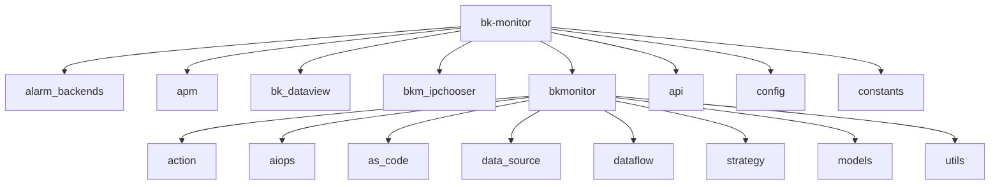
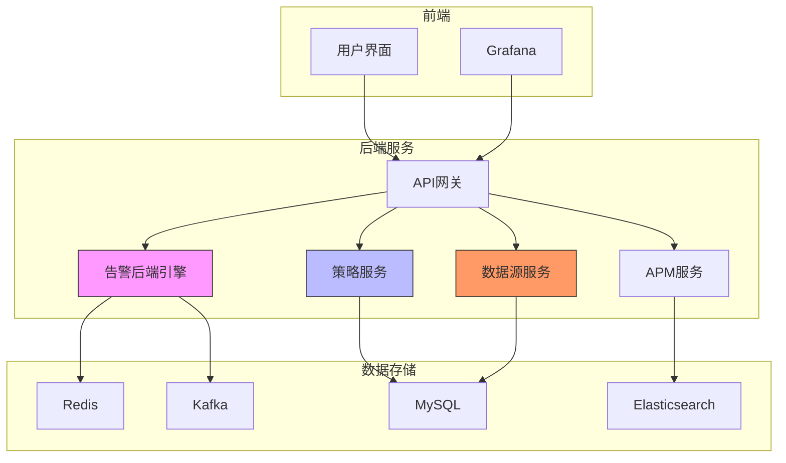
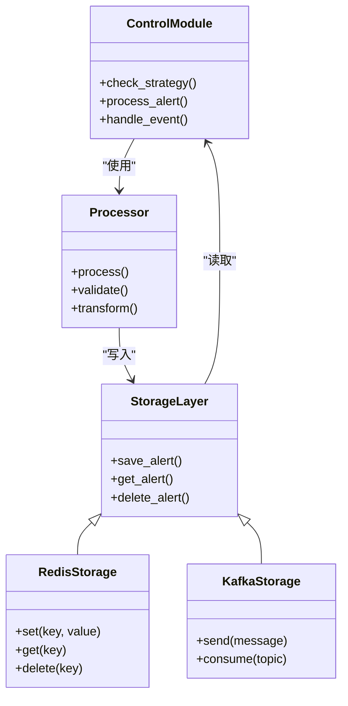
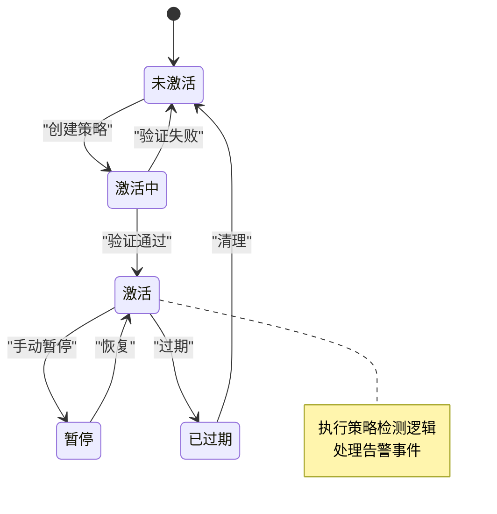
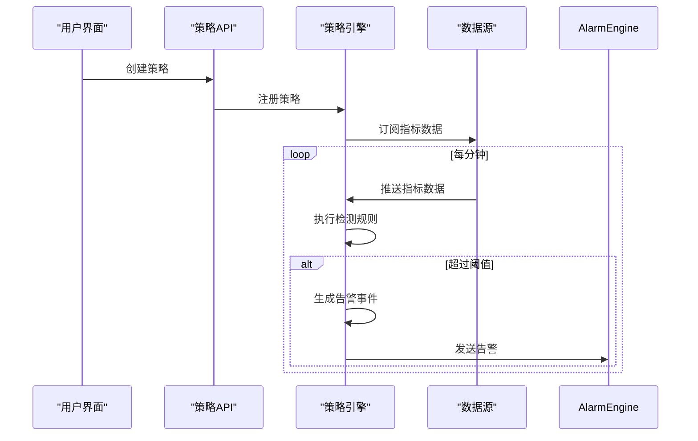
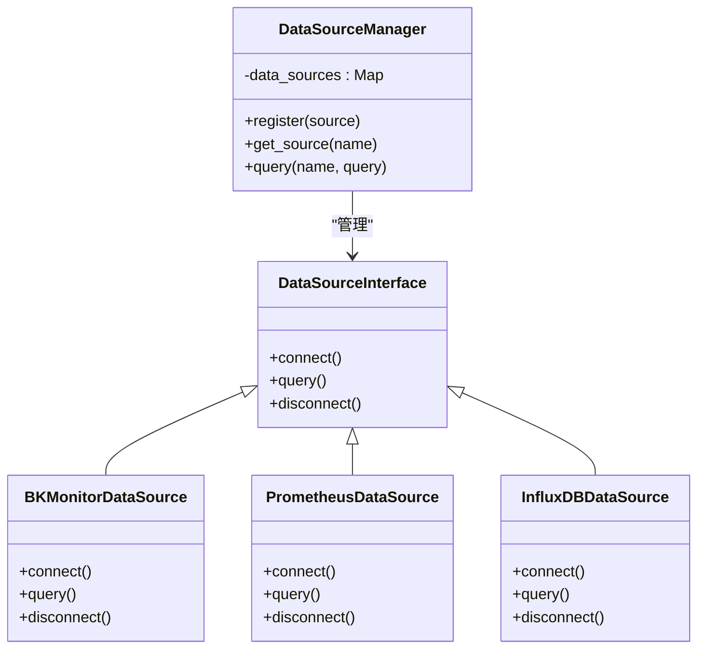
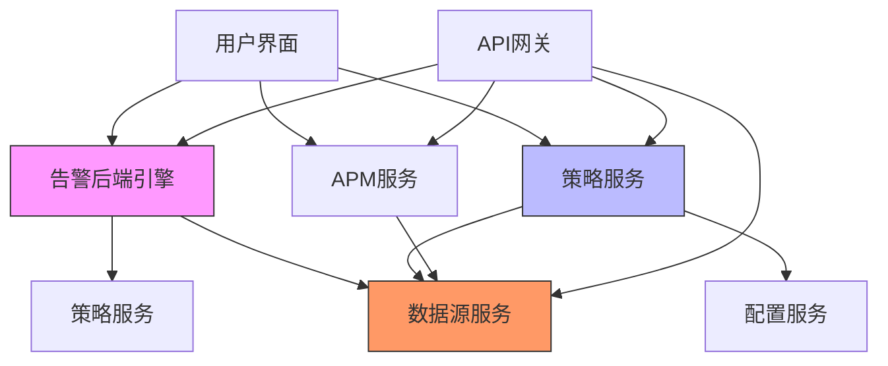

# 核心架构

<cite>
**本文档引用的文件**   
- [alarm_backends\urls.py](file://bkmonitor/alarm_backends/urls.py)
- [alarm_backends\core\control\strategy.py](file://bkmonitor/alarm_backends/core/control/strategy.py)
- [alarm_backends\core\processor\base.py](file://bkmonitor/alarm_backends/core/processor/base.py)
- [alarm_backends\core\storage\redis.py](file://bkmonitor/alarm_backends/core/storage/redis.py)
- [bkmonitor\models\strategy.py](file://bkmonitor/bkmonitor/models/strategy.py)
- [bkmonitor\strategy\strategy.py](file://bkmonitor/bkmonitor/strategy/strategy.py)
- [bkmonitor\data_source\models\__init__.py](file://bkmonitor/bkmonitor/data_source/models/__init__.py)
- [bkmonitor\data_source\handler\__init__.py](file://bkmonitor/bkmonitor/data_source/handler/__init__.py)
</cite>

## 目录
1. [引言](#引言)
2. [项目结构](#项目结构)
3. [核心组件](#核心组件)
4. [架构概述](#架构概述)
5. [详细组件分析](#详细组件分析)
6. [依赖分析](#依赖分析)
7. [性能考虑](#性能考虑)
8. [故障排除指南](#故障排除指南)
9. [结论](#结论)

## 引言
bk-monitor系统是一个企业级监控平台，提供全面的监控、告警和数据分析功能。本架构文档深入分析其模块化设计和组件交互，重点解析告警后端引擎、策略管理系统和数据源接入层的架构设计。

## 项目结构
bk-monitor项目采用模块化设计，主要包含告警后端、APM、数据源、策略管理等核心模块。项目遵循Django MVC架构模式，各模块通过清晰的职责划分实现高内聚低耦合。

**图示来源**
- [alarm_backends](file://bkmonitor/alarm_backends)
- [apm](file://bkmonitor/apm)
- [bkmonitor](file://bkmonitor/bkmonitor)

**本节来源**
- [项目结构](file://bkmonitor)

## 核心组件
bk-monitor系统的核心组件包括告警后端引擎、策略管理系统、数据源接入层和APM模块。这些组件共同构成了系统的监控和告警能力。

**本节来源**
- [bkmonitor](file://bkmonitor/bkmonitor)
- [alarm_backends](file://bkmonitor/alarm_backends)

## 架构概述
bk-monitor系统采用混合架构模式，结合了Django MVC架构和微服务架构的特点。系统通过清晰的模块划分和接口定义，实现了高可扩展性和可维护性。

**图示来源**
- [alarm_backends](file://bkmonitor/alarm_backends)
- [bkmonitor](file://bkmonitor/bkmonitor)
- [api](file://bkmonitor/api)

## 详细组件分析

### 告警后端引擎分析
告警后端引擎是bk-monitor系统的核心组件，负责告警的处理、存储和分发。引擎采用分层架构设计，包括控制模块、处理器和存储层。

#### 架构设计

**图示来源**
- [alarm_backends\core\control\strategy.py](file://bkmonitor/alarm_backends/core/control/strategy.py)
- [alarm_backends\core\processor\base.py](file://bkmonitor/alarm_backends/core/processor/base.py)
- [alarm_backends\core\storage\redis.py](file://bkmonitor/alarm_backends/core/storage/redis.py)

**本节来源**
- [alarm_backends](file://bkmonitor/alarm_backends)

### 策略管理系统分析
策略管理系统负责监控策略的创建、管理和执行。系统采用状态机设计，确保策略的生命周期管理。

#### 状态机设计

#### 执行流程

**图示来源**
- [bkmonitor\models\strategy.py](file://bkmonitor/bkmonitor/models/strategy.py)
- [bkmonitor\strategy\strategy.py](file://bkmonitor/bkmonitor/strategy/strategy.py)

**本节来源**
- [bkmonitor\strategy](file://bkmonitor/bkmonitor/strategy)
- [bkmonitor\models](file://bkmonitor/bkmonitor/models)

### 数据源接入层分析
数据源接入层负责统一接入和管理多种数据源，提供抽象的数据访问接口。

#### 抽象设计

**图示来源**
- [bkmonitor\data_source\models\__init__.py](file://bkmonitor/bkmonitor/data_source/models/__init__.py)
- [bkmonitor\data_source\handler\__init__.py](file://bkmonitor/bkmonitor/data_source/handler/__init__.py)

**本节来源**
- [bkmonitor\data_source](file://bkmonitor/bkmonitor/data_source)

## 依赖分析
bk-monitor系统各组件之间存在明确的依赖关系，通过接口定义实现松耦合。

**图示来源**
- [alarm_backends](file://bkmonitor/alarm_backends)
- [bkmonitor](file://bkmonitor/bkmonitor)
- [api](file://bkmonitor/api)

**本节来源**
- [项目结构](file://bkmonitor)

## 性能考虑
bk-monitor系统在设计时充分考虑了性能因素，采用多种优化策略确保系统的高可用性和响应速度。

- **缓存机制**：使用Redis缓存频繁访问的数据，减少数据库查询
- **异步处理**：通过Kafka实现告警事件的异步处理，提高系统吞吐量
- **分片存储**：对大规模数据进行分片存储，提高查询效率
- **连接池**：使用连接池管理数据库连接，减少连接开销

## 故障排除指南
当系统出现异常时，可以按照以下步骤进行排查：

1. 检查告警后端引擎的日志文件
2. 验证策略配置是否正确
3. 检查数据源连接状态
4. 查看Redis和Kafka服务是否正常运行
5. 检查数据库连接和性能

**本节来源**
- [alarm_backends](file://bkmonitor/alarm_backends)
- [bkmonitor](file://bkmonitor/bkmonitor)

## 结论
bk-monitor系统通过模块化设计和清晰的架构分层，实现了强大的监控和告警功能。系统采用混合架构模式，结合了MVC架构的清晰性和微服务架构的灵活性，为大规模监控场景提供了可靠的解决方案。