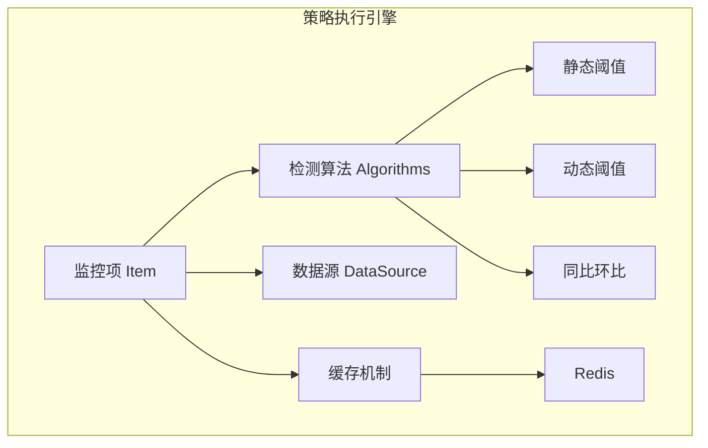
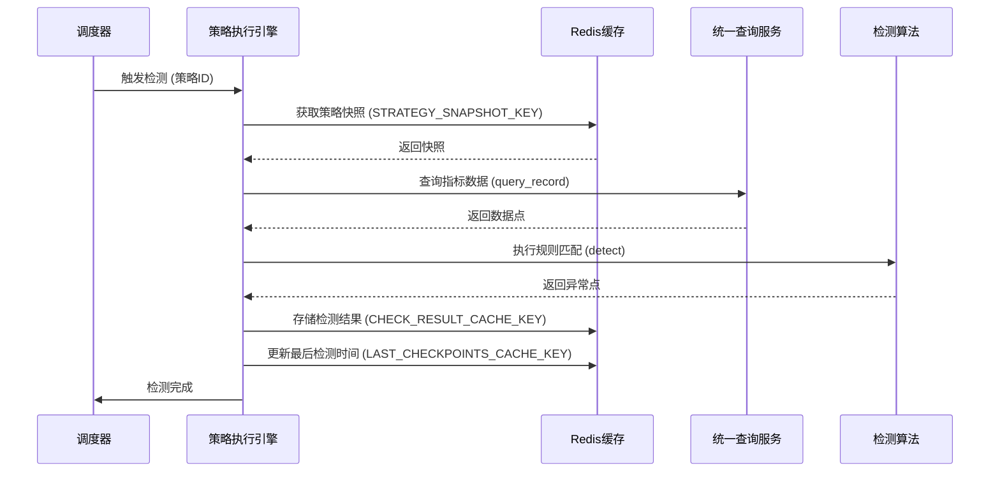
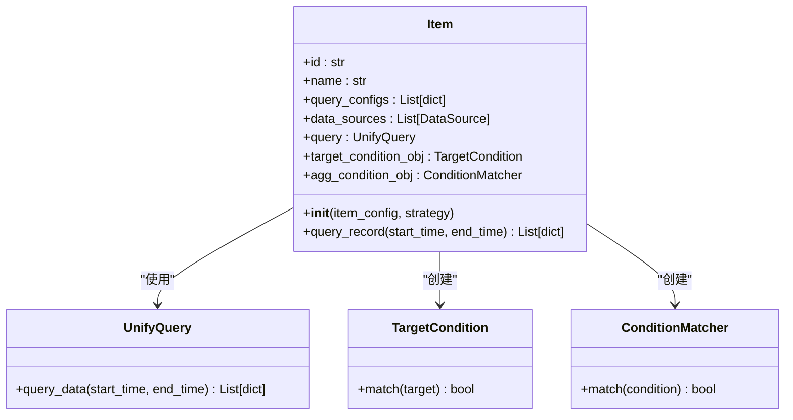
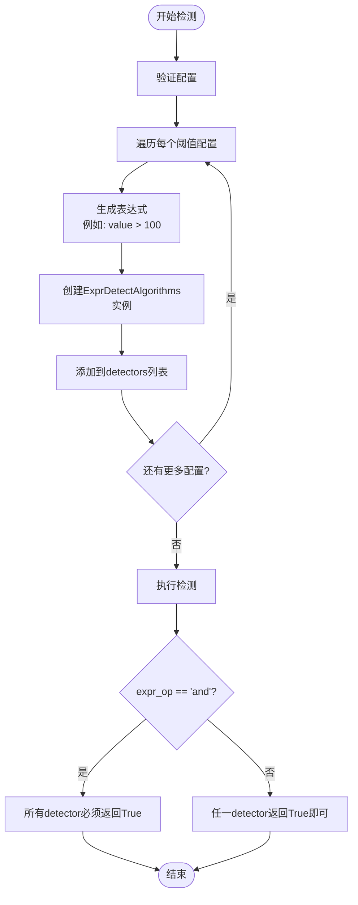
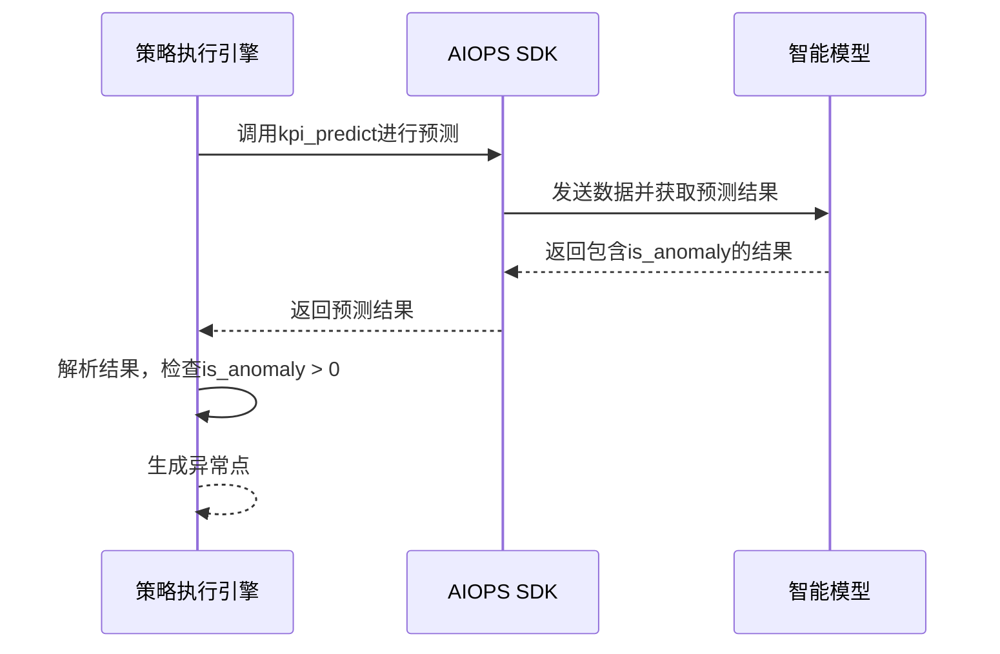
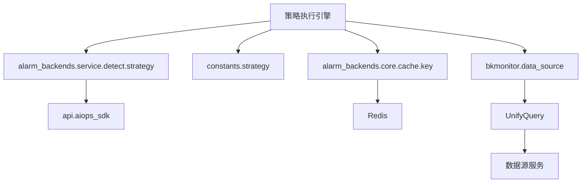

# 策略执行引擎

<cite>
**本文档引用文件**  
- [item.py](file://bkmonitor/alarm_backends/core/control/item.py)
- [double_check.py](file://bkmonitor/alarm_backends/core/control/mixins/double_check.py)
- [__init__.py](file://bkmonitor/alarm_backends/service/detect/strategy/__init__.py)
- [threshold.py](file://bkmonitor/alarm_backends/service/detect/strategy/threshold.py)
- [intelligent_detect.py](file://bkmonitor/alarm_backends/service/detect/strategy/intelligent_detect.py)
- [key.py](file://bkmonitor/alarm_backends/core/cache/key.py)
</cite>

## 目录
1. [引言](#引言)
2. [项目结构](#项目结构)
3. [核心组件](#核心组件)
4. [架构概览](#架构概览)
5. [详细组件分析](#详细组件分析)
6. [依赖分析](#依赖分析)
7. [性能考量](#性能考量)
8. [故障排除指南](#故障排除指南)
9. [结论](#结论)

## 引言
本文档详细描述了蓝鲸监控平台中策略执行引擎的内部工作机制。该引擎是监控系统的核心，负责周期性地检测指标数据、执行告警规则、进行异常确认，并最终触发告警。文档将深入分析其检测周期调度、指标数据获取、规则匹配算法、缓存机制、多条件组合判断逻辑、性能监控与优化、以及失败处理策略。

## 项目结构
策略执行引擎主要分布在 `bkmonitor/alarm_backends` 目录下，其核心功能模块包括：
- `core/control`: 包含监控项（Item）和控制逻辑（Control）的核心实现。
- `service/detect`: 负责异常检测的具体执行，包含各种检测算法。
- `core/cache`: 定义了用于提升性能的缓存键和机制。



**图示来源**
- [item.py](file://bkmonitor/alarm_backends/core/control/item.py)
- [threshold.py](file://bkmonitor/alarm_backends/service/detect/strategy/threshold.py)
- [intelligent_detect.py](file://bkmonitor/alarm_backends/service/detect/strategy/intelligent_detect.py)
- [key.py](file://bkmonitor/alarm_backends/core/cache/key.py)

## 核心组件
策略执行引擎的核心组件包括监控项（Item）、检测算法（Algorithms）和缓存键（Redis Keys）。监控项是策略的基本单元，封装了数据查询配置和检测逻辑。检测算法是规则匹配的核心，实现了从简单阈值到复杂智能模型的各种判断逻辑。缓存机制则通过减少重复计算和数据库访问来显著提升系统吞扑量。

**组件来源**
- [item.py](file://bkmonitor/alarm_backends/core/control/item.py#L1-L246)
- [__init__.py](file://bkmonitor/alarm_backends/service/detect/strategy/__init__.py#L1-L648)

## 架构概览
策略执行引擎采用模块化设计，其工作流程如下：首先，系统根据调度周期触发检测任务；然后，引擎从 `item.py` 加载监控项配置，并通过 `UnifyQuery` 从统一查询服务获取指标数据；接着，根据配置的算法类型，调用相应的检测策略（如 `threshold.py` 或 `intelligent_detect.py`）进行规则匹配；匹配结果会通过 `key.py` 定义的缓存机制进行存储和去重；最后，对于确认的异常，引擎会触发告警流程。



**图示来源**
- [item.py](file://bkmonitor/alarm_backends/core/control/item.py#L100-L120)
- [key.py](file://bkmonitor/alarm_backends/core/cache/key.py#L400-L600)
- [threshold.py](file://bkmonitor/alarm_backends/service/detect/strategy/threshold.py#L1-L72)

## 详细组件分析

### 监控项处理逻辑分析
`Item` 类是策略执行的入口，它负责解析策略配置、初始化数据源和聚合条件。



**图示来源**
- [item.py](file://bkmonitor/alarm_backends/core/control/item.py#L50-L150)

**组件来源**
- [item.py](file://bkmonitor/alarm_backends/core/control/item.py#L1-L246)

### 规则匹配算法分析
引擎支持多种检测算法，核心基类为 `Algorithms`，它通过 `eval` 执行动态生成的Python表达式来进行判断。

#### 静态阈值算法
`AndThreshold` 和 `Threshold` 类实现了静态阈值检测。`AndThreshold` 要求所有条件同时满足（AND），而 `Threshold` 只需任一条件满足（OR）。



**图示来源**
- [threshold.py](file://bkmonitor/alarm_backends/service/detect/strategy/threshold.py#L1-L72)

**组件来源**
- [threshold.py](file://bkmonitor/alarm_backends/service/detect/strategy/threshold.py#L1-L72)

#### 智能检测算法分析
`IntelligentDetect` 类实现了基于AI模型的动态阈值检测。它通过调用 `aiops_sdk` 进行预测，并根据返回的 `is_anomaly` 字段判断是否异常。



**图示来源**
- [intelligent_detect.py](file://bkmonitor/alarm_backends/service/detect/strategy/intelligent_detect.py#L1-L105)

**组件来源**
- [intelligent_detect.py](file://bkmonitor/alarm_backends/service/detect/strategy/intelligent_detect.py#L1-L105)

### 策略缓存机制分析
缓存机制是提升引擎性能的关键。`key.py` 文件定义了所有Redis键的模板、过期时间和存储后端。

```mermaid
classDiagram
class RedisDataKey {
+key_tpl : str
+ttl : int
+backend : str
+get_key(**kwargs) str
+expire(**kwargs) void
}
class StringKey {
}
class HashKey {
+field_tpl : str
+get_field(**kwargs) str
}
class SortedSetKey {
}
RedisDataKey <|-- StringKey
RedisDataKey <|-- HashKey
RedisDataKey <|-- SortedSetKey
class STRATEGY_SNAPSHOT_KEY {
+key_tpl : "cache.strategy.snapshot.{strategy_id}.{update_time}"
+ttl : 1小时
}
class CHECK_RESULT_CACHE_KEY {
+key_tpl : "{prefix}.detect.result.{strategy_id}.{item_id}.{dimensions_md5}.{level}"
+ttl : 可配置
}
class LAST_CHECKPOINTS_CACHE_KEY {
+key_tpl : "detect.last.checkpoint.{strategy_id}.{item_id}"
+field_tpl : "detect.result.{dimensions_md5}.{level}"
}
StringKey <|-- STRATEGY_SNAPSHOT_KEY
SortedSetKey <|-- CHECK_RESULT_CACHE_KEY
HashKey <|-- LAST_CHECKPOINTS_CACHE_KEY
```

**图示来源**
- [key.py](file://bkmonitor/alarm_backends/core/cache/key.py#L1-L600)

**组件来源**
- [key.py](file://bkmonitor/alarm_backends/core/cache/key.py#L1-L1075)

## 依赖分析
策略执行引擎高度依赖于多个内部和外部组件。其核心依赖关系如下图所示：



**图示来源**
- [item.py](file://bkmonitor/alarm_backends/core/control/item.py#L10-L20)
- [intelligent_detect.py](file://bkmonitor/alarm_backends/service/detect/strategy/intelligent_detect.py#L10-L20)
- [key.py](file://bkmonitor/alarm_backends/core/cache/key.py#L1-L20)

## 性能考量
策略执行引擎通过多种技术提升系统吞吐量：
1.  **缓存机制**：使用 `STRATEGY_SNAPSHOT_KEY` 缓存策略快照，避免每次检测都从数据库加载；使用 `CHECK_RESULT_CACHE_KEY` 缓存检测结果，实现去重和状态追踪。
2.  **异步与批量处理**：在 `SDKPreDetectMixin` 中，使用 `ThreadPoolExecutor` 对多个数据点进行批量并发预测，显著提高了智能检测的效率。
3.  **内存优化**：`cached_property` 装饰器确保 `agg_condition_obj` 等复杂对象只在首次访问时计算并缓存，避免重复解析。
4.  **QoS控制**：通过 `STRATEGY_TOKEN_BUCKET_KEY` 实现令牌桶限流，防止单一策略组过度消耗系统资源。

## 故障排除指南
当策略执行失败时，系统提供了相应的重试和降级机制：
1.  **重试机制**：检测任务通过 `service_lock` (如 `SERVICE_LOCK_DETECT`) 进行互斥，如果任务因异常中断，锁会在过期后自动释放，允许下一次调度重试。
2.  **告警降级**：在 `IntelligentDetect` 中，如果SDK状态为 `PREPARING`，会抛出异常并跳过本次检测，这是一种保护性降级，避免在依赖数据未准备就绪时产生误报。
3.  **日志监控**：关键流程（如 `double_check`）会记录INFO级别的日志，便于追踪执行流程。异常情况会通过 `logger.exception` 记录完整的堆栈信息。

**组件来源**
- [double_check.py](file://bkmonitor/alarm_backends/core/control/mixins/double_check.py#L138-L180)
- [intelligent_detect.py](file://bkmonitor/alarm_backends/service/detect/strategy/intelligent_detect.py#L1-L105)

## 结论
蓝鲸监控的策略执行引擎是一个设计精良、性能高效的系统。它通过模块化的架构将数据获取、规则匹配、状态管理和缓存优化清晰地分离。其核心优势在于灵活的算法插件机制、高效的缓存策略以及对大规模数据处理的优化。通过深入理解其内部机制，可以更好地进行性能调优和故障排查，确保监控系统的稳定可靠运行。