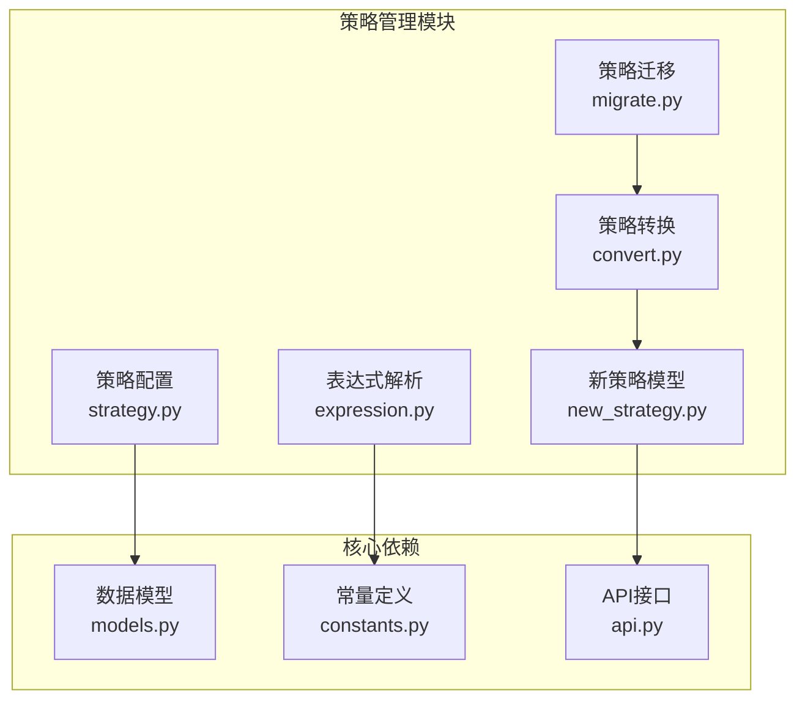
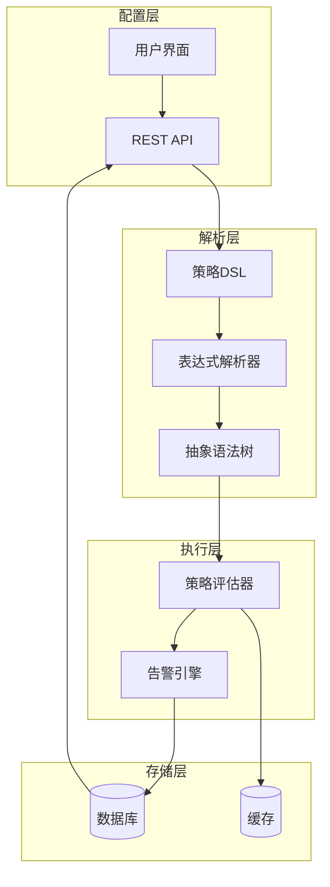
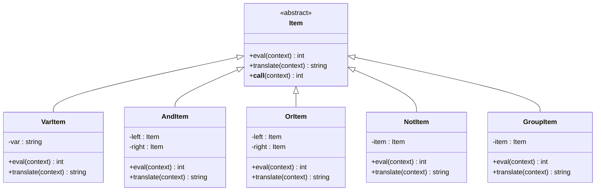
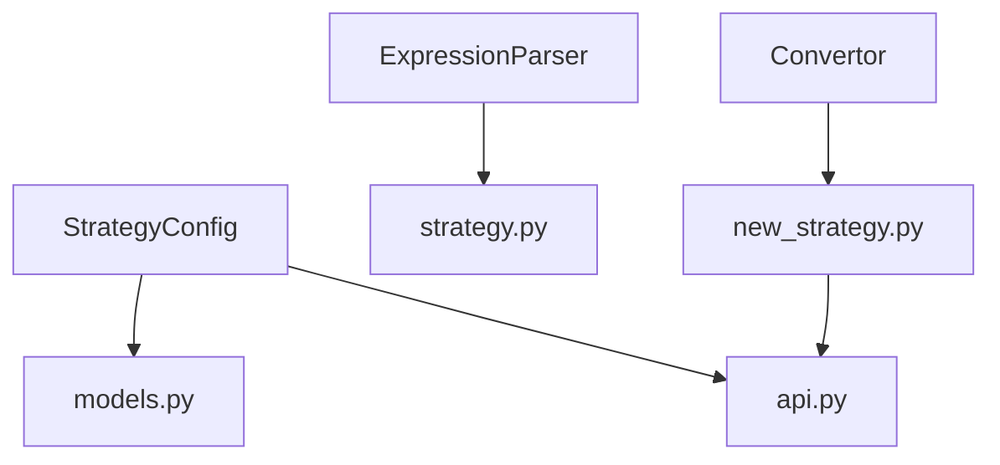

# 策略管理架构

<cite>
**本文档引用文件**   
- [strategy.py](file://bkmonitor\bkmonitor\strategy\strategy.py)
- [expression.py](file://bkmonitor\bkmonitor\strategy\expression.py)
- [convert.py](file://bkmonitor\bkmonitor\strategy\convert.py)
- [migrate.py](file://bkmonitor\bkmonitor\strategy\migrate.py)
- [constants.py](file://constants\strategy.py)
</cite>

## 目录
1. [引言](#引言)
2. [项目结构](#项目结构)
3. [核心组件](#核心组件)
4. [架构概述](#架构概述)
5. [详细组件分析](#详细组件分析)
6. [依赖分析](#依赖分析)
7. [性能考虑](#性能考虑)
8. [故障排除指南](#故障排除指南)
9. [结论](#结论)

## 引言
本架构文档旨在深入解析蓝鲸监控平台的策略管理系统，涵盖其配置模型、执行机制、表达式解析、条件判断、阈值检测、版本管理、迁移与转换流程。文档重点阐述策略DSL的设计思想与语法结构，解析策略缓存机制与性能优化策略，并通过时序图展示从策略配置到规则匹配的完整调用链路。同时，文档将解释策略分组、继承、优先级等高级特性及策略诊断工具的工作原理。

## 项目结构
策略管理功能主要位于`bkmonitor/bkmonitor/strategy/`目录下，其核心模块包括策略配置、表达式解析、版本转换与迁移。该模块与数据源、告警、动作等其他子系统紧密集成，共同构成完整的监控告警体系。

**图示来源**
- [strategy.py](file://bkmonitor\bkmonitor\strategy\strategy.py)
- [expression.py](file://bkmonitor\bkmonitor\strategy\expression.py)
- [convert.py](file://bkmonitor\bkmonitor\strategy\convert.py)
- [migrate.py](file://bkmonitor\bkmonitor\strategy\migrate.py)

**本节来源**
- [bkmonitor\bkmonitor\strategy\](file://bkmonitor\bkmonitor\strategy\)

## 核心组件
策略管理系统的三大核心组件为：**策略配置模型**、**表达式解析引擎**和**策略转换与迁移框架**。`StrategyConfig`类是策略配置的核心，它封装了策略、监控项、检测算法、动作等所有配置信息的初始化、验证与持久化逻辑。`expression.py`模块实现了基于PLY（Python Lex-Yacc）的策略DSL解析器，负责将用户定义的逻辑表达式（如 `A && (B || C) && !D`）解析为可执行的抽象语法树（AST）。`convert.py`和`migrate.py`模块则共同构成了策略的版本兼容与升级体系，确保旧版策略能够平滑过渡到新版配置模型。

**本节来源**
- [strategy.py](file://bkmonitor\bkmonitor\strategy\strategy.py#L1-L100)
- [expression.py](file://bkmonitor\bkmonitor\strategy\expression.py#L1-L50)
- [convert.py](file://bkmonitor\bkmonitor\strategy\convert.py#L1-L30)

## 架构概述
策略管理系统的整体架构遵循分层设计原则，从上至下分为配置层、解析层、执行层和存储层。配置层提供用户友好的策略定义接口；解析层将高级策略DSL转换为底层可执行的指令；执行层负责实时评估策略条件并触发告警；存储层则持久化策略配置与执行状态。各层之间通过清晰的接口进行通信，保证了系统的高内聚与低耦合。

**图示来源**
- [strategy.py](file://bkmonitor\bkmonitor\strategy\strategy.py)
- [expression.py](file://bkmonitor\bkmonitor\strategy\expression.py)

## 详细组件分析

### 策略配置模型分析
`StrategyConfig`类是整个策略管理系统的数据核心。它通过定义一系列常量字段（如`STRATEGY_FIELDS`, `ITEM_FIELDS`）来规范策略配置的结构，并利用Django ORM模型（如`Strategy`, `Item`, `DetectAlgorithm`）与数据库进行交互。该类的构造函数接收业务ID和策略ID，负责从数据库加载完整的策略配置，并将其组织成一个易于操作的字典结构。其`save`方法则实现了配置的原子化更新，确保了数据的一致性。

**本节来源**
- [strategy.py](file://bkmonitor\bkmonitor\strategy\strategy.py#L50-L200)

### 表达式解析引擎分析
策略DSL的解析过程分为词法分析和语法分析两个阶段。词法分析器（`lexer`）将输入的字符串（如 `A && B`）分解为一系列Token（如`VAR('A')`, `AND('&&')`, `VAR('B')`）。语法分析器（`yacc`）则根据预定义的语法规则（`precedence`）和产生式函数（如`p_expression_and`），将Token流构建成一棵抽象语法树（AST）。

#### 类图：表达式解析器核心类

**图示来源**
- [expression.py](file://bkmonitor\bkmonitor\strategy\expression.py#L50-L150)

**本节来源**
- [expression.py](file://bkmonitor\bkmonitor\strategy\expression.py#L1-L200)

### 策略转换与迁移分析
策略转换与迁移是保障系统向后兼容的关键。`convert.py`模块定义了多个转换器类（如`UptimeCheckConvert`, `CMDBTopoNodeAggConvert`），它们分别处理特定类型策略（如拨测策略、拓扑聚合策略）的配置转换。`migrate.py`模块则负责协调这些转换器，在策略保存或加载时自动执行必要的转换逻辑，确保新旧配置格式的无缝衔接。

**本节来源**
- [convert.py](file://bkmonitor\bkmonitor\strategy\convert.py#L1-L100)
- [migrate.py](file://bkmonitor\bkmonitor\strategy\migrate.py#L1-L50)

## 依赖分析
策略管理系统与多个核心模块存在强依赖关系。它直接依赖`bkmonitor.models`中的数据模型进行持久化操作，并通过`core.drf_resource.api`调用其他服务的API。`constants`模块提供了所有必要的枚举常量，确保了配置项的统一性。此外，`new_strategy.py`模块定义了新的策略数据结构，是`convert.py`进行格式转换的目标模型。

**图示来源**
- [strategy.py](file://bkmonitor\bkmonitor\strategy\strategy.py)
- [convert.py](file://bkmonitor\bkmonitor\strategy\convert.py)
- [new_strategy.py](file://bkmonitor\bkmonitor\strategy\new_strategy.py)

**本节来源**
- [strategy.py](file://bkmonitor\bkmonitor\strategy\strategy.py)
- [convert.py](file://bkmonitor\bkmonitor\strategy\convert.py)

## 性能考虑
系统通过多种机制优化策略管理的性能。首先，利用Django ORM的`select_related`和`prefetch_related`减少数据库查询次数。其次，对于复杂的表达式解析，其时间复杂度主要取决于表达式的深度和复杂度，但PLY库的实现保证了高效的解析速度。最后，策略配置在加载后通常会被缓存，避免了频繁的数据库访问和解析开销。

## 故障排除指南
当策略配置无法保存或表达式解析失败时，应首先检查日志文件。`t_error`函数会捕获非法字符并抛出`ValueError`，`StrategyConfig`的构造函数在加载不存在的策略时会引发`StrategyNotExist`错误。对于转换失败，应检查`convert.py`中对应转换器的逻辑，确认输入配置是否符合预期。

**本节来源**
- [expression.py](file://bkmonitor\bkmonitor\strategy\expression.py#L180-L190)
- [strategy.py](file://bkmonitor\bkmonitor\strategy\strategy.py#L200-L210)

## 结论
蓝鲸监控平台的策略管理系统设计精巧，通过分层架构和模块化设计，实现了策略配置、解析、执行与迁移的全生命周期管理。其基于PLY的DSL解析器提供了强大的逻辑表达能力，而完善的转换与迁移框架则确保了系统的稳定性和可扩展性。该系统为构建灵活、可靠的监控告警体系提供了坚实的基础。