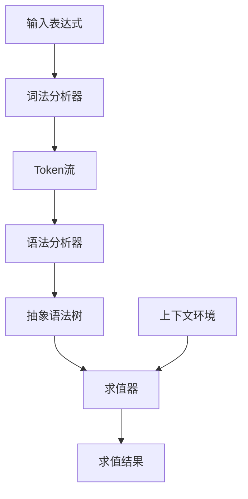
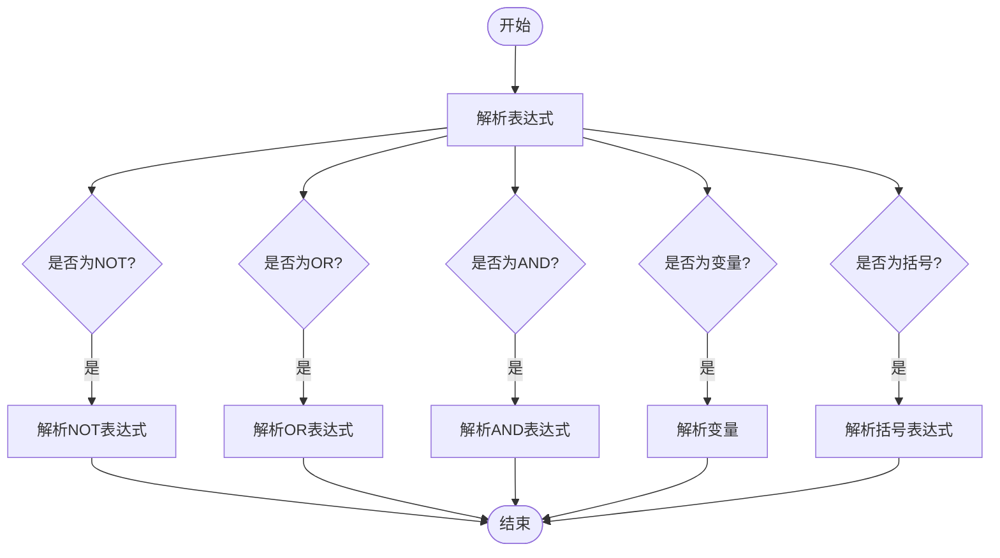
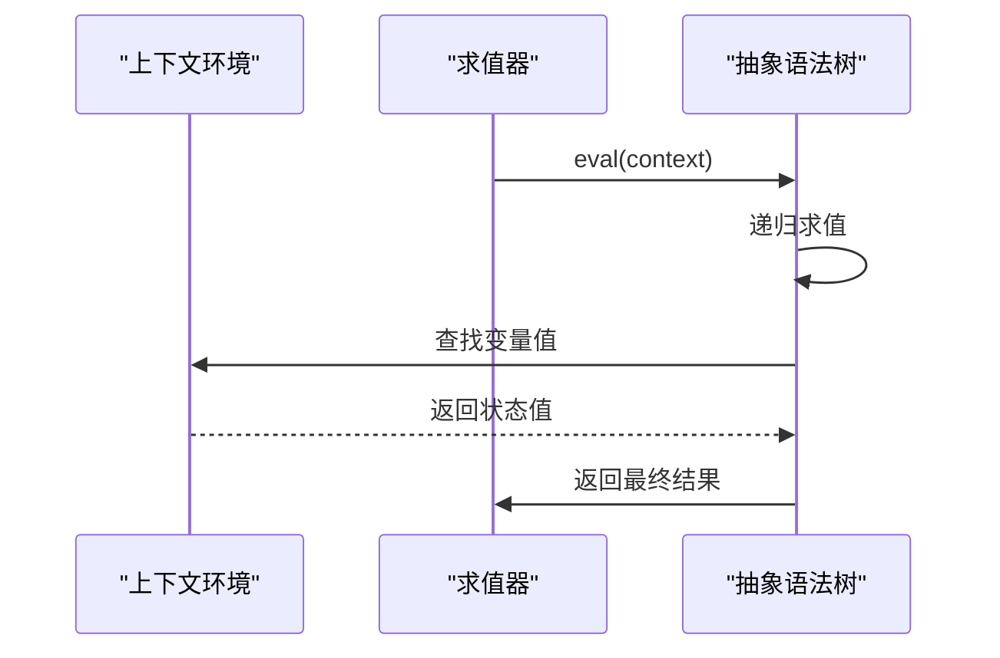
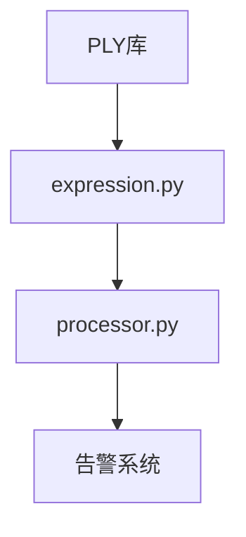

# 策略表达式解析

<cite>
**本文档引用的文件**   
- [expression.py](file://bkmonitor\bkmonitor\strategy\expression.py)
- [parsetab.py](file://bkmonitor\bkmonitor\strategy\parsetab.py)
- [processor.py](file://bkmonitor\alarm_backends\service\composite\processor.py)
</cite>

## 目录
1. [引言](#引言)
2. [项目结构](#项目结构)
3. [核心组件](#核心组件)
4. [架构概述](#架构概述)
5. [详细组件分析](#详细组件分析)
6. [依赖分析](#依赖分析)
7. [性能考虑](#性能考虑)
8. [故障排除指南](#故障排除指南)
9. [结论](#结论)

## 引言
本文档深入分析了基于PLY（Python Lex-Yacc）的策略表达式解析引擎的实现机制。该系统用于解析和求值监控告警策略中的条件表达式，如"A && (B || C) && !D"。文档详细解释了词法分析器如何将策略条件字符串分解为token流，语法分析器如何构建抽象语法树（AST），以及表达式求值过程中的类型推断、运算符优先级处理和短路计算优化。通过实际策略配置的解析示例，展示了从原始配置到执行计划的转换过程，并解释了错误处理机制，包括语法错误定位和语义错误校验。

## 项目结构
策略表达式解析功能主要分布在`bkmonitor`目录下的`strategy`和`alarm_backends/service/composite`模块中。`expression.py`文件是核心解析器的实现，包含了词法分析、语法分析和求值逻辑。`parsetab.py`是由PLY工具自动生成的语法解析表，用于指导语法分析过程。`processor.py`文件则展示了该解析器在告警关联策略检测中的实际应用场景。

```mermaid
graph TB
subgraph "策略表达式解析模块"
expression[expression.py]
parsetab[parsetab.py]
end
subgraph "告警处理模块"
processor[processor.py]
end
expression --> processor : "被调用"
parsetab --> expression : "提供解析表"
```

**图示来源**
- [expression.py](file://bkmonitor\bkmonitor\strategy\expression.py)
- [parsetab.py](file://bkmonitor\bkmonitor\strategy\parsetab.py)
- [processor.py](file://bkmonitor\alarm_backends\service\composite\processor.py)

## 核心组件
策略表达式解析器的核心组件包括词法分析器（Lexer）、语法分析器（Parser）和求值器（Evaluator）。词法分析器负责将输入的字符串分解为有意义的token序列，如变量名、操作符和括号。语法分析器根据预定义的语法规则，将token序列构建成抽象语法树（AST）。求值器则遍历AST，结合上下文环境计算表达式的最终结果。整个过程基于PLY库实现，确保了语法的严谨性和解析的高效性。

**组件来源**
- [expression.py](file://bkmonitor\bkmonitor\strategy\expression.py)

## 架构概述
策略表达式解析引擎采用经典的编译器架构，分为词法分析、语法分析和语义分析（求值）三个阶段。词法分析阶段使用正则表达式匹配输入字符串，生成token流。语法分析阶段采用LALR(1)分析算法，根据`parsetab.py`中的解析表，将token流转换为AST。求值阶段通过递归遍历AST，执行相应的逻辑运算。该架构清晰分离了不同层次的处理逻辑，提高了代码的可维护性和可扩展性。



**图示来源**
- [expression.py](file://bkmonitor\bkmonitor\strategy\expression.py)

## 详细组件分析
### 词法分析器分析
词法分析器定义了五种token类型：VAR（变量）、NOT（非）、AND（与）、OR（或）、LPAREN（左括号）和RPAREN（右括号）。它使用正则表达式来匹配这些token，并忽略空格字符。当遇到无法识别的字符时，会抛出`ValueError`异常，提供详细的错误位置信息。

```mermaid
classDiagram
class Lexer {
+tokens : tuple
+t_VAR : regex
+t_NOT : regex
+t_AND : regex
+t_OR : regex
+t_LPAREN : regex
+t_RPAREN : regex
+t_ignore : str
+t_error(t) : void
}
Lexer --> "PLY" : "基于"
```

**图示来源**
- [expression.py](file://bkmonitor\bkmonitor\strategy\expression.py#L30-L60)

### 语法分析器分析
语法分析器基于LALR(1)算法，使用`parsetab.py`中预生成的解析表进行语法分析。它定义了五条语法规则，分别对应NOT、OR、AND、VAR和括号表达式。运算符优先级通过`precedence`元组定义，确保"AND"和"OR"具有左结合性，而"NOT"具有右结合性。



**图示来源**
- [expression.py](file://bkmonitor\bkmonitor\strategy\expression.py#L176-L239)
- [parsetab.py](file://bkmonitor\bkmonitor\strategy\parsetab.py)

### 求值器分析
求值器通过AST节点的`eval`方法实现。`VarItem`从上下文中查找变量值，`AndItem`取左右子节点的最小值（最低状态），`OrItem`取最大值（最高状态），`NotItem`实现状态反转（正常变异常，异常变正常），`GroupItem`直接返回内部表达式的值。这种设计确保了逻辑运算的正确性和效率。



**图示来源**
- [expression.py](file://bkmonitor\bkmonitor\strategy\expression.py#L89-L135)

## 依赖分析
策略表达式解析器主要依赖PLY库（lex和yacc模块）来实现词法和语法分析。它被`alarm_backends/service/composite/processor.py`中的告警关联策略检测功能所调用。解析器本身不依赖外部数据库或网络服务，确保了其高可用性和低延迟。



**图示来源**
- [expression.py](file://bkmonitor\bkmonitor\strategy\expression.py)
- [processor.py](file://bkmonitor\alarm_backends\service\composite\processor.py)

## 性能考虑
由于策略表达式通常较短且结构简单，解析和求值过程非常高效。AST的递归求值避免了重复计算，且上下文查找使用字典，时间复杂度为O(1)。在高并发场景下，可以通过缓存已编译的表达式来进一步提升性能。

## 故障排除指南
常见的错误包括语法错误和语义错误。语法错误通常由非法字符或不匹配的括号引起，解析器会提供精确的错误位置。语义错误主要是变量未定义，求值时会抛出`ValueError`。建议在部署前对策略表达式进行充分的测试和验证。

**故障排除来源**
- [expression.py](file://bkmonitor\bkmonitor\strategy\expression.py#L60-L65)
- [expression.py](file://bkmonitor\bkmonitor\strategy\expression.py#L90-L95)

## 结论
基于PLY的策略表达式解析引擎设计精巧，实现了从字符串到可执行逻辑的完整转换。其模块化的架构和清晰的错误处理机制，为监控系统的告警策略提供了可靠的支持。通过深入理解其工作原理，可以更好地设计和调试复杂的告警规则。