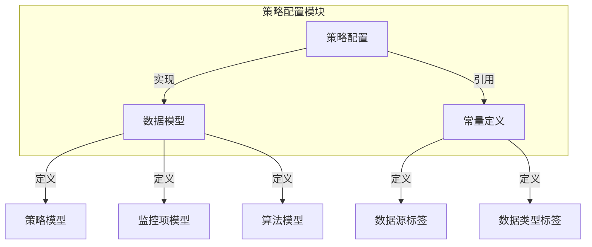
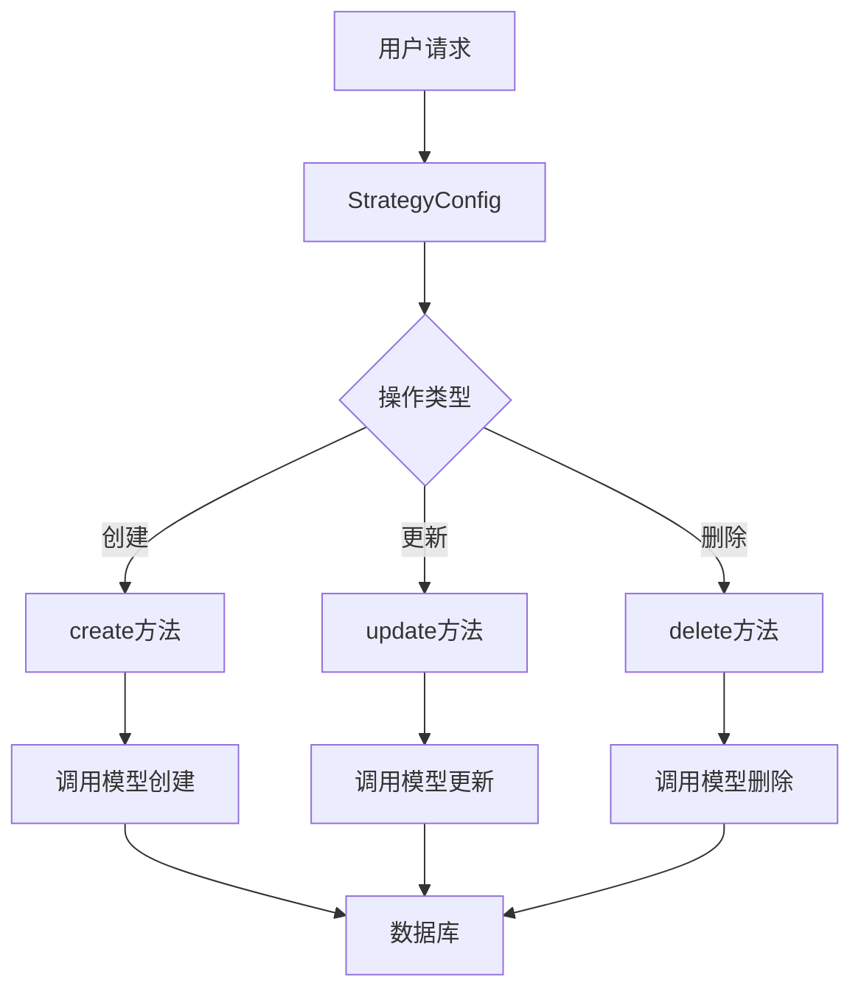
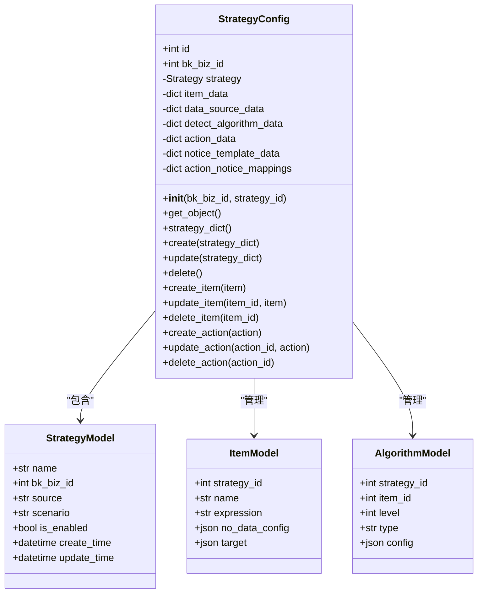
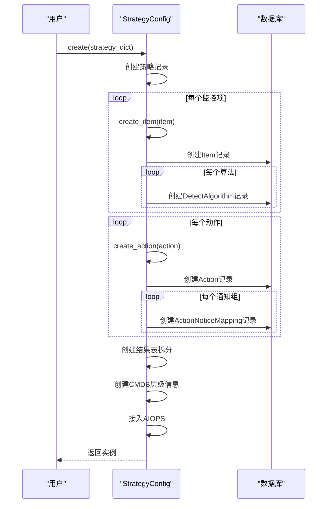
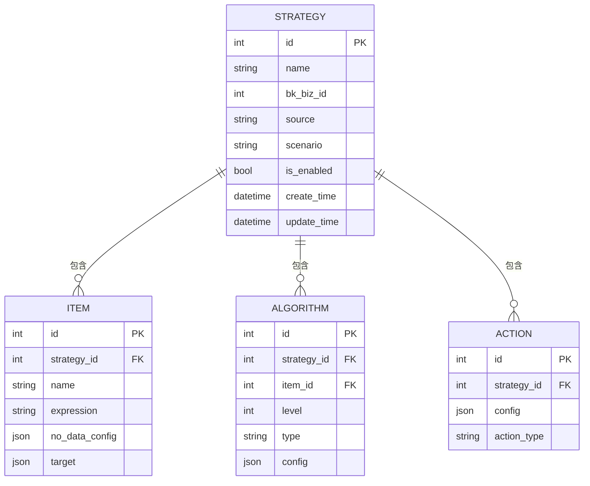
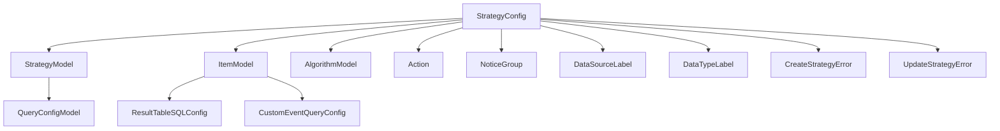

# 策略配置管理

<cite>
**本文档引用的文件**   
- [strategy.py](file://bkmonitor/bkmonitor/strategy/strategy.py)
- [models/strategy.py](file://bkmonitor/bkmonitor/models/strategy.py)
- [constants/strategy.py](file://bkmonitor/constants/strategy.py)
- [constants/data_source.py](file://bkmonitor/constants/data_source.py)
- [core/errors/strategy.py](file://bkmonitor/core/errors/strategy.py)
</cite>

## 目录
1. [简介](#简介)
2. [项目结构](#项目结构)
3. [核心组件](#核心组件)
4. [架构概述](#架构概述)
5. [详细组件分析](#详细组件分析)
6. [依赖分析](#依赖分析)
7. [性能考虑](#性能考虑)
8. [故障排除指南](#故障排除指南)
9. [结论](#结论)

## 简介
本文档全面解析了蓝鲸监控平台中策略配置的全生命周期管理机制。文档详细阐述了策略从创建、修改、删除到导入导出等操作的实现细节，深入分析了策略版本控制、审计日志记录、迁移工具、序列化与反序列化以及诊断功能等核心模块。通过代码级的分析和可视化图表，为开发者和运维人员提供了对策略配置系统内部工作原理的深刻理解。

## 项目结构
策略配置管理功能主要分布在`bkmonitor/bkmonitor/strategy`和`bkmonitor/bkmonitor/models`两个目录下。`strategy`目录包含了策略配置的业务逻辑和操作接口，而`models`目录则定义了相关的数据模型。

**图示来源**
- [strategy.py](file://bkmonitor/bkmonitor/strategy/strategy.py)
- [models/strategy.py](file://bkmonitor/bkmonitor/models/strategy.py)
- [constants/data_source.py](file://bkmonitor/constants/data_source.py)

**本节来源**
- [strategy.py](file://bkmonitor/bkmonitor/strategy/strategy.py)
- [models/strategy.py](file://bkmonitor/bkmonitor/models/strategy.py)

## 核心组件
策略配置管理的核心组件是`StrategyConfig`类，它封装了策略的创建、更新、删除和查询等所有操作。该类通过与数据库模型交互，实现了策略配置的全生命周期管理。

**本节来源**
- [strategy.py](file://bkmonitor/bkmonitor/strategy/strategy.py#L20-L199)

## 架构概述
策略配置管理采用分层架构，上层为业务逻辑层（`StrategyConfig`类），下层为数据持久层（Django Models）。业务逻辑层负责处理复杂的配置转换和验证，而数据持久层则负责与数据库进行交互。

**图示来源**
- [strategy.py](file://bkmonitor/bkmonitor/strategy/strategy.py#L600-L930)
- [models/strategy.py](file://bkmonitor/bkmonitor/models/strategy.py#L0-L199)

## 详细组件分析

### 策略配置类分析
`StrategyConfig`类是策略配置管理的核心，它通过一系列方法实现了策略的全生命周期管理。

#### 类图

**图示来源**
- [strategy.py](file://bkmonitor/bkmonitor/strategy/strategy.py#L20-L199)
- [models/strategy.py](file://bkmonitor/bkmonitor/models/strategy.py#L0-L199)

#### 创建流程

**图示来源**
- [strategy.py](file://bkmonitor/bkmonitor/strategy/strategy.py#L600-L650)

**本节来源**
- [strategy.py](file://bkmonitor/bkmonitor/strategy/strategy.py#L20-L930)

### 策略数据模型分析
策略相关的数据模型定义了策略配置在数据库中的存储结构。

#### 数据模型图

**图示来源**
- [models/strategy.py](file://bkmonitor/bkmonitor/models/strategy.py#L0-L400)

**本节来源**
- [models/strategy.py](file://bkmonitor/bkmonitor/models/strategy.py#L0-L400)

## 依赖分析
策略配置管理模块依赖于多个核心组件，包括数据模型、常量定义和错误处理。

**图示来源**
- [strategy.py](file://bkmonitor/bkmonitor/strategy/strategy.py#L10-L30)
- [models/strategy.py](file://bkmonitor/bkmonitor/models/strategy.py#L0-L400)

**本节来源**
- [strategy.py](file://bkmonitor/bkmonitor/strategy/strategy.py#L10-L30)
- [models/strategy.py](file://bkmonitor/bkmonitor/models/strategy.py#L0-L400)

## 性能考虑
策略配置管理在设计时考虑了性能优化，主要体现在以下几个方面：
1. **批量操作**：在创建和更新策略时，采用批量数据库操作，减少数据库交互次数。
2. **缓存机制**：通过实例变量缓存已加载的模型对象，避免重复查询数据库。
3. **条件索引**：在数据库表上创建了复合索引，如`("is_enabled", "bk_biz_id", "scenario")`，以加速常用查询。

## 故障排除指南
当策略配置操作失败时，应检查以下常见问题：
1. **权限问题**：确保操作用户具有足够的权限。
2. **数据完整性**：检查传入的配置数据是否完整且符合规范。
3. **依赖服务**：确认AIOPS、计算平台等依赖服务是否正常运行。
4. **日志分析**：查看系统日志，定位具体的错误信息。

**本节来源**
- [core/errors/strategy.py](file://bkmonitor/core/errors/strategy.py)
- [strategy.py](file://bkmonitor/bkmonitor/strategy/strategy.py#L600-L650)

## 结论
本文档详细解析了蓝鲸监控平台中策略配置管理的实现机制。通过`StrategyConfig`类和一系列数据模型，系统实现了策略配置的全生命周期管理。该设计具有良好的扩展性和维护性，为监控系统的稳定运行提供了坚实的基础。