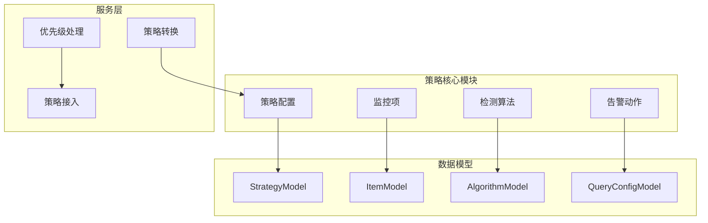
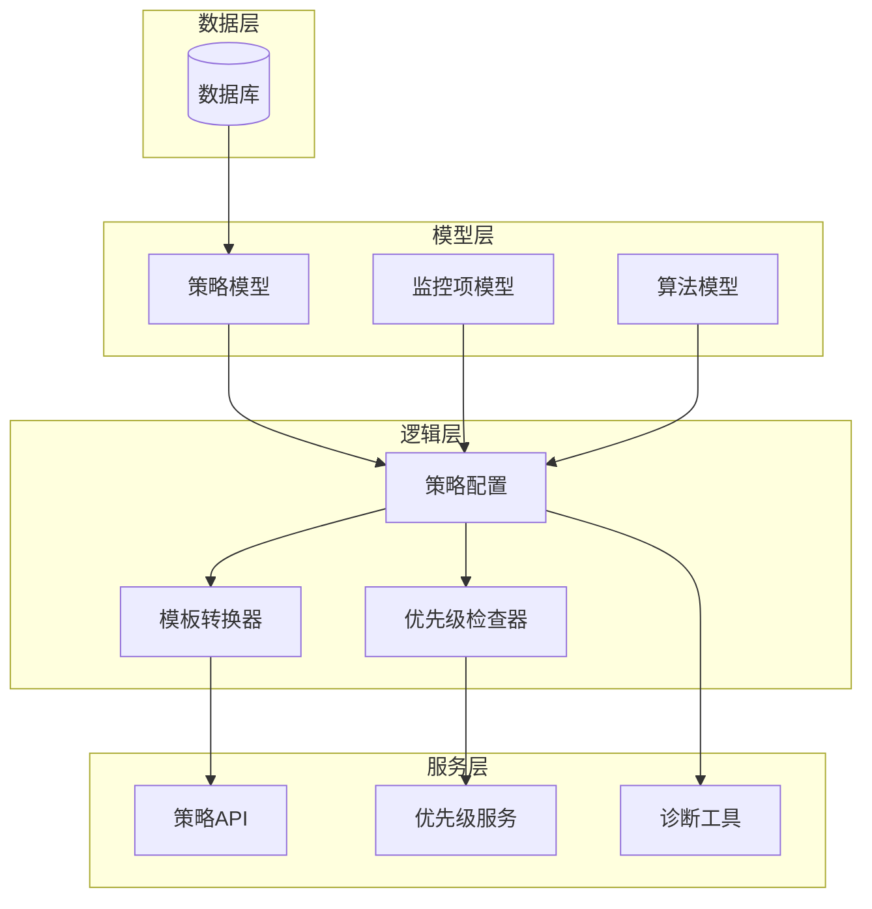
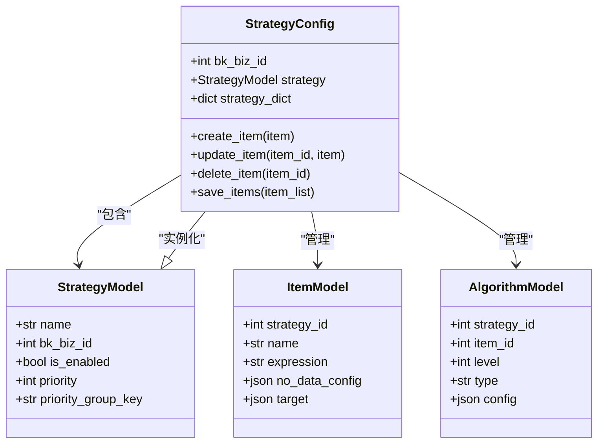
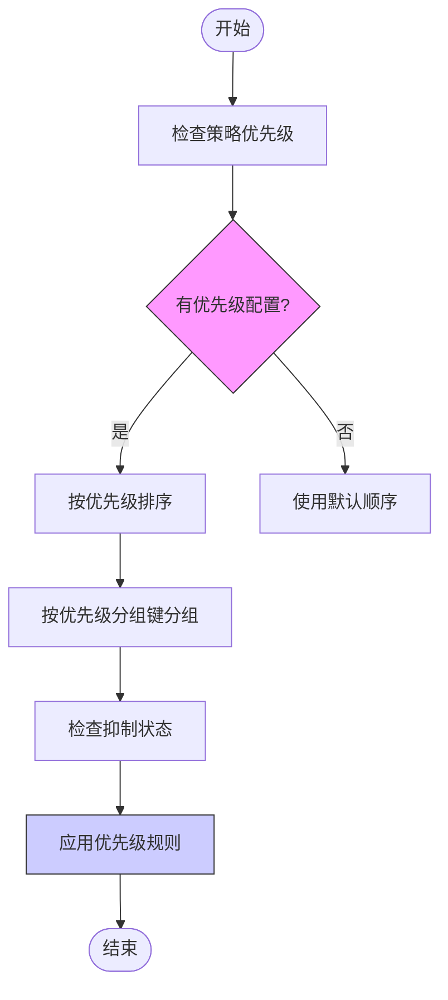
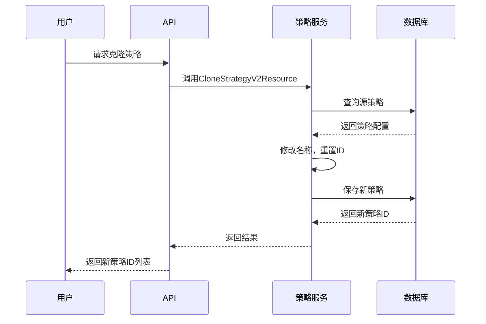
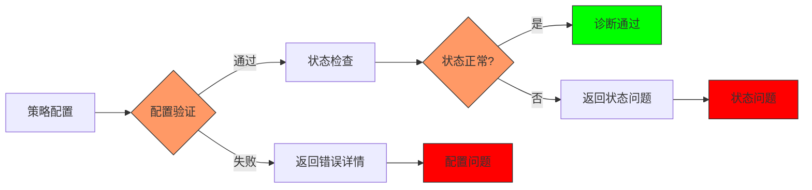
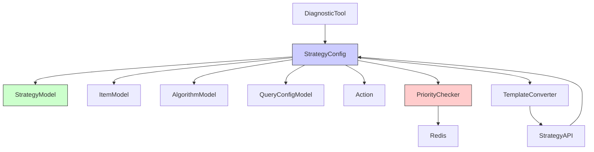

# 策略高级特性

<cite>
**本文档引用文件**   
- [strategy.py](file://bkmonitor/bkmonitor/strategy/strategy.py#L500-L930)
- [strategy.py](file://bkmonitor/bkmonitor/models/strategy.py#L0-L1028)
- [priority.py](file://alarm_backends/service/access/priority.py#L48-L142)
- [new_strategy.py](file://bkmonitor/bkmonitor/strategy/new_strategy.py#L577-L619)
- [test_priority.py](file://alarm_backends/tests/service/access/data/test_priority.py#L30-L78)
</cite>

## 目录
1. [引言](#引言)
2. [项目结构](#项目结构)
3. [核心组件](#核心组件)
4. [架构概述](#架构概述)
5. [详细组件分析](#详细组件分析)
6. [依赖分析](#依赖分析)
7. [性能考虑](#性能考虑)
8. [故障排除指南](#故障排除指南)
9. [结论](#结论)

## 引言
本文档深入探讨了监控平台中策略系统的高级功能实现，包括策略分组管理、继承机制、优先级排序等复杂特性。通过分析核心代码文件，详细解释了策略继承的实现方式、多策略冲突时的优先级判定算法以及策略模板化功能。文档还介绍了策略诊断工具的实现原理，帮助用户理解如何自动识别配置异常和潜在风险。

## 项目结构
策略系统主要由以下几个核心模块组成：
- `bkmonitor/strategy/`：策略核心逻辑实现
- `bkmonitor/models/strategy.py`：策略相关数据模型定义
- `alarm_backends/service/access/priority.py`：优先级处理逻辑
- `bkmonitor/strategy/new_strategy.py`：新策略配置处理



**图示来源**
- [strategy.py](file://bkmonitor/bkmonitor/strategy/strategy.py)
- [models/strategy.py](file://bkmonitor/bkmonitor/models/strategy.py)

## 核心组件
策略系统的核心组件包括策略配置、监控项、检测算法和告警动作。这些组件通过清晰的继承关系和依赖管理协同工作。

**组件关系**
- **策略配置**：包含多个监控项，定义整体策略行为
- **监控项**：关联具体的数据查询配置和检测算法
- **检测算法**：实现具体的异常检测逻辑
- **告警动作**：定义告警触发后的通知和处理方式

**本节来源**
- [models/strategy.py](file://bkmonitor/bkmonitor/models/strategy.py#L0-L200)

## 架构概述
策略系统的整体架构采用分层设计，从数据模型到业务逻辑再到服务接口，形成了清晰的层次结构。



**图示来源**
- [models/strategy.py](file://bkmonitor/bkmonitor/models/strategy.py)
- [strategy.py](file://bkmonitor/bkmonitor/strategy/strategy.py)

## 详细组件分析

### 策略继承机制分析
策略继承通过配置的递归更新实现，允许子策略继承父策略的配置并进行个性化调整。



**图示来源**
- [strategy.py](file://bkmonitor/bkmonitor/strategy/strategy.py#L500-L800)
- [models/strategy.py](file://bkmonitor/bkmonitor/models/strategy.py#L200-L500)

#### 继承实现原理
策略继承的实现基于`update_specified_key`函数，该函数通过递归方式更新策略配置：

```python
def update_specified_key(origin_dict, data):
    """递归更新字典"""
    for k in list(origin_dict.keys()):
        if k in data:
            origin_dict[k] = data[k]
        else:
            if isinstance(origin_dict[k], dict):
                update_specified_key(origin_dict[k], data)
            elif isinstance(origin_dict[k], list):
                for item in origin_dict[k]:
                    if isinstance(item, dict):
                        update_specified_key(item, data)
```

这种设计允许子策略只覆盖需要修改的配置项，而保留父策略的其他配置，实现了灵活的继承机制。

**本节来源**
- [strategy.py](file://bkmonitor/bkmonitor/strategy/strategy.py#L800-L930)

### 优先级排序算法分析
当多个策略同时匹配时，系统通过优先级算法决定最终的处理策略。



**图示来源**
- [priority.py](file://alarm_backends/service/access/priority.py#L109-L142)

#### 优先级判定逻辑
优先级判定算法的核心实现如下：

```python
def is_inhibited(self, record: Union[DataRecord, EventRecord], item: Item) -> bool:
    """
    判断数据点是否被抑制，同时记录需要更新的优先级信息
    """
    now_timestamp = time.time()
    
    if isinstance(record, DataRecord):
        dimensions_md5 = record.record_id.split(".")[0]
    else:
        dimensions_md5 = record.md5_dimension
    strategy_priority = item.strategy.priority

    # 如果没有优先级信息，则更新优先级信息
    priority = self.priority_cache.get(dimensions_md5)
    if not priority:
        # 如果策略优先级为0，则不更新优先级信息
        if strategy_priority:
            self.priority_cache[dimensions_md5] = f"{item.id}:{now_timestamp}"
            return False
        return True
    
    # 解析优先级信息
    priority_item_id, priority_timestamp = priority.split(":")
    priority_timestamp = float(priority_timestamp)
    
    # 比较优先级和时间戳
    if strategy_priority > int(priority_item_id):
        return False
    elif strategy_priority == int(priority_item_id):
        return now_timestamp - priority_timestamp < 300  # 5分钟内有效
    else:
        return True
```

该算法综合考虑了策略优先级数值和时间因素，确保高优先级策略能够及时生效，同时避免频繁切换。

**本节来源**
- [priority.py](file://alarm_backends/service/access/priority.py#L48-L80)

### 策略模板化功能分析
策略模板化功能通过克隆和转换机制实现，支持快速创建标准化策略。



**图示来源**
- [new_strategy.py](file://bkmonitor/bkmonitor/strategy/new_strategy.py#L2095-L2141)

#### 模板实现机制
策略模板的核心是`CloneStrategyV2Resource`类：

```python
class CloneStrategyV2Resource(Resource):
    """
    克隆策略
    """
    
    def perform_request(self, params):
        strategies = Strategy.from_models(
            StrategyModel.objects.filter(bk_biz_id=params["bk_biz_id"], id__in=params["ids"])
        )

        for strategy in strategies:
            strategy.id = 0
            strategy.name += "_copy"
            strategy.app = ""
            strategy.source = settings.APP_CODE

            while StrategyModel.objects.filter(bk_biz_id=params["bk_biz_id"], name=strategy.name).exists():
                strategy.name += "_copy"
            strategy.save()

        return [strategy.id for strategy in strategies]
```

该实现通过将源策略的ID设置为0来创建新记录，同时自动处理名称冲突，确保模板化创建的可靠性。

**本节来源**
- [new_strategy.py](file://bkmonitor/bkmonitor/strategy/new_strategy.py#L2959-L3000)

### 策略诊断工具分析
策略诊断工具通过配置验证和状态检查，帮助用户识别配置异常和潜在风险。



**图示来源**
- [strategy.py](file://bkmonitor/bkmonitor/strategy/strategy.py#L500-L600)

#### 诊断实现原理
诊断工具的核心是创建和更新过程中的异常处理：

```python
def create(cls, strategy_dict):
    item_list = strategy_dict.pop("item_list", [])
    action_list = strategy_dict.pop("action_list", [])
    try:
        # 创建策略记录
        strategy = Strategy.objects.create(**strategy_dict)
        instance = cls(strategy_dict["bk_biz_id"], strategy)
        
        # 创建监控项
        for item in item_list:
            instance.create_item(item)
            
        # 创建告警动作
        for action in action_list:
            instance.create_action(action)
            
        instance.create_result_table_split()
        instance.create_cmdb_level_info()
        instance.access_aiops()
    except ValidationError as e:
        # 创建失败，删除关联配置
        if instance:
            instance.delete()
        raise CreateStrategyError({"msg": ",".join(e.detail)})
    except Exception as e:
        # 创建失败，删除关联配置
        if instance:
            instance.delete()
        raise CreateStrategyError({"msg": str(e)})
```

这种全面的异常捕获机制确保了任何配置问题都能被及时发现和报告。

**本节来源**
- [strategy.py](file://bkmonitor/bkmonitor/strategy/strategy.py#L500-L550)

## 依赖分析
策略系统各组件之间的依赖关系如下：



**图示来源**
- [models/strategy.py](file://bkmonitor/bkmonitor/models/strategy.py)
- [strategy.py](file://bkmonitor/bkmonitor/strategy/strategy.py)

## 性能考虑
策略系统的性能主要受以下因素影响：
- **优先级缓存**：使用Redis缓存优先级信息，减少数据库查询
- **批量操作**：支持批量创建、更新和删除策略
- **索引优化**：在关键字段上建立数据库索引
- **异步处理**：将耗时操作放入任务队列

## 故障排除指南
常见问题及解决方案：

1. **策略创建失败**
   - 检查配置项是否符合验证规则
   - 确认相关资源是否存在
   - 查看详细的错误信息

2. **优先级不生效**
   - 检查策略是否配置了优先级
   - 确认优先级分组键是否正确
   - 验证Redis缓存是否正常

3. **模板克隆失败**
   - 检查源策略是否存在
   - 确认业务ID是否匹配
   - 验证名称是否冲突

**本节来源**
- [strategy.py](file://bkmonitor/bkmonitor/strategy/strategy.py#L500-L930)
- [priority.py](file://alarm_backends/service/access/priority.py#L48-L142)

## 结论
本文档详细分析了策略系统的高级特性实现，包括策略继承、优先级排序、模板化和诊断工具。通过深入研究核心代码，揭示了这些功能的技术实现细节。系统采用分层架构和模块化设计，确保了功能的灵活性和可维护性。建议在实际使用中充分利用这些高级特性，以提高监控策略的管理效率和可靠性。