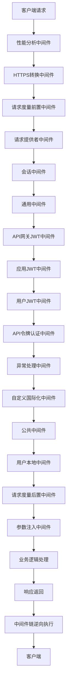
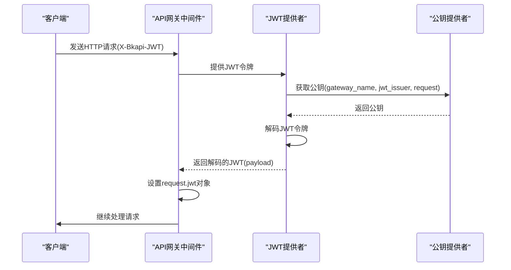
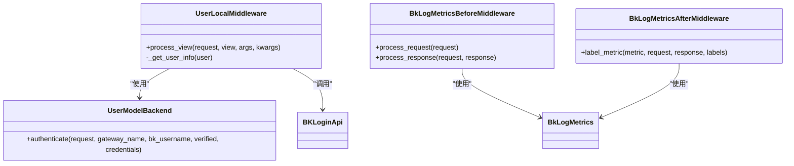
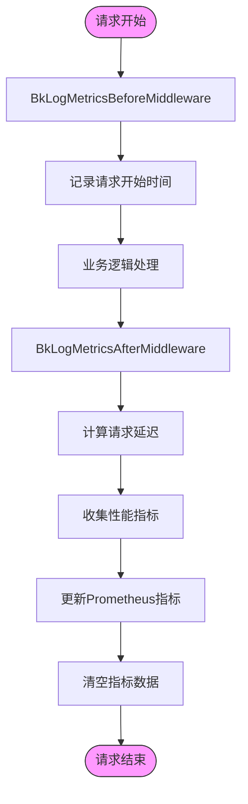
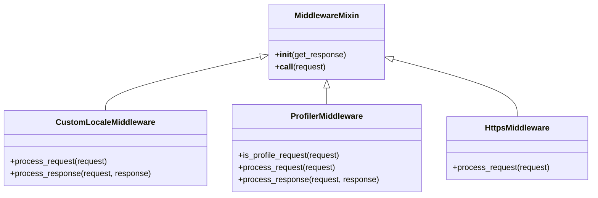

# 中间件架构

<cite>
**本文档引用的文件**   
- [api_token_middleware.py](file://bklog/apps/middleware/api_token_middleware.py)
- [apigw.py](file://bklog/apps/middleware/apigw.py)
- [user_middleware.py](file://bklog/apps/middleware/user_middleware.py)
- [custom_locale.py](file://bklog/apps/middleware/custom_locale.py)
- [pyinstrument.py](file://bklog/apps/middleware/pyinstrument.py)
- [default.py](file://bklog/config/default.py)
- [prometheus.py](file://bklog/apps/utils/prometheus.py)
- [middlewares.py](file://bklog/apps/middlewares.py)
</cite>

## 目录
1. [中间件链设计](#中间件链设计)
2. [API网关中间件](#api网关中间件)
3. [用户身份中间件](#用户身份中间件)
4. [性能监控中间件](#性能监控中间件)
5. [自定义中间件开发](#自定义中间件开发)
6. [中间件执行顺序](#中间件执行顺序)

## 中间件链设计

BK-LOG系统采用Django框架的中间件机制构建了完整的请求处理链。中间件链按照预定义的顺序依次处理HTTP请求和响应，每个中间件负责特定的功能，如认证、权限检查、性能监控等。中间件链的设计遵循单一职责原则，确保每个中间件只关注一个特定的功能领域。

中间件链的执行流程从请求进入系统开始，依次经过性能分析、HTTPS转换、请求度量、会话管理、认证授权、异常处理、国际化处理、用户上下文构建等环节，最后到达业务逻辑处理层。响应阶段则按照相反的顺序返回，形成一个完整的处理闭环。

**Diagram sources**
- [default.py](file://bklog/config/default.py#L113-L154)

**Section sources**
- [default.py](file://bklog/config/default.py#L113-L154)

## API网关中间件

API网关中间件负责处理请求路由、认证鉴权和流量控制。系统通过`ApiGatewayJWTMiddleware`实现基于JWT（JSON Web Token）的认证机制，解析请求头中的`X-Bkapi-JWT`，获取`request.jwt`对象。该中间件与`ApiGatewayJWTAppMiddleware`和`ApiGatewayJWTUserMiddleware`协同工作，分别获取`request.app`和`request.user`对象。

API网关中间件支持多种认证方式，包括内部API网关和外部API网关。通过`CustomCachePublicKeyProvider`类，系统能够根据网关名称和请求头中的`Is-External`标志选择合适的公钥进行JWT验证。对于内部API网关请求，使用`NEW_INTERNAL_APIGW_PUBLIC_KEY`；对于外部API网关请求，使用`EXTERNAL_APIGW_PUBLIC_KEY`。

**Diagram sources**
- [apigw.py](file://bklog/apps/middleware/apigw.py#L22-L125)

**Section sources**
- [apigw.py](file://bklog/apps/middleware/apigw.py#L22-L125)

## 用户身份中间件

用户身份中间件负责蓝鲸登录态识别、用户信息注入和权限上下文构建。`UserLocalMiddleware`是核心的用户身份中间件，它通过`BKLoginApi.get_user`接口从蓝鲸登录服务获取用户的个人配置信息，包括时区设置。中间件将获取的用户信息注入到`request.user_info`中，供后续业务逻辑使用。

用户身份中间件还负责处理国际化相关的用户偏好设置。通过`activate_request`和`set_local_param`函数，中间件激活当前请求的上下文，并设置用户的时区参数。对于后台API请求，中间件会使用系统默认时区，避免用户时区设置对后台任务产生影响。

**Diagram sources**
- [user_middleware.py](file://bklog/apps/middleware/user_middleware.py#L45-L157)

**Section sources**
- [user_middleware.py](file://bklog/apps/middleware/user_middleware.py#L45-L157)

## 性能监控中间件

性能监控中间件负责收集请求耗时、异常信息和性能指标。系统采用`django_prometheus`库实现Prometheus监控指标的收集。`BkLogMetricsBeforeMiddleware`和`BkLogMetricsAfterMiddleware`分别在请求处理前后记录性能数据，形成完整的请求性能监控链。

性能监控中间件收集的指标包括请求总数、响应总数、请求延迟等。这些指标通过`BkLogRegistry`注册到Prometheus监控系统中，并添加了主机名、环境阶段、应用代码等标签，便于多实例部署环境下的指标聚合分析。监控数据在上报后会被清空，由上层系统进行聚合计算。

**Diagram sources**
- [user_middleware.py](file://bklog/apps/middleware/user_middleware.py#L81-L118)
- [prometheus.py](file://bklog/apps/utils/prometheus.py#L1-L68)

**Section sources**
- [user_middleware.py](file://bklog/apps/middleware/user_middleware.py#L81-L118)
- [prometheus.py](file://bklog/apps/utils/prometheus.py#L1-L68)

## 自定义中间件开发

自定义中间件开发遵循Django的中间件规范，通过继承`MiddlewareMixin`类来实现。系统提供了多个自定义中间件的开发示例，如`CustomLocaleMiddleware`用于处理国际化，`ProfilerMiddleware`用于性能分析。开发新的中间件时，需要关注`process_request`、`process_view`和`process_response`等处理方法。

自定义中间件的注册通过在`default.py`配置文件的`MIDDLEWARE`元组中添加中间件类的完整路径来实现。中间件的执行顺序由其在元组中的位置决定，位置越靠前的中间件越早执行。开发自定义中间件时，需要注意避免与其他中间件产生冲突，特别是认证和权限相关的中间件。

**Diagram sources**
- [custom_locale.py](file://bklog/apps/middleware/custom_locale.py#L18-L69)
- [pyinstrument.py](file://bklog/apps/middleware/pyinstrument.py#L16-L87)
- [middlewares.py](file://bklog/apps/middlewares.py#L205-L211)

**Section sources**
- [custom_locale.py](file://bklog/apps/middleware/custom_locale.py#L18-L69)
- [pyinstrument.py](file://bklog/apps/middleware/pyinstrument.py#L16-L87)
- [middlewares.py](file://bklog/apps/middlewares.py#L205-L211)

## 中间件执行顺序

中间件执行顺序在`default.py`配置文件的`MIDDLEWARE`元组中定义，执行顺序从上到下。正确的执行顺序对于系统的安全性和功能完整性至关重要。例如，认证中间件必须在业务逻辑处理之前执行，而性能监控中间件需要在请求处理的前后都进行记录。

系统中间件执行顺序遵循以下原则：性能分析中间件最先执行，以便能够监控整个请求处理过程；HTTPS转换中间件在早期执行，确保安全连接；认证授权中间件在会话管理之后执行；异常处理中间件在靠近前端的位置执行，以便捕获所有异常；用户上下文构建中间件在认证之后执行，确保用户信息的准确性。

**Diagram sources**
- [default.py](file://bklog/config/default.py#L113-L154)

**Section sources**
- [default.py](file://bklog/config/default.py#L113-L154)