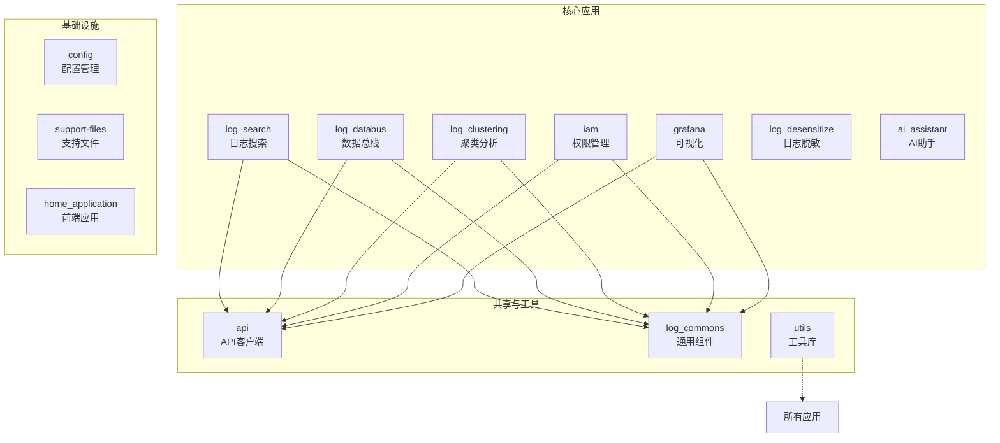
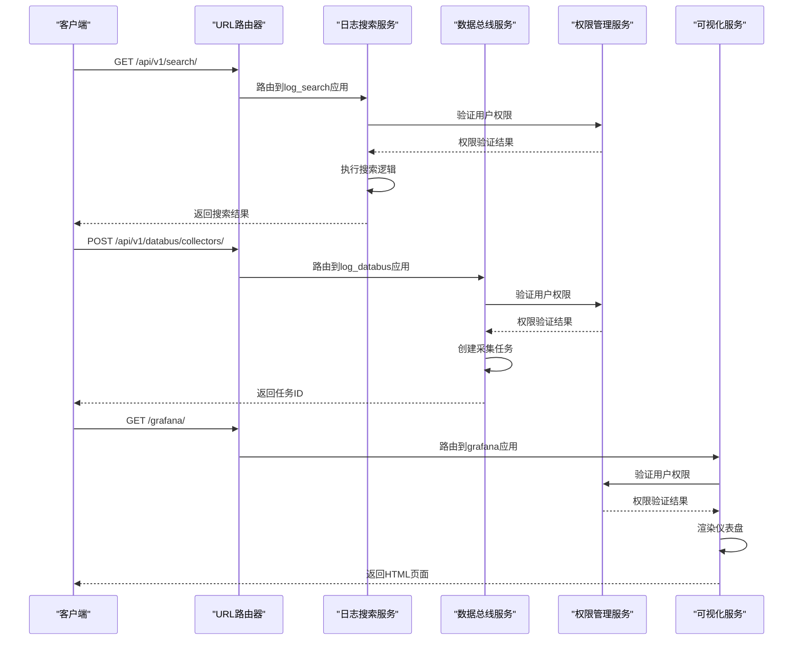
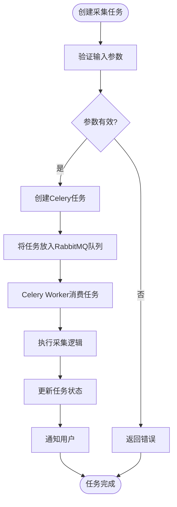
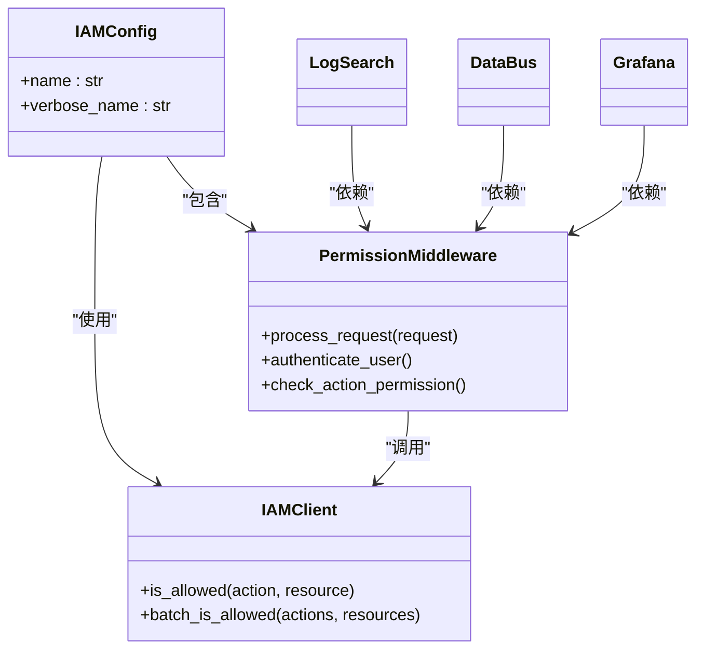
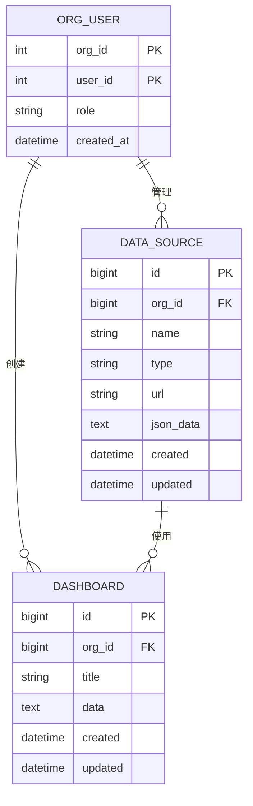
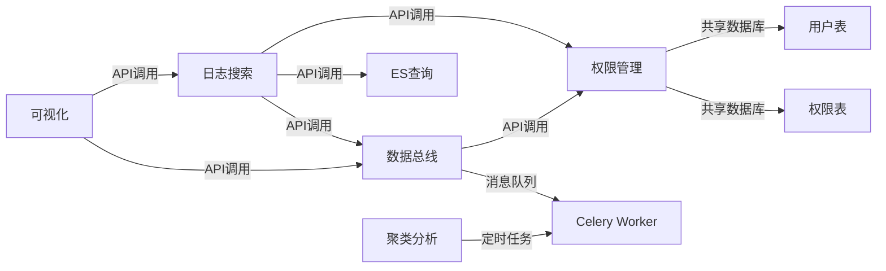

# 微服务设计

<cite>
**本文档引用的文件**   
- [settings.py](file://bklog/settings.py)
- [urls.py](file://bklog/urls.py)
- [default.py](file://bklog/config/default.py)
- [log_search/apps.py](file://bklog/apps/log_search/apps.py)
- [log_databus/apps.py](file://bklog/apps/log_databus/apps.py)
- [log_clustering/apps.py](file://bklog/apps/log_clustering/apps.py)
- [iam/apps.py](file://bklog/apps/iam/apps.py)
- [grafana/models.py](file://bklog/bk_dataview/grafana/models.py)
- [definition.yaml](file://bklog/support-files/apigw/definition.yaml)
- [sync_apigw.py](file://bklog/apps/api/management/commands/sync_apigw.py)
</cite>

## 目录
1. [引言](#引言)
2. [项目结构](#项目结构)
3. [核心组件](#核心组件)
4. [架构概述](#架构概述)
5. [详细组件分析](#详细组件分析)
6. [依赖分析](#依赖分析)
7. [性能考虑](#性能考虑)
8. [故障排除指南](#故障排除指南)
9. [结论](#结论)

## 引言
BK-LOG 是一个基于 Django 框架构建的蓝鲸日志平台，通过微服务化架构实现了日志搜索、数据总线、聚类分析、权限管理和可视化等核心功能的解耦。本设计文档详细阐述了 BK-LOG 如何通过独立的 Django 应用实现微服务化，分析了各功能模块的设计理念、实现方式以及服务间的依赖与通信机制。

## 项目结构
BK-LOG 的项目结构清晰地体现了微服务化的设计理念。核心功能被划分为多个独立的 Django 应用，每个应用都位于 `bklog/apps/` 目录下，拥有自己的 `models.py`、`views.py`、`urls.py` 和 `apps.py` 文件。这种模块化的设计使得每个服务都可以独立开发、测试和部署。



**图示来源**
- [settings.py](file://bklog/settings.py#L54-L95)
- [urls.py](file://bklog/urls.py#L42-L74)

**本节来源**
- [settings.py](file://bklog/settings.py#L54-L95)
- [urls.py](file://bklog/urls.py#L42-L74)

## 核心组件
BK-LOG 的核心组件是其各个功能独立的 Django 应用。每个应用都通过 `apps.py` 中的 `AppConfig` 类进行配置，并在 `settings.py` 的 `INSTALLED_APPS` 中注册。这种设计确保了应用的独立性和可插拔性。例如，`log_search` 应用负责日志检索功能，而 `log_databus` 应用则管理日志采集和传输。

**本节来源**
- [settings.py](file://bklog/settings.py#L54-L95)
- [log_search/apps.py](file://bklog/apps/log_search/apps.py#L48-L57)
- [log_databus/apps.py](file://bklog/apps/log_databus/apps.py#L25-L27)

## 架构概述
BK-LOG 的微服务架构基于 Django 的应用系统构建。整个系统通过统一的 `urls.py` 文件将各个应用的 API 端点进行路由分发。所有 API 请求均以 `/api/v1/` 为前缀，后接具体的应用名称，如 `/api/v1/databus/` 或 `/api/v1/search/`。这种设计实现了清晰的服务边界划分。



**图示来源**
- [urls.py](file://bklog/urls.py#L42-L74)
- [log_search/apps.py](file://bklog/apps/log_search/apps.py#L48-L57)
- [log_databus/apps.py](file://bklog/apps/log_databus/apps.py#L25-L27)

## 详细组件分析

### 日志搜索服务分析
`log_search` 应用是 BK-LOG 的核心功能之一，负责提供日志检索能力。该服务通过 RESTful API 暴露其功能，并依赖于 `log_esquery` 服务进行底层的 Elasticsearch 查询。服务的初始化逻辑在 `apps.py` 的 `ready()` 方法中定义，确保了在 Django 启动时执行必要的迁移和配置同步。

```mermaid
classDiagram
class LogSearchConfig {
+name : str
+verbose_name : str
+ready()
+init_bklog_api()
+sync_package_version()
+check_feature()
}
class IndexSet {
+index_set_id : int
+index_set_name : str
+scenario_id : str
+storage_cluster_id : int
+create()
+update()
+delete()
}
class SearchHandler {
+search_logs(query_params)
+get_context(query_params)
+get_realtime(query_params)
}
LogSearchConfig --> IndexSet : "管理"
LogSearchConfig --> SearchHandler : "使用"
SearchHandler --> "log_esquery" : "调用"
```

**图示来源**
- [log_search/apps.py](file://bklog/apps/log_search/apps.py#L48-L155)
- [log_search/models.py](file://bklog/apps/log_search/models.py)
- [log_search/handlers/search.py](file://bklog/apps/log_search/handlers/search.py)

**本节来源**
- [log_search/apps.py](file://bklog/apps/log_search/apps.py#L48-L155)
- [log_search/models.py](file://bklog/apps/log_search/models.py)

### 数据总线服务分析
`log_databus` 应用负责日志数据的采集、传输和存储管理。该服务通过 Celery 任务异步处理耗时的采集任务，并通过消息队列（如 RabbitMQ）与其它服务进行通信。其 `apps.py` 文件定义了应用的基本配置，而具体的业务逻辑分布在 `handlers` 和 `tasks` 目录中。



**图示来源**
- [log_databus/apps.py](file://bklog/apps/log_databus/apps.py#L25-L27)
- [log_databus/tasks/collector.py](file://bklog/apps/log_databus/tasks/collector.py)
- [home_application/utils/rabbitmq.py](file://bklog/home_application/utils/rabbitmq.py)

**本节来源**
- [log_databus/apps.py](file://bklog/apps/log_databus/apps.py#L25-L27)
- [log_databus/tasks/collector.py](file://bklog/apps/log_databus/tasks/collector.py)

### 聚类分析服务分析
`log_clustering` 应用专注于日志数据的智能分析和模式识别。该服务通过定时任务（Celery Beat）定期运行聚类算法，并将结果存储在数据库中。其架构设计体现了计算与存储的分离，核心算法位于 `tasks` 目录，而结果管理则由 `models` 和 `views` 处理。

**本节来源**
- [log_clustering/apps.py](file://bklog/apps/log_clustering/apps.py#L25-L27)
- [log_clustering/tasks/sync_pattern.py](file://bklog/apps/log_clustering/tasks/sync_pattern.py)

### 权限管理服务分析
`iam` 应用是 BK-LOG 的权限中心，负责所有服务的访问控制。它通过蓝鲸 IAM（Identity and Access Management）系统实现基于角色的访问控制（RBAC）。该服务不仅提供权限验证 API，还通过中间件（Middleware）集成到所有其他服务的请求处理流程中，确保了权限检查的统一性。



**图示来源**
- [iam/apps.py](file://bklog/apps/iam/apps.py)
- [middleware/apigw.py](file://bklog/apps/middleware/apigw.py)
- [default.py](file://bklog/config/default.py#L560-L568)

**本节来源**
- [iam/apps.py](file://bklog/apps/iam/apps.py)
- [middleware/apigw.py](file://bklog/apps/middleware/apigw.py)

### 可视化服务分析
`grafana` 应用为 BK-LOG 提供了强大的数据可视化能力。它通过集成 Grafana 开源项目，实现了仪表盘的创建、管理和展示。该服务不仅提供前端界面，还通过 `bk_dataview` 模块与后端数据源进行交互，确保了数据的实时性和准确性。



**图示来源**
- [bk_dataview/grafana/models.py](file://bklog/bk_dataview/grafana/models.py)
- [grafana/provisioning.py](file://bklog/apps/grafana/provisioning.py)

**本节来源**
- [bk_dataview/grafana/models.py](file://bklog/bk_dataview/grafana/models.py)
- [grafana/views.py](file://bklog/apps/grafana/views.py)

## 依赖分析
BK-LOG 的微服务之间通过多种机制进行通信和依赖管理。最核心的依赖是通过 API 调用，所有服务都通过 `/api/v1/` 前缀的 RESTful 接口相互通信。此外，服务间还通过共享数据库模式和消息队列进行异步交互。



**图示来源**
- [urls.py](file://bklog/urls.py#L42-L74)
- [settings.py](file://bklog/settings.py#L213-L232)
- [home_application/utils/rabbitmq.py](file://bklog/home_application/utils/rabbitmq.py)

**本节来源**
- [urls.py](file://bklog/urls.py#L42-L74)
- [settings.py](file://bklog/settings.py#L213-L232)

## 性能考虑
BK-LOG 在性能方面进行了多项优化。首先，通过 Celery 实现了异步任务处理，将耗时的采集和分析任务从主请求流程中剥离。其次，系统广泛使用了缓存机制，如 `cache_one_hour` 装饰器，以减少对后端服务的重复调用。此外，通过配置 `CELERYD_CONCURRENCY` 环境变量，可以灵活调整 Celery Worker 的并发数，以适应不同的负载需求。

## 故障排除指南
当 BK-LOG 服务出现问题时，应首先检查 Celery Worker 和 RabbitMQ 的状态。可以通过 `home_application` 应用提供的健康检查接口（如 `/healthz/`）来快速诊断系统整体健康状况。对于权限相关的问题，应检查 `iam` 服务的日志和配置。对于数据查询缓慢的问题，应检查 Elasticsearch 集群的状态和查询语句的优化。

**本节来源**
- [home_application/urls.py](file://bklog/home_application/urls.py#L40-L47)
- [home_application/handlers/healthz_metrics/](file://bklog/home_application/handlers/healthz_metrics/)

## 结论
BK-LOG 通过 Django 应用的微服务化设计，成功实现了日志平台各功能模块的解耦。这种架构不仅提高了系统的可维护性和可扩展性，还为未来的功能迭代提供了坚实的基础。通过清晰的服务边界划分、统一的 API 网关和灵活的通信机制，BK-LOG 展现出一个现代化日志平台应有的架构水准。