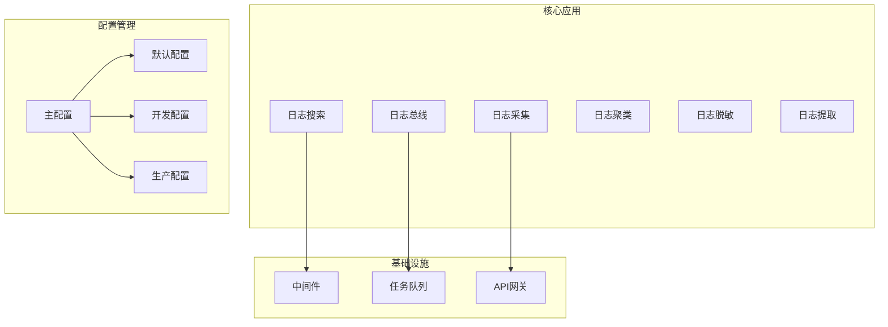
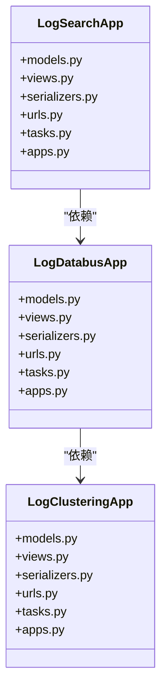
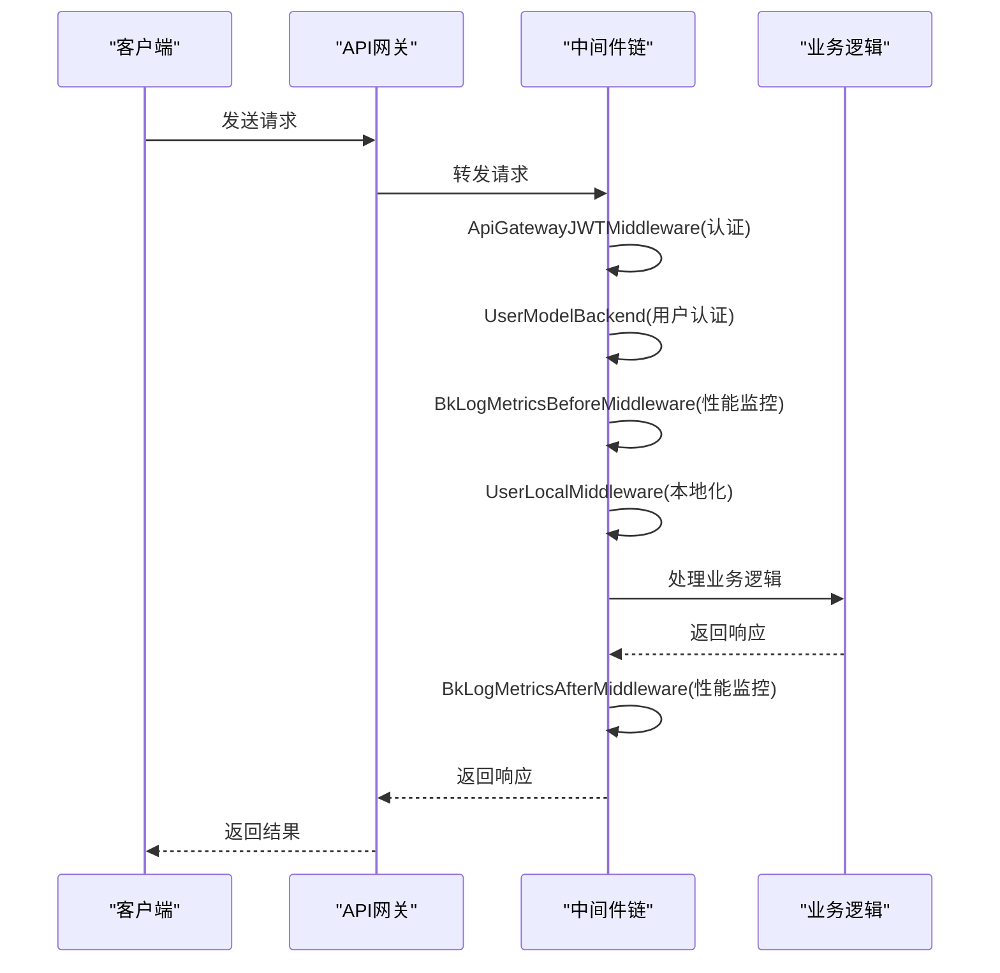
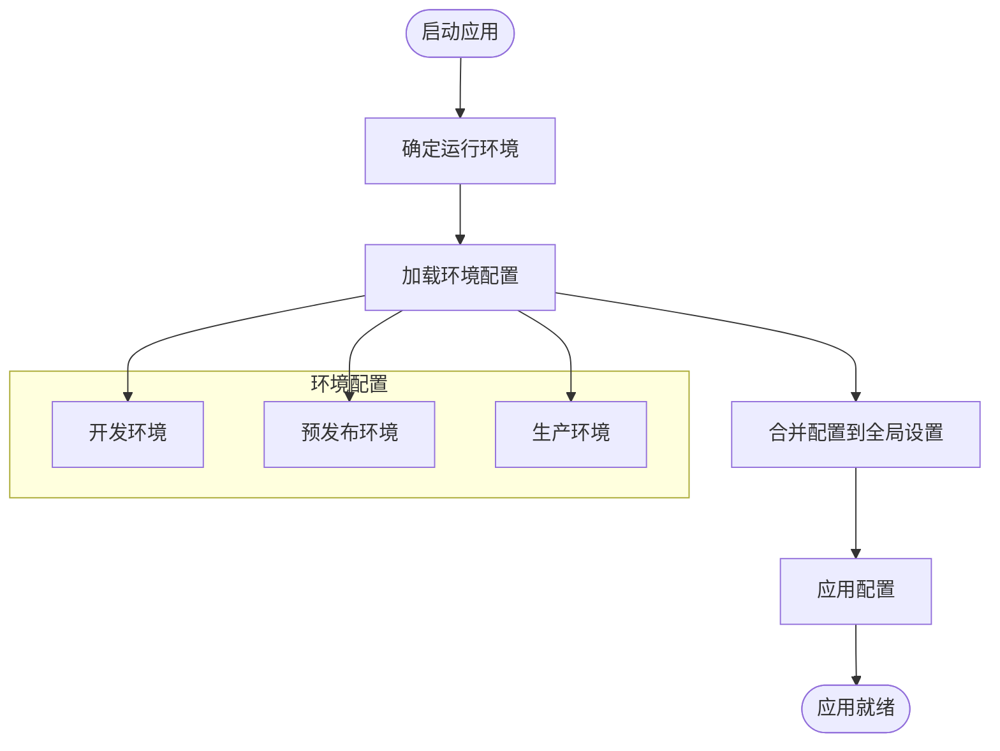
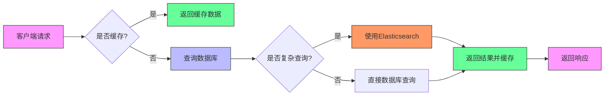

# 架构设计模式

<cite>
**本文档引用的文件**  
- [settings.py](file://bklog/settings.py)
- [urls.py](file://bklog/urls.py)
- [wsgi.py](file://bklog/wsgi.py)
- [default.py](file://bklog/config/default.py)
- [dev.py](file://bklog/config/dev.py)
- [prod.py](file://bklog/config/prod.py)
- [middlewares.py](file://bklog/apps/middlewares.py)
- [user_middleware.py](file://bklog/apps/middleware/user_middleware.py)
- [apigw.py](file://bklog/apps/middleware/apigw.py)
- [apps.py](file://bklog/apps/log_search/apps.py)
- [apps.py](file://bklog/apps/log_databus/apps.py)
</cite>

## 目录
1. [引言](#引言)
2. [项目结构分析](#项目结构分析)
3. [基于Django的微服务化设计](#基于django的微服务化设计)
4. [中间件链设计](#中间件链设计)
5. [配置管理策略](#配置管理策略)
6. [任务队列(Celery)应用模式](#任务队列celery应用模式)
7. [系统性能优化策略](#系统性能优化策略)
8. [结论](#结论)

## 引言

BK-LOG作为蓝鲸日志平台，采用基于Django框架的微服务化架构设计，实现了功能解耦和高可维护性。本架构设计模式文档深入分析了BK-LOG的技术决策和架构模式，涵盖微服务化设计、中间件链、配置管理、任务队列和性能优化等关键方面。通过独立应用实现功能模块化，BK-LOG能够灵活应对复杂的日志管理需求，同时确保系统的稳定性和可扩展性。

**本文档引用的文件**  
- [settings.py](file://bklog/settings.py)
- [urls.py](file://bklog/urls.py)

## 项目结构分析

BK-LOG项目采用模块化的应用结构，每个功能模块作为独立的Django应用存在，实现了清晰的职责分离。核心应用包括日志搜索(log_search)、日志总线(log_databus)、日志采集(log_collect)、日志聚类(log_clustering)等，每个应用都有独立的models、views、serializers和tasks模块。

项目配置采用分层设计，通过settings.py主配置文件动态加载不同环境的配置。配置文件结构包括default.py（默认配置）、dev.py（开发环境）、stag.py（预发布环境）和prod.py（生产环境），实现了环境差异化配置管理。



**图源**  
- [settings.py](file://bklog/settings.py)
- [urls.py](file://bklog/urls.py)

**本文档引用的文件**  
- [settings.py](file://bklog/settings.py)
- [urls.py](file://bklog/urls.py)
- [config/default.py](file://bklog/config/default.py)

## 基于Django的微服务化设计

BK-LOG采用基于Django的微服务化设计，通过独立应用实现功能解耦和可维护性。每个功能模块作为独立的Django应用，拥有自己的模型、视图、序列化器和任务，实现了高内聚低耦合的设计原则。

在INSTALLED_APPS配置中，可以看到多个独立的应用模块被注册，如apps.log_search、apps.log_databus、apps.log_esquery等。这种设计使得每个模块可以独立开发、测试和部署，提高了开发效率和系统可维护性。

URL路由采用模块化设计，通过include方式将不同应用的URL配置集成到主路由中。例如，日志搜索相关的API通过re_path(r"^api/v1/", include("apps.log_search.urls"))集成，实现了清晰的API边界划分。



**图源**  
- [settings.py](file://bklog/settings.py)
- [urls.py](file://bklog/urls.py)

**本文档引用的文件**  
- [settings.py](file://bklog/settings.py)
- [urls.py](file://bklog/urls.py)
- [apps.py](file://bklog/apps/log_search/apps.py)
- [apps.py](file://bklog/apps/log_databus/apps.py)

## 中间件链设计

BK-LOG设计了完善的中间件链，处理API网关、用户身份认证和性能监控等横切关注点。中间件链按照特定顺序执行，确保请求在到达业务逻辑前完成必要的预处理。

中间件配置在settings.py中定义，包括性能分析、HTTPS转换、会话管理、认证授权、异常处理等多个层次。关键中间件包括：

1. **ApiGatewayJWTMiddleware**：处理API网关JWT认证，解析请求头中的X-Bkapi-JWT获取request.jwt对象
2. **UserModelBackend**：用户认证后端，基于用户名获取用户信息
3. **BkLogMetricsBeforeMiddleware**：性能监控中间件，在请求处理前记录指标
4. **BkLogMetricsAfterMiddleware**：性能监控中间件，在请求处理后记录指标
5. **UserLocalMiddleware**：用户本地化中间件，处理用户时区和语言偏好



**图源**  
- [middlewares.py](file://bklog/apps/middlewares.py)
- [user_middleware.py](file://bklog/apps/middleware/user_middleware.py)
- [apigw.py](file://bklog/apps/middleware/apigw.py)

**本文档引用的文件**  
- [middlewares.py](file://bklog/apps/middlewares.py)
- [user_middleware.py](file://bklog/apps/middleware/user_middleware.py)
- [apigw.py](file://bklog/apps/middleware/apigw.py)

## 配置管理策略

BK-LOG采用灵活的配置管理策略，支持开发、测试、生产环境的差异化配置。配置系统基于Django设置模块，通过环境变量动态加载不同环境的配置文件。

配置加载流程如下：
1. settings.py根据环境变量BKPAAS_ENVIRONMENT或BK_ENV确定运行环境
2. 动态导入对应环境的配置模块（config.dev、config.stag、config.prod）
3. 将环境配置中的大写变量合并到全局设置中

开发环境配置（dev.py）包含本地开发所需的设置，如DEBUG=True、本地数据库连接和开发用的BROKER_URL。生产环境配置（prod.py）则包含生产环境的安全设置，如CSRF保护、错误日志级别和外部服务连接信息。



**图源**  
- [settings.py](file://bklog/settings.py)
- [default.py](file://bklog/config/default.py)
- [dev.py](file://bklog/config/dev.py)
- [prod.py](file://bklog/config/prod.py)

**本文档引用的文件**  
- [settings.py](file://bklog/settings.py)
- [default.py](file://bklog/config/default.py)
- [dev.py](file://bklog/config/dev.py)
- [prod.py](file://bklog/config/prod.py)

## 任务队列(Celery)应用模式

BK-LOG使用Celery作为异步任务处理框架，处理日志采集配置变更、聚类分析任务调度等耗时操作。Celery配置在settings.py中定义，支持RabbitMQ和Redis作为消息代理。

任务注册通过CELERY_IMPORTS配置实现，将各个应用的任务模块注册到Celery中。关键任务模块包括：
- apps.log_search.tasks：日志搜索相关任务
- apps.log_databus.tasks：日志总线相关任务
- apps.log_clustering.tasks：日志聚类相关任务
- apps.log_extract.tasks：日志提取相关任务

异步处理模式提高了系统的响应性能，将耗时操作从主请求流程中分离，确保API接口的快速响应。任务队列还支持任务重试、定时调度和优先级队列等高级功能。

```mermaid
graph TB
subgraph "Web应用"
Request[HTTP请求]
Response[HTTP响应]
end
subgraph "Celery工作进程"
Worker[任务工作进程]
TaskQueue[任务队列]
Task[执行任务]
end
Request --> Worker : 发布任务
Worker --> TaskQueue : 存储任务
TaskQueue --> Task : 消费任务
Task --> Worker : 执行完成
Worker --> Response : 返回结果
style Request fill:#f9f,stroke:#333
style Response fill:#f9f,stroke:#333
style Worker fill:#bbf,stroke:#333
style TaskQueue fill:#f96,stroke:#333
style Task fill:#6f9,stroke:#333
```

**图源**  
- [settings.py](file://bklog/settings.py)
- [apps.py](file://bklog/apps/log_search/apps.py)

**本文档引用的文件**  
- [settings.py](file://bklog/settings.py)
- [apps.py](file://bklog/apps/log_search/apps.py)

## 系统性能优化策略

BK-LOG实施了多层次的系统性能优化策略，包括缓存机制、数据库查询优化和Elasticsearch索引策略。

### 缓存机制
系统采用多级缓存策略：
1. **Redis缓存**：用于存储会话数据、频繁查询结果和热点数据
2. **内存缓存**：用于存储配置信息和元数据
3. **浏览器缓存**：通过STATIC_VERSION控制静态资源缓存

### 数据库查询优化
- 使用数据库连接重试机制(django_dbconn_retry)
- 优化查询语句，避免N+1查询问题
- 使用数据库索引优化查询性能
- 实施查询分页和批量处理

### Elasticsearch索引策略
- 采用热温架构(Hot-Warm Architecture)优化索引性能
- 实施索引生命周期管理(ILM)
- 优化分片和副本配置
- 使用合适的分析器和映射配置



**图源**  
- [settings.py](file://bklog/settings.py)
- [default.py](file://bklog/config/default.py)

**本文档引用的文件**  
- [settings.py](file://bklog/settings.py)
- [default.py](file://bklog/config/default.py)

## 结论

BK-LOG通过基于Django的微服务化设计，成功实现了功能解耦和高可维护性。系统采用模块化应用结构，每个功能模块作为独立的Django应用存在，拥有清晰的职责边界。中间件链设计完善，有效处理了API网关、用户认证和性能监控等横切关注点。

配置管理策略灵活，支持多环境差异化配置，确保了系统在不同部署环境中的适应性。任务队列(Celery)的应用模式使得耗时操作能够异步处理，提高了系统的响应性能和用户体验。

系统性能优化策略全面，包括多级缓存机制、数据库查询优化和Elasticsearch索引策略，确保了系统在高负载下的稳定性和响应速度。整体架构设计合理，技术决策科学，为日志管理平台的稳定运行提供了坚实的基础。