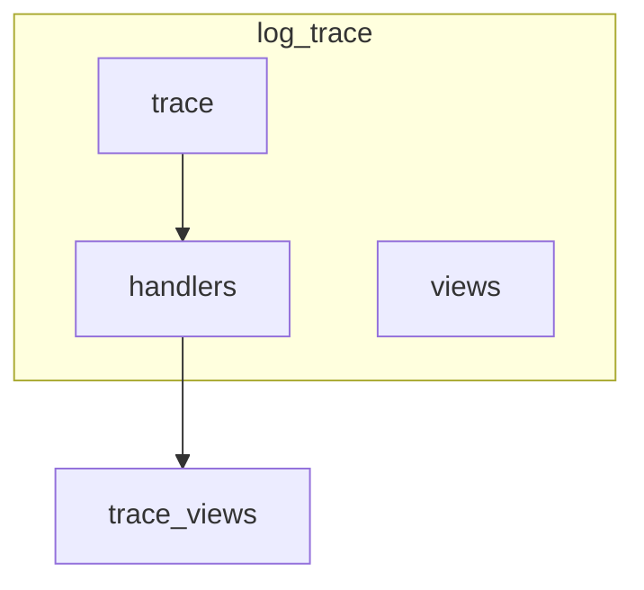
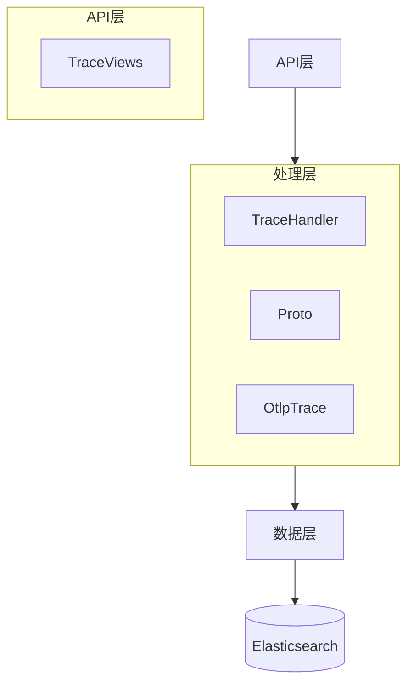
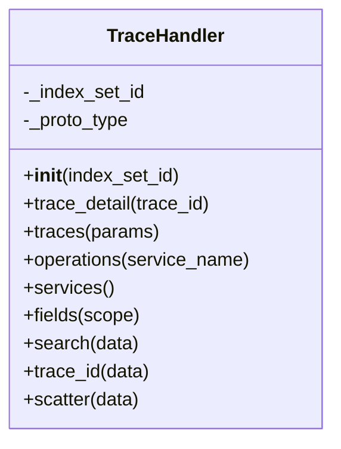
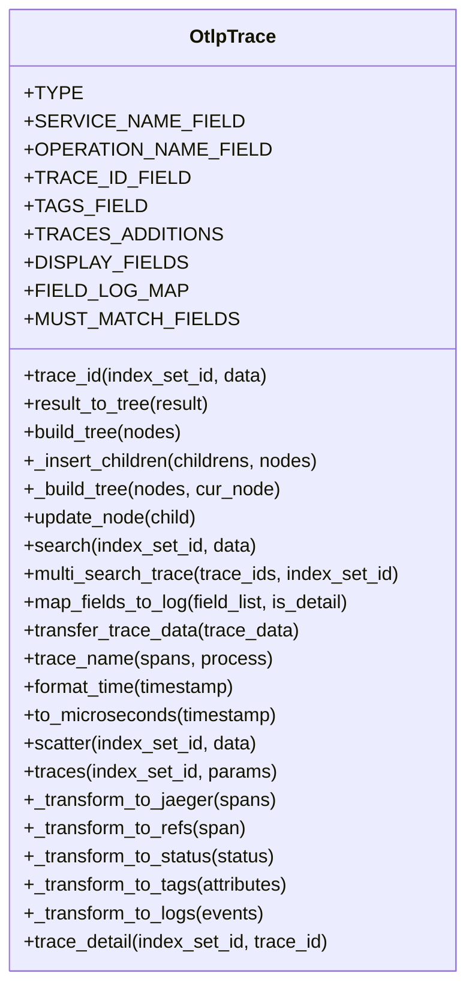
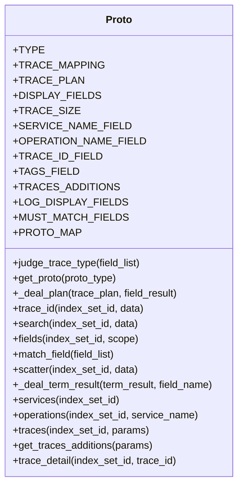
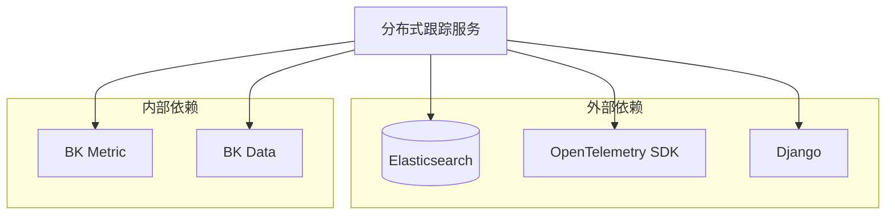

# 分布式跟踪服务

<cite>
**本文档引用的文件**
- [trace_handlers.py](file://bklog/apps/log_trace/handlers/trace_handlers.py)
- [otlp.py](file://bklog/apps/log_trace/handlers/proto/otlp.py)
- [proto.py](file://bklog/apps/log_trace/handlers/proto/proto.py)
- [trace_field_handlers.py](file://bklog/apps/log_trace/handlers/trace_field_handlers.py)
- [constants.py](file://bklog/apps/log_trace/constants.py)
- [trace_views.py](file://bklog/apps/log_trace/views/trace_views.py)
</cite>

## 目录
1. [简介](#简介)
2. [项目结构](#项目结构)
3. [核心组件](#核心组件)
4. [架构概述](#架构概述)
5. [详细组件分析](#详细组件分析)
6. [依赖分析](#依赖分析)
7. [性能考虑](#性能考虑)
8. [故障排除指南](#故障排除指南)
9. [结论](#结论)

## 简介
本文档详细描述了分布式跟踪服务的技术实现，重点介绍其对OpenTelemetry协议的支持。文档涵盖了trace_handlers.py中实现的跟踪数据处理逻辑，包括跨度（Span）和跟踪（Trace）的关联分析。同时，文档解释了OTLP（OpenTelemetry Protocol）数据的接收和解析过程，以及如何将跟踪数据与日志数据进行关联查询。此外，还阐述了跟踪数据的存储结构和索引策略，以确保高效的查询性能，并提供了通过跟踪ID关联分布式系统中日志记录的实际案例。最后，文档包括与Elasticsearch的集成方式和查询优化技巧。

## 项目结构
分布式跟踪服务位于`bklog/apps/log_trace/`目录下，主要包含handlers、views和trace三个子目录。handlers目录包含核心处理逻辑，views目录包含API视图，trace目录包含跟踪相关的配置和初始化代码。

**图表来源**
- [trace_handlers.py](file://bklog/apps/log_trace/handlers/trace_handlers.py)
- [trace_views.py](file://bklog/apps/log_trace/views/trace_views.py)

**章节来源**
- [trace_handlers.py](file://bklog/apps/log_trace/handlers/trace_handlers.py)
- [trace_views.py](file://bklog/apps/log_trace/views/trace_views.py)

## 核心组件
分布式跟踪服务的核心组件包括TraceHandler、OtlpTrace、Proto等类，它们共同实现了跟踪数据的处理、查询和展示功能。

**章节来源**
- [trace_handlers.py](file://bklog/apps/log_trace/handlers/trace_handlers.py)
- [otlp.py](file://bklog/apps/log_trace/handlers/proto/otlp.py)
- [proto.py](file://bklog/apps/log_trace/handlers/proto/proto.py)

## 架构概述
分布式跟踪服务采用分层架构，包括API层、处理层和数据层。API层通过trace_views.py暴露REST API，处理层通过trace_handlers.py和proto.py实现业务逻辑，数据层通过Elasticsearch存储和查询跟踪数据。

**图表来源**
- [trace_handlers.py](file://bklog/apps/log_trace/handlers/trace_handlers.py)
- [trace_views.py](file://bklog/apps/log_trace/views/trace_views.py)

## 详细组件分析

### TraceHandler分析
TraceHandler是跟踪服务的核心处理类，负责协调各种跟踪操作。

**图表来源**
- [trace_handlers.py](file://bklog/apps/log_trace/handlers/trace_handlers.py#L27-L57)

**章节来源**
- [trace_handlers.py](file://bklog/apps/log_trace/handlers/trace_handlers.py#L27-L57)

### OtlpTrace分析
OtlpTrace类实现了OpenTelemetry协议的跟踪数据处理逻辑，包括数据转换、查询和关联分析。

**图表来源**
- [otlp.py](file://bklog/apps/log_trace/handlers/proto/otlp.py#L45-L453)

**章节来源**
- [otlp.py](file://bklog/apps/log_trace/handlers/proto/otlp.py#L45-L453)

### Proto分析
Proto类是跟踪协议的抽象基类，定义了各种跟踪协议的通用接口和行为。

**图表来源**
- [proto.py](file://bklog/apps/log_trace/handlers/proto/proto.py#L35-L278)

**章节来源**
- [proto.py](file://bklog/apps/log_trace/handlers/proto/proto.py#L35-L278)

## 依赖分析
分布式跟踪服务依赖于多个内部和外部组件，包括Elasticsearch用于数据存储和查询，OpenTelemetry SDK用于数据采集，以及Django框架用于Web服务。

**图表来源**
- [trace_handlers.py](file://bklog/apps/log_trace/handlers/trace_handlers.py)
- [otlp.py](file://bklog/apps/log_trace/handlers/proto/otlp.py)

**章节来源**
- [trace_handlers.py](file://bklog/apps/log_trace/handlers/trace_handlers.py)
- [otlp.py](file://bklog/apps/log_trace/handlers/proto/otlp.py)

## 性能考虑
分布式跟踪服务在设计时考虑了多种性能优化策略，包括使用Elasticsearch的聚合功能进行高效查询，采用多线程执行批量查询操作，以及合理设计索引结构以支持快速检索。

## 故障排除指南
当遇到跟踪数据查询失败或性能问题时，可以检查以下方面：
1. 确认Elasticsearch集群状态正常
2. 检查索引配置是否正确
3. 验证跟踪数据格式是否符合预期
4. 查看服务日志是否有错误信息

**章节来源**
- [exceptions.py](file://bklog/apps/log_trace/exceptions.py)

## 结论
分布式跟踪服务通过支持OpenTelemetry协议，实现了对分布式系统中跟踪数据的高效采集、存储和查询。服务采用模块化设计，具有良好的扩展性和维护性。通过与Elasticsearch的深度集成，提供了强大的数据查询和分析能力，能够有效支持分布式系统的监控和故障排查。