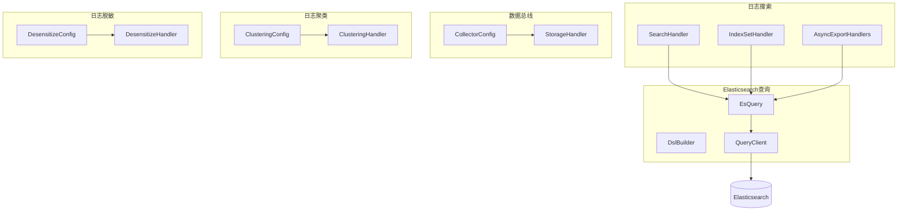
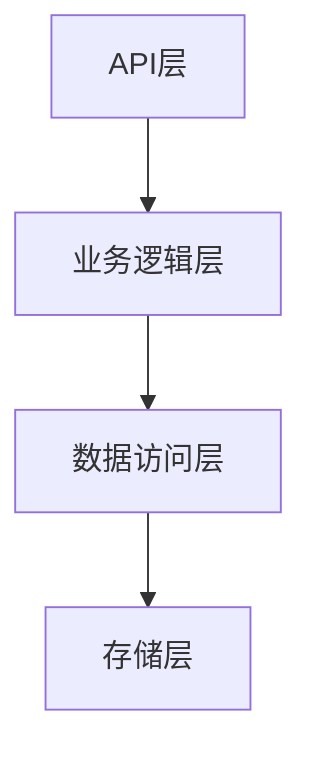
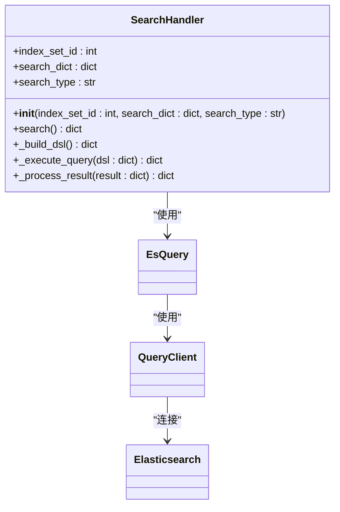
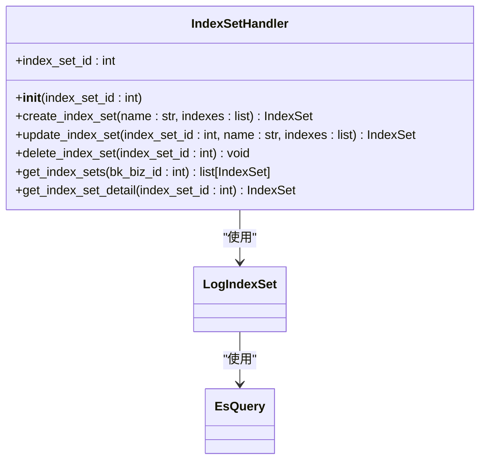
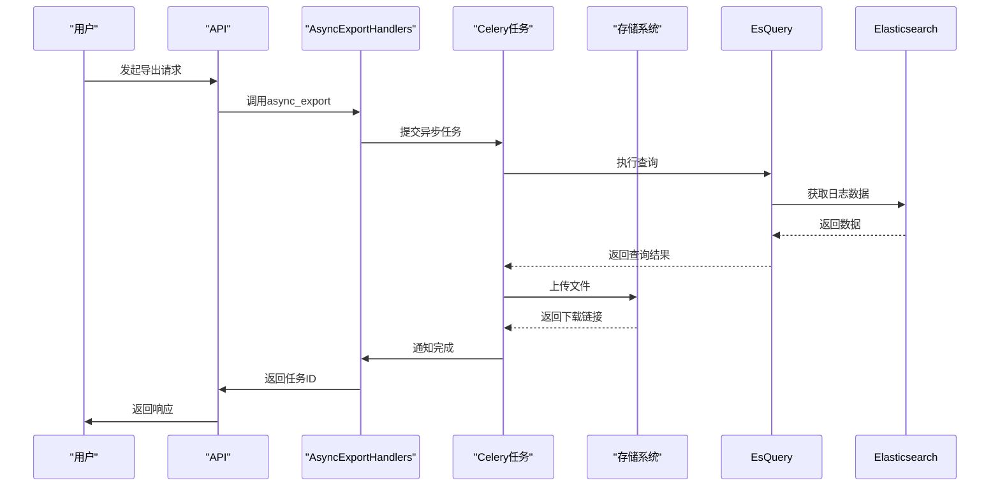
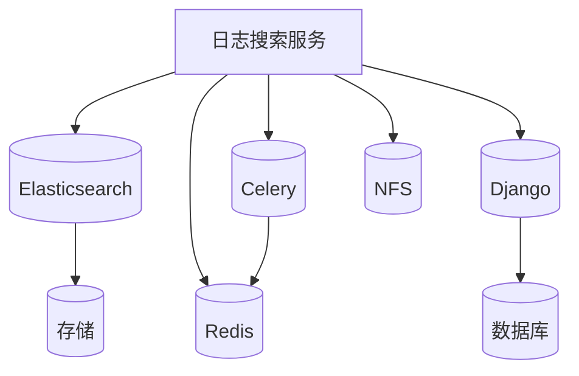

# 日志搜索服务

<cite>
**本文档引用的文件**   
- [search_handlers_esquery.py](file://bklog/apps/log_search/handlers/search/search_handlers_esquery.py)
- [dsl_builder.py](file://bklog/apps/log_esquery/esquery/dsl_builder/dsl_builder.py)
- [query_builder_logic.py](file://bklog/apps/log_esquery/esquery/dsl_builder/query_builder/query_builder_logic.py)
- [index_set.py](file://bklog/apps/log_search/handlers/index_set.py)
- [async_export_handlers.py](file://bklog/apps/log_search/handlers/search/async_export_handlers.py)
- [async_export.py](file://bklog/apps/log_search/tasks/async_export.py)
- [esquery.py](file://bklog/apps/log_esquery/esquery/esquery.py)
- [QueryClient.py](file://bklog/apps/log_esquery/esquery/client/QueryClient.py)
- [search_views.py](file://bklog/apps/log_search/views/search_views.py)
</cite>

## 目录
1. [简介](#简介)
2. [项目结构](#项目结构)
3. [核心组件](#核心组件)
4. [架构概述](#架构概述)
5. [详细组件分析](#详细组件分析)
6. [依赖分析](#依赖分析)
7. [性能考虑](#性能考虑)
8. [故障排除指南](#故障排除指南)
9. [结论](#结论)

## 简介
日志搜索服务是一个基于Elasticsearch的查询引擎，旨在为用户提供高效、灵活的日志检索功能。该服务支持复杂的查询操作，包括全文检索、字段过滤、时间范围查询和聚合分析。通过索引集（IndexSet）的概念，实现了多租户环境下的数据隔离和管理。此外，服务还提供了异步导出功能，允许用户将大量日志数据导出到外部存储，以便进一步分析或归档。

## 项目结构
日志搜索服务的代码库遵循模块化设计，主要分为以下几个部分：
- `bklog/apps/log_search/`: 包含日志搜索的核心逻辑，如搜索处理、索引集管理和异步导出。
- `bklog/apps/log_esquery/`: 提供与Elasticsearch交互的底层接口，包括DSL构建、查询执行和结果处理。
- `bklog/apps/log_databus/`: 负责日志数据的采集和传输。
- `bklog/apps/log_clustering/`: 实现日志聚类和模式识别。
- `bklog/apps/log_desensitize/`: 提供日志数据脱敏功能，保护敏感信息。

**Diagram sources**
- [search_handlers_esquery.py](file://bklog/apps/log_search/handlers/search/search_handlers_esquery.py)
- [esquery.py](file://bklog/apps/log_esquery/esquery/esquery.py)
- [QueryClient.py](file://bklog/apps/log_esquery/esquery/client/QueryClient.py)

**Section sources**
- [search_handlers_esquery.py](file://bklog/apps/log_search/handlers/search/search_handlers_esquery.py)
- [esquery.py](file://bklog/apps/log_esquery/esquery/esquery.py)
- [QueryClient.py](file://bklog/apps/log_esquery/esquery/client/QueryClient.py)

## 核心组件
日志搜索服务的核心组件主要包括搜索处理器、索引集处理器和异步导出处理器。这些组件协同工作，提供完整的日志搜索和管理功能。

**Section sources**
- [search_handlers_esquery.py](file://bklog/apps/log_search/handlers/search/search_handlers_esquery.py)
- [index_set.py](file://bklog/apps/log_search/handlers/index_set.py)
- [async_export_handlers.py](file://bklog/apps/log_search/handlers/search/async_export_handlers.py)

## 架构概述
日志搜索服务采用分层架构，从上到下依次为API层、业务逻辑层、数据访问层和存储层。API层提供RESTful接口，供前端应用调用；业务逻辑层实现具体的搜索、索引管理和导出功能；数据访问层封装了与Elasticsearch的交互；存储层则负责日志数据的实际存储。

**Diagram sources**
- [search_views.py](file://bklog/apps/log_search/views/search_views.py)
- [search_handlers_esquery.py](file://bklog/apps/log_search/handlers/search/search_handlers_esquery.py)
- [esquery.py](file://bklog/apps/log_esquery/esquery/esquery.py)

## 详细组件分析
### 搜索处理器分析
搜索处理器是日志搜索服务的核心，负责处理用户的搜索请求。它通过构建Elasticsearch DSL查询语句，执行搜索并返回结果。

#### 搜索处理器类图

**Diagram sources**
- [search_handlers_esquery.py](file://bklog/apps/log_search/handlers/search/search_handlers_esquery.py)
- [esquery.py](file://bklog/apps/log_esquery/esquery/esquery.py)
- [QueryClient.py](file://bklog/apps/log_esquery/esquery/client/QueryClient.py)

### 索引集处理器分析
索引集处理器负责管理索引集的创建、更新和删除操作。它还提供了获取索引集列表和详细信息的功能。

#### 索引集处理器类图

**Diagram sources**
- [index_set.py](file://bklog/apps/log_search/handlers/index_set.py)
- [esquery.py](file://bklog/apps/log_esquery/esquery/esquery.py)

### 异步导出处理器分析
异步导出处理器负责处理用户的日志导出请求。它将导出任务提交到后台队列，由Celery任务异步执行。

#### 异步导出处理器序列图

**Diagram sources**
- [async_export_handlers.py](file://bklog/apps/log_search/handlers/search/async_export_handlers.py)
- [async_export.py](file://bklog/apps/log_search/tasks/async_export.py)
- [esquery.py](file://bklog/apps/log_esquery/esquery/esquery.py)

## 依赖分析
日志搜索服务依赖于多个外部组件和库，包括Elasticsearch、Celery、Django等。这些依赖关系确保了服务的稳定性和可扩展性。

**Diagram sources**
- [requirements.txt](file://requirements.txt)
- [pyproject.toml](file://pyproject.toml)

**Section sources**
- [requirements.txt](file://requirements.txt)
- [pyproject.toml](file://pyproject.toml)

## 性能考虑
为了保证日志搜索服务的高性能，采取了多种优化措施：
- 使用Elasticsearch的分片和副本机制，提高查询速度和数据可靠性。
- 通过异步任务处理大量数据导出，避免阻塞主线程。
- 实现缓存机制，减少重复查询的开销。
- 优化DSL查询语句，减少不必要的字段加载。

## 故障排除指南
### 常见问题
1. **搜索结果为空**：检查时间范围是否正确，确认索引集中包含相关数据。
2. **导出任务失败**：查看任务日志，确认是否有权限问题或网络故障。
3. **查询超时**：优化查询条件，减少返回的数据量。

### 调试工具
- **日志文件**：查看`/var/log/bk-log/`目录下的日志文件，获取详细的错误信息。
- **监控面板**：使用Grafana监控Elasticsearch集群状态和查询性能。
- **API测试**：使用Postman或curl工具测试API接口，验证请求参数。

**Section sources**
- [logs](file:///var/log/bk-log/)
- [monitoring](file://bklog/apps/grafana/)

## 结论
日志搜索服务通过集成Elasticsearch和Celery等技术，提供了一个强大且灵活的日志管理平台。其模块化设计和丰富的功能特性，使得用户能够高效地进行日志检索、分析和导出。未来，可以通过引入机器学习算法，进一步提升日志聚类和异常检测的能力。