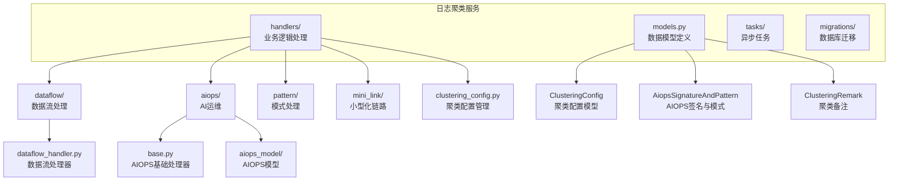
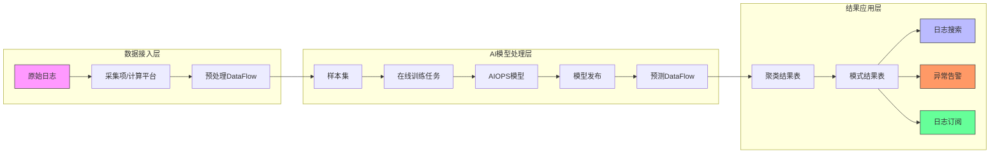
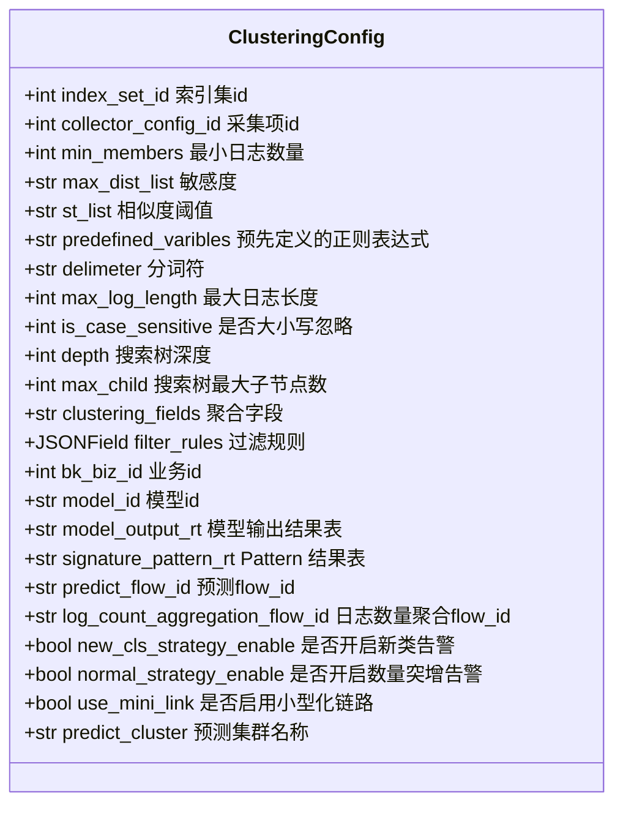
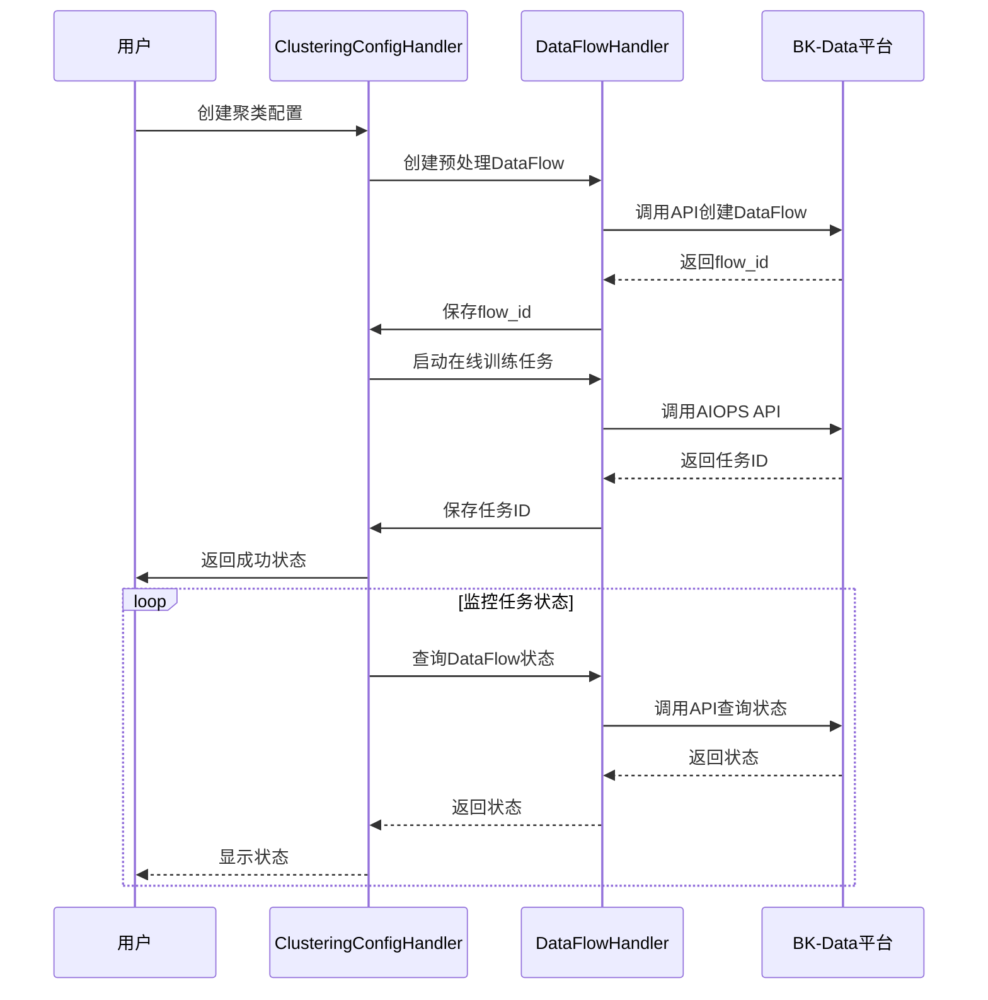
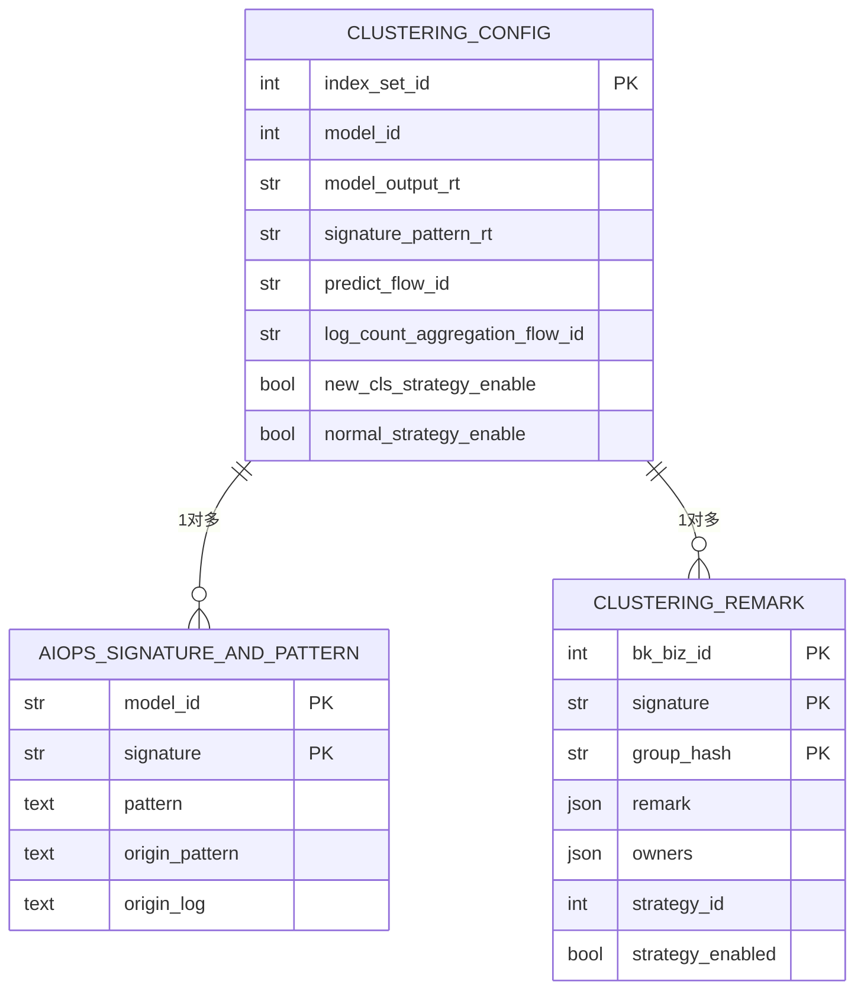
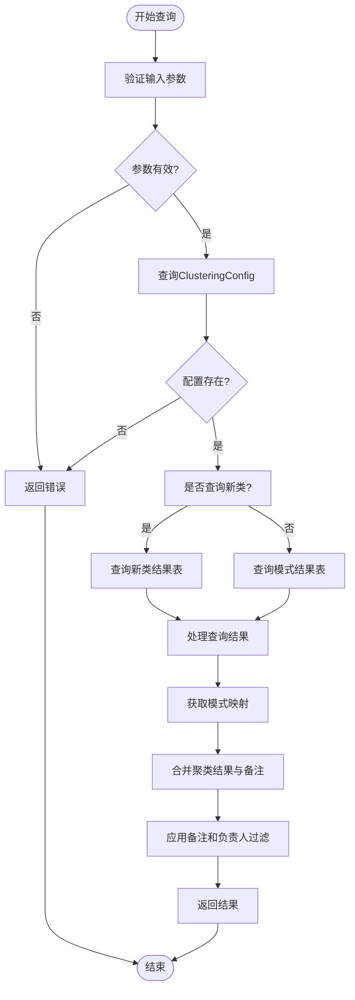
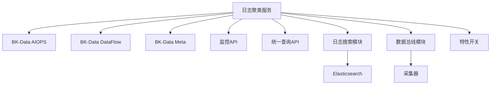

# 日志聚类服务

<cite>
**本文档引用的文件**   
- [models.py](file://bklog/apps/log_clustering/models.py)
- [constants.py](file://bklog/apps/log_clustering/constants.py)
- [clustering_config.py](file://bklog/apps/log_clustering/handlers/clustering_config.py)
- [dataflow_handler.py](file://bklog/apps/log_clustering/handlers/dataflow/dataflow_handler.py)
- [dataflow/constants.py](file://bklog/apps/log_clustering/handlers/dataflow/constants.py)
- [pattern.py](file://bklog/apps/log_clustering/handlers/pattern.py)
- [aiops_service_online.py](file://bklog/apps/log_clustering/handlers/pipline_service/aiops_service_online.py)
- [base.py](file://bklog/apps/log_clustering/handlers/aiops/base.py)
- [data_cls.py](file://bklog/apps/log_clustering/handlers/aiops/aiops_model/data_cls.py)
- [mini_link.py](file://bklog/apps/log_clustering/handlers/mini_link.py)
</cite>

## 目录
1. [引言](#引言)
2. [项目结构](#项目结构)
3. [核心组件](#核心组件)
4. [架构概述](#架构概述)
5. [详细组件分析](#详细组件分析)
6. [依赖分析](#依赖分析)
7. [性能考虑](#性能考虑)
8. [故障排除指南](#故障排除指南)
9. [结论](#结论)

## 引言
日志聚类服务是蓝鲸日志平台（BK-LOG）中的一个关键功能，它利用AI技术对海量日志进行智能分析，通过模式识别和聚类算法，将相似的日志自动归类，从而帮助运维人员快速定位系统异常。该服务支持与BK-Data平台的深度集成，实现了从日志采集、预处理、模型训练、预测到结果存储和告警的完整闭环。本文档将深入解析该服务的技术实现，重点阐述其AI驱动的日志模式识别能力、聚类配置参数、模型训练与部署流程、结果存储结构以及与BK-Data平台的集成方式。

## 项目结构
日志聚类服务的代码主要位于`bklog/apps/log_clustering/`目录下，其结构清晰，模块化程度高。核心模块包括`models`（数据模型）、`handlers`（业务逻辑处理）、`tasks`（异步任务）和`migrations`（数据库迁移）。`handlers`目录下进一步细分为`dataflow`（数据流处理）、`aiops`（AI运维）、`pattern`（模式处理）等子模块，体现了功能的分层设计。

**Diagram sources**
- [models.py](file://bklog/apps/log_clustering/models.py)
- [clustering_config.py](file://bklog/apps/log_clustering/handlers/clustering_config.py)
- [dataflow_handler.py](file://bklog/apps/log_clustering/handlers/dataflow/dataflow_handler.py)
- [base.py](file://bklog/apps/log_clustering/handlers/aiops/base.py)
- [mini_link.py](file://bklog/apps/log_clustering/handlers/mini_link.py)

**Section sources**
- [models.py](file://bklog/apps/log_clustering/models.py)
- [clustering_config.py](file://bklog/apps/log_clustering/handlers/clustering_config.py)
- [dataflow_handler.py](file://bklog/apps/log_clustering/handlers/dataflow/dataflow_handler.py)

## 核心组件

日志聚类服务的核心在于其AI驱动的模式识别能力。服务通过`ClusteringConfig`模型管理聚类配置，并利用BK-Data平台的AIOPS能力进行模型训练和预测。`DataFlowHandler`负责创建和管理复杂的数据处理流水线（DataFlow），而`PatternHandler`则负责对聚类结果进行查询和展示。整个流程实现了从原始日志到可读模式的自动化转换。

**Section sources**
- [models.py](file://bklog/apps/log_clustering/models.py#L106-L184)
- [dataflow_handler.py](file://bklog/apps/log_clustering/handlers/dataflow/dataflow_handler.py#L122-L1729)
- [pattern.py](file://bklog/apps/log_clustering/handlers/pattern.py#L71-L669)

## 架构概述

日志聚类服务采用微服务架构，与BK-Data平台深度集成。其核心架构可以分为数据接入、AI模型处理和结果应用三个层次。

**Diagram sources**
- [dataflow_handler.py](file://bklog/apps/log_clustering/handlers/dataflow/dataflow_handler.py#L1409-L1599)
- [clustering_config.py](file://bklog/apps/log_clustering/handlers/clustering_config.py#L162-L204)
- [pattern.py](file://bklog/apps/log_clustering/handlers/pattern.py#L71-L232)

## 详细组件分析

### 聚类配置分析
`ClusteringConfig`模型是整个服务的配置中心，它定义了日志聚类的所有参数。

#### 聚类配置模型

**Diagram sources**
- [models.py](file://bklog/apps/log_clustering/models.py#L106-L184)

**Section sources**
- [models.py](file://bklog/apps/log_clustering/models.py#L106-L184)
- [constants.py](file://bklog/apps/log_clustering/constants.py)

### AI模型训练与部署流程分析
日志聚类服务的AI模型训练和部署是一个自动化流水线过程。

#### 模型训练与部署流程

**Diagram sources**
- [clustering_config.py](file://bklog/apps/log_clustering/handlers/clustering_config.py#L98-L204)
- [dataflow_handler.py](file://bklog/apps/log_clustering/handlers/dataflow/dataflow_handler.py#L122-L1729)
- [aiops_service_online.py](file://bklog/apps/log_clustering/handlers/pipline_service/aiops_service_online.py#L194-L226)

### 聚类结果存储与查询分析
聚类结果的存储和查询是服务的核心功能，确保了分析结果的高效访问。

#### 聚类结果存储结构

**Diagram sources**
- [models.py](file://bklog/apps/log_clustering/models.py#L65-L105)
- [models.py](file://bklog/apps/log_clustering/models.py#L106-L184)

#### 聚类结果查询流程

**Diagram sources**
- [pattern.py](file://bklog/apps/log_clustering/handlers/pattern.py#L71-L232)
- [models.py](file://bklog/apps/log_clustering/models.py#L65-L105)

**Section sources**
- [pattern.py](file://bklog/apps/log_clustering/handlers/pattern.py#L71-L232)
- [models.py](file://bklog/apps/log_clustering/models.py#L65-L105)

## 依赖分析

日志聚类服务高度依赖BK-Data平台的AIOPS和DataFlow能力，同时与日志平台的其他模块紧密协作。

**Diagram sources**
- [dataflow_handler.py](file://bklog/apps/log_clustering/handlers/dataflow/dataflow_handler.py#L34-L40)
- [pattern.py](file://bklog/apps/log_clustering/handlers/pattern.py#L31-L32)
- [models.py](file://bklog/apps/log_clustering/models.py#L51-L58)

**Section sources**
- [dataflow_handler.py](file://bklog/apps/log_clustering/handlers/dataflow/dataflow_handler.py#L34-L40)
- [pattern.py](file://bklog/apps/log_clustering/handlers/pattern.py#L31-L32)

## 性能考虑

日志聚类服务在设计时充分考虑了性能因素。通过使用BK-Data平台的分布式计算能力（如Flink/Spark），能够高效处理海量日志数据。在模型预测阶段，服务通过Redis等内存数据库缓存热点数据，加速查询响应。同时，服务支持对聚类结果进行分组和过滤，避免了全量数据扫描，提升了查询效率。

## 故障排除指南

当遇到日志聚类服务问题时，应首先检查`ClusteringConfig`的`access_finished`字段和`task_details`字段。`access_finished`为`True`表示接入已完成。`task_details`记录了每个操作步骤的详细状态和日志，是排查问题的关键。此外，应检查相关DataFlow在BK-Data平台上的运行状态，确认其是否正常启动。

**Section sources**
- [clustering_config.py](file://bklog/apps/log_clustering/handlers/clustering_config.py#L280-L373)
- [models.py](file://bklog/apps/log_clustering/models.py#L205-L238)

## 结论

日志聚类服务通过与BK-Data平台的深度集成，构建了一个强大的AI驱动日志分析系统。它不仅实现了日志的自动化聚类和模式识别，还提供了完善的告警、订阅和备注功能，极大地提升了运维效率。其模块化的设计和清晰的架构，使得服务易于维护和扩展。未来，可以进一步优化模型算法，提升聚类的准确性和实时性。