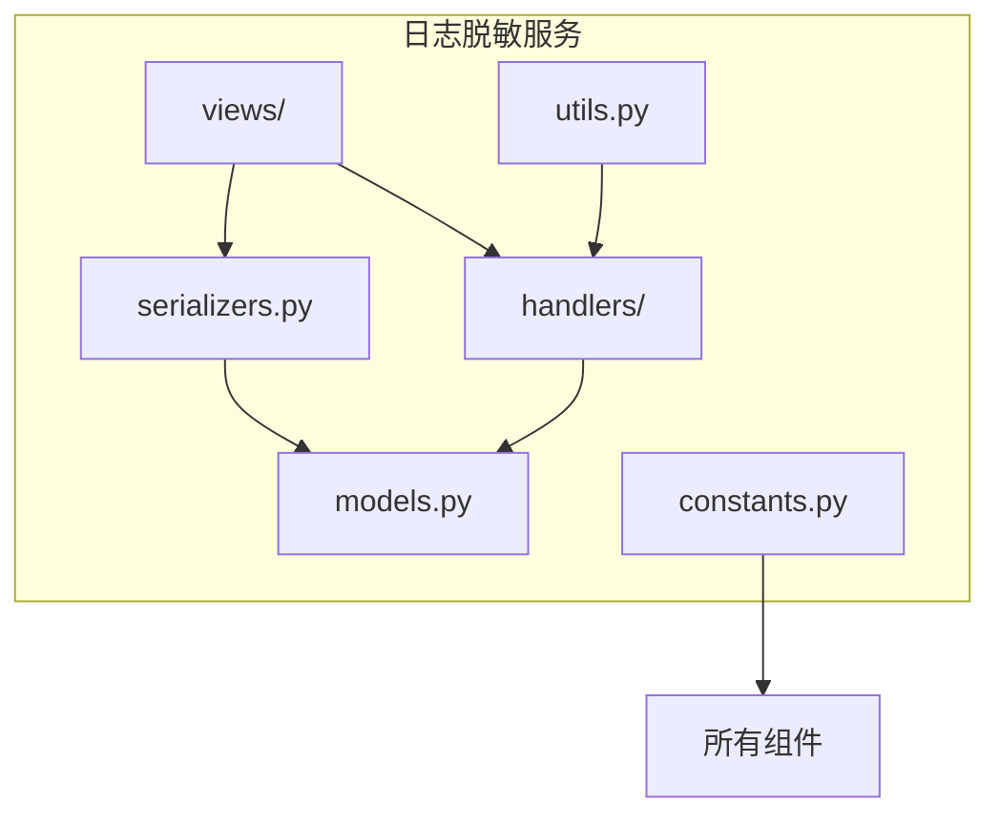
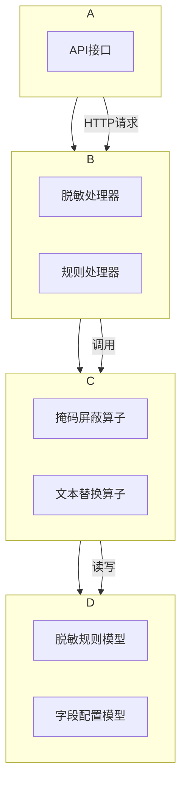
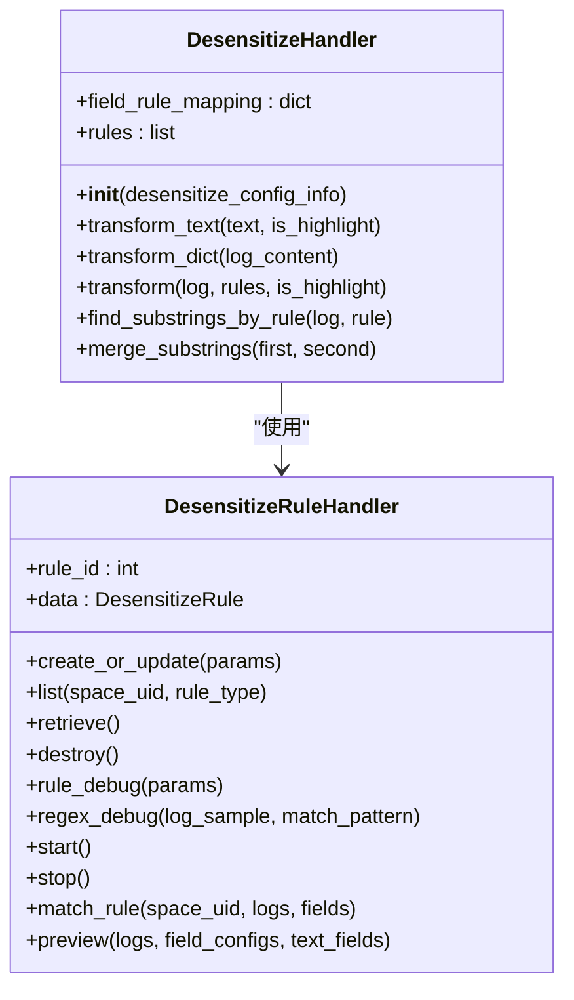
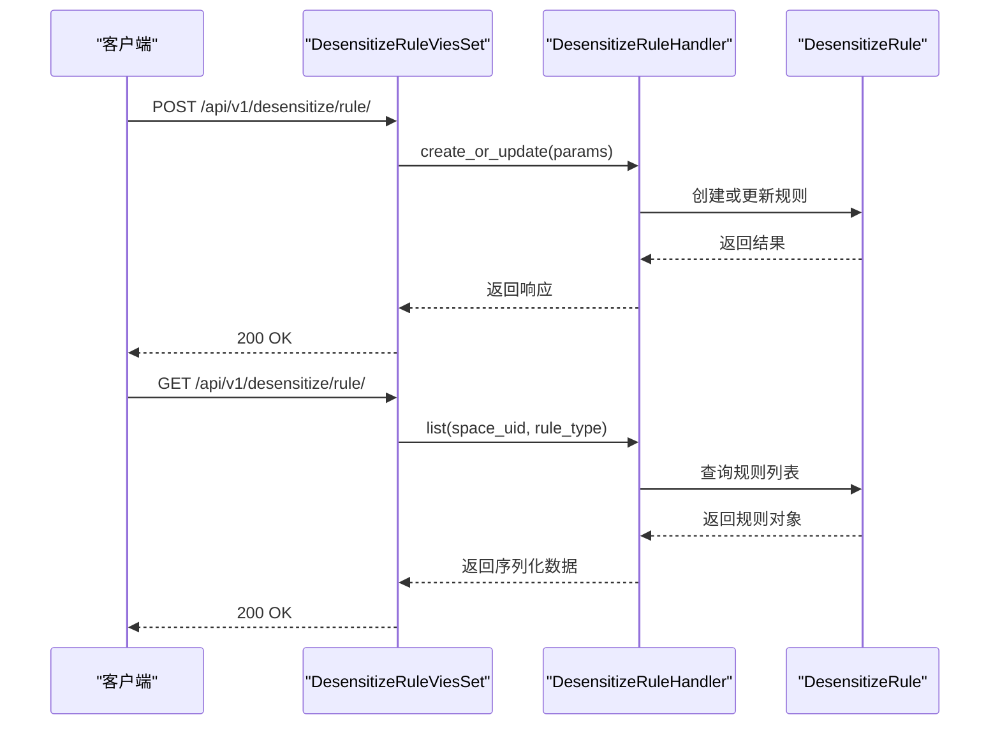
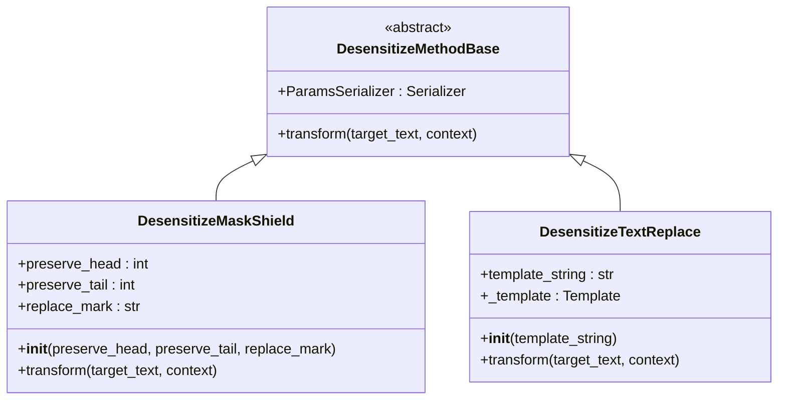
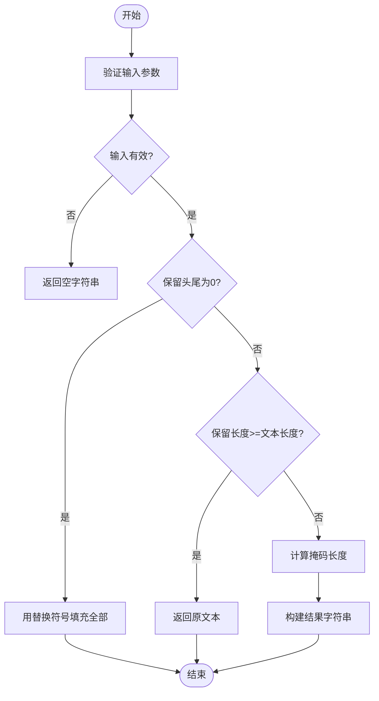
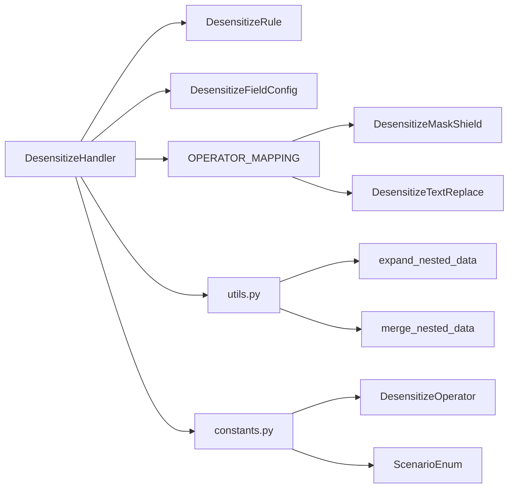

# 日志脱敏服务

<cite>
**本文档引用的文件**  
- [desensitize.py](file://bklog/apps/log_desensitize/handlers/desensitize.py)
- [text_replace.py](file://bklog/apps/log_desensitize/handlers/desensitize_operator/text_replace.py)
- [mask_shield.py](file://bklog/apps/log_desensitize/handlers/desensitize_operator/mask_shield.py)
- [base.py](file://bklog/apps/log_desensitize/handlers/desensitize_operator/base.py)
- [desensitize_rule_views.py](file://bklog/apps/log_desensitize/views/desensitize_rule_views.py)
- [models.py](file://bklog/apps/log_desensitize/models.py)
- [constants.py](file://bklog/apps/log_desensitize/constants.py)
- [serializers.py](file://bklog/apps/log_desensitize/serializers.py)
- [utils.py](file://bklog/apps/log_desensitize/utils.py)
</cite>

## 目录
1. [简介](#简介)
2. [项目结构](#项目结构)
3. [核心组件](#核心组件)
4. [架构概述](#架构概述)
5. [详细组件分析](#详细组件分析)
6. [依赖分析](#依赖分析)
7. [性能考虑](#性能考虑)
8. [故障排除指南](#故障排除指南)
9. [结论](#结论)

## 简介
日志脱敏服务是蓝鲸日志平台中的关键安全组件，负责在日志数据入库前对敏感信息进行保护处理。该服务通过灵活的脱敏规则配置，支持正则表达式匹配和固定位置屏蔽两种模式，确保敏感数据在存储和展示过程中得到有效保护。服务采用流水线式处理机制，支持多规则优先级管理和嵌套、重叠敏感信息的正确处理，保障了脱敏的准确性和完整性。

## 项目结构
日志脱敏服务位于 `bklog/apps/log_desensitize/` 目录下，采用模块化设计，各组件职责清晰。核心功能分布在 handlers、models、views 等目录中，其中 handlers 目录包含脱敏处理的核心逻辑和算子实现，models 定义了脱敏规则和配置的数据模型，views 提供了 RESTful API 接口。

**图源**
- [models.py](file://bklog/apps/log_desensitize/models.py)
- [handlers/desensitize.py](file://bklog/apps/log_desensitize/handlers/desensitize.py)
- [views/desensitize_rule_views.py](file://bklog/apps/log_desensitize/views/desensitize_rule_views.py)

**本节来源**
- [models.py](file://bklog/apps/log_desensitize/models.py)
- [desensitize.py](file://bklog/apps/log_desensitize/handlers/desensitize.py)
- [desensitize_rule_views.py](file://bklog/apps/log_desensitize/views/desensitize_rule_views.py)

## 核心组件
日志脱敏服务的核心组件包括脱敏处理器（DesensitizeHandler）、脱敏规则处理器（DesensitizeRuleHandler）、脱敏算子（DesensitizeMethodBase 及其子类）和数据模型（DesensitizeRule、DesensitizeFieldConfig）。这些组件协同工作，实现了从规则配置到实际脱敏处理的完整流程。脱敏处理器负责接收配置规则列表，进行规则匹配，并调用相关脱敏算子进行处理，规则列表以流水线的方式处理。

**本节来源**
- [desensitize.py](file://bklog/apps/log_desensitize/handlers/desensitize.py)
- [models.py](file://bklog/apps/log_desensitize/models.py)
- [base.py](file://bklog/apps/log_desensitize/handlers/desensitize_operator/base.py)

## 架构概述
日志脱敏服务采用分层架构设计，从上到下分为接口层、业务逻辑层、算子层和数据层。接口层通过 RESTful API 接收外部请求；业务逻辑层包含脱敏处理器和规则处理器，负责核心业务逻辑；算子层实现具体的脱敏算法；数据层管理脱敏规则和配置的持久化存储。

**图源**
- [desensitize_rule_views.py](file://bklog/apps/log_desensitize/views/desensitize_rule_views.py)
- [desensitize.py](file://bklog/apps/log_desensitize/handlers/desensitize.py)
- [models.py](file://bklog/apps/log_desensitize/models.py)

## 详细组件分析

### 脱敏处理器分析
脱敏处理器（DesensitizeHandler）是日志脱敏服务的核心，负责协调整个脱敏流程。它接收脱敏配置信息，构建字段与规则的映射关系，并按照优先级对规则进行排序。处理器支持两种处理模式：文本处理和字典处理，能够灵活应对不同格式的日志数据。

#### 对象导向组件

**图源**
- [desensitize.py](file://bklog/apps/log_desensitize/handlers/desensitize.py#L46-L692)
- [desensitize_rule_views.py](file://bklog/apps/log_desensitize/views/desensitize_rule_views.py#L42-L494)

#### API/服务组件

**图源**
- [desensitize_rule_views.py](file://bklog/apps/log_desensitize/views/desensitize_rule_views.py#L42-L494)
- [desensitize.py](file://bklog/apps/log_desensitize/handlers/desensitize.py#L254-L692)

### 脱敏算子分析
脱敏算子是实现具体脱敏算法的组件，目前支持掩码屏蔽和文本替换两种模式。算子通过继承基类 DesensitizeMethodBase 实现，遵循统一的接口规范，便于扩展新的脱敏算法。

#### 对象导向组件

**图源**
- [base.py](file://bklog/apps/log_desensitize/handlers/desensitize_operator/base.py#L25-L37)
- [mask_shield.py](file://bklog/apps/log_desensitize/handlers/desensitize_operator/mask_shield.py#L30-L78)
- [text_replace.py](file://bklog/apps/log_desensitize/handlers/desensitize_operator/text_replace.py#L29-L71)

#### 复杂逻辑组件

**图源**
- [mask_shield.py](file://bklog/apps/log_desensitize/handlers/desensitize_operator/mask_shield.py#L54-L78)

**本节来源**
- [desensitize.py](file://bklog/apps/log_desensitize/handlers/desensitize.py)
- [mask_shield.py](file://bklog/apps/log_desensitize/handlers/desensitize_operator/mask_shield.py)
- [text_replace.py](file://bklog/apps/log_desensitize/handlers/desensitize_operator/text_replace.py)
- [base.py](file://bklog/apps/log_desensitize/handlers/desensitize_operator/base.py)

## 依赖分析
日志脱敏服务依赖于多个外部组件和内部模块，形成了复杂的依赖关系网络。服务通过 OPERATOR_MAPPING 映射将算子类型与具体实现类关联，确保了扩展性和灵活性。

**图源**
- [desensitize.py](file://bklog/apps/log_desensitize/handlers/desensitize.py)
- [models.py](file://bklog/apps/log_desensitize/models.py)
- [__init__.py](file://bklog/apps/log_desensitize/handlers/desensitize_operator/__init__.py)

**本节来源**
- [desensitize.py](file://bklog/apps/log_desensitize/handlers/desensitize.py)
- [models.py](file://bklog/apps/log_desensitize/models.py)
- [constants.py](file://bklog/apps/log_desensitize/constants.py)

## 性能考虑
日志脱敏服务在设计时充分考虑了性能因素。通过预编译正则表达式、延迟初始化模板对象、使用高效的字符串操作等技术手段，最大限度地减少了处理开销。服务采用流水线式处理机制，能够有效处理大量日志数据。对于嵌套和重叠的敏感信息，服务通过合并子串匹配结果来避免重复处理，提高了处理效率。

## 故障排除指南
在使用日志脱敏服务时，可能会遇到规则不生效、正则表达式错误等问题。建议首先检查规则是否已启用，匹配字段和正则表达式是否正确配置。可以使用规则调试功能验证脱敏效果。对于正则表达式错误，可以使用正则调试功能检查表达式是否合法。在处理嵌套字段时，需确保字段名称正确，避免因字段名错误导致脱敏失败。

**本节来源**
- [desensitize.py](file://bklog/apps/log_desensitize/handlers/desensitize.py)
- [desensitize_rule_views.py](file://bklog/apps/log_desensitize/views/desensitize_rule_views.py)
- [serializers.py](file://bklog/apps/log_desensitize/serializers.py)

## 结论
日志脱敏服务通过灵活的规则配置和高效的处理算法，为蓝鲸日志平台提供了强大的敏感信息保护能力。服务支持多种脱敏模式，能够满足不同场景下的安全需求。通过合理的架构设计和性能优化，服务能够在保证安全性的同时，提供良好的处理性能。未来可以考虑增加更多类型的脱敏算子，进一步提升服务的适用性和灵活性。