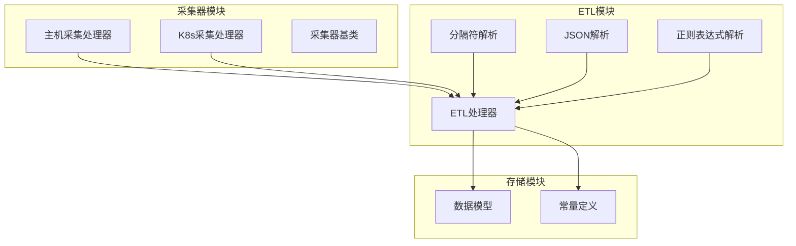
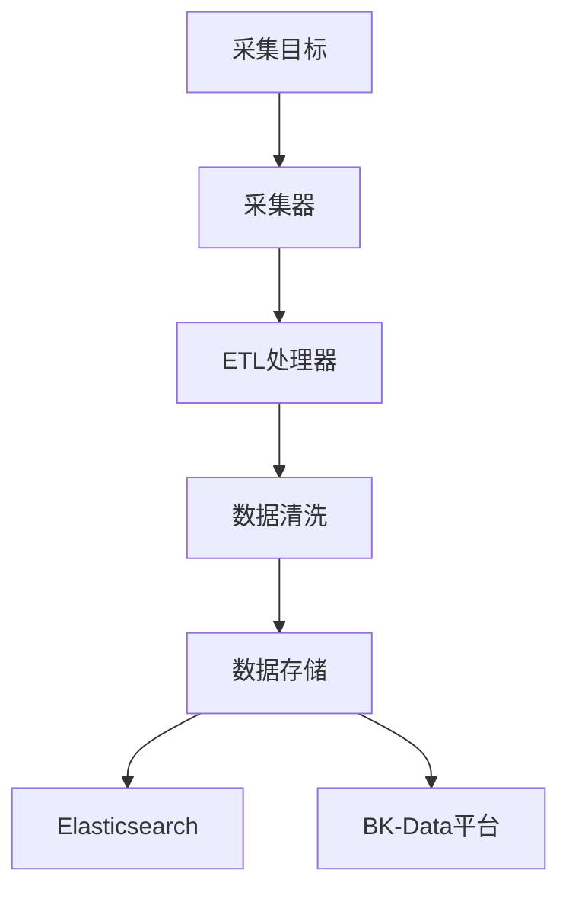
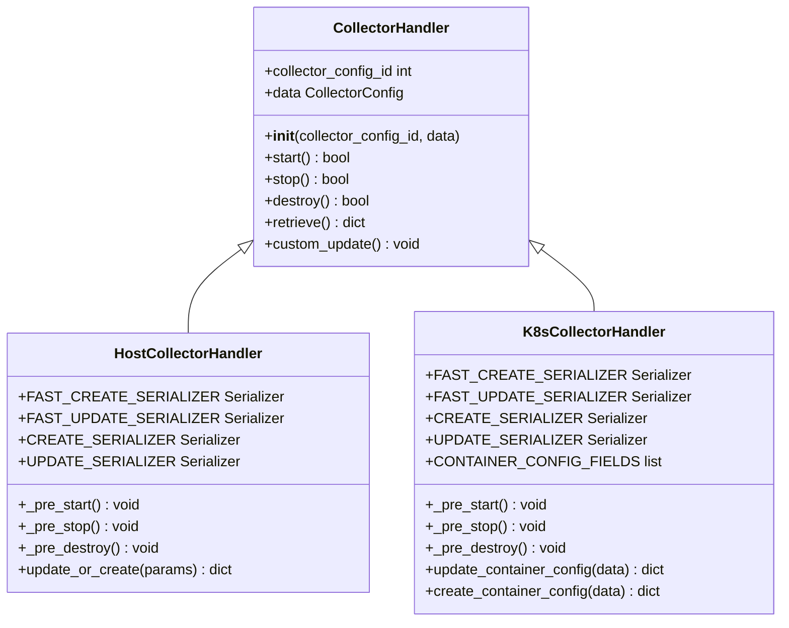
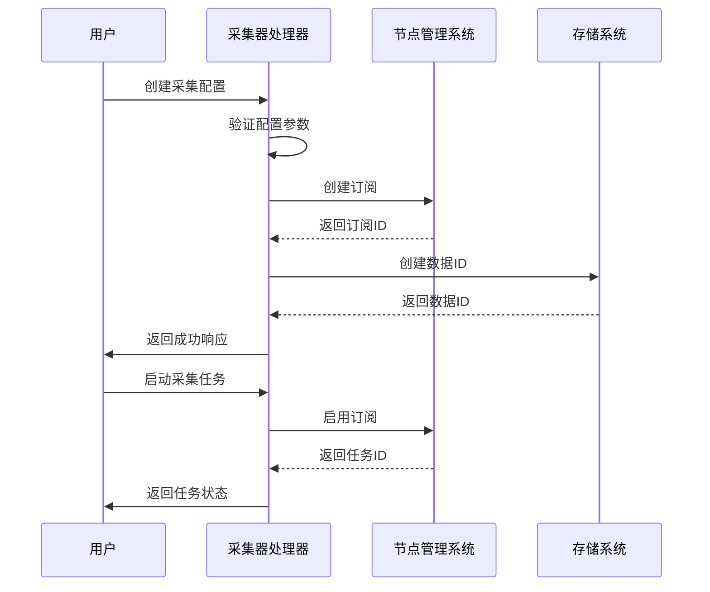
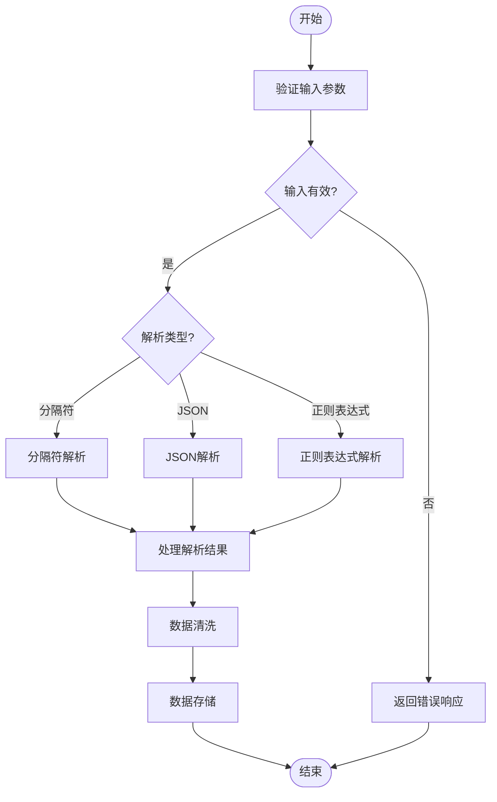
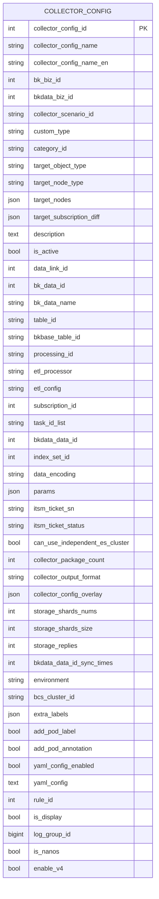
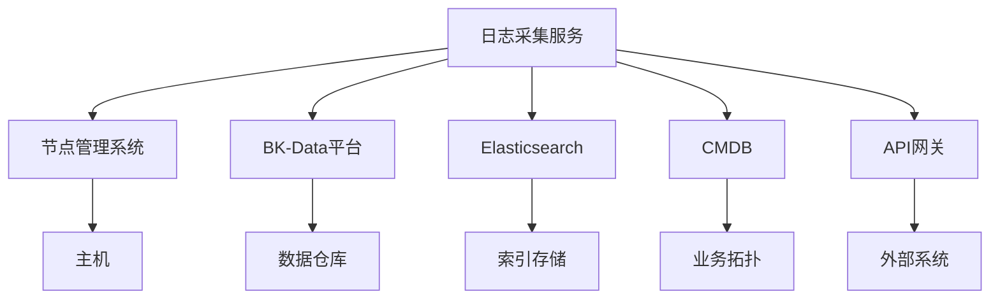

# 日志采集服务

<cite>
**Referenced Files in This Document**   
- [base.py](file://bklog/apps/log_databus/handlers/collector/base.py)
- [host.py](file://bklog/apps/log_databus/handlers/collector/host.py)
- [k8s.py](file://bklog/apps/log_databus/handlers/collector/k8s.py)
- [bk_log_delimiter.py](file://bklog/apps/log_databus/handlers/etl_storage/bk_log_delimiter.py)
- [bk_log_json.py](file://bklog/apps/log_databus/handlers/etl_storage/bk_log_json.py)
- [bk_log_regexp.py](file://bklog/apps/log_databus/handlers/etl_storage/bk_log_regexp.py)
- [transfer.py](file://bklog/apps/log_databus/handlers/etl/transfer.py)
- [models.py](file://bklog/apps/log_databus/models.py)
- [constants.py](file://bklog/apps/log_databus/constants.py)
</cite>

## 目录
1. [简介](#简介)
2. [项目结构](#项目结构)
3. [核心组件](#核心组件)
4. [架构概述](#架构概述)
5. [详细组件分析](#详细组件分析)
6. [依赖分析](#依赖分析)
7. [性能考虑](#性能考虑)
8. [故障排除指南](#故障排除指南)
9. [结论](#结论)
10. [附录](#附录) (如有必要)

## 简介
日志采集服务是蓝鲸日志平台的核心组件，作为数据总线负责从各种来源采集日志数据。该服务支持两种主要的采集模式：主机采集和Kubernetes（K8s）采集，能够灵活适应不同的部署环境。通过ETL（抽取、转换、加载）流程，服务能够对原始日志进行解析和清洗，支持分隔符、正则表达式和JSON格式等多种解析策略。清洗后的数据可以与BK-Data平台集成，实现数据的持久化存储。本文档将详细介绍从创建采集任务到数据入库的完整流程，包括配置管理、数据处理和错误处理机制。

## 项目结构
日志采集服务的代码主要位于`bklog/apps/log_databus`目录下，遵循模块化设计原则。核心功能被划分为采集器（collector）、ETL处理（etl）和存储（storage）三个主要模块。采集器模块负责管理采集配置和与节点管理系统的交互；ETL模块处理日志的解析和转换；存储模块则负责与Elasticsearch等后端存储系统的集成。这种分层架构使得系统易于维护和扩展。

**Diagram sources**
- [base.py](file://bklog/apps/log_databus/handlers/collector/base.py)
- [host.py](file://bklog/apps/log_databus/handlers/collector/host.py)
- [k8s.py](file://bklog/apps/log_databus/handlers/collector/k8s.py)
- [bk_log_delimiter.py](file://bklog/apps/log_databus/handlers/etl_storage/bk_log_delimiter.py)
- [bk_log_json.py](file://bklog/apps/log_databus/handlers/etl_storage/bk_log_json.py)
- [bk_log_regexp.py](file://bklog/apps/log_databus/handlers/etl_storage/bk_log_regexp.py)
- [transfer.py](file://bklog/apps/log_databus/handlers/etl/transfer.py)

**Section sources**
- [base.py](file://bklog/apps/log_databus/handlers/collector/base.py#L1-L200)
- [models.py](file://bklog/apps/log_databus/models.py#L1-L50)

## 核心组件

日志采集服务的核心组件包括采集器处理器、ETL解析器和数据模型。采集器处理器负责管理采集配置的生命周期，包括创建、启动、停止和删除。ETL解析器实现了多种日志解析策略，能够处理不同格式的日志数据。数据模型定义了采集配置和相关元数据的结构，确保数据的一致性和完整性。

**Section sources**
- [base.py](file://bklog/apps/log_databus/handlers/collector/base.py#L124-L200)
- [models.py](file://bklog/apps/log_databus/models.py#L101-L200)

## 架构概述

日志采集服务采用分层架构，将采集、处理和存储功能解耦。采集层负责从目标系统收集日志数据；处理层对原始日志进行解析和清洗；存储层则将处理后的数据写入后端存储系统。这种架构设计提高了系统的可维护性和可扩展性。

**Diagram sources**
- [base.py](file://bklog/apps/log_databus/handlers/collector/base.py#L124-L200)
- [transfer.py](file://bklog/apps/log_databus/handlers/etl/transfer.py#L42-L268)

## 详细组件分析

### 采集器处理器分析
采集器处理器是日志采集服务的核心，负责管理采集配置的整个生命周期。它提供了统一的接口来处理主机和K8s环境下的采集任务。

#### 采集器基类

**Diagram sources**
- [base.py](file://bklog/apps/log_databus/handlers/collector/base.py#L124-L200)
- [host.py](file://bklog/apps/log_databus/handlers/collector/host.py#L81-L200)
- [k8s.py](file://bklog/apps/log_databus/handlers/collector/k8s.py#L112-L200)

#### 采集流程

**Diagram sources**
- [base.py](file://bklog/apps/log_databus/handlers/collector/base.py#L408-L441)
- [host.py](file://bklog/apps/log_databus/handlers/collector/host.py#L87-L99)

### ETL解析器分析
ETL解析器负责对原始日志进行解析和转换，支持多种解析策略。

#### ETL解析策略

**Diagram sources**
- [bk_log_delimiter.py](file://bklog/apps/log_databus/handlers/etl_storage/bk_log_delimiter.py#L43-L71)
- [bk_log_json.py](file://bklog/apps/log_databus/handlers/etl_storage/bk_log_json.py#L29-L40)
- [bk_log_regexp.py](file://bklog/apps/log_databus/handlers/etl_storage/bk_log_regexp.py#L33-L49)

#### 数据模型

**Diagram sources**
- [models.py](file://bklog/apps/log_databus/models.py#L101-L200)

**Section sources**
- [base.py](file://bklog/apps/log_databus/handlers/collector/base.py#L124-L200)
- [host.py](file://bklog/apps/log_databus/handlers/collector/host.py#L81-L200)
- [k8s.py](file://bklog/apps/log_databus/handlers/collector/k8s.py#L112-L200)
- [bk_log_delimiter.py](file://bklog/apps/log_databus/handlers/etl_storage/bk_log_delimiter.py#L43-L71)
- [bk_log_json.py](file://bklog/apps/log_databus/handlers/etl_storage/bk_log_json.py#L29-L40)
- [bk_log_regexp.py](file://bklog/apps/log_databus/handlers/etl_storage/bk_log_regexp.py#L33-L49)
- [transfer.py](file://bklog/apps/log_databus/handlers/etl/transfer.py#L42-L268)
- [models.py](file://bklog/apps/log_databus/models.py#L101-L200)
- [constants.py](file://bklog/apps/log_databus/constants.py#L377-L382)

## 依赖分析

日志采集服务依赖于多个外部系统和内部模块。主要依赖包括节点管理系统用于部署采集代理，BK-Data平台用于数据存储和分析，以及Elasticsearch用于日志的索引和查询。

**Diagram sources**
- [base.py](file://bklog/apps/log_databus/handlers/collector/base.py#L33-L35)
- [host.py](file://bklog/apps/log_databus/handlers/collector/host.py#L26-L27)
- [k8s.py](file://bklog/apps/log_databus/handlers/collector/k8s.py#L31-L32)

**Section sources**
- [base.py](file://bklog/apps/log_databus/handlers/collector/base.py#L33-L35)
- [host.py](file://bklog/apps/log_databus/handlers/collector/host.py#L26-L27)
- [k8s.py](file://bklog/apps/log_databus/handlers/collector/k8s.py#L31-L32)

## 性能考虑

日志采集服务在设计时考虑了性能优化。通过批量处理和并发执行，系统能够高效地处理大量日志数据。ETL处理器支持并行解析，可以充分利用多核CPU的计算能力。此外，系统还实现了缓存机制，减少了对后端系统的重复查询。

## 故障排除指南

当采集任务出现故障时，可以通过以下步骤进行排查：
1. 检查采集配置是否正确
2. 验证目标主机或K8s集群的连接状态
3. 查看节点管理系统的任务日志
4. 检查ETL处理的错误日志
5. 验证存储系统的可用性

**Section sources**
- [base.py](file://bklog/apps/log_databus/handlers/collector/base.py#L114-L121)
- [host.py](file://bklog/apps/log_databus/handlers/collector/host.py#L547-L575)
- [k8s.py](file://bklog/apps/log_databus/handlers/collector/k8s.py#L548-L575)

## 结论

日志采集服务作为蓝鲸日志平台的核心组件，提供了一套完整的日志采集和处理解决方案。通过灵活的采集模式、强大的ETL功能和可靠的错误处理机制，服务能够满足各种复杂的日志管理需求。未来可以通过引入更智能的解析算法和优化性能来进一步提升服务的质量。