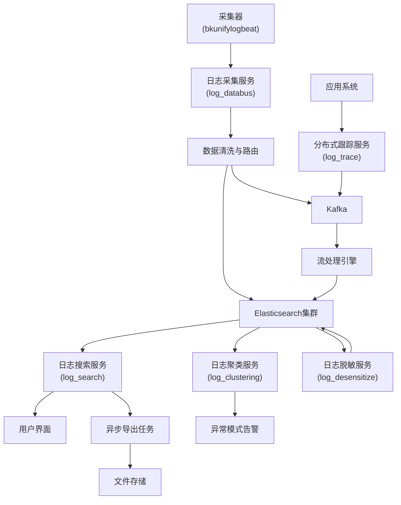

# 核心服务架构

<cite>
**本文档中引用的文件**  
- [log_search](file://bklog/apps/log_search)
- [log_databus](file://bklog/apps/log_databus)
- [log_clustering](file://bklog/apps/log_clustering)
- [log_desensitize](file://bklog/apps/log_desensitize)
- [log_trace](file://bklog/apps/log_trace)
- [log_esquery](file://bklog/apps/log_esquery)
- [log_unifyquery](file://bklog/apps/log_unifyquery)
- [config.py](file://bklog/config/default.py)
</cite>

## 目录
1. [引言](#引言)
2. [日志搜索服务](#日志搜索服务)
3. [日志采集服务](#日志采集服务)
4. [日志聚类服务](#日志聚类服务)
5. [日志脱敏服务](#日志脱敏服务)
6. [分布式跟踪服务](#分布式跟踪服务)
7. [服务间调用关系](#服务间调用关系)
8. [总结](#总结)

## 引言
BK-LOG平台是一个企业级日志管理与分析系统，提供从日志采集、存储、搜索到智能分析的全链路解决方案。本架构文档重点阐述其五大核心服务模块：日志搜索、日志采集、日志聚类、日志脱敏和分布式跟踪。这些服务共同构成了一个高效、可扩展的日志处理流水线，支持海量日志数据的实时处理与深度分析。

## 日志搜索服务
日志搜索服务（log_search）是BK-LOG平台的核心查询引擎，为用户提供高效、灵活的日志检索能力。该服务基于Elasticsearch构建，通过优化的DSL查询生成、索引策略和异步处理机制，实现对大规模日志数据的秒级响应。

### 查询处理机制
日志搜索服务通过`log_esquery`模块与Elasticsearch集群进行交互。当用户发起查询请求时，系统首先解析查询语句，结合索引集配置生成优化的Elasticsearch DSL。查询构建过程考虑了字段类型、时间范围和查询条件的复杂性，以生成最高效的查询语句。

### 索引优化策略
服务采用基于时间的索引分片策略，将日志数据按天或按业务需求进行分片存储。通过别名机制实现无缝的索引轮转，同时支持冷热数据分层存储，将近期访问频繁的数据存储在高性能存储介质上，而将历史数据迁移至成本更低的存储系统。

### 异步导出功能
对于大规模数据导出请求，日志搜索服务提供异步处理能力。用户提交导出任务后，系统将其放入任务队列，由后台任务处理器完成数据检索和文件生成，完成后通过通知机制告知用户下载链接，避免长时间HTTP连接导致的超时问题。

**服务来源**
- [log_search](file://bklog/apps/log_search)
- [log_esquery](file://bklog/apps/log_esquery)

## 日志采集服务
日志采集服务（log_databus）作为BK-LOG平台的数据总线，负责日志数据的接入、传输和初步处理。它提供了一套完整的采集器管理框架，支持多种数据源的接入和灵活的数据处理管道。

### 采集器管理
log_databus模块提供对采集器（如bkunifylogbeat）的全生命周期管理，包括部署、配置下发、状态监控和版本升级。通过与GSE（Golden Signal Engine）系统的集成，实现对采集节点的统一管控。

### 数据清洗与转换
在数据传输过程中，服务支持多种数据清洗和转换功能，包括字段提取、格式转换、数据过滤和路由分发。这些处理规则可以通过可视化界面配置，并实时下发到各个采集节点，确保数据质量。

### 存储配置管理
服务提供灵活的存储配置能力，支持将采集到的日志数据路由到不同的Elasticsearch集群、Kafka主题或其他存储系统。配置信息包括索引模板、分片策略、副本数量等，确保数据存储的性能和可靠性。

**服务来源**
- [log_databus](file://bklog/apps/log_databus)

## 日志聚类服务
日志聚类服务（log_clustering）利用AI算法对海量日志进行智能分析，自动识别日志模式并进行聚类，帮助运维人员快速发现异常和趋势。

### AI驱动聚类算法
该服务采用基于无监督学习的聚类算法，对日志消息体进行特征提取和相似度计算。通过自然语言处理技术，将非结构化的日志文本转换为数值特征向量，然后使用聚类算法（如K-means或层次聚类）将相似的日志条目归为同一类别。

### 模式识别能力
系统能够自动识别日志中的固定模板和可变参数，将"User login failed for user123 at 2023-01-01 12:00:00"和"User login failed for user456 at 2023-01-01 12:01:00"识别为同一模式。这种能力大大减少了日志量，使运维人员能够关注真正的异常模式而非个别实例。

### 动态学习与优化
聚类模型支持在线学习和动态更新，能够适应系统日志模式的变化。服务定期重新训练模型，并提供模型版本管理和回滚能力，确保聚类结果的准确性和稳定性。

**服务来源**
- [log_clustering](file://bklog/apps/log_clustering)

## 日志脱敏服务
日志脱敏服务（log_desensitize）负责保护日志中的敏感信息，确保数据安全合规。

### 敏感信息屏蔽策略
服务提供基于规则的敏感信息识别和屏蔽功能，支持正则表达式匹配、关键词识别和数据类型识别等多种方式。常见的敏感信息如身份证号、手机号、银行卡号等都可以被自动识别并进行掩码处理。

### 动态脱敏配置
脱敏规则可以通过管理界面动态配置和更新，支持按业务系统、日志类型或数据源进行精细化控制。规则变更后可实时生效，无需重启服务。

### 脱敏审计与监控
系统记录所有脱敏操作的审计日志，包括原始数据、脱敏规则和处理结果。同时提供脱敏效果监控，统计脱敏数据量和识别准确率，确保数据安全策略的有效性。

**服务来源**
- [log_desensitize](file://bklog/apps/log_desensitize)

## 分布式跟踪服务
分布式跟踪服务（log_trace）提供端到端的请求跟踪能力，帮助分析跨服务调用的性能瓶颈。

### 跟踪数据采集
服务通过在应用代码中植入探针或利用标准协议（如OpenTelemetry），采集请求的跟踪数据。每个请求被分配唯一的跟踪ID，并在跨服务调用时传递，实现调用链的完整串联。

### 调用链分析
系统将分散的跟踪片段组装成完整的调用链，可视化展示请求经过的所有服务节点、调用顺序和耗时分布。通过分析调用链，可以快速定位性能瓶颈和错误根源。

### 与日志关联
分布式跟踪服务与日志搜索服务深度集成，用户可以从调用链直接跳转到相关日志，实现"从跟踪到日志"的无缝分析体验，大大提高问题排查效率。

**服务来源**
- [log_trace](file://bklog/apps/log_trace)

## 服务间调用关系
以下Mermaid图展示了BK-LOG平台核心服务间的调用关系和数据流。

**图示来源**
- [log_databus](file://bklog/apps/log_databus)
- [log_search](file://bklog/apps/log_search)
- [log_clustering](file://bklog/apps/log_clustering)
- [log_desensitize](file://bklog/apps/log_desensitize)
- [log_trace](file://bklog/apps/log_trace)

## 总结
BK-LOG平台的五大核心服务模块各司其职，协同工作，构建了一个完整的日志管理生态系统。日志采集服务作为数据入口，确保数据的可靠接入；日志搜索服务提供强大的查询能力；日志聚类服务通过AI技术实现智能分析；日志脱敏服务保障数据安全；分布式跟踪服务则提供了应用性能监控的深度洞察。这些服务通过清晰的职责边界和标准化的接口进行交互，既保证了系统的灵活性，又确保了整体的稳定性，为企业级日志管理提供了坚实的基础。