# 系统架构

<cite>
**本文档引用的文件**
- [README.md](file://README.md)
- [settings.py](file://bklog/settings.py)
- [urls.py](file://bklog/urls.py)
- [architecture.md](file://docs/overview/architecture.md)
- [log_search/urls.py](file://bklog/apps/log_search/urls.py)
- [log_databus/urls.py](file://bklog/apps/log_databus/urls.py)
- [log_clustering/urls.py](file://bklog/apps/log_clustering/urls.py)
- [api/base.py](file://bklog/apps/api/base.py)
- [api/modules/bkdata_databus.py](file://bklog/apps/api/modules/bkdata_databus.py)
- [api/modules/gse.py](file://bklog/apps/api/modules/gse.py)
- [api/modules/job.py](file://bklog/apps/api/modules/job.py)
- [blueking/component/client.py](file://bklog/blueking/component/client.py)
</cite>

## 目录
1. [架构概述](#架构概述)
2. [层次结构分析](#层次结构分析)
3. [核心模块职责划分](#核心模块职责划分)
4. [微服务化设计模式](#微服务化设计模式)
5. [蓝鲸PaaS平台集成](#蓝鲸paas平台集成)
6. [组件间调用关系](#组件间调用关系)
7. [架构决策说明](#架构决策说明)

## 架构概述

BK-LOG日志平台采用分层架构设计，从底层管控平台到用户层形成完整的层次结构。系统建立在蓝鲸PaaS平台之上，充分利用蓝鲸生态系统的各项能力，为用户提供全面的日志管理解决方案。

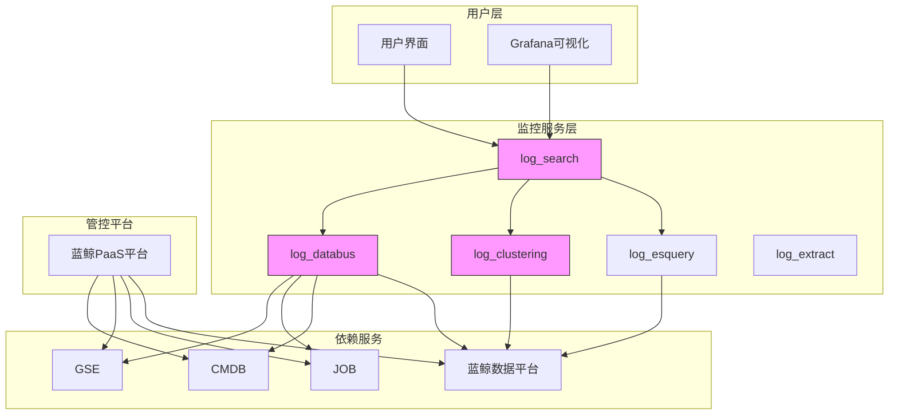

**图示来源**
- [architecture.md](file://docs/overview/architecture.md)
- [urls.py](file://bklog/urls.py)

## 层次结构分析

BK-LOG日志平台的架构从下至上分为四个主要层次：管控平台、依赖服务、监控服务层和用户层。

### 管控平台层

管控平台层以蓝鲸PaaS平台为核心，为整个监控系统提供基础支撑。PaaS平台提供了应用部署、资源管理、权限控制等基础能力，使BK-LOG能够快速构建和部署服务。

### 依赖服务层

依赖服务层包含蓝鲸生态系统中的关键组件，包括：
- **CMDB**：配置管理数据库，用于管理业务拓扑和主机信息
- **GSE**：游戏服务引擎，负责进程管理和指令下发
- **JOB**：作业平台，用于执行批量操作和脚本
- **蓝鲸数据平台**：提供数据处理和分析能力

### 监控服务层

监控服务层是BK-LOG的核心，由多个Django应用组成，每个应用负责特定的功能领域。这些应用通过API网关进行通信，形成松耦合的服务架构。

### 用户层

用户层提供用户与系统交互的界面，包括Web界面和Grafana集成，使用户能够方便地查询日志、创建仪表盘和进行数据分析。

**图示来源**
- [architecture.md](file://docs/overview/architecture.md)
- [settings.py](file://bklog/settings.py)

## 核心模块职责划分

BK-LOG平台的核心功能由多个Django应用实现，每个应用都有明确的职责边界。

### log_search模块

log_search模块负责日志的搜索和查询功能，是用户访问日志数据的主要入口。

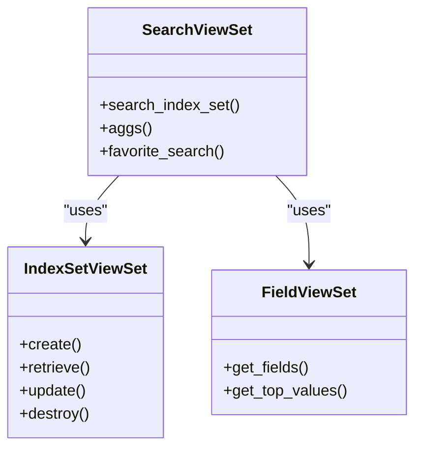

**图示来源**
- [log_search/urls.py](file://bklog/apps/log_search/urls.py)
- [log_search/views/search_views.py](file://bklog/apps/log_search/views/search_views.py)

### log_databus模块

log_databus模块负责日志的采集、清洗和入库，是日志数据流入系统的入口。

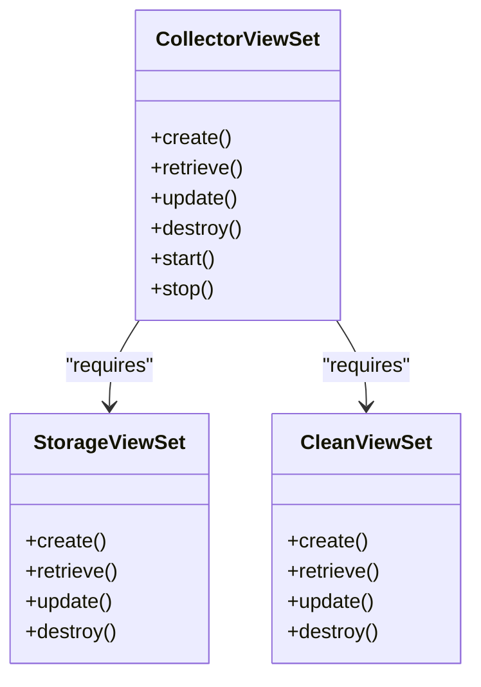

**图示来源**
- [log_databus/urls.py](file://bklog/apps/log_databus/urls.py)
- [log_databus/views/collector_views.py](file://bklog/apps/log_databus/views/collector_views.py)

### log_clustering模块

log_clustering模块负责日志的智能聚类和模式识别，帮助用户从海量日志中发现异常。

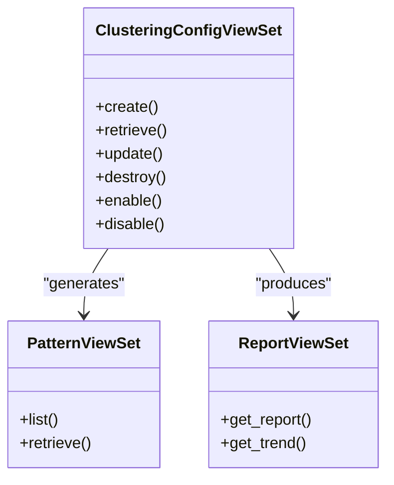

**图示来源**
- [log_clustering/urls.py](file://bklog/apps/log_clustering/urls.py)
- [log_clustering/views/clustering_config_views.py](file://bklog/apps/log_clustering/views/clustering_config_views.py)

## 微服务化设计模式

BK-LOG平台采用微服务化设计模式，将不同功能领域分离到独立的Django应用中，每个应用都可以独立配置和复用。

### 模块边界

各核心模块有清晰的边界和职责划分：
- **log_search**：专注于日志查询和展示
- **log_databus**：专注于日志采集和处理
- **log_clustering**：专注于日志智能分析
- **log_esquery**：专注于Elasticsearch查询优化
- **log_extract**：专注于日志提取和归档

### 通信机制

模块间的通信主要通过RESTful API实现，遵循统一的API规范。

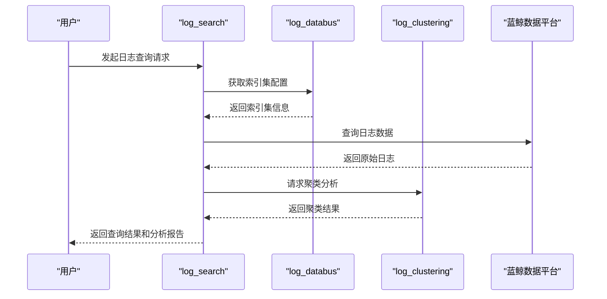

**图示来源**
- [urls.py](file://bklog/urls.py)
- [api/base.py](file://bklog/apps/api/base.py)

## 蓝鲸PaaS平台集成

BK-LOG深度集成蓝鲸PaaS平台能力，充分利用蓝鲸生态系统的各项服务。

### 与CMDB集成

通过CMDB获取业务拓扑和主机信息，实现基于业务视角的日志管理。

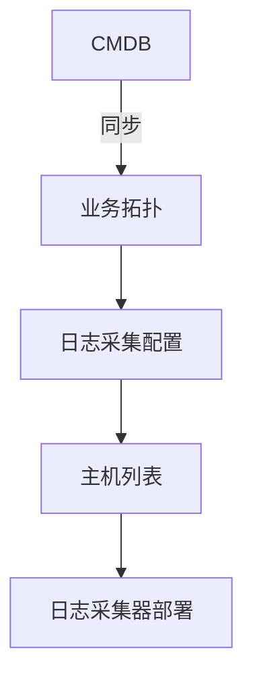

### 与GSE集成

利用GSE进行日志采集器的部署和管理，实现高效的指令下发。

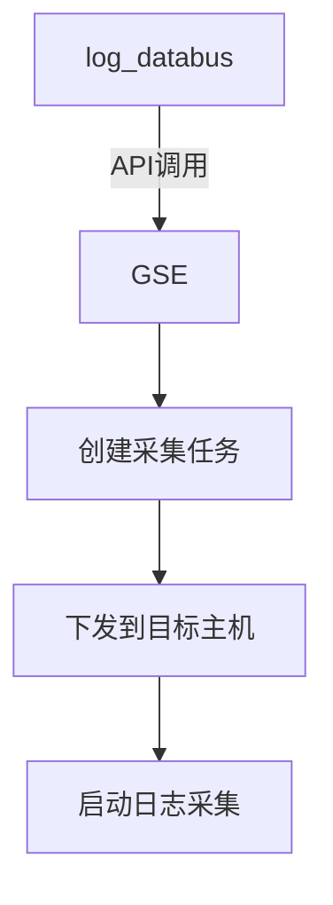

### 与JOB集成

通过JOB平台执行复杂的日志处理任务，如日志清洗和归档。

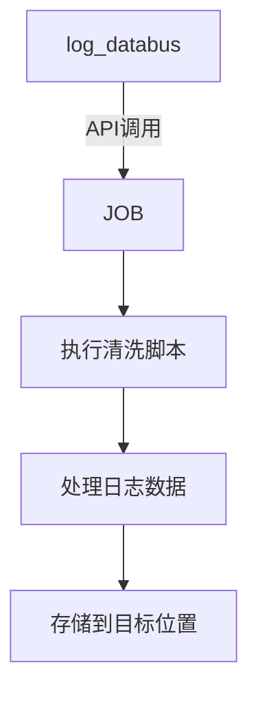

**图示来源**
- [api/modules/gse.py](file://bklog/apps/api/modules/gse.py)
- [api/modules/job.py](file://bklog/apps/api/modules/job.py)
- [api/modules/cc.py](file://bklog/apps/api/modules/cc.py)

## 组件间调用关系

BK-LOG平台的组件间调用关系复杂而有序，通过API网关进行统一管理和路由。

### API网关路由

API网关将外部请求路由到相应的Django应用。

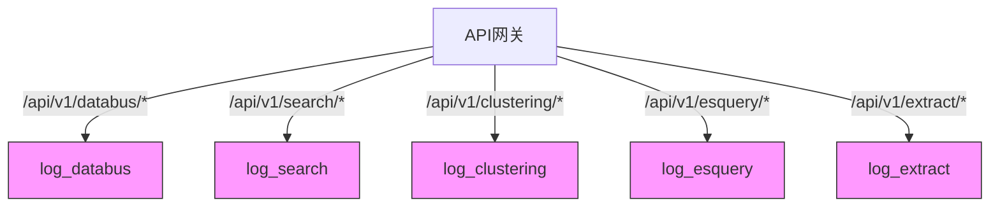

### 服务发现机制

系统通过配置文件和注册中心实现服务发现。

```python
# 服务配置示例
SERVICE_CONFIG = {
    "log_search": {
        "host": "log-search-service",
        "port": 8000,
        "timeout": 30
    },
    "log_databus": {
        "host": "log-databus-service",
        "port": 8001,
        "timeout": 60
    }
}
```

### 依赖管理

通过api/modules中的客户端进行系统集成，实现对其他蓝鲸组件的调用。

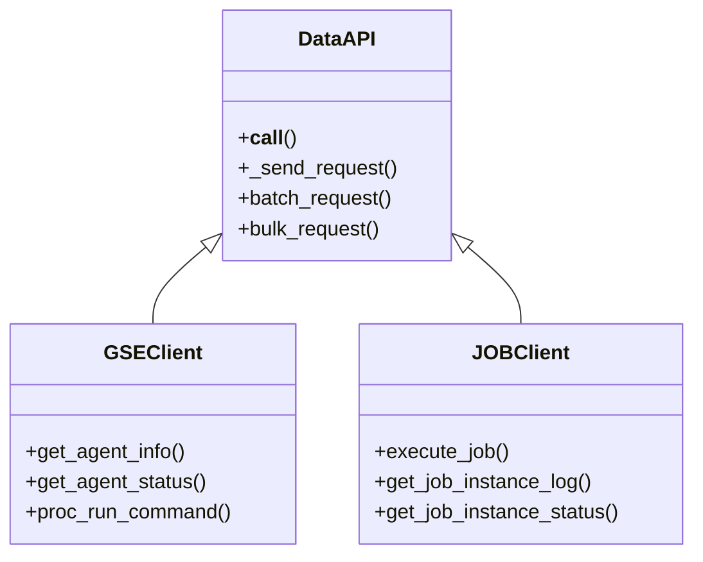

**图示来源**
- [api/base.py](file://bklog/apps/api/base.py)
- [blueking/component/client.py](file://bklog/blueking/component/client.py)

## 架构决策说明

### 采用Django框架的原因

选择Django框架主要基于以下考虑：
1. **开发效率高**：Django提供了丰富的内置功能，如ORM、Admin界面等，大大提高了开发效率
2. **社区支持好**：拥有庞大的开发者社区和丰富的第三方库
3. **安全性强**：内置了CSRF保护、SQL注入防护等安全特性
4. **可扩展性好**：支持通过应用(App)的方式进行功能扩展

### 选择Elasticsearch存储引擎的原因

选择Elasticsearch作为存储引擎主要基于以下优势：
1. **全文搜索能力强**：专为全文搜索设计，支持复杂的查询语法
2. **实时性好**：数据写入后几乎可以立即被搜索到
3. **可扩展性强**：支持水平扩展，能够处理海量数据
4. **分析功能丰富**：内置了强大的聚合分析功能，适合日志分析场景

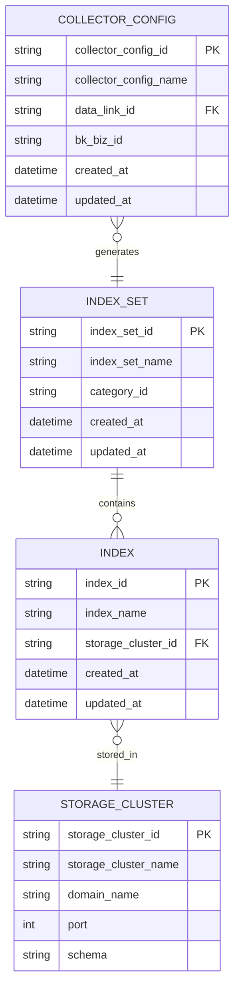

**图示来源**
- [log_databus/models.py](file://bklog/apps/log_databus/models.py)
- [log_search/models.py](file://bklog/apps/log_search/models.py)