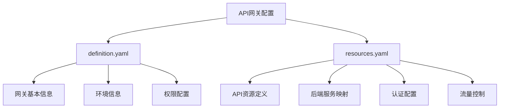
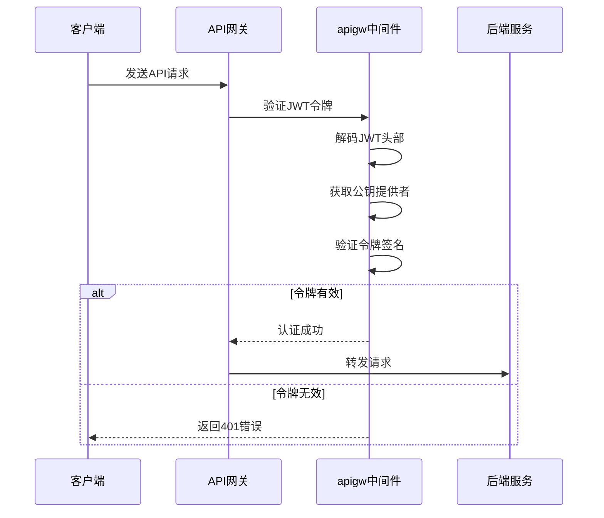
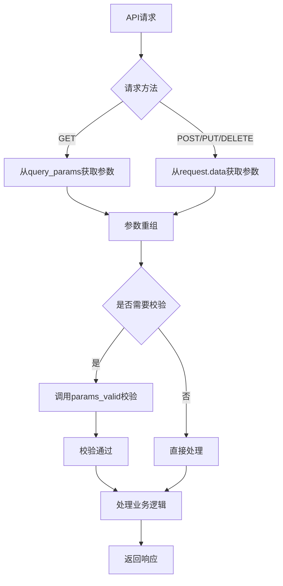
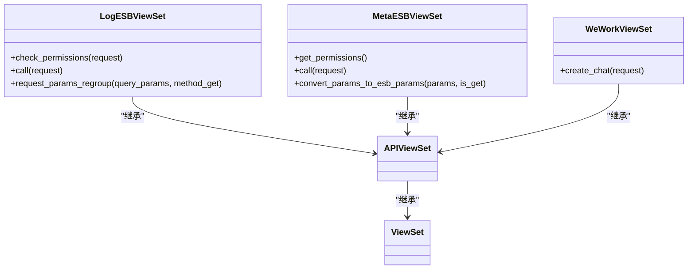
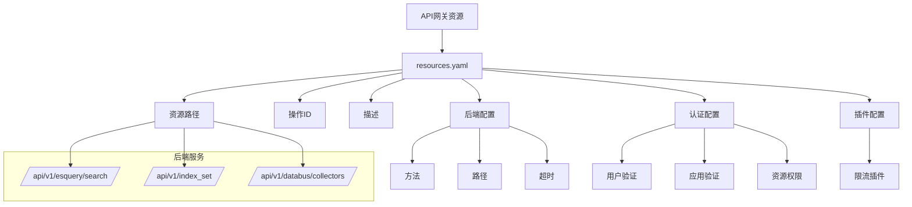
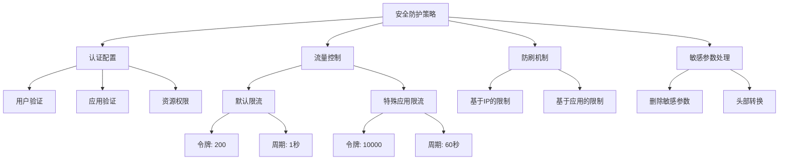
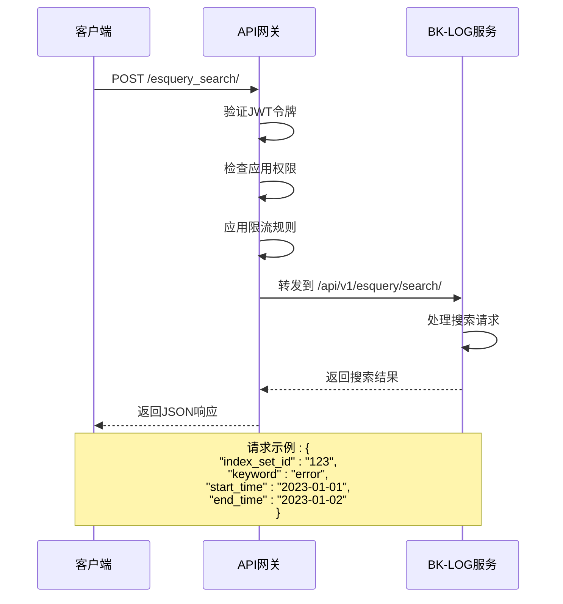
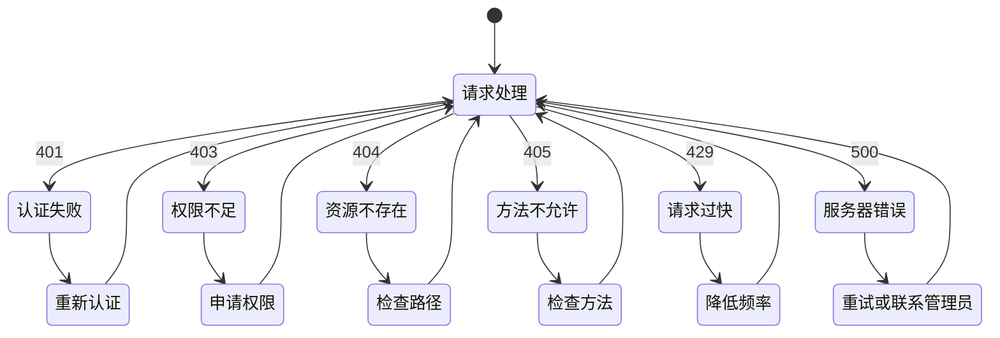

# API网关集成

<cite>
**本文档引用的文件**   
- [apigw.py](file://bklog/apps/middleware/apigw.py)
- [views.py](file://bklog/apps/esb/views.py)
- [urls.py](file://bklog/apps/esb/urls.py)
- [definition.yaml](file://bklog/support-files/apigw/definition.yaml)
- [resources.yaml](file://bklog/support-files/apigw/resources.yaml)
- [sync_apigw.py](file://bklog/apps/api/management/commands/sync_apigw.py)
- [esb.py](file://bklog/blueking/component/apis/esb.py)
- [api_token_middleware.py](file://bklog/apps/middleware/api_token_middleware.py)
</cite>

## 目录
1. [引言](#引言)
2. [API网关配置](#api网关配置)
3. [请求认证机制](#请求认证机制)
4. [参数校验与流量控制](#参数校验与流量控制)
5. [ESB组件实现](#esb组件实现)
6. [API资源映射](#api资源映射)
7. [安全防护策略](#安全防护策略)
8. [API调用示例](#api调用示例)
9. [常见错误代码解析](#常见错误代码解析)
10. [总结](#总结)

## 引言
BK-LOG通过蓝鲸API网关对外提供服务，实现了统一的API管理、认证授权和流量控制。本文档系统化说明BK-LOG如何通过API网关集成，详细解释apigw中间件的请求认证、参数校验和流量控制机制，描述ESB组件如何实现内部API的外部暴露，包括接口注册、版本管理和访问控制。

## API网关配置

**图示来源**
- [definition.yaml](file://bklog/support-files/apigw/definition.yaml)
- [resources.yaml](file://bklog/support-files/apigw/resources.yaml)

**章节来源**
- [definition.yaml](file://bklog/support-files/apigw/definition.yaml#L1-L138)
- [resources.yaml](file://bklog/support-files/apigw/resources.yaml#L1-L800)

## 请求认证机制

**图示来源**
- [apigw.py](file://bklog/apps/middleware/apigw.py#L22-L125)

**章节来源**
- [apigw.py](file://bklog/apps/middleware/apigw.py#L22-L125)

## 参数校验与流量控制

**图示来源**
- [views.py](file://bklog/apps/esb/views.py#L111-L122)

**章节来源**
- [views.py](file://bklog/apps/esb/views.py#L111-L122)

## ESB组件实现

**图示来源**
- [views.py](file://bklog/apps/esb/views.py#L41-L212)
- [urls.py](file://bklog/apps/esb/urls.py#L28-L37)

**章节来源**
- [views.py](file://bklog/apps/esb/views.py#L41-L212)
- [urls.py](file://bklog/apps/esb/urls.py#L28-L37)

## API资源映射

**图示来源**
- [resources.yaml](file://bklog/support-files/apigw/resources.yaml#L8-L800)

**章节来源**
- [resources.yaml](file://bklog/support-files/apigw/resources.yaml#L8-L800)

## 安全防护策略

**图示来源**
- [definition.yaml](file://bklog/support-files/apigw/definition.yaml#L23-L29)
- [resources.yaml](file://bklog/support-files/apigw/resources.yaml#L25-L34)

**章节来源**
- [definition.yaml](file://bklog/support-files/apigw/definition.yaml#L23-L29)
- [resources.yaml](file://bklog/support-files/apigw/resources.yaml#L25-L34)

## API调用示例

**图示来源**
- [resources.yaml](file://bklog/support-files/apigw/resources.yaml#L8-L18)
- [views.py](file://bklog/apps/esb/views.py#L117-L122)

**章节来源**
- [resources.yaml](file://bklog/support-files/apigw/resources.yaml#L8-L18)
- [views.py](file://bklog/apps/esb/views.py#L117-L122)

## 常见错误代码解析

**图示来源**
- [views.py](file://bklog/apps/esb/views.py#L81-L88)
- [exceptions.py](file://bklog/apps/esb/exceptions.py)

**章节来源**
- [views.py](file://bklog/apps/esb/views.py#L81-L88)

## 总结
BK-LOG通过蓝鲸API网关实现了完整的API服务集成，包括请求认证、参数校验、流量控制和安全防护等机制。通过ESB组件实现了内部API的外部暴露，通过resources.yaml文件定义了API资源映射关系。系统提供了完善的认证授权机制和流量控制策略，确保了API服务的安全性和稳定性。