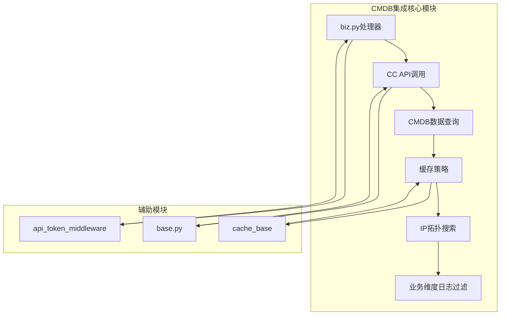
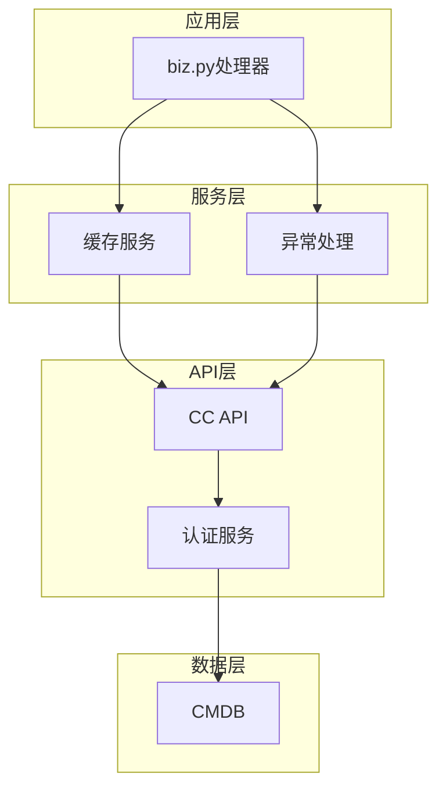
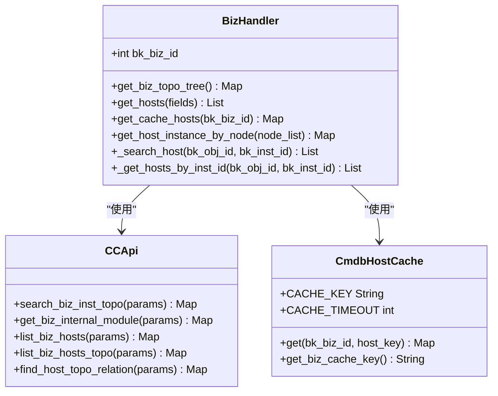
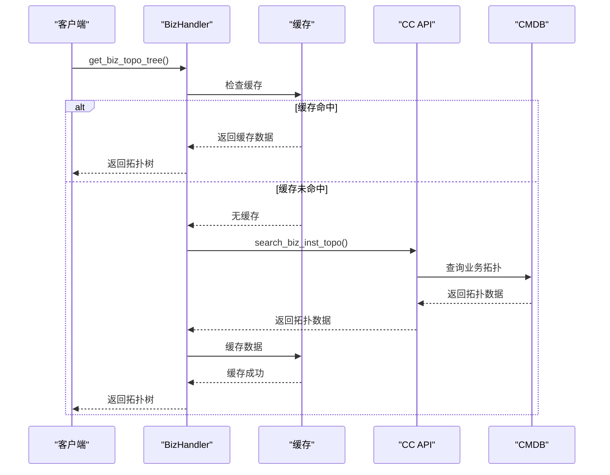
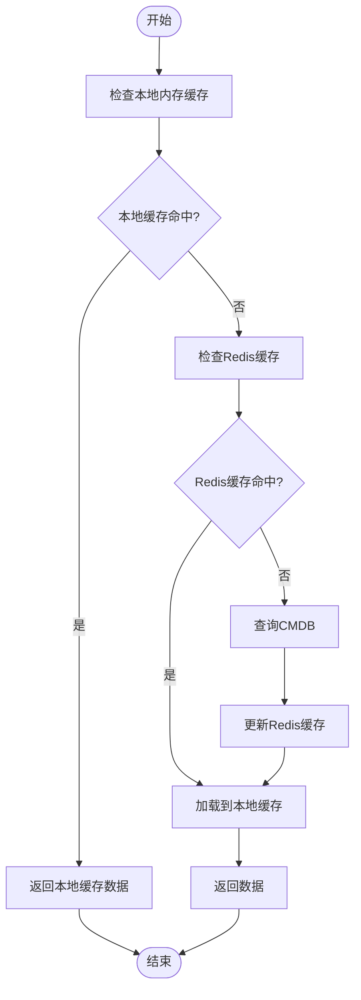
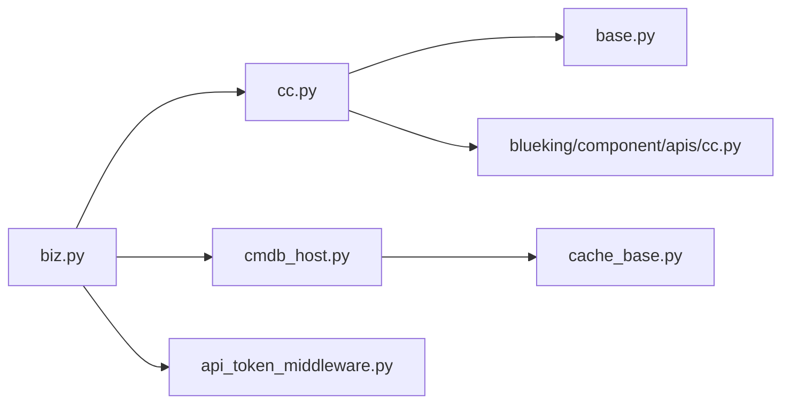
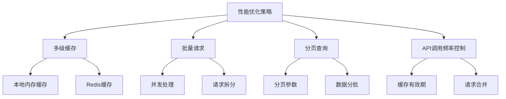

# CMDB集成架构

<cite>
**本文档引用的文件**   
- [biz.py](file://bklog/apps/log_search/handlers/biz.py)
- [cc.py](file://bklog/apps/api/modules/cc.py)
- [cc.py](file://bklog/blueking/component/apis/cc.py)
- [cmdb_host.py](file://bklog/apps/utils/core/cache/cmdb_host.py)
- [cache_base.py](file://bklog/apps/utils/core/cache/cache_base.py)
- [cache.py](file://bklog/apps/utils/cache.py)
- [default.py](file://bklog/config/default.py)
- [api_token_middleware.py](file://bklog/apps/middleware/api_token_middleware.py)
- [base.py](file://bklog/apps/api/base.py)
- [topo_handler.py](file://bklog/bkm_ipchooser/handlers/topo_handler.py)
- [resource.py](file://bklog/bkm_ipchooser/query/resource.py)
- [constants.py](file://bklog/apps/log_search/constants.py)
</cite>

## 目录
1. [简介](#简介)
2. [项目结构](#项目结构)
3. [核心组件](#核心组件)
4. [架构概述](#架构概述)
5. [详细组件分析](#详细组件分析)
6. [依赖分析](#依赖分析)
7. [性能考虑](#性能考虑)
8. [故障排除指南](#故障排除指南)
9. [结论](#结论)

## 简介
本文档详细描述了BK-LOG如何通过蓝鲸组件API与配置管理数据库（CMDB）进行深度集成。文档涵盖了项目信息同步机制，包括业务拓扑获取、主机信息查询和拓扑关系维护。重点说明了log_search模块中biz.py处理器如何利用CMDB数据实现IP拓扑搜索和业务维度日志过滤。文档还包含了认证流程、API调用频率控制、缓存策略（如cmdb_host缓存）以及异常处理机制。提供了代码示例展示CMDB数据查询的最佳实践，并说明了在大规模拓扑场景下的性能优化方案。

## 项目结构
BK-LOG项目的CMDB集成主要分布在以下几个关键目录中：
- `bklog/apps/api/modules/`：包含与蓝鲸各组件（包括CC/CMDB）的API接口定义
- `bklog/apps/log_search/handlers/`：包含日志搜索相关的业务逻辑处理，特别是biz.py处理器
- `bklog/blueking/component/apis/`：包含蓝鲸组件API的底层实现
- `bklog/apps/utils/core/cache/`：包含缓存机制的实现，特别是cmdb_host缓存
- `bklog/bkm_ipchooser/`：包含IP选择器相关的拓扑处理逻辑

**图示来源**
- [biz.py](file://bklog/apps/log_search/handlers/biz.py)
- [cc.py](file://bklog/apps/api/modules/cc.py)
- [cmdb_host.py](file://bklog/apps/utils/core/cache/cmdb_host.py)
- [api_token_middleware.py](file://bklog/apps/middleware/api_token_middleware.py)
- [base.py](file://bklog/apps/api/base.py)

**节来源**
- [biz.py](file://bklog/apps/log_search/handlers/biz.py)
- [cc.py](file://bklog/apps/api/modules/cc.py)
- [cmdb_host.py](file://bklog/apps/utils/core/cache/cmdb_host.py)

## 核心组件
CMDB集成的核心组件主要包括biz.py处理器、CC API模块和cmdb_host缓存机制。biz.py处理器作为log_search模块的核心，负责处理与CMDB相关的所有业务逻辑，包括获取业务拓扑树、查询主机信息、处理拓扑关系等。CC API模块提供了与蓝鲸配置管理数据库通信的标准接口，封装了所有必要的API调用。cmdb_host缓存机制则通过Redis缓存主机信息，显著提升了查询性能，特别是在大规模拓扑场景下。

**节来源**
- [biz.py](file://bklog/apps/log_search/handlers/biz.py)
- [cc.py](file://bklog/apps/api/modules/cc.py)
- [cmdb_host.py](file://bklog/apps/utils/core/cache/cmdb_host.py)

## 架构概述
BK-LOG的CMDB集成架构采用分层设计，从上到下分为应用层、服务层、API层和数据层。应用层的biz.py处理器通过服务层的缓存机制与API层的CC接口进行交互，最终访问CMDB数据层。整个架构通过蓝鲸组件API实现与CMDB的深度集成，确保了数据的一致性和实时性。

**图示来源**
- [biz.py](file://bklog/apps/log_search/handlers/biz.py)
- [cmdb_host.py](file://bklog/apps/utils/core/cache/cmdb_host.py)
- [cc.py](file://bklog/apps/api/modules/cc.py)
- [api_token_middleware.py](file://bklog/apps/middleware/api_token_middleware.py)

## 详细组件分析

### biz.py处理器分析
biz.py处理器是CMDB集成的核心，负责处理所有与业务拓扑和主机信息相关的请求。处理器通过调用CC API获取业务拓扑树、主机列表和拓扑关系，并利用缓存机制提升性能。

#### 类图

**图示来源**
- [biz.py](file://bklog/apps/log_search/handlers/biz.py)
- [cc.py](file://bklog/apps/api/modules/cc.py)
- [cmdb_host.py](file://bklog/apps/utils/core/cache/cmdb_host.py)

#### 序列图

**图示来源**
- [biz.py](file://bklog/apps/log_search/handlers/biz.py)
- [cmdb_host.py](file://bklog/apps/utils/core/cache/cmdb_host.py)
- [cc.py](file://bklog/apps/api/modules/cc.py)

**节来源**
- [biz.py](file://bklog/apps/log_search/handlers/biz.py)

### 缓存机制分析
CMDB集成中的缓存机制是性能优化的关键。系统采用了多级缓存策略，包括本地内存缓存和Redis分布式缓存。

#### 流程图

**图示来源**
- [cmdb_host.py](file://bklog/apps/utils/core/cache/cmdb_host.py)
- [cache_base.py](file://bklog/apps/utils/core/cache/cache_base.py)

**节来源**
- [cmdb_host.py](file://bklog/apps/utils/core/cache/cmdb_host.py)

## 依赖分析
CMDB集成涉及多个组件之间的依赖关系，主要包括API依赖、缓存依赖和认证依赖。

**图示来源**
- [biz.py](file://bklog/apps/log_search/handlers/biz.py)
- [cc.py](file://bklog/apps/api/modules/cc.py)
- [cmdb_host.py](file://bklog/apps/utils/core/cache/cmdb_host.py)
- [base.py](file://bklog/apps/api/base.py)
- [cache_base.py](file://bklog/apps/utils/core/cache/cache_base.py)
- [api_token_middleware.py](file://bklog/apps/middleware/api_token_middleware.py)

**节来源**
- [biz.py](file://bklog/apps/log_search/handlers/biz.py)
- [cc.py](file://bklog/apps/api/modules/cc.py)
- [cmdb_host.py](file://bklog/apps/utils/core/cache/cmdb_host.py)

## 性能考虑
在大规模拓扑场景下，CMDB集成的性能优化至关重要。系统采用了多种策略来确保高性能：

1. **缓存策略**：采用多级缓存机制，包括本地内存缓存和Redis分布式缓存，缓存有效期根据数据类型设置为5分钟到24小时不等。
2. **批量请求**：通过batch_request方法实现并发请求，将大请求拆分为多个小请求并行处理，显著提升了查询效率。
3. **分页查询**：对于大量数据的查询，采用分页机制，避免单次请求数据量过大。
4. **API调用频率控制**：通过配置合理的缓存策略和批量请求机制，有效控制了对CMDB API的调用频率。

**图示来源**
- [cmdb_host.py](file://bklog/apps/utils/core/cache/cmdb_host.py)
- [cache.py](file://bklog/apps/utils/cache.py)
- [base.py](file://bklog/apps/api/base.py)
- [topo_handler.py](file://bklog/bkm_ipchooser/handlers/topo_handler.py)

## 故障排除指南
CMDB集成可能出现的常见问题及解决方案：

1. **认证失败**：检查api_token_middleware中的认证逻辑，确保token有效且未过期。
2. **缓存失效**：检查Redis连接是否正常，确认缓存键的生成逻辑正确。
3. **API调用超时**：检查网络连接，确认CMDB服务正常运行。
4. **数据不一致**：检查缓存刷新机制，确保数据同步及时。

**节来源**
- [api_token_middleware.py](file://bklog/apps/middleware/api_token_middleware.py)
- [cmdb_host.py](file://bklog/apps/utils/core/cache/cmdb_host.py)

## 结论
BK-LOG通过蓝鲸组件API与CMDB实现了深度集成，提供了高效的业务拓扑获取、主机信息查询和拓扑关系维护功能。通过biz.py处理器、CC API模块和cmdb_host缓存机制的协同工作，系统能够高效地支持IP拓扑搜索和业务维度日志过滤。多级缓存策略和批量请求机制确保了在大规模拓扑场景下的高性能表现。整体架构设计合理，依赖关系清晰，为日志管理提供了强大的CMDB集成能力。