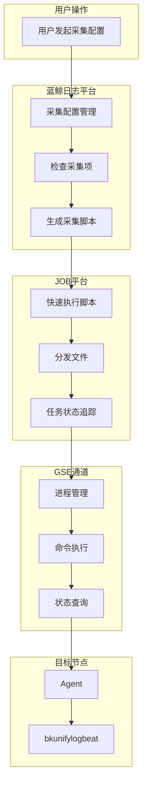
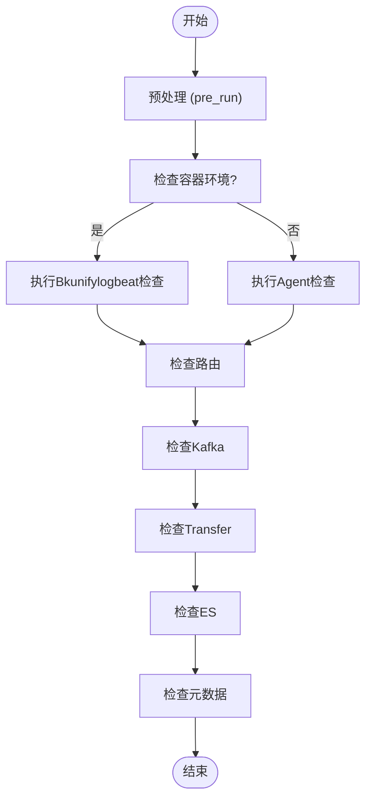
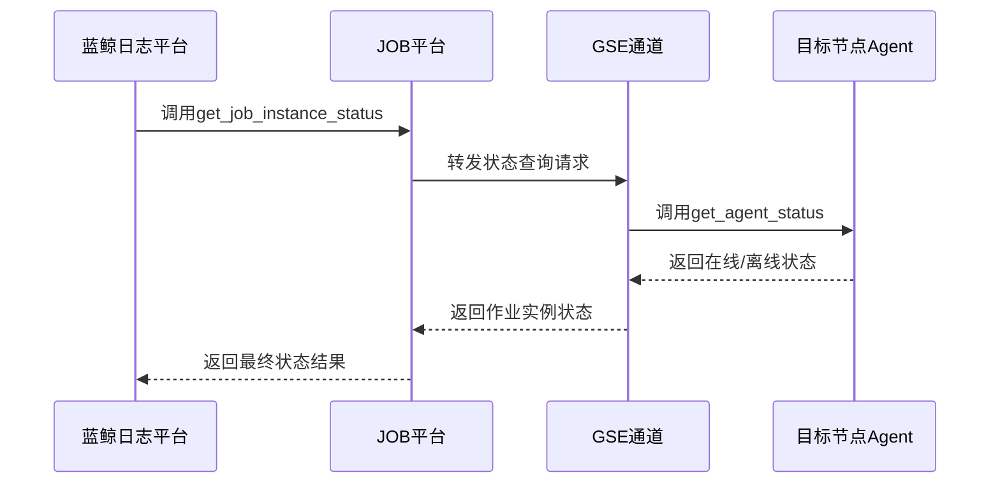
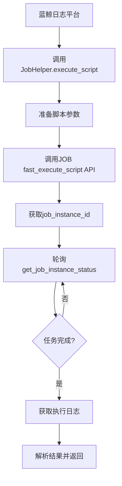

# GSE与JOB集成

<cite>
**本文档引用文件**   
- [check.py](file://bklog/apps/log_databus/scripts/check_bkunifylogbeat/check.py)
- [agent_checker.py](file://bklog/apps/log_databus/handlers/check_collector/checker/agent_checker.py)
- [bkunifylogbeat_checker.py](file://bklog/apps/log_databus/handlers/check_collector/checker/bkunifylogbeat_checker.py)
- [handler.py](file://bklog/apps/log_databus/handlers/check_collector/handler.py)
- [base.py](file://bklog/apps/log_databus/handlers/check_collector/base.py)
- [gse.py](file://bklog/blueking/component/apis/gse.py)
- [job.py](file://bklog/blueking/component/apis/job.py)
- [job.py](file://bklog/apps/api/modules/job.py)
- [constants.py](file://bklog/apps/log_databus/constants.py)
- [job.py](file://bklog/apps/log_commons/job.py)
- [fileserver.py](file://bklog/apps/log_extract/fileserver.py)
</cite>

## 目录
1. [引言](#引言)
2. [GSE与JOB集成架构](#gse与job集成架构)
3. [日志采集代理部署与管理](#日志采集代理部署与管理)
4. [通过GSE通道实现状态监控与指令下发](#通过gse通道实现状态监控与指令下发)
5. [JOB平台在批量部署中的应用](#job平台在批量部署中的应用)
6. [采集任务失败诊断流程](#采集任务失败诊断流程)
7. [大规模节点部署性能优化建议](#大规模节点部署性能优化建议)
8. [结论](#结论)

## 引言

本文档详细描述了蓝鲸日志平台中GSE（Game Server Engine）与JOB平台的集成机制，重点阐述日志采集代理（bkunifylogbeat）的部署、管理、监控和故障诊断。文档涵盖了通过GSE通道实现的实时状态监控和指令下发，以及JOB平台在批量部署采集配置、执行日志采集脚本方面的应用，包括任务模板管理、执行状态追踪和结果分析。同时，提供了采集任务失败的诊断流程和大规模节点部署时的性能优化建议。

**本文档引用文件**   
- [check.py](file://bklog/apps/log_databus/scripts/check_bkunifylogbeat/check.py)
- [agent_checker.py](file://bklog/apps/log_databus/handlers/check_collector/checker/agent_checker.py)
- [bkunifylogbeat_checker.py](file://bklog/apps/log_databus/handlers/check_collector/checker/bkunifylogbeat_checker.py)
- [handler.py](file://bklog/apps/log_databus/handlers/check_collector/handler.py)
- [base.py](file://bklog/apps/log_databus/handlers/check_collector/base.py)
- [gse.py](file://bklog/blueking/component/apis/gse.py)
- [job.py](file://bklog/blueking/component/apis/job.py)
- [job.py](file://bklog/apps/api/modules/job.py)
- [constants.py](file://bklog/apps/log_databus/constants.py)
- [job.py](file://bklog/apps/log_commons/job.py)
- [fileserver.py](file://bklog/apps/log_extract/fileserver.py)

## GSE与JOB集成架构

GSE与JOB的集成是实现日志采集自动化和集中管理的核心。GSE作为底层通信和进程管理通道，负责与部署在各节点上的Agent进行通信，执行命令和获取状态。JOB平台则作为上层的作业调度和批量操作平台，负责编排和执行复杂的批量任务，如分发文件、执行脚本等。

**图示来源**
- [handler.py](file://bklog/apps/log_databus/handlers/check_collector/handler.py)
- [agent_checker.py](file://bklog/apps/log_databus/handlers/check_collector/checker/agent_checker.py)
- [gse.py](file://bklog/blueking/component/apis/gse.py)
- [job.py](file://bklog/blueking/component/apis/job.py)

## 日志采集代理部署与管理

日志采集代理（bkunifylogbeat）的部署与管理通过一个标准化的流程完成，该流程由蓝鲸日志平台发起，利用JOB平台进行批量操作，并通过GSE通道与目标节点交互。

部署流程的核心是`CheckCollectorHandler`类，它协调整个检查和部署过程。当用户创建或修改采集配置时，系统会触发一个异步任务`async_run_check`，该任务会实例化`CheckCollectorHandler`并执行`run`方法。

**图示来源**
- [handler.py](file://bklog/apps/log_databus/handlers/check_collector/handler.py#L131-L178)

### 非容器环境部署

在非容器环境中，部署的核心是`AgentChecker`类。它通过JOB平台的`fast_execute_script` API在目标节点上执行一个名为`check.py`的Python脚本。

**Section sources**
- [agent_checker.py](file://bklog/apps/log_databus/handlers/check_collector/checker/agent_checker.py#L49-L237)
- [check.py](file://bklog/apps/log_databus/scripts/check_bkunifylogbeat/check.py)

### 容器环境部署

在容器环境中，部署的核心是`BkunifylogbeatChecker`类。它通过Kubernetes API与集群交互，检查CRD、CR、ConfigMap和DaemonSet等资源的状态。

**Section sources**
- [bkunifylogbeat_checker.py](file://bklog/apps/log_databus/handlers/check_collector/checker/bkunifylogbeat_checker.py#L61-L453)

## 通过GSE通道实现状态监控与指令下发

GSE通道是实现对日志采集代理实时状态监控和指令下发的关键。它提供了丰富的API，允许上层应用直接与GSE Agent进行交互。

### 实时状态监控

GSE提供了`get_agent_status`和`get_agent_info`两个核心API来查询Agent的状态。

**图示来源**
- [gse.py](file://bklog/blueking/component/apis/gse.py#L37-L42)
- [job.py](file://bklog/blueking/component/apis/job.py#L97-L102)
- [agent_checker.py](file://bklog/apps/log_databus/handlers/check_collector/checker/agent_checker.py#L115-L158)

### 指令下发

GSE的`proc_run_command` API允许平台向Agent下发任意命令，这是实现指令下发的基础。

**Section sources**
- [gse.py](file://bklog/blueking/component/apis/gse.py#L55-L60)

## JOB平台在批量部署中的应用

JOB平台在日志采集的批量部署中扮演着作业调度器的角色，负责执行脚本、分发文件和追踪任务状态。

### 批量执行脚本

`JobHelper`类封装了对JOB平台API的调用，简化了脚本执行的流程。

**图示来源**
- [job.py](file://bklog/apps/log_commons/job.py#L29-L74)
- [agent_checker.py](file://bklog/apps/log_databus/handlers/check_collector/checker/agent_checker.py#L83-L114)

### 任务模板管理与执行状态追踪

JOB平台支持任务模板的创建和管理，允许用户复用复杂的作业流程。在日志采集场景中，虽然主要使用“快速执行脚本”功能，但其底层机制与任务模板一致。

**Section sources**
- [job.py](file://bklog/blueking/component/apis/job.py#L109-L126)

## 采集任务失败诊断流程

当采集任务失败时，系统提供了一套完整的诊断流程，帮助用户快速定位问题。

1.  **检查采集项状态**：首先通过`CheckCollectorHandler`检查整个采集链路的状态。
2.  **分析JOB执行日志**：如果`AgentChecker`执行失败，检查JOB平台返回的`job_instance_id`，并调用`batch_get_job_instance_ip_log`获取详细的执行日志。
3.  **解析日志内容**：`check.py`脚本的输出是一个JSON格式的结果，包含了多个检查项（如二进制文件、进程、配置等）的详细状态和错误信息。
4.  **GSE通道诊断**：检查GSE相关的状态，如Agent进程、socket文件、dataserver端口等。

**Section sources**
- [check.py](file://bklog/apps/log_databus/scripts/check_bkunifylogbeat/check.py)
- [agent_checker.py](file://bklog/apps/log_databus/handlers/check_collector/checker/agent_checker.py#L159-L237)

## 大规模节点部署性能优化建议

在大规模节点部署场景下，应注意以下性能优化点：

1.  **合理设置超时时间**：`CHECK_COLLECTOR_SCRIPT_TIMEOUT`常量定义了脚本执行的超时时间为7200秒，可根据实际网络和节点负载情况调整。
2.  **控制并发度**：避免一次性对过多节点执行操作，可通过分批处理来降低JOB平台和GSE通道的压力。
3.  **优化脚本逻辑**：确保`check.py`等执行脚本的逻辑高效，避免在节点上执行耗时过长的操作。
4.  **利用缓存**：`CheckCollectorRecord`类使用了Redis缓存来存储检查结果，避免了重复计算，提高了响应速度。

**Section sources**
- [constants.py](file://bklog/apps/log_databus/constants.py#L607)
- [base.py](file://bklog/apps/log_databus/handlers/check_collector/base.py)

## 结论

GSE与JOB的集成在蓝鲸日志平台中构建了一个强大、可靠的日志采集基础设施。GSE提供了底层的通信和进程管理能力，而JOB平台则提供了上层的批量作业调度能力。两者结合，实现了日志采集代理的自动化部署、实时状态监控、指令下发和故障诊断。通过理解这一集成机制，运维人员可以更有效地管理和维护大规模的日志采集系统。