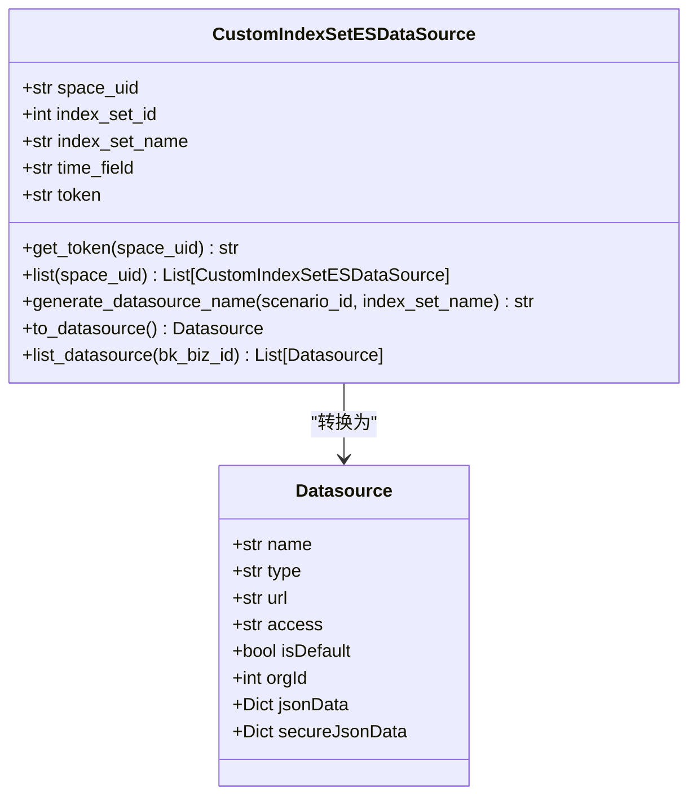
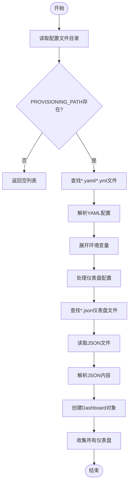
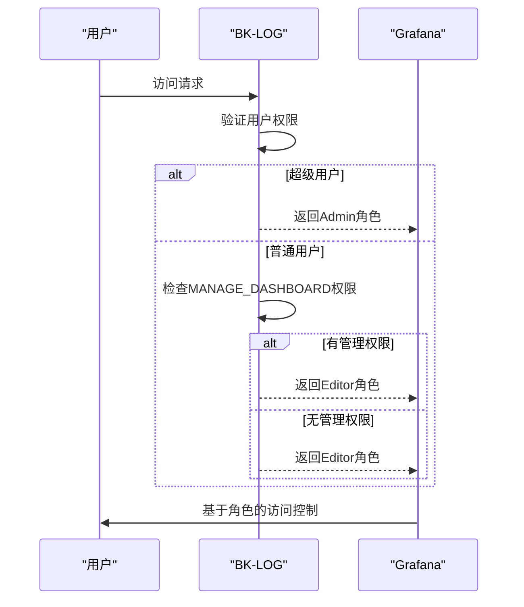
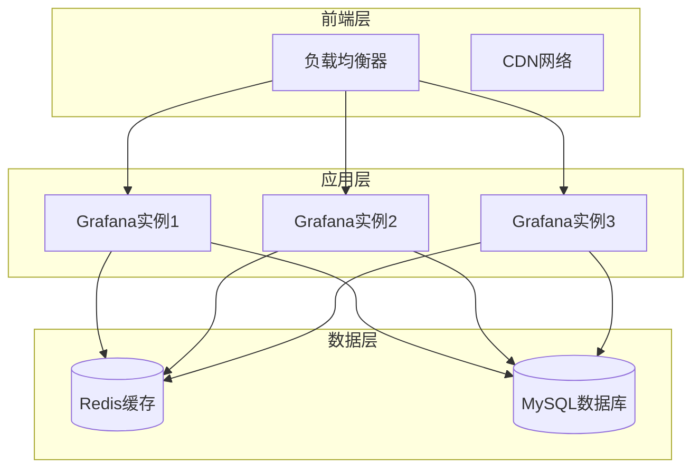
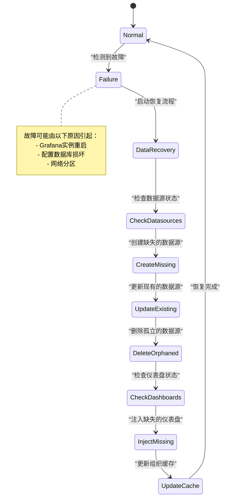

# Grafana可视化集成

<cite>
**本文档引用的文件**
- [data_source.py](file://bklog/apps/grafana/data_source.py)
- [provisioning.py](file://bklog/apps/grafana/provisioning.py)
- [permissions.py](file://bklog/apps/grafana/permissions.py)
- [views.py](file://bklog/bk_dataview/grafana/views.py)
- [client.py](file://bklog/bk_dataview/grafana/client.py)
- [provisioning.py](file://bklog/bk_dataview/grafana/provisioning.py)
- [authentication.py](file://bklog/apps/grafana/authentication.py)
- [model.py](file://bklog/apps/grafana/model.py)
- [urls.py](file://bklog/apps/grafana/urls.py)
</cite>

## 目录
1. [引言](#引言)
2. [数据源自动配置机制](#数据源自动配置机制)
3. [仪表盘预置方案](#仪表盘预置方案)
4. [权限同步机制](#权限同步机制)
5. [高可用部署考虑](#高可用部署考虑)
6. [性能监控指标](#性能监控指标)
7. [故障恢复策略](#故障恢复策略)
8. [实际部署案例](#实际部署案例)

## 引言
BK-LOG与Grafana的集成实现了日志数据的可视化展示，通过自动化配置和权限同步机制，为用户提供了一站式的日志分析解决方案。本集成文档详细阐述了BK-LOG如何实现与Grafana的无缝集成，包括数据源自动配置、仪表盘预置、权限同步等核心功能。

## 数据源自动配置机制
BK-LOG通过自定义ES数据源配置机制，实现了Elasticsearch数据源的动态创建和认证信息注入。系统通过`CustomIndexSetESDataSource`类将日志索引集转换为Grafana兼容的数据源格式。



**图示来源**
- [data_source.py](file://bklog/apps/grafana/data_source.py#L46-L127)

**本节来源**
- [data_source.py](file://bklog/apps/grafana/data_source.py#L46-L152)

## 仪表盘预置方案
BK-LOG采用基于Provisioning的仪表盘预置方案，通过模板管理和批量部署流程实现标准化日志分析仪表盘的自动化部署。系统通过`SimpleProvisioning`类从配置文件目录中读取仪表盘定义并批量注入。



**图示来源**
- [provisioning.py](file://bklog/bk_dataview/grafana/provisioning.py#L85-L124)

**本节来源**
- [provisioning.py](file://bklog/bk_dataview/grafana/provisioning.py#L85-L124)

## 权限同步机制
BK-LOG通过权限同步机制确保Grafana视图访问与BK-LOG权限体系保持一致。系统通过`BizPermission`类实现业务权限控制，将BK-LOG的权限映射到Grafana的角色体系中。



**图示来源**
- [permissions.py](file://bklog/apps/grafana/permissions.py#L28-L47)

**本节来源**
- [permissions.py](file://bklog/apps/grafana/permissions.py#L28-L47)

## 高可用部署考虑
BK-LOG的Grafana集成在高可用部署方面进行了全面考虑，包括数据库独立部署、缓存机制和负载均衡配置。系统通过独立的MySQL数据库存储Grafana元数据，确保数据持久性和可恢复性。



**图示来源**
- [0001_grafana_20201113-0000_mysql.sql](file://bklog/support-files/sql/0001_grafana_20201113-0000_mysql.sql#L1)
- [provisioning.py](file://bklog/bk_dataview/grafana/provisioning.py)

**本节来源**
- [0001_grafana_20201113-0000_mysql.sql](file://bklog/support-files/sql/0001_grafana_20201113-0000_mysql.sql#L1)

## 性能监控指标
BK-LOG集成的Grafana系统监控关键性能指标，包括JVM内存使用、文件系统状态和查询性能。系统通过ES查询接口收集Elasticsearch集群的运行时指标。

```mermaid
erDiagram
PERFORMANCE_METRICS {
string metric_name PK
string metric_type
string es_field_name
string description
timestamp created_at
timestamp updated_at
}
JVM_MEMORY {
string jvm_mem_non_heap_used PK
string gauge
string jvm.mem.non_heap_used_in_bytes
string "非堆内存使用量"
}
JVM_MEMORY ||--o{ PERFORMANCE_METRICS : "属于"
FILE_SYSTEM {
string elasticsearch_fs_total_total_in_bytes PK
string gauge
string fs.total.total_in_bytes
string "文件系统总容量"
}
FILE_SYSTEM ||--o{ PERFORMANCE_METRICS : "属于"
THREADS {
string jvm_threads_count PK
string gauge
string jvm.threads.count
string "线程数量"
}
THREADS ||--o{ PERFORMANCE_METRICS : "属于"
```

**图示来源**
- [es.py](file://bklog/apps/log_measure/utils/es.py#L326-L337)

**本节来源**
- [es.py](file://bklog/apps/log_measure/utils/es.py#L326-L337)

## 故障恢复策略
BK-LOG的Grafana集成实现了完善的故障恢复策略，包括数据源自动重建、仪表盘重新注入和缓存失效处理。系统通过定期检查和同步机制确保配置的一致性。



**图示来源**
- [provisioning.py](file://bklog/apps/grafana/provisioning.py#L55-L98)
- [views.py](file://bklog/bk_dataview/grafana/views.py#L117-L142)

**本节来源**
- [provisioning.py](file://bklog/apps/grafana/provisioning.py#L55-L98)
- [views.py](file://bklog/bk_dataview/grafana/views.py#L117-L142)

## 实际部署案例
在实际部署中，BK-LOG的Grafana集成通过自动化脚本和配置管理工具实现快速部署。系统通过特性开关控制功能启用，确保平滑的升级和回滚能力。


**图示来源**
- [provisioning.py](file://bklog/apps/grafana/provisioning.py)
- [views.py](file://bklog/bk_dataview/grafana/views.py)

**本节来源**
- [provisioning.py](file://bklog/apps/grafana/provisioning.py)
- [views.py](file://bklog/bk_dataview/grafana/views.py)