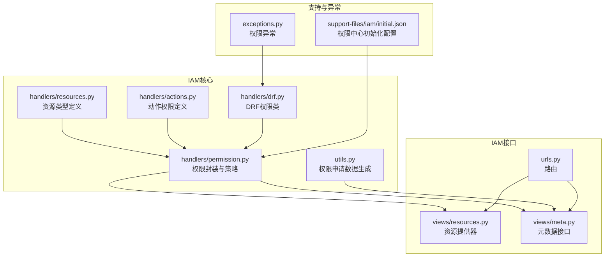
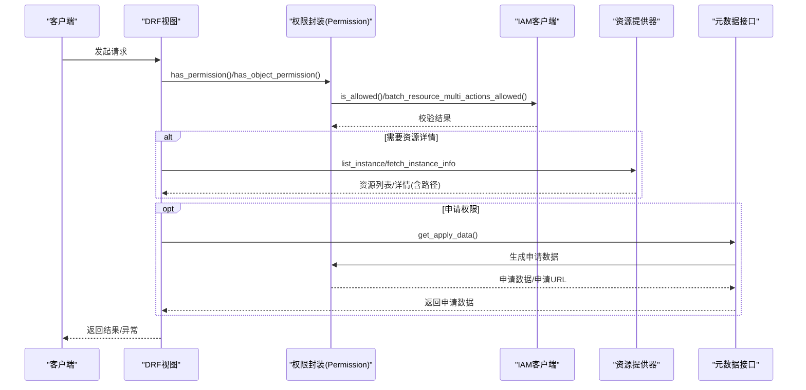
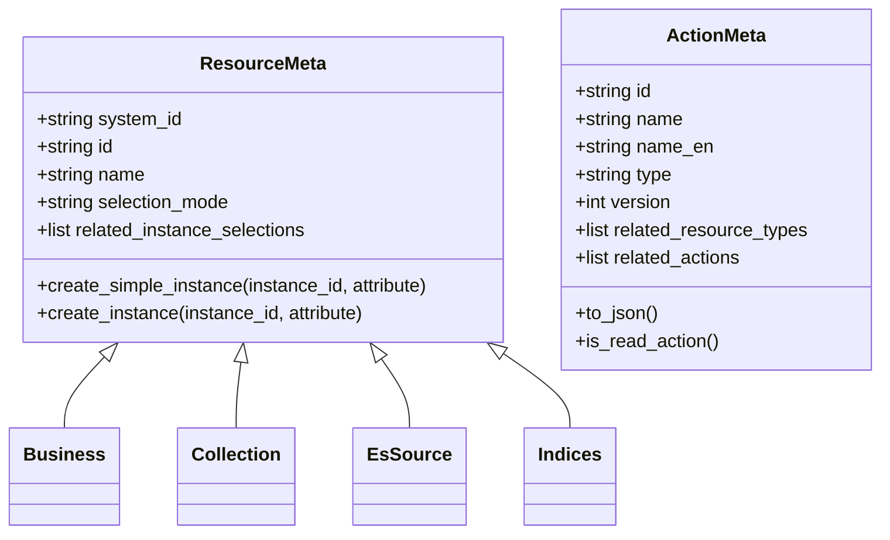
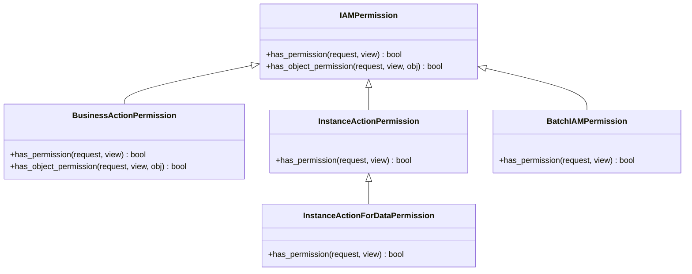
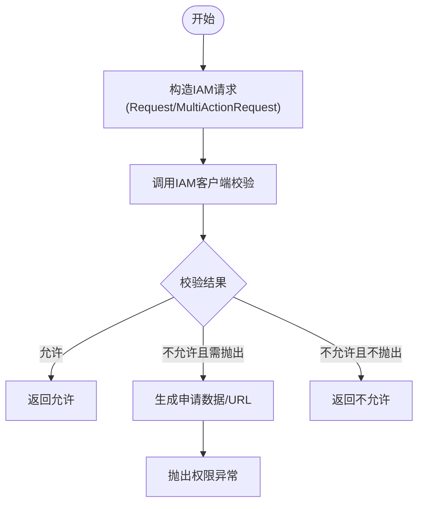
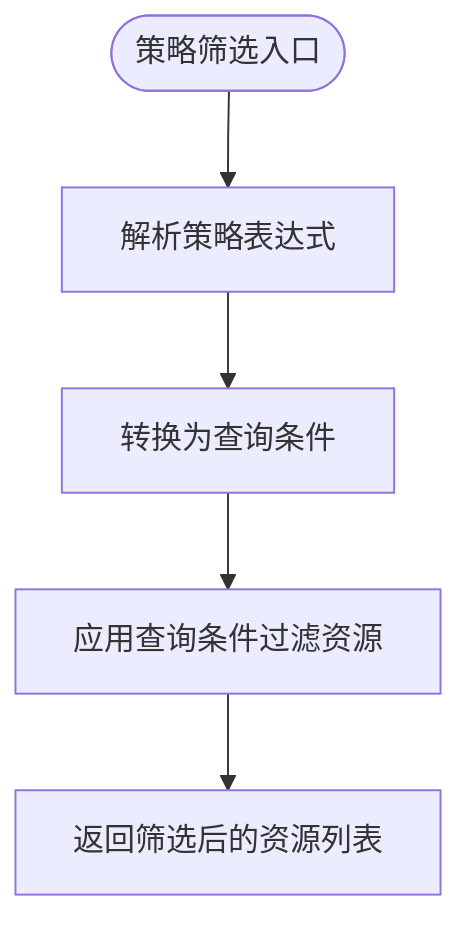
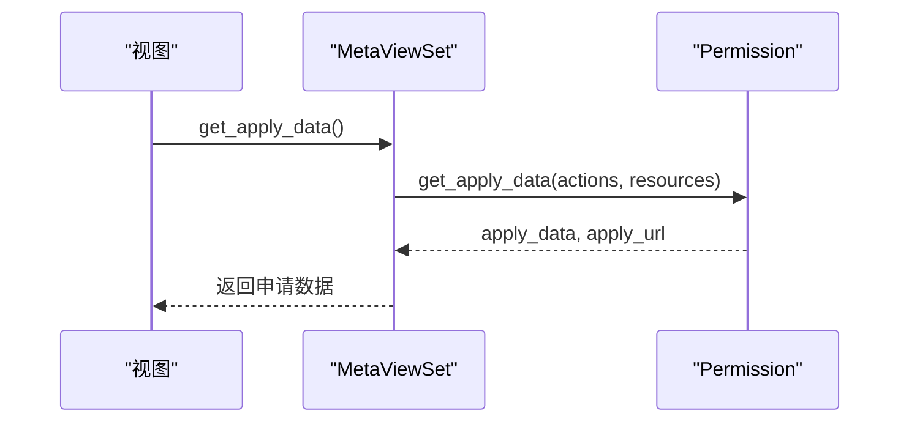
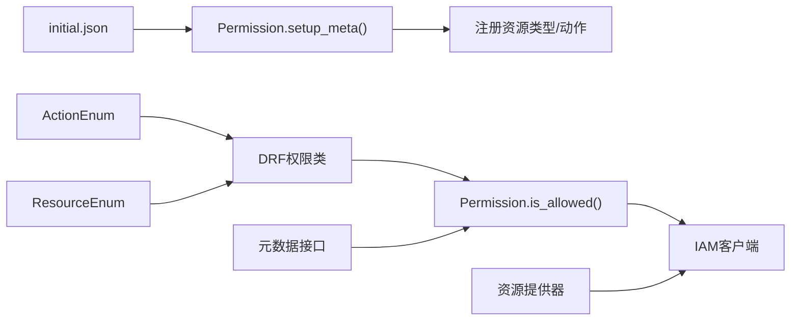

# IAM权限集成

<cite>
**本文引用的文件**
- [bklog/apps/iam/handlers/resources.py](file://bklog/apps/iam/handlers/resources.py)
- [bklog/apps/iam/handlers/actions.py](file://bklog/apps/iam/handlers/actions.py)
- [bklog/apps/iam/handlers/drf.py](file://bklog/apps/iam/handlers/drf.py)
- [bklog/apps/iam/handlers/permission.py](file://bklog/apps/iam/handlers/permission.py)
- [bklog/apps/iam/views/resources.py](file://bklog/apps/iam/views/resources.py)
- [bklog/apps/iam/views/meta.py](file://bklog/apps/iam/views/meta.py)
- [bklog/apps/iam/utils.py](file://bklog/apps/iam/utils.py)
- [bklog/apps/iam/urls.py](file://bklog/apps/iam/urls.py)
- [bklog/apps/iam/exceptions.py](file://bklog/apps/iam/exceptions.py)
- [bklog/apps/generic.py](file://bklog/apps/generic.py)
- [bklog/support-files/iam/initial.json](file://support-files/iam/initial.json)
- [bklog/home_application/utils/third_party.py](file://home_application/utils/third_party.py)
</cite>

## 目录
1. [简介](#简介)
2. [项目结构](#项目结构)
3. [核心组件](#核心组件)
4. [架构总览](#架构总览)
5. [详细组件分析](#详细组件分析)
6. [依赖关系分析](#依赖关系分析)
7. [性能考量](#性能考量)
8. [故障排查指南](#故障排查指南)
9. [结论](#结论)
10. [附录](#附录)

## 简介
本文件系统化阐述BK-LOG基于蓝鲸权限中心（IAM）的细粒度访问控制实现，涵盖资源类型与操作权限的注册机制、DRF权限类与IAM交互验证流程、权限策略的继承与覆盖规则、分布式环境下的权限缓存与更新机制，并提供实际代码示例路径与调试排查方法，帮助开发者快速理解与落地权限集成。

## 项目结构
IAM权限集成主要分布在以下模块：
- handlers：权限核心实现（资源、动作、DRF权限类、鉴权封装）
- views：IAM元数据与资源提供器接口
- utils：权限申请数据生成工具
- urls：IAM接口路由
- exceptions：权限相关异常定义
- 支持文件：权限中心初始化配置

图表来源
- [bklog/apps/iam/handlers/resources.py](file://bklog/apps/iam/handlers/resources.py#L1-L240)
- [bklog/apps/iam/handlers/actions.py](file://bklog/apps/iam/handlers/actions.py#L1-L291)
- [bklog/apps/iam/handlers/drf.py](file://bklog/apps/iam/handlers/drf.py#L1-L269)
- [bklog/apps/iam/handlers/permission.py](file://bklog/apps/iam/handlers/permission.py#L1-L444)
- [bklog/apps/iam/views/resources.py](file://bklog/apps/iam/views/resources.py#L1-L480)
- [bklog/apps/iam/views/meta.py](file://bklog/apps/iam/views/meta.py#L1-L200)
- [bklog/apps/iam/utils.py](file://bklog/apps/iam/utils.py#L1-L79)
- [bklog/apps/iam/urls.py](file://bklog/apps/iam/urls.py#L1-L60)
- [bklog/support-files/iam/initial.json](file://support-files/iam/initial.json#L1-L819)
- [bklog/apps/iam/exceptions.py](file://bklog/apps/iam/exceptions.py#L1-L64)

章节来源
- [bklog/apps/iam/handlers/resources.py](file://bklog/apps/iam/handlers/resources.py#L1-L240)
- [bklog/apps/iam/handlers/actions.py](file://bklog/apps/iam/handlers/actions.py#L1-L291)
- [bklog/apps/iam/handlers/drf.py](file://bklog/apps/iam/handlers/drf.py#L1-L269)
- [bklog/apps/iam/handlers/permission.py](file://bklog/apps/iam/handlers/permission.py#L1-L444)
- [bklog/apps/iam/views/resources.py](file://bklog/apps/iam/views/resources.py#L1-L480)
- [bklog/apps/iam/views/meta.py](file://bklog/apps/iam/views/meta.py#L1-L200)
- [bklog/apps/iam/utils.py](file://bklog/apps/iam/utils.py#L1-L79)
- [bklog/apps/iam/urls.py](file://bklog/apps/iam/urls.py#L1-L60)
- [bklog/support-files/iam/initial.json](file://support-files/iam/initial.json#L1-L819)

## 核心组件
- 资源类型定义：封装业务空间、采集项、ES源、索引集等资源元信息，支持构建实例与路径信息，便于权限校验与资源拓扑。
- 动作权限定义：定义查看、新建、管理等动作，声明动作类型与关联资源类型，支持动作依赖树的递归展开。
- DRF权限类：提供业务动作、实例动作、批量实例动作等权限类，统一接入IAM校验；支持对象级权限与列表批量注入权限字段。
- 权限封装：封装IAM客户端、请求构造、批量校验、策略表达式计算、系统/资源/动作注册、创建者授权等能力。
- 资源提供器：对接IAM资源目录，提供资源列表、详情、策略筛选、搜索等能力，支持多租户模式与路径字段。
- 元数据接口：提供系统信息、权限校验、权限申请数据生成等接口，便于前端或调用方自助校验与申请。
- 权限申请数据生成：按IAM协议聚合动作与资源，生成申请数据结构，便于跳转到权限中心申请。

章节来源
- [bklog/apps/iam/handlers/resources.py](file://bklog/apps/iam/handlers/resources.py#L1-L240)
- [bklog/apps/iam/handlers/actions.py](file://bklog/apps/iam/handlers/actions.py#L1-L291)
- [bklog/apps/iam/handlers/drf.py](file://bklog/apps/iam/handlers/drf.py#L1-L269)
- [bklog/apps/iam/handlers/permission.py](file://bklog/apps/iam/handlers/permission.py#L1-L444)
- [bklog/apps/iam/views/resources.py](file://bklog/apps/iam/views/resources.py#L1-L480)
- [bklog/apps/iam/views/meta.py](file://bklog/apps/iam/views/meta.py#L1-L200)
- [bklog/apps/iam/utils.py](file://bklog/apps/iam/utils.py#L1-L79)

## 架构总览
IAM权限在BK-LOG中的整体交互如下：
- DRF视图通过权限类组装动作与资源，调用权限封装进行校验。
- 权限封装构造IAM请求，调用IAM客户端进行单动作或多动作校验。
- 对于资源实例级权限，资源提供器负责资源列表与策略筛选，支持多租户与路径字段。
- 元数据接口用于系统信息查询、权限校验与申请数据生成。

图表来源
- [bklog/apps/iam/handlers/drf.py](file://bklog/apps/iam/handlers/drf.py#L1-L269)
- [bklog/apps/iam/handlers/permission.py](file://bklog/apps/iam/handlers/permission.py#L1-L444)
- [bklog/apps/iam/views/resources.py](file://bklog/apps/iam/views/resources.py#L1-L480)
- [bklog/apps/iam/views/meta.py](file://bklog/apps/iam/views/meta.py#L1-L200)

## 详细组件分析

### 资源类型与动作注册
- 资源类型：业务空间、采集项、ES源、索引集，均以ResourceMeta派生类定义，包含系统ID、类型ID、名称、选择模式与实例选择链等元信息；支持创建实例并自动补全路径信息。
- 动作类型：查看、新建、管理等，声明动作ID、名称、类型、版本、关联资源类型与依赖动作；支持递归展开依赖动作集合。

图表来源
- [bklog/apps/iam/handlers/resources.py](file://bklog/apps/iam/handlers/resources.py#L1-L240)
- [bklog/apps/iam/handlers/actions.py](file://bklog/apps/iam/handlers/actions.py#L1-L291)

章节来源
- [bklog/apps/iam/handlers/resources.py](file://bklog/apps/iam/handlers/resources.py#L1-L240)
- [bklog/apps/iam/handlers/actions.py](file://bklog/apps/iam/handlers/actions.py#L1-L291)
- [bklog/support-files/iam/initial.json](file://support-files/iam/initial.json#L1-L819)

### DRF权限类与资源实例级校验
- IAMPermission：基础权限类，支持动作列表与资源列表的统一校验；支持对象级权限。
- BusinessActionPermission：针对业务动作的权限类，自动从请求或对象中解析业务ID，构造业务资源实例。
- InstanceActionPermission/InstanceActionForDataPermission/BatchIAMPermission：分别用于实例动作、从数据中解析实例ID、批量实例动作的权限校验。
- insert_permission_field：在列表返回后批量注入权限字段，支持权限豁免回调。

图表来源
- [bklog/apps/iam/handlers/drf.py](file://bklog/apps/iam/handlers/drf.py#L1-L269)

章节来源
- [bklog/apps/iam/handlers/drf.py](file://bklog/apps/iam/handlers/drf.py#L1-L269)

### 权限封装与策略计算
- 权限封装负责：构造IAM请求、批量校验、策略表达式计算、系统/资源/动作注册、创建者授权、过滤业务列表等。
- 支持演示业务权限豁免：对演示业务资源在读权限或特定开关下直接放行。
- 支持多租户：通过租户ID切换IAM客户端，资源提供器也支持按租户过滤。

图表来源
- [bklog/apps/iam/handlers/permission.py](file://bklog/apps/iam/handlers/permission.py#L1-L444)

章节来源
- [bklog/apps/iam/handlers/permission.py](file://bklog/apps/iam/handlers/permission.py#L1-L444)

### 资源提供器与策略筛选
- CollectionResourceProvider/EsSourceResourceProvider/IndicesResourceProvider：实现资源列表、详情、策略筛选、搜索等能力。
- 支持多租户模式：根据租户ID过滤资源列表。
- 支持路径字段：在返回实例时附加资源拓扑路径，便于策略表达式匹配。

图表来源
- [bklog/apps/iam/views/resources.py](file://bklog/apps/iam/views/resources.py#L1-L480)

章节来源
- [bklog/apps/iam/views/resources.py](file://bklog/apps/iam/views/resources.py#L1-L480)

### 元数据接口与权限申请
- 元数据接口：提供系统信息查询、权限校验、权限申请数据生成。
- 权限申请数据生成：按IAM协议聚合动作与资源，生成申请数据结构，便于跳转到权限中心申请。

图表来源
- [bklog/apps/iam/views/meta.py](file://bklog/apps/iam/views/meta.py#L1-L200)
- [bklog/apps/iam/utils.py](file://bklog/apps/iam/utils.py#L1-L79)
- [bklog/apps/iam/handlers/permission.py](file://bklog/apps/iam/handlers/permission.py#L1-L444)

章节来源
- [bklog/apps/iam/views/meta.py](file://bklog/apps/iam/views/meta.py#L1-L200)
- [bklog/apps/iam/utils.py](file://bklog/apps/iam/utils.py#L1-L79)
- [bklog/apps/iam/handlers/permission.py](file://bklog/apps/iam/handlers/permission.py#L1-L444)

## 依赖关系分析
- 资源与动作注册：通过initial.json完成系统、资源类型、实例选择链、动作、动作组、资源创建者动作等注册；运行时Permission.setup_meta会再次确保注册。
- DRF权限类依赖ActionEnum与ResourceEnum，统一动作与资源定义。
- 资源提供器依赖模型与TransferApi，结合IAM路径字段与策略表达式进行筛选。
- 元数据接口依赖Permission封装，生成申请数据与系统信息。

图表来源
- [bklog/support-files/iam/initial.json](file://support-files/iam/initial.json#L1-L819)
- [bklog/apps/iam/handlers/permission.py](file://bklog/apps/iam/handlers/permission.py#L1-L444)
- [bklog/apps/iam/handlers/drf.py](file://bklog/apps/iam/handlers/drf.py#L1-L269)
- [bklog/apps/iam/views/resources.py](file://bklog/apps/iam/views/resources.py#L1-L480)
- [bklog/apps/iam/views/meta.py](file://bklog/apps/iam/views/meta.py#L1-L200)

章节来源
- [bklog/support-files/iam/initial.json](file://support-files/iam/initial.json#L1-L819)
- [bklog/apps/iam/handlers/permission.py](file://bklog/apps/iam/handlers/permission.py#L1-L444)
- [bklog/apps/iam/handlers/drf.py](file://bklog/apps/iam/handlers/drf.py#L1-L269)
- [bklog/apps/iam/views/resources.py](file://bklog/apps/iam/views/resources.py#L1-L480)
- [bklog/apps/iam/views/meta.py](file://bklog/apps/iam/views/meta.py#L1-L200)

## 性能考量
- 批量权限注入：insert_permission_field通过Permission.batch_is_allowed一次性批量校验，减少多次远程调用。
- 路径字段优化：资源提供器在返回实例时附带路径字段，便于策略表达式快速匹配，避免复杂查询。
- 多租户过滤：资源提供器按租户ID过滤资源列表，降低无效匹配成本。
- 缓存与跳过：settings.IGNORE_IAM_PERMISSION可跳过权限校验，settings.SKIP_IAM_PERMISSION_CHECK可跳过某些场景的权限校验，减少延迟。

章节来源
- [bklog/apps/iam/handlers/drf.py](file://bklog/apps/iam/handlers/drf.py#L1-L269)
- [bklog/apps/iam/views/resources.py](file://bklog/apps/iam/views/resources.py#L1-L480)
- [bklog/apps/iam/handlers/permission.py](file://bklog/apps/iam/handlers/permission.py#L1-L444)

## 故障排查指南
- 权限异常：PermissionDeniedError用于权限校验失败时抛出，包含权限申请数据与申请URL，便于引导用户申请。
- 动作/资源不存在：ActionNotExistError/ResourceNotExistError提示动作或资源ID不存在。
- IAM连通性：third_party.check_iam用于检测IAM连通性，包含错误信息与建议。
- 日志与通知：generic异常处理统一记录日志并通知，便于定位问题。
- 权限调试：MetaViewSet提供check_allowed与get_apply_data接口，可在开发阶段自助校验与生成申请数据。

章节来源
- [bklog/apps/iam/exceptions.py](file://bklog/apps/iam/exceptions.py#L1-L64)
- [bklog/home_application/utils/third_party.py](file://home_application/utils/third_party.py#L122-L151)
- [bklog/apps/generic.py](file://bklog/apps/generic.py#L332-L378)
- [bklog/apps/iam/views/meta.py](file://bklog/apps/iam/views/meta.py#L1-L200)

## 结论
BK-LOG通过资源类型与动作的标准化定义、DRF权限类的统一接入、权限封装的批量校验与策略计算、资源提供器的路径与策略筛选，以及元数据接口的自助校验与申请，构建了完善的IAM细粒度访问控制体系。配合演示业务权限豁免与多租户支持，能够在保证安全的同时提升用户体验与系统性能。

## 附录
- 实际代码示例路径（仅路径，不含具体代码内容）：
  - 资源类型定义：[bklog/apps/iam/handlers/resources.py](file://bklog/apps/iam/handlers/resources.py#L1-L240)
  - 动作权限定义：[bklog/apps/iam/handlers/actions.py](file://bklog/apps/iam/handlers/actions.py#L1-L291)
  - DRF权限类：[bklog/apps/iam/handlers/drf.py](file://bklog/apps/iam/handlers/drf.py#L1-L269)
  - 权限封装与策略：[bklog/apps/iam/handlers/permission.py](file://bklog/apps/iam/handlers/permission.py#L1-L444)
  - 资源提供器：[bklog/apps/iam/views/resources.py](file://bklog/apps/iam/views/resources.py#L1-L480)
  - 元数据接口：[bklog/apps/iam/views/meta.py](file://bklog/apps/iam/views/meta.py#L1-L200)
  - 权限申请数据生成：[bklog/apps/iam/utils.py](file://bklog/apps/iam/utils.py#L1-L79)
  - 权限中心初始化配置：[bklog/support-files/iam/initial.json](file://support-files/iam/initial.json#L1-L819)
  - IAM连通性检测：[bklog/home_application/utils/third_party.py](file://home_application/utils/third_party.py#L122-L151)