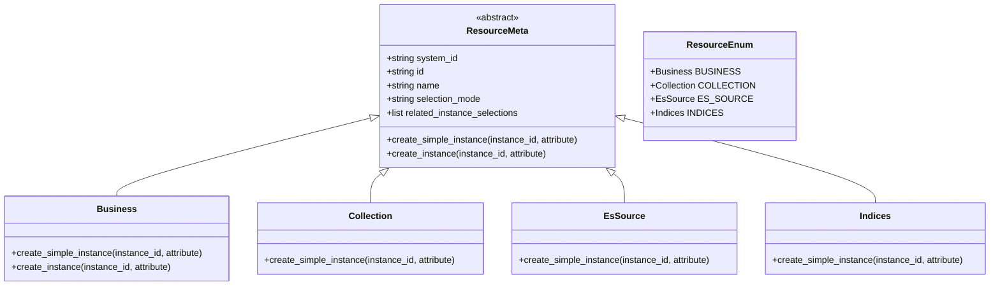

# 集成组件架构

<cite>
**本文档引用文件**   
- [cc.py](file://bklog/apps/api/modules/cc.py)
- [gse.py](file://bklog/apps/api/modules/gse.py)
- [job.py](file://bklog/apps/api/modules/job.py)
- [iam.py](file://bklog/apps/api/modules/iam.py)
- [base.py](file://bklog/apps/api/base.py)
- [drf.py](file://bklog/apps/iam/handlers/drf.py)
- [resources.py](file://bklog/apps/iam/handlers/resources.py)
- [actions.py](file://bklog/apps/iam/handlers/actions.py)
- [authentication.py](file://bklog/apps/grafana/authentication.py)
- [data_source.py](file://bklog/apps/grafana/data_source.py)
- [views.py](file://bklog/apps/grafana/views.py)
- [audit_record.py](file://bklog/apps/bk_log_admin/handlers/audit_record.py)
- [index_set.py](file://bklog/apps/bk_log_admin/handlers/index_set.py)
- [audit_record_views.py](file://bklog/apps/bk_log_admin/views/audit_record_views.py)
- [index_set_views.py](file://bklog/apps/bk_log_admin/views/index_set.py)
</cite>

## 目录
1. [简介](#简介)
2. [核心集成模块](#核心集成模块)
3. [认证与API调用机制](#认证与api调用机制)
4. [IAM权限系统实现](#iam权限系统实现)
5. [Grafana深度集成方案](#grafana深度集成方案)
6. [管理接口与审计功能](#管理接口与审计功能)
7. [最佳实践与性能优化](#最佳实践与性能优化)

## 简介
BK-LOG作为蓝鲸生态的重要组成部分，通过api/modules目录下的模块与蓝鲸CMDB、GSE、JOB、IAM等核心组件进行深度集成。本架构文档系统化描述了各集成组件的交互方式、权限控制机制和数据流设计，重点阐述了IAM权限系统的实现细节、Grafana的深度集成方案以及管理接口的功能特性。

## 核心集成模块

BK-LOG通过`api/modules`目录下的专用模块实现与蓝鲸生态及其他外部系统的集成。这些模块采用统一的`DataAPI`基类，封装了与各系统的API交互逻辑。


**模块来源**
- [cc.py](file://bklog/apps/api/modules/cc.py)
- [gse.py](file://bklog/apps/api/modules/gse.py)
- [job.py](file://bklog/apps/api/modules/job.py)
- [iam.py](file://bklog/apps/api/modules/iam.py)

## 认证与API调用机制

### 认证机制
BK-LOG采用蓝鲸标准的API网关认证机制，通过`get_request_api_headers`函数生成包含应用码、密钥和用户信息的认证头。所有API调用都通过`DataAPI`类进行封装，确保了统一的认证处理。


**认证来源**
- [base.py](file://bklog/apps/api/base.py#L64-L74)
- [cc.py](file://bklog/apps/api/modules/cc.py#L30-L35)

### API调用模式
API调用采用声明式设计模式，通过`DataAPI`类的实例化配置来定义API行为。每个API实例都包含方法、URL、描述、前置/后置处理函数等配置。

```python
self.get_app_list = DataAPI(
    method="POST",
    url=self._build_url("api/v3/biz/search/{bk_supplier_account}", "search_business/"),
    module=self.MODULE,
    description="查询业务列表",
    url_keys=["bk_supplier_account"],
    before_request=get_supplier_account_before,
    cache_time=60,
    use_superuser=True,
)
```

这种模式实现了API调用的标准化和可配置化，便于统一管理和维护。

**API调用来源**
- [base.py](file://bklog/apps/api/base.py#L191-L800)
- [cc.py](file://bklog/apps/api/modules/cc.py#L75-L317)

### 错误处理策略
系统实现了多层次的错误处理机制，包括网络超时重试、HTTP状态码处理和业务逻辑错误处理。`DataAPI`类通过`DataApiRetryClass`支持可配置的重试策略。


**错误处理来源**
- [base.py](file://bklog/apps/api/base.py#L108-L182)
- [base.py](file://bklog/apps/api/base.py#L367-L424)

## IAM权限系统实现

### 资源类型定义
IAM系统通过`ResourceEnum`枚举类定义了多种资源类型，每种资源类型都实现了`ResourceMeta`基类，包含系统ID、资源ID、名称和选择模式等属性。



**资源定义来源**
- [resources.py](file://bklog/apps/iam/handlers/resources.py#L34-L240)

### 操作权限控制
操作权限通过`ActionEnum`枚举类定义，每个操作都关联了相关的资源类型和前置操作。系统实现了细粒度的权限控制，包括业务访问、日志检索、采集管理等。


**操作权限来源**
- [actions.py](file://bklog/apps/iam/handlers/actions.py#L29-L291)

### DRF权限类集成
系统通过DRF权限类实现了与Django REST Framework的深度集成，提供了多种权限检查器，如`BusinessActionPermission`和`InstanceActionPermission`。


**DRF集成来源**
- [drf.py](file://bklog/apps/iam/handlers/drf.py#L41-L269)

## Grafana深度集成方案

### 数据源配置
BK-LOG通过`CustomIndexSetESDataSource`类实现了与Grafana的数据源集成，将日志索引集自动转换为Grafana可用的ES数据源。


**数据源来源**
- [data_source.py](file://bklog/apps/grafana/data_source.py#L46-L152)

### 仪表盘预置
系统通过`GrafanaProxyView`拦截Grafana的仪表盘请求，并对首页仪表盘进行动态修补，实现了预置仪表盘的功能。


**仪表盘来源**
- [views.py](file://bklog/apps/grafana/views.py#L67-L100)

### 权限同步机制
Grafana集成实现了与BK-LOG权限系统的同步，通过`GrafanaProxyView`的`get_request_headers`方法，在创建仪表盘或文件夹时检查用户的管理权限。

```python
def get_request_headers(self, request):
    headers = super().get_request_headers(request)
    
    is_dashboard_api = request.path.rstrip("/").endswith("/api/dashboards/db")
    is_folder_api = request.path.rstrip("/").endswith("/api/folders")
    
    if request.method == "POST" and (is_dashboard_api or is_folder_api):
        # 先判断是否有权限编辑
        has_manage_permission = Permission().is_allowed(
            action=ActionEnum.MANAGE_DASHBOARD,
            resources=[ResourceEnum.BUSINESS.create_instance(request.org_name)],
            raise_exception=True,
        )
        if has_manage_permission or request.user.is_superuser:
            headers["X-WEBAUTH-USER"] = "admin"
    
    return headers
```

**权限同步来源**
- [views.py](file://bklog/apps/grafana/views.py#L67-L84)

## 管理接口与审计功能

### 审计日志管理
`bk_log_admin`模块提供了全面的审计日志管理功能，通过`AuditRecordHandler`和`AuditRecordViewSet`实现操作记录的查询和格式化。


**审计日志来源**
- [audit_record.py](file://bklog/apps/bk_log_admin/handlers/audit_record.py#L31-L48)
- [audit_record_views.py](file://bklog/apps/bk_log_admin/views/audit_record_views.py#L32-L85)

### 索引集管理
系统提供了索引集使用情况的统计分析功能，包括时间分布、用户分布和时长分布等维度的统计。


**索引集管理来源**
- [index_set.py](file://bklog/apps/bk_log_admin/handlers/index_set.py#L36-L164)
- [index_set_views.py](file://bklog/apps/bk_log_admin/views/index_set.py#L34-L200)

## 最佳实践与性能优化

### 跨系统调用最佳实践
1. **统一API封装**：使用`DataAPI`类封装所有外部系统调用，确保一致的错误处理和日志记录。
2. **缓存策略**：对频繁查询但变化不频繁的数据（如业务列表）使用缓存，减少对后端系统的压力。
3. **批量操作**：对于需要处理大量数据的场景，使用`batch_request`和`bulk_request`方法进行批量操作。

### 性能优化技巧
1. **并发处理**：利用`ThreadPool`实现并发请求，提高批量操作的效率。
2. **连接复用**：通过`requests.session()`复用HTTP连接，减少连接建立的开销。
3. **数据裁剪**：在日志记录中限制请求参数和响应数据的长度，避免日志文件过大。


**性能优化来源**
- [base.py](file://bklog/apps/api/base.py#L632-L741)
- [base.py](file://bklog/apps/api/base.py#L517-L520)