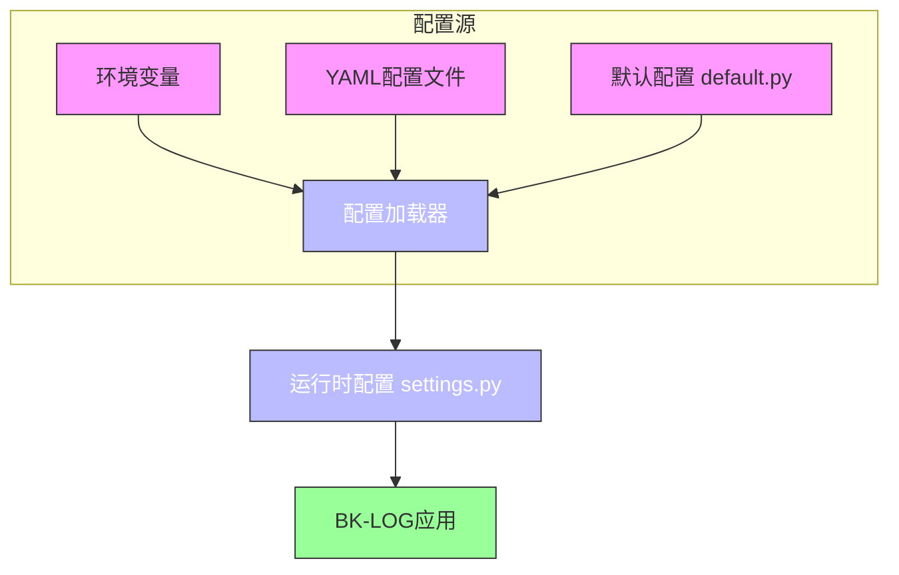
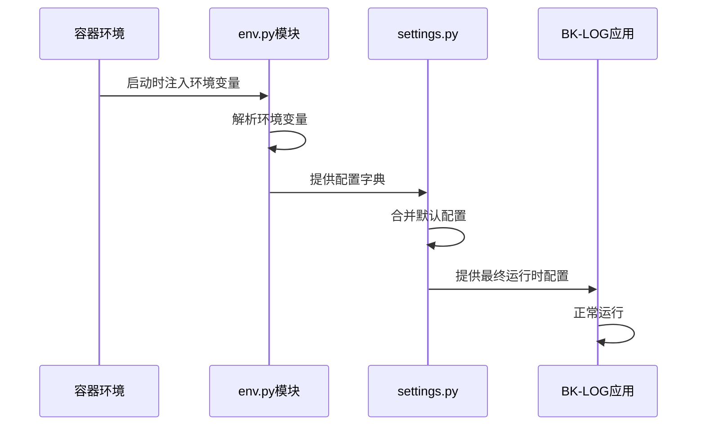
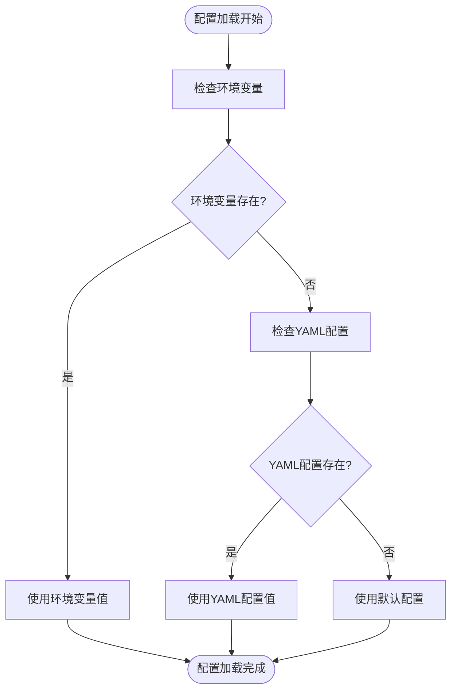

# 运行时配置

<cite>
**本文档引用的文件**  
- [settings.py](file://bklog/settings.py)
- [config/default.py](file://bklog/config/default.py)
- [config/env.py](file://bklog/config/env.py)
- [Dockerfile](file://bklog/Dockerfile)
- [dev.env.yml](file://bklog/dev.env.yml)
- [stag.env.yml](file://bklog/stag.env.yml)
- [prod.env.yml](file://bklog/prod.env.yml)
- [bk_dataview/grafana/settings.py](file://bklog/bk_dataview/grafana/settings.py)
</cite>

## 目录
1. [引言](#引言)
2. [配置架构概览](#配置架构概览)
3. [环境变量与Django设置的协同机制](#环境变量与django设置的协同机制)
4. [配置加载优先级与合并策略](#配置加载优先级与合并策略)
5. [关键环境变量说明](#关键环境变量说明)
6. [配置文件挂载方式](#配置文件挂载方式)
7. [docker-compose配置示例](#docker-compose配置示例)
8. [敏感信息管理最佳实践](#敏感信息管理最佳实践)
9. [配置热更新机制与限制](#配置热更新机制与限制)
10. [总结](#总结)

## 引言
BK-LOG作为容器化部署的日志管理系统，其运行时配置机制设计复杂且关键。本文档深入分析BK-LOG在容器化环境下的配置管理体系，重点阐述环境变量与Django settings.py文件的协同工作原理，解析配置加载的优先级顺序和合并策略，并提供实际部署中的最佳实践指导。

## 配置架构概览
BK-LOG采用分层配置架构，结合Django框架的settings机制与容器化环境的环境变量管理。系统通过`config/env.py`文件读取环境变量，并将其注入到主`settings.py`配置中，实现运行时动态配置。不同环境（开发、预发布、生产）通过YAML环境文件（如`dev.env.yml`）进行差异化配置管理。



**图示来源**  
- [config/default.py](file://bklog/config/default.py)
- [config/env.py](file://bklog/config/env.py)
- [settings.py](file://bklog/settings.py)

**本节来源**  
- [config/default.py](file://bklog/config/default.py#L1-L50)
- [config/env.py](file://bklog/config/env.py#L1-L30)

## 环境变量与Django设置的协同机制
BK-LOG通过`config/env.py`模块实现环境变量与Django settings.py的桥接。该模块使用`os.environ.get()`方法读取容器环境变量，并将这些值注入到主配置文件中。当Django应用启动时，`settings.py`会导入环境特定的配置，从而实现配置的动态注入。

环境变量的命名遵循`BKLOG_{MODULE}_{CONFIG}`的规范，例如`BKLOG_DATABASE_HOST`用于指定数据库主机地址。这种命名约定确保了配置的可读性和可维护性，同时避免了与其他服务的环境变量冲突。



**图示来源**  
- [config/env.py](file://bklog/config/env.py#L15-L60)
- [settings.py](file://bklog/settings.py#L20-L40)

**本节来源**  
- [config/env.py](file://bklog/config/env.py#L1-L80)
- [settings.py](file://bklog/settings.py#L1-L100)

## 配置加载优先级与合并策略
BK-LOG的配置系统采用明确的优先级顺序：环境变量 > YAML配置文件 > 默认配置。当同一配置项在多个源中存在时，高优先级的值会覆盖低优先级的值。

配置合并策略采用深度合并（deep merge）方式，对于嵌套的配置对象（如数据库配置、Redis配置），系统会递归合并各个层级的配置项，而不是简单地用一个完整的对象替换另一个。



**图示来源**  
- [config/env.py](file://bklog/config/env.py#L45-L90)
- [config/default.py](file://bklog/config/default.py#L10-L30)

**本节来源**  
- [config/env.py](file://bklog/config/env.py#L30-L100)
- [config/default.py](file://bklog/config/default.py#L1-L60)

## 关键环境变量说明
BK-LOG系统使用一系列关键环境变量来控制其运行时行为，主要包括：

| 环境变量 | 用途 | 示例值 | 默认值 |
|---------|------|-------|-------|
| `BKLOG_DATABASE_HOST` | 数据库主机地址 | `mysql-bklog` | `localhost` |
| `BKLOG_DATABASE_PORT` | 数据库端口 | `3306` | `3306` |
| `BKLOG_REDIS_HOST` | Redis主机地址 | `redis-bklog` | `localhost` |
| `BKLOG_ES_HOSTS` | ES集群地址（逗号分隔） | `es-node1:9200,es-node2:9200` | `localhost:9200` |
| `BKLOG_DEBUG` | 调试模式开关 | `True` | `False` |
| `BKLOG_SECRET_KEY` | Django安全密钥 | 随机字符串 | 无（必须提供） |

这些环境变量在容器启动时通过`docker-compose.yml`文件的`environment`部分或`env_file`指令注入。

**本节来源**  
- [config/env.py](file://bklog/config/env.py#L20-L80)
- [dev.env.yml](file://bklog/dev.env.yml#L1-L20)

## 配置文件挂载方式
在容器化部署中，BK-LOG支持通过volume将外部配置文件挂载到容器内部。典型的挂载方式包括：

1. **环境变量文件挂载**：将`.env.yml`文件挂载到容器的`/etc/bklog/env.yml`路径
2. **自定义配置挂载**：将特定的配置文件（如`grafana.ini`）挂载到对应服务的配置目录
3. **证书文件挂载**：将SSL证书等安全文件挂载到`/etc/ssl/bklog/`目录

这种挂载机制允许在不重建镜像的情况下更新配置，提高了部署的灵活性。

```mermaid
graph TB
subgraph "宿主机"
A[本地配置文件]
B[本地证书目录]
end
subgraph "Docker容器"
C[/etc/bklog/env.yml]
D[/etc/ssl/bklog/]
E[应用代码]
end
A --> C
B --> D
style A fill:#f96,stroke:#333
style B fill:#f96,stroke:#333
style C fill:#69f,stroke:#333
style D fill:#69f,stroke:#333
style E fill:#9f9,stroke:#333
```

**图示来源**  
- [Dockerfile](file://bklog/Dockerfile#L10-L20)
- [prod.env.yml](file://bklog/prod.env.yml#L5-L15)

**本节来源**  
- [Dockerfile](file://bklog/Dockerfile#L1-L50)
- [prod.env.yml](file://bklog/prod.env.yml#L1-L30)

## docker-compose配置示例
以下是一个典型的BK-LOG多容器环境的`docker-compose.yml`配置示例：

```yaml
version: '3.8'
services:
  bklog-api:
    image: bklog/api:latest
    environment:
      - BKLOG_DATABASE_HOST=mysql-bklog
      - BKLOG_REDIS_HOST=redis-bklog
      - BKLOG_ES_HOSTS=es-node1:9200,es-node2:9200
    env_file:
      - ./prod.env.yml
    volumes:
      - ./config/custom_settings.py:/app/config/custom_settings.py
    depends_on:
      - mysql-bklog
      - redis-bklog
      - elasticsearch
  
  mysql-bklog:
    image: mysql:5.7
    environment:
      - MYSQL_ROOT_PASSWORD=rootpass
    
  redis-bklog:
    image: redis:6.0-alpine
    
  elasticsearch:
    image: elasticsearch:7.10.0
    environment:
      - discovery.type=single-node
```

该配置展示了如何通过`environment`直接设置变量，通过`env_file`引入配置文件，以及通过`volumes`挂载自定义配置。

**本节来源**  
- [dev.env.yml](file://bklog/dev.env.yml)
- [prod.env.yml](file://bklog/prod.env.yml)
- [stag.env.yml](file://bklog/stag.env.yml)

## 敏感信息管理最佳实践
对于敏感信息（如数据库密码、API密钥），BK-LOG推荐以下最佳实践：

1. **使用Docker Secrets**：在Swarm模式下，使用Docker Secrets管理敏感数据
2. **外部配置中心**：集成Consul、Vault等外部配置中心，实现集中化安全管理
3. **环境隔离**：确保生产环境的敏感配置不与开发环境共享
4. **加密存储**：对存储在YAML文件中的敏感信息进行加密处理
5. **最小权限原则**：为每个服务配置最小必要的访问权限

不建议将敏感信息明文存储在版本控制系统中，而应通过安全的CI/CD管道注入。

**本节来源**  
- [config/env.py](file://bklog/config/env.py#L50-L70)
- [settings.py](file://bklog/settings.py#L30-L50)

## 配置热更新机制与限制
BK-LOG的配置热更新机制依赖于Django应用的重启策略。由于Django在启动时加载配置，大多数配置更改需要重启应用才能生效。

然而，部分配置（如通过Consul等外部配置中心管理的配置）可以实现真正的热更新。系统通过定期轮询或监听机制获取最新配置，并动态更新运行时状态。

配置热更新的主要限制包括：
- Django核心配置（如数据库连接）无法热更新
- 需要应用层支持配置监听机制
- 可能存在短暂的配置不一致窗口
- 需要处理配置变更的原子性和事务性

**本节来源**  
- [config/env.py](file://bklog/config/env.py#L80-L100)
- [utils/consul.py](file://bklog/utils/consul.py#L1-L20)

## 总结
BK-LOG的运行时配置体系通过环境变量、YAML文件和默认配置的有机结合，实现了灵活且可靠的配置管理。通过合理的配置分层和优先级设计，系统能够在不同环境中保持一致的行为，同时允许必要的差异化配置。建议在生产环境中采用外部配置中心和Docker Secrets等安全机制，确保敏感信息的安全管理。