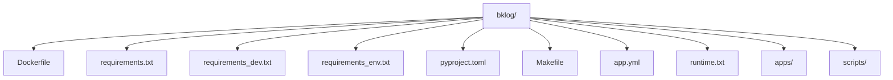
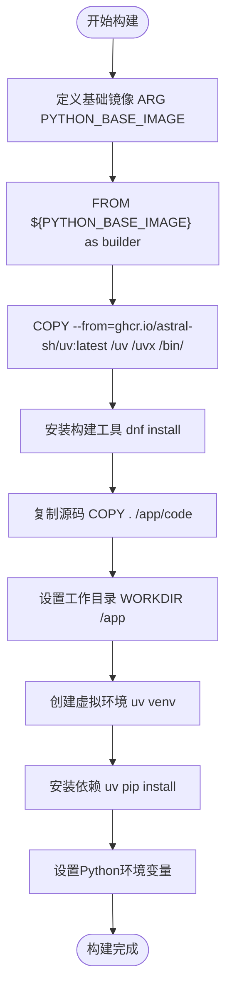
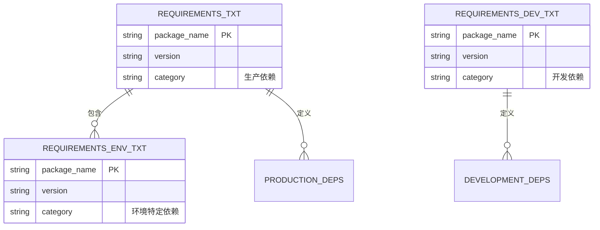
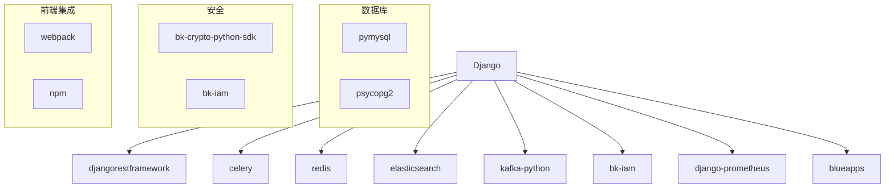

# 镜像构建

<cite>
**本文档中引用的文件**  
- [Dockerfile](file://bklog/Dockerfile)
- [requirements.txt](file://bklog/requirements.txt)
- [requirements_dev.txt](file://bklog/requirements_dev.txt)
- [pyproject.toml](file://pyproject.toml)
- [app.yml](file://bklog/app.yml)
- [Makefile](file://bklog/Makefile)
- [runtime.txt](file://bklog/runtime.txt)
- [requirements_env.txt](file://bklog/requirements_env.txt)
</cite>

## 目录
1. [简介](#简介)
2. [项目结构](#项目结构)
3. [核心组件](#核心组件)
4. [架构概述](#架构概述)
5. [详细组件分析](#详细组件分析)
6. [依赖分析](#依赖分析)
7. [性能考虑](#性能考虑)
8. [故障排除指南](#故障排除指南)
9. [结论](#结论)

## 简介
本文档详细描述了BK-LOG系统的Docker镜像构建流程。文档重点分析了多阶段构建策略、基础镜像选择、依赖管理、构建上下文优化、构建参数使用、安全加固措施以及分层策略对构建速度和镜像大小的优化。

## 项目结构
BK-LOG系统位于`bklog/`目录下，其主要结构包括应用代码、配置文件、静态资源和构建脚本。核心构建文件包括Dockerfile、requirements.txt系列文件、pyproject.toml和Makefile。

**Diagram sources**
- [Dockerfile](file://bklog/Dockerfile)
- [requirements.txt](file://bklog/requirements.txt)
- [pyproject.toml](file://pyproject.toml)

**Section sources**
- [Dockerfile](file://bklog/Dockerfile)
- [requirements.txt](file://bklog/requirements.txt)
- [pyproject.toml](file://pyproject.toml)

## 核心组件
镜像构建的核心组件包括Dockerfile中的多阶段构建流程、依赖管理文件和构建配置。Dockerfile使用了`ARG`指令定义可变基础镜像，通过`uv`工具进行依赖安装，并设置了Python虚拟环境。

**Section sources**
- [Dockerfile](file://bklog/Dockerfile)
- [requirements.txt](file://bklog/requirements.txt)
- [runtime.txt](file://bklog/runtime.txt)

## 架构概述
BK-LOG系统的镜像构建采用多阶段构建策略，第一阶段为构建器阶段，负责依赖安装和环境准备。构建过程使用了TencentOS作为基础镜像，通过`uv`包管理器高效安装Python依赖。

**Diagram sources**
- [Dockerfile](file://bklog/Dockerfile)
- [requirements.txt](file://bklog/requirements.txt)

## 详细组件分析

### 多阶段构建分析
BK-LOG系统的Dockerfile采用了多阶段构建策略，通过`as builder`命名构建阶段，实现了构建环境与运行环境的分离。

#### 构建流程分析：

**Diagram sources**
- [Dockerfile](file://bklog/Dockerfile)

**Section sources**
- [Dockerfile](file://bklog/Dockerfile)

### 依赖管理分析
系统通过多个requirements文件实现了生产环境和开发环境依赖的分离管理。

#### 依赖文件关系：

**Diagram sources**
- [requirements.txt](file://bklog/requirements.txt)
- [requirements_dev.txt](file://bklog/requirements_dev.txt)
- [requirements_env.txt](file://bklog/requirements_env.txt)

**Section sources**
- [requirements.txt](file://bklog/requirements.txt)
- [requirements_dev.txt](file://bklog/requirements_dev.txt)

## 依赖分析
BK-LOG系统的依赖关系复杂，涵盖了Web框架、数据库连接、消息队列、监控等多个方面。通过requirements.txt文件中的分类注释，可以清晰地看到不同功能模块的依赖。

**Diagram sources**
- [requirements.txt](file://bklog/requirements.txt)
- [pyproject.toml](file://pyproject.toml)

**Section sources**
- [requirements.txt](file://bklog/requirements.txt)
- [pyproject.toml](file://pyproject.toml)

## 性能考虑
在镜像构建过程中，通过使用`uv`包管理器和`--no-cache-dir`选项，优化了依赖安装速度。同时，通过多阶段构建和合理的层顺序，最大化利用了Docker的构建缓存机制。

**Section sources**
- [Dockerfile](file://bklog/Dockerfile)
- [Makefile](file://bklog/Makefile)

## 故障排除指南
当镜像构建出现问题时，可以检查以下方面：
1. 基础镜像是否可访问
2. 依赖源是否可用
3. 网络连接是否正常
4. 构建上下文是否完整

**Section sources**
- [Dockerfile](file://bklog/Dockerfile)
- [requirements.txt](file://bklog/requirements.txt)

## 结论
BK-LOG系统的镜像构建流程设计合理，采用了现代化的构建工具和最佳实践。通过多阶段构建、依赖分离管理和环境变量配置，实现了高效、安全和可维护的镜像构建过程。