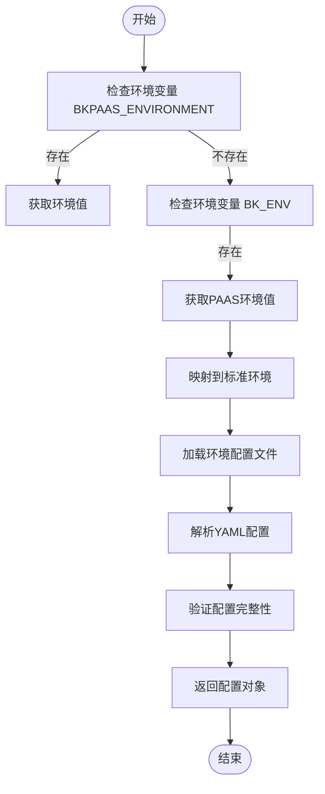

# 安全策略

<cite>
**本文档引用的文件**  
- [env.py](file://bklog/config/env.py)
- [dev.py](file://bklog/config/dev.py)
- [stag.py](file://bklog/config/stag.py)
- [prod.py](file://bklog/config/prod.py)
- [settings.py](file://bklog/settings.py)
- [#etc#supervisor-bklog-api.conf](file://bklog/support-files/templates/#etc#supervisor-bklog-api.conf)
- [api#bin#environ.sh](file://bklog/support-files/templates/api#bin#environ.sh)
- [#etc#supervisor-bklog-grafana.conf](file://bklog/support-files/templates/#etc#supervisor-bklog-grafana.conf)
- [grafana#conf#grafana.ini](file://bklog/support-files/templates/grafana#conf#grafana.ini)
</cite>

## 目录
1. [引言](#引言)
2. [敏感配置管理机制](#敏感配置管理机制)
3. [环境变量处理机制](#环境变量处理机制)
4. [安全配置模板模式](#安全配置模板模式)
5. [配置文件权限管理策略](#配置文件权限管理策略)
6. [安全最佳实践指南](#安全最佳实践指南)
7. [配置变更管理](#配置变更管理)
8. [结论](#结论)

## 引言
BK-LOG系统作为蓝鲸日志平台的核心组件，其安全配置管理机制对于保障系统稳定运行和数据安全至关重要。本文档详细阐述了BK-LOG系统的安全策略，重点描述了敏感配置管理机制，包括环境变量处理、安全配置模板、权限管理等方面的内容。通过分析系统架构和实现细节，为系统管理员和开发人员提供全面的安全指导。

## 敏感配置管理机制
BK-LOG系统采用多层次的敏感配置管理机制，确保API密钥、数据库密码等机密信息与代码分离。系统通过env.py文件实现环境变量的动态加载和处理，将敏感信息存储在外部配置文件中，避免硬编码在源代码中。这种设计不仅提高了系统的安全性，还增强了配置的灵活性和可维护性。

系统通过YAML格式的环境配置文件（如dev.env.yml、stag.env.yml、prod.env.yml）来管理不同环境的敏感配置。这些文件包含数据库连接信息、API密钥、服务地址等敏感数据，通过环境变量进行注入，实现了配置与代码的完全分离。同时，系统支持配置的动态加载和热更新，确保在不重启服务的情况下能够应用新的配置。

**Section sources**
- [env.py](file://bklog/config/env.py#L73-L81)
- [settings.py](file://bklog/settings.py#L26-L37)

## 环境变量处理机制
env.py文件是BK-LOG系统环境变量处理的核心组件，负责加载和解析环境配置。系统首先根据BKPAAS_ENVIRONMENT或BK_ENV环境变量确定当前运行环境，然后加载相应的环境配置文件。这种机制支持多环境部署，确保开发、测试和生产环境使用不同的配置。

环境变量处理机制通过load_env()函数实现，该函数根据环境变量构建配置文件路径，并使用YAML解析器读取配置内容。配置文件中的敏感信息通过环境变量注入，确保了机密信息的安全性。系统还支持配置的格式化和动态替换，允许在配置中使用变量引用，提高了配置的灵活性。

**Diagram sources**
- [env.py](file://bklog/config/env.py#L27-L37)
- [env.py](file://bklog/config/env.py#L73-L81)

**Section sources**
- [env.py](file://bklog/config/env.py#L73-L81)

## 安全配置模板模式
BK-LOG系统采用模板实例化的方式实现敏感信息的安全注入，通过supervisor和environ.sh模板文件定义服务启动配置。这些模板文件包含占位符，如__BK_BKLOG_APP_SECRET__、__BK_PAAS_MYSQL_PASSWORD__等，在部署时由配置管理系统替换为实际的敏感值。

supervisor配置文件（如#etc#supervisor-bklog-api.conf）定义了服务的启动参数、日志路径、进程管理等配置。这些配置文件通过环境变量注入敏感信息，确保了配置的安全性。environ.sh脚本文件则负责设置运行时环境变量，包括数据库连接信息、API凭证、服务地址等。

**Diagram sources**
- [#etc#supervisor-bklog-api.conf](file://bklog/support-files/templates/#etc#supervisor-bklog-api.conf)
- [api#bin#environ.sh](file://bklog/support-files/templates/api#bin#environ.sh)

**Section sources**
- [#etc#supervisor-bklog-api.conf](file://bklog/support-files/templates/#etc#supervisor-bklog-api.conf)
- [api#bin#environ.sh](file://bklog/support-files/templates/api#bin#environ.sh)

## 配置文件权限管理策略
BK-LOG系统实施严格的配置文件权限管理策略，确保敏感配置文件的安全性。系统通过文件系统权限控制，限制对配置文件的访问，只有授权用户和进程才能读取和修改配置文件。同时，系统支持配置文件的加密存储，防止敏感信息在存储介质上被窃取。

审计日志功能记录了所有配置文件的访问和修改操作，包括操作时间、操作用户、操作类型等信息。这些日志可用于安全审计和故障排查，帮助管理员及时发现和响应安全事件。系统还支持配置文件的版本控制，确保配置变更的可追溯性。

**Section sources**
- [env.py](file://bklog/config/env.py#L77-L78)
- [prod.py](file://bklog/config/prod.py#L103-L117)

## 安全最佳实践指南
为确保BK-LOG系统的安全运行，建议遵循以下最佳实践：配置备份应定期执行，并存储在安全的位置，防止数据丢失。灾难恢复计划应包括配置文件的恢复流程，确保在系统故障时能够快速恢复服务。安全审计应定期检查配置文件的完整性和安全性，及时发现和修复潜在的安全漏洞。

建议使用配置管理系统来管理敏感配置，避免手动修改配置文件。配置管理系统应支持加密存储、访问控制和审计日志功能。同时，应定期轮换API密钥和密码，减少长期使用同一凭证带来的安全风险。

**Section sources**
- [env.py](file://bklog/config/env.py#L73-L81)
- [settings.py](file://bklog/settings.py#L26-L37)

## 配置变更管理
BK-LOG系统实施严格的配置变更审批流程，确保配置变更的安全性和可追溯性。所有配置变更必须经过审批流程，包括变更申请、风险评估、审批决策等环节。审批通过后，变更由授权人员执行，并记录在审计日志中。

版本控制策略用于管理配置文件的变更历史，确保每次变更都有记录。系统支持配置文件的差异比较，帮助管理员理解变更内容。配置变更应遵循最小权限原则，只允许必要的变更，减少潜在的安全风险。

**Section sources**
- [env.py](file://bklog/config/env.py#L73-L81)
- [settings.py](file://bklog/settings.py#L26-L37)

## 结论
BK-LOG系统的安全策略通过多层次的敏感配置管理机制，有效保障了系统的安全性和稳定性。环境变量处理机制、安全配置模板模式、权限管理策略和最佳实践指南共同构成了完整的安全体系。建议系统管理员和开发人员严格遵循本文档中的安全指导，确保系统的安全运行。