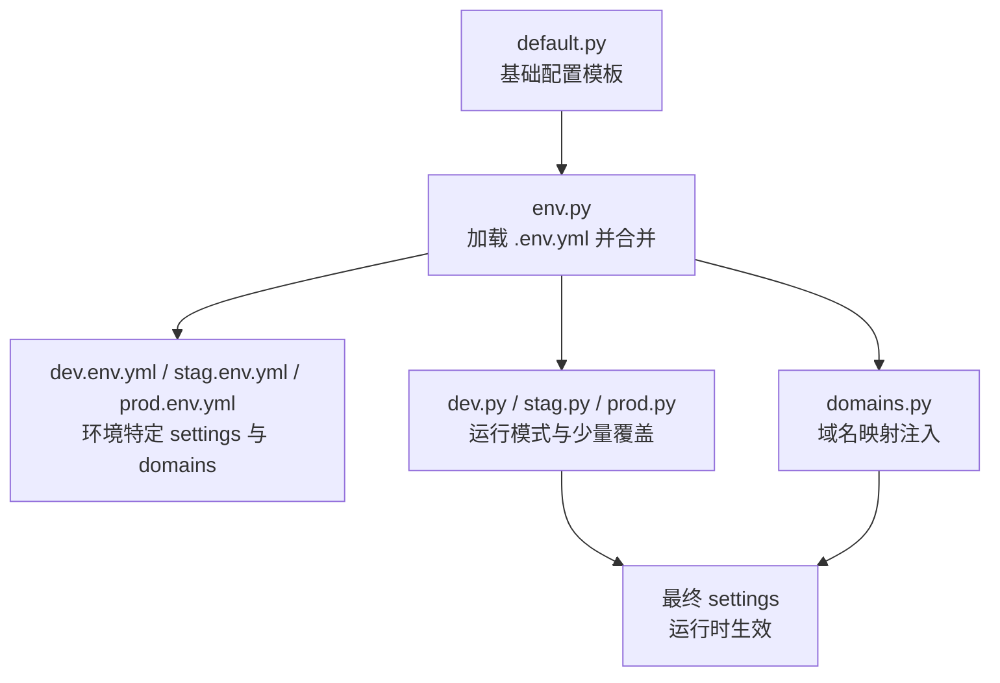
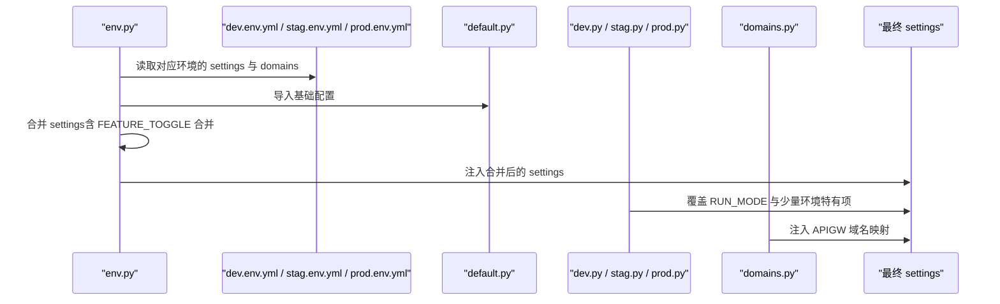
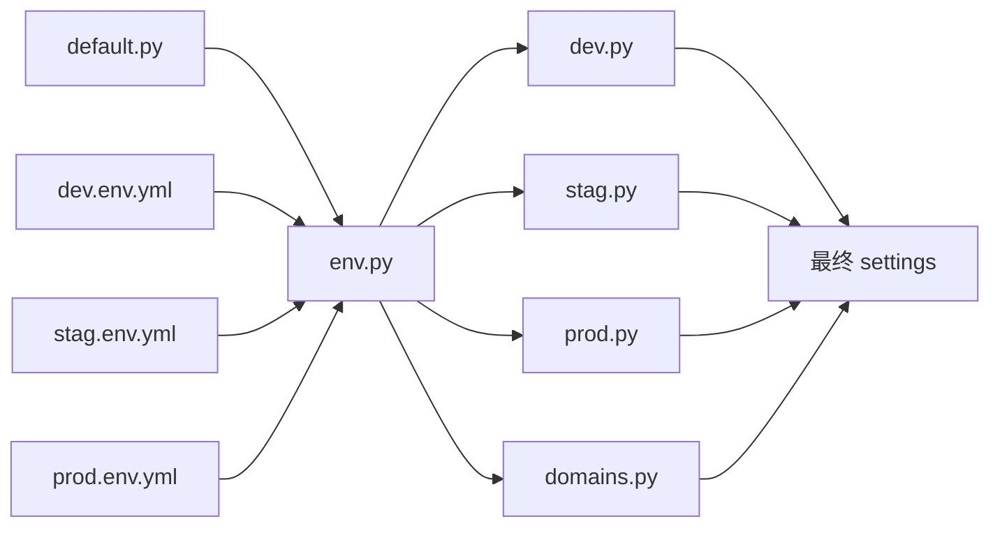

# 环境差异

<cite>
**本文引用的文件**
- [default.py](file://bklog/config/default.py)
- [dev.py](file://bklog/config/dev.py)
- [stag.py](file://bklog/config/stag.py)
- [prod.py](file://bklog/config/prod.py)
- [env.py](file://bklog/config/env.py)
- [domains.py](file://bklog/config/domains.py)
- [log.py](file://bklog/config/log.py)
- [dev.env.yml](file://bklog/dev.env.yml)
- [stag.env.yml](file://bklog/stag.env.yml)
- [prod.env.yml](file://bklog/prod.env.yml)
</cite>

## 目录
1. [简介](#简介)
2. [项目结构](#项目结构)
3. [核心组件](#核心组件)
4. [架构总览](#架构总览)
5. [详细组件分析](#详细组件分析)
6. [依赖关系分析](#依赖关系分析)
7. [性能考量](#性能考量)
8. [故障排查指南](#故障排查指南)
9. [结论](#结论)
10. [附录](#附录)

## 简介
本文件系统性梳理 BK-LOG 系统在开发、测试（预发布）、生产三类环境中的配置差异，重点围绕以下目标展开：
- 解析 dev.py 的开发环境特有配置（调试模式、本地数据库、测试服务端点、本地消息队列等）
- 对比 stag.py 的预发布环境配置（CORS 调整、日志级别、中间件扩展等）
- 深入解析 prod.py 的生产环境关键配置（安全加固、日志级别、数据库覆盖、部署模式差异等）
- 说明 default.py 作为基础配置模板的作用，以及各环境如何继承和覆盖默认值
- 提供环境迁移检查清单，明确配置转换时的关键差异点

## 项目结构
BK-LOG 的环境配置采用“基础模板 + 环境覆盖”的分层设计：
- default.py 定义通用默认配置（应用、中间件、日志、认证、特性开关、ES/Databus/Redis 等）
- env.py 负责从对应环境的 .env.yml 中加载 settings 与 domains，并与 default.py 合并
- dev.py/stag.py/prod.py 仅声明运行模式与少量差异化配置，其余由 env.py 动态注入
- domains.py 将 env.py 解析出的域名映射注入到 settings，便于 APIGW 等模块使用

图表来源
- [default.py](file://bklog/config/default.py#L1-L120)
- [env.py](file://bklog/config/env.py#L1-L112)
- [dev.env.yml](file://bklog/dev.env.yml#L1-L87)
- [stag.env.yml](file://bklog/stag.env.yml#L1-L87)
- [prod.env.yml](file://bklog/prod.env.yml#L1-L86)
- [dev.py](file://bklog/config/dev.py#L1-L112)
- [stag.py](file://bklog/config/stag.py#L1-L106)
- [prod.py](file://bklog/config/prod.py#L1-L121)
- [domains.py](file://bklog/config/domains.py#L1-L83)

章节来源
- [default.py](file://bklog/config/default.py#L1-L120)
- [env.py](file://bklog/config/env.py#L1-L112)
- [dev.env.yml](file://bklog/dev.env.yml#L1-L87)
- [stag.env.yml](file://bklog/stag.env.yml#L1-L87)
- [prod.env.yml](file://bklog/prod.env.yml#L1-L86)
- [dev.py](file://bklog/config/dev.py#L1-L112)
- [stag.py](file://bklog/config/stag.py#L1-L106)
- [prod.py](file://bklog/config/prod.py#L1-L121)
- [domains.py](file://bklog/config/domains.py#L1-L83)

## 核心组件
- 基础模板 default.py
  - 应用与中间件、日志、认证、特性开关、ES/Databus/Redis 等通用配置
  - 提供日志格式、OTLP/UDP 上报、Kubernetes 模式下的 JSON 日志结构
- 环境加载 env.py
  - 识别 BKPAAS_ENVIRONMENT 或 BK_ENV，定位对应 .env.yml
  - 将 settings 与 domains 通过字符串格式化注入到最终 settings
- 环境覆盖 dev.py/stag.py/prod.py
  - 仅声明 RUN_MODE 与少量差异化项（如 dev 的本地数据库、stag 的 CORS、prod 的 CSRF 与日志级别）
- 域名注入 domains.py
  - 将 APIGW 根域名映射注入到 settings，供各模块使用

章节来源
- [default.py](file://bklog/config/default.py#L1-L200)
- [env.py](file://bklog/config/env.py#L1-L112)
- [domains.py](file://bklog/config/domains.py#L1-L83)

## 架构总览
下图展示从 .env.yml 到最终 settings 的装配流程，以及各环境的差异化入口。

图表来源
- [env.py](file://bklog/config/env.py#L1-L112)
- [dev.env.yml](file://bklog/dev.env.yml#L1-L87)
- [stag.env.yml](file://bklog/stag.env.yml#L1-L87)
- [prod.env.yml](file://bklog/prod.env.yml#L1-L86)
- [default.py](file://bklog/config/default.py#L1-L200)
- [dev.py](file://bklog/config/dev.py#L1-L112)
- [stag.py](file://bklog/config/stag.py#L1-L106)
- [prod.py](file://bklog/config/prod.py#L1-L121)
- [domains.py](file://bklog/config/domains.py#L1-L83)

## 详细组件分析

### 开发环境（dev.py）差异点
- 运行模式与调试
  - RUN_MODE = "DEVELOP"
  - DEBUG = True
  - 静态资源 URL 指向本地 /static/
- 数据库与消息队列
  - 默认使用本地 MySQL（sqlite3 用于测试）
  - 消息队列可选 Redis 或 RabbitMQ（示例为 Redis）
- IAM 与 Grafana
  - 明确 IAM 内部域名与资源 API 域名
  - Grafana 配置包含 HOST/PREFIX/ADMIN/PROVISIONING_CLASSES/PERMISSION_CLASSES
- 环境注入
  - 通过 env.py 动态注入 settings 与 domains
  - 支持本地覆盖 local_settings.py（纳入忽略）

章节来源
- [dev.py](file://bklog/config/dev.py#L1-L112)
- [dev.env.yml](file://bklog/dev.env.yml#L1-L87)

### 预发布环境（stag.py）差异点
- 运行模式与 CORS
  - RUN_MODE = "STAGING"
  - CORS_ORIGIN_ALLOW_ALL = True
  - CORS_ALLOW_CREDENTIALS = True
  - 注入 CorsMiddleware 中间件
- 日志级别
  - LOG_LEVEL 可通过环境变量覆盖（默认 INFO）
- IAM 与 Grafana
  - 明确 IAM 内部域名与资源 API 域名
  - Grafana 配置包含 HOST/PREFIX/ADMIN/PROVISIONING_CLASSES/PERMISSION_CLASSES
- 环境注入
  - 通过 env.py 动态注入 settings 与 domains

章节来源
- [stag.py](file://bklog/config/stag.py#L1-L106)
- [stag.env.yml](file://bklog/stag.env.yml#L1-L87)

### 生产环境（prod.py）差异点
- 运行模式与安全
  - RUN_MODE = "PRODUCT"
  - CSRF_COOKIE_NAME 更名为更严格的名称
  - LOG_LEVEL 默认提升至 ERROR（可通过环境变量覆盖）
- 数据库覆盖（Kubernetes 部署模式）
  - 当 DEPLOY_MODE=kubernetes 时，显式覆盖 DATABASES（从环境变量读取）
  - 同时覆盖文档与监控等站点 URL
- IAM 与 Grafana
  - 明确 IAM 内部域名与资源 API 域名
  - Grafana 配置包含 HOST/PREFIX/ADMIN/PROVISIONING_CLASSES/PERMISSION_CLASSES
- 环境注入
  - 通过 env.py 动态注入 settings 与 domains

章节来源
- [prod.py](file://bklog/config/prod.py#L1-L121)
- [prod.env.yml](file://bklog/prod.env.yml#L1-L86)

### default.py 基础模板要点
- 应用与中间件
  - INSTALLED_APPS/MIDDLEWARE 包含蓝鲸生态与 BK-LOG 业务模块
  - 中间件链包含性能分析、HTTPS 强制、安全、国际化、APIGW 鉴权、审计等
- 日志与可观测性
  - 默认日志格式；Kubernetes 模式下使用 JSON 格式与 stdout 输出
  - 支持 OTLP/UDP 日志上报（可选）
- Celery 与任务路由
  - IS_USE_CELERY 控制是否启用 Celery
  - 导入大量业务任务模块
- 特性开关与菜单
  - FEATURE_TOGGLE 控制功能开关
  - MENUS 根据 FEATURE_TOGGLE 动态渲染
- Redis 与缓存
  - CACHES 支持单实例/哨兵模式，可按 USE_REDIS 切换
- APIGW 与域名
  - domains.py 从 env.py 注入 APIGW 根域名集合
- 其他
  - ES/Databus/BCS/提取/通知/多租户/预查询等大量配置项

章节来源
- [default.py](file://bklog/config/default.py#L1-L200)
- [default.py](file://bklog/config/default.py#L800-L1382)
- [log.py](file://bklog/config/log.py#L1-L157)
- [domains.py](file://bklog/config/domains.py#L1-L83)

### env.py 与 .env.yml 的合并机制
- 环境识别
  - 优先读取 BKPAAS_ENVIRONMENT（V3），否则回退 BK_ENV（V2）并映射为 dev/stag/prod
- 文件定位
  - 依据 ENVIRONMENT 选择 {ENVIRONMENT}.env.yml（或通过 BKAPP_ENV_FILE 指定）
- 合并策略
  - settings 字段支持字符串格式化（{settings}、{env}）
  - FEATURE_TOGGLE 与原 default.py 的字典进行合并
  - domains 字段同样支持格式化并注入到 settings

章节来源
- [env.py](file://bklog/config/env.py#L1-L112)
- [dev.env.yml](file://bklog/dev.env.yml#L1-L87)
- [stag.env.yml](file://bklog/stag.env.yml#L1-L87)
- [prod.env.yml](file://bklog/prod.env.yml#L1-L86)

### domains.py 的域名注入
- 从 env.py 返回的 domains 映射中，批量注入到当前 settings
- 覆盖范围包括 APIGW 根域名、节点管理、监控、BCS、AIOPS、数据流、资源中心、统一查询等

章节来源
- [domains.py](file://bklog/config/domains.py#L1-L83)

## 依赖关系分析
- default.py 为所有环境提供基础配置，dev/stag/prod 仅声明 RUN_MODE 与少量差异化项
- env.py 是环境配置的中枢：负责加载 .env.yml、合并 settings 与 domains，并与 default.py 合并
- domains.py 依赖 env.py 的返回结果，将 APIGW 域名注入到 settings
- dev.py/stag.py/prod.py 通过 env.py 的动态注入实现“最小覆盖”

图表来源
- [default.py](file://bklog/config/default.py#L1-L200)
- [env.py](file://bklog/config/env.py#L1-L112)
- [dev.env.yml](file://bklog/dev.env.yml#L1-L87)
- [stag.env.yml](file://bklog/stag.env.yml#L1-L87)
- [prod.env.yml](file://bklog/prod.env.yml#L1-L86)
- [domains.py](file://bklog/config/domains.py#L1-L83)
- [dev.py](file://bklog/config/dev.py#L1-L112)
- [stag.py](file://bklog/config/stag.py#L1-L106)
- [prod.py](file://bklog/config/prod.py#L1-L121)

## 性能考量
- 日志级别
  - 开发：DEBUG = True，便于问题定位
  - 预发布：LOG_LEVEL 可调（默认 INFO）
  - 生产：LOG_LEVEL 默认 ERROR，降低 IO 压力
- Celery 并发
  - default.py 提供并发度配置（BK_CELERYD_CONCURRENCY），可在环境变量中调整
- 缓存与 Redis
  - default.py 支持单实例与哨兵模式，USE_REDIS 可按需启用
- Kubernetes 模式日志
  - default.py 在 K8S 模式下强制 JSON 日志与 stdout 输出，利于集中收集

章节来源
- [dev.py](file://bklog/config/dev.py#L1-L112)
- [stag.py](file://bklog/config/stag.py#L1-L106)
- [prod.py](file://bklog/config/prod.py#L1-L121)
- [default.py](file://bklog/config/default.py#L1-L200)
- [default.py](file://bklog/config/default.py#L800-L1382)
- [log.py](file://bklog/config/log.py#L1-L157)

## 故障排查指南
- 环境识别失败
  - 确认 BKPAAS_ENVIRONMENT 或 BK_ENV 是否正确设置
  - 确认是否存在对应 {ENVIRONMENT}.env.yml
- CORS 问题（预发布）
  - 若出现跨域错误，确认 CORS_ORIGIN_ALLOW_ALL/CORS_ALLOW_CREDENTIALS 与 CorsMiddleware 是否已注入
- CSRF 问题（生产）
  - 确认 CSRF_COOKIE_NAME 是否与前端一致
- 日志级别过高导致 IO 压力
  - 在生产环境适当提高 LOG_LEVEL（默认 ERROR）
- 数据库连接异常（K8S 生产）
  - 确认 DEPLOY_MODE=kubernetes 时 DATABASES 是否从环境变量读取
- APIGW 域名不可用
  - 检查 domains.py 是否成功注入 APIGW 根域名映射

章节来源
- [env.py](file://bklog/config/env.py#L1-L112)
- [stag.py](file://bklog/config/stag.py#L1-L106)
- [prod.py](file://bklog/config/prod.py#L1-L121)
- [domains.py](file://bklog/config/domains.py#L1-L83)

## 结论
- default.py 提供稳定、全面的基础配置，dev/stag/prod 仅承担“最小覆盖”
- env.py 与 .env.yml 的组合实现了“配置即代码”，便于版本化与自动化
- 各环境差异集中在：调试模式、CORS、日志级别、安全 Cookie 名称、数据库覆盖（K8S 生产）、域名映射等
- 建议在迁移时严格遵循“最小覆盖”原则，避免在 dev/stag/prod 中重复定义 default.py 已有的配置

## 附录

### 环境迁移检查清单
- 环境变量
  - 确认 BKPAAS_ENVIRONMENT 或 BK_ENV 设置正确
  - 确认对应 {ENVIRONMENT}.env.yml 存在且内容完整
- 运行模式
  - dev：RUN_MODE = "DEVELOP"，DEBUG = True
  - stag：RUN_MODE = "STAGING"，CORS_* 与 CorsMiddleware 已启用
  - prod：RUN_MODE = "PRODUCT"，CSRF_COOKIE_NAME 更名，LOG_LEVEL 默认 ERROR
- 数据库
  - dev：本地 MySQL（sqlite3 用于测试）
  - prod（K8S）：DATABASES 从环境变量读取（DB_NAME/DB_USERNAME/DB_PASSWORD/DB_HOST/DB_PORT）
- 日志
  - dev：DEBUG 与 INFO 级别
  - stag：LOG_LEVEL 可调（默认 INFO）
  - prod：LOG_LEVEL 默认 ERROR
- 中间件与安全
  - stag：CORS_* 与 CorsMiddleware
  - prod：CSRF_COOKIE_NAME 更名
- 域名映射
  - 确认 domains.py 成功注入 APIGW 根域名映射
- 特性开关
  - 检查 FEATURE_TOGGLE 是否按需合并
- 本地覆盖
  - dev 可使用 local_settings.py（纳入忽略）

章节来源
- [env.py](file://bklog/config/env.py#L1-L112)
- [dev.py](file://bklog/config/dev.py#L1-L112)
- [stag.py](file://bklog/config/stag.py#L1-L106)
- [prod.py](file://bklog/config/prod.py#L1-L121)
- [domains.py](file://bklog/config/domains.py#L1-L83)
- [dev.env.yml](file://bklog/dev.env.yml#L1-L87)
- [stag.env.yml](file://bklog/stag.env.yml#L1-L87)
- [prod.env.yml](file://bklog/prod.env.yml#L1-L86)