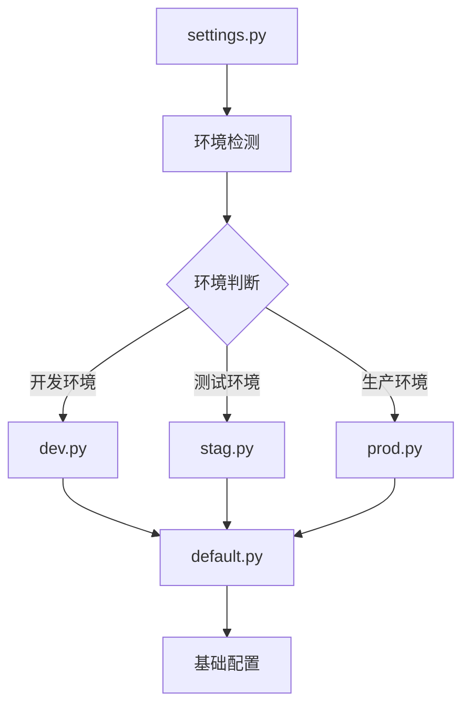
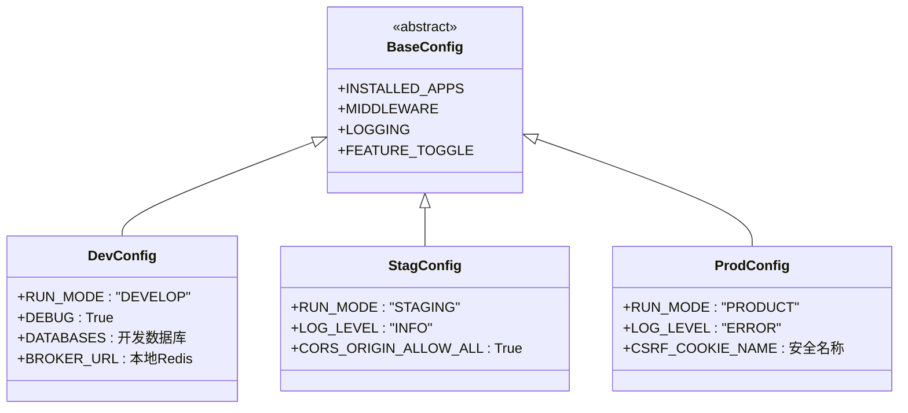
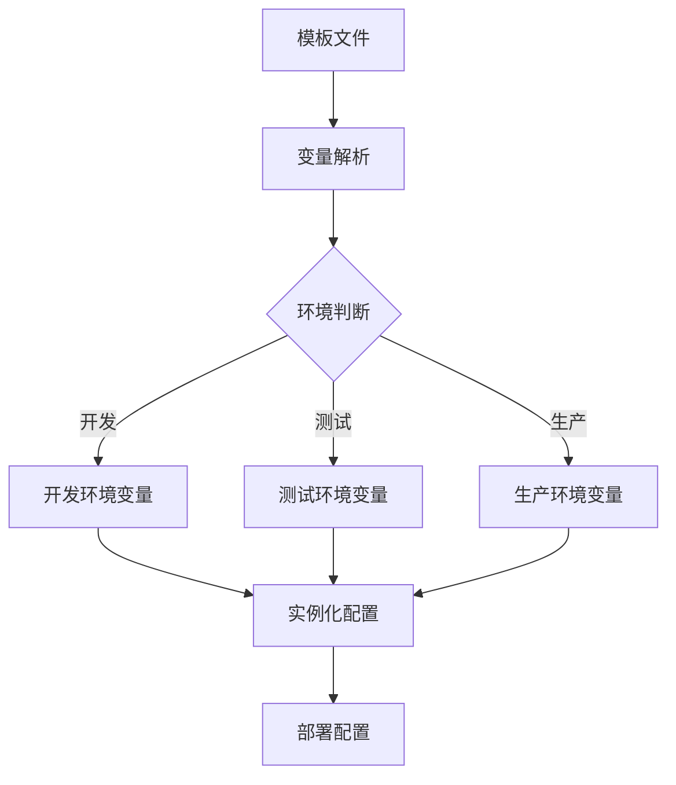

# 环境配置管理

<cite>
**本文档引用的文件**   
- [settings.py](file://bklog/settings.py)
- [config/default.py](file://bklog/config/default.py)
- [config/dev.py](file://bklog/config/dev.py)
- [config/stag.py](file://bklog/config/stag.py)
- [config/prod.py](file://bklog/config/prod.py)
- [config/env.py](file://bklog/config/env.py)
- [config/domains.py](file://bklog/config/domains.py)
- [support-files/templates/#etc#supervisor-bklog-api.conf](file://bklog/support-files/templates/#etc#supervisor-bklog-api.conf)
- [support-files/templates/api#bin#environ.sh](file://bklog/support-files/templates/api#bin#environ.sh)
</cite>

## 目录
1. [配置架构概述](#配置架构概述)
2. [核心配置文件分析](#核心配置文件分析)
3. [环境配置继承机制](#环境配置继承机制)
4. [各环境配置详解](#各环境配置详解)
5. [模板文件与配置生成](#模板文件与配置生成)
6. [敏感信息管理方案](#敏感信息管理方案)
7. [配置迁移指南](#配置迁移指南)

## 配置架构概述

BK-LOG系统的环境配置管理采用分层继承架构，通过主配置文件(settings.py)动态加载不同环境的特定配置。系统根据环境变量BKPAAS_ENVIRONMENT或BK_ENV确定当前运行环境，并加载相应的配置模块。这种设计实现了配置的集中管理和环境差异化，确保了开发、测试和生产环境的一致性与安全性。

**图示来源**
- [settings.py](file://bklog/settings.py#L24-L47)
- [config/default.py](file://bklog/config/default.py#L1-L800)

## 核心配置文件分析

### settings.py 配置入口

settings.py作为系统配置的入口文件，负责环境检测和配置模块的动态加载。文件通过检查BKPAAS_ENVIRONMENT或BK_ENV环境变量来确定当前运行环境，并构建相应的配置模块路径。系统使用Python的import机制动态导入环境特定的配置模块，并将其中的大写变量导入到全局命名空间。

**配置加载流程：**
1. 检测环境变量BKPAAS_ENVIRONMENT或BK_ENV
2. 确定运行环境(dev/stag/prod)
3. 构建配置模块路径config.{env}
4. 动态导入配置模块
5. 将模块中的大写变量导入全局命名空间

**关键配置参数：**
- ENVIRONMENT: 运行环境标识
- DJANGO_CONF_MODULE: 配置模块路径
- _module: 动态导入的配置模块对象

**配置文件来源**
- [settings.py](file://bklog/settings.py#L24-L47)

### default.py 基础配置

default.py文件包含系统的默认配置，为所有环境提供基础配置值。该文件定义了应用程序的基本设置，包括安装的应用列表(INSTALLED_APPS)、中间件配置(MIDDLEWARE)、日志配置、静态资源设置等。这些配置作为所有环境的基线，可被特定环境的配置文件覆盖。

**主要配置类别：**
- 应用配置：INSTALLED_APPS扩展
- 中间件配置：MIDDLEWARE定义
- 日志配置：LOGGING字典
- 静态资源：STATIC_VERSION等
- 功能开关：FEATURE_TOGGLE

**配置文件来源**
- [config/default.py](file://bklog/config/default.py#L1-L800)

## 环境配置继承机制

BK-LOG系统采用基于Python模块导入的配置继承机制，实现了配置的层次化管理。这种机制允许基础配置被特定环境配置覆盖，同时保持配置结构的一致性。

### 配置继承原理

系统通过动态导入机制实现配置继承。settings.py文件根据环境变量确定要加载的配置模块，如config.dev、config.stag或config.prod。这些环境特定的配置文件首先导入基础配置，然后根据需要覆盖或添加特定配置。

**图示来源**
- [config/dev.py](file://bklog/config/dev.py#L1-L112)
- [config/stag.py](file://bklog/config/stag.py#L1-L106)
- [config/prod.py](file://bklog/config/prod.py#L1-L121)

### 配置覆盖规则

配置覆盖遵循Python变量作用域规则，后定义的同名变量会覆盖先定义的变量。环境配置文件通过重新定义特定变量来实现配置覆盖，同时保留未覆盖的基础配置。

**覆盖优先级：**
1. 环境特定配置文件(dev.py/stag.py/prod.py)
2. default.py基础配置
3. Django默认配置

**配置文件来源**
- [settings.py](file://bklog/settings.py#L37-L47)
- [config/default.py](file://bklog/config/default.py#L1-L800)

## 各环境配置详解

### 开发环境配置 (dev.py)

开发环境配置针对本地开发需求进行了优化，提供了便利的开发工具和宽松的安全设置。

**关键配置参数：**
- RUN_MODE: "DEVELOP" - 标识开发环境
- DEBUG: True - 启用调试模式
- DATABASES: 本地MySQL数据库连接
- BROKER_URL: 本地Redis消息队列
- STATIC_URL: "/static/" - 静态资源路径

**开发环境特性：**
- 启用调试模式，便于问题排查
- 使用本地数据库，便于数据操作
- 配置本地消息队列，简化依赖
- 允许从local_settings.py加载本地覆盖配置

**配置文件来源**
- [config/dev.py](file://bklog/config/dev.py#L1-L112)

### 测试环境配置 (stag.py)

测试环境配置平衡了开发便利性和生产安全性，适用于预发布测试。

**关键配置参数：**
- RUN_MODE: "STAGING" - 标识测试环境
- LOG_LEVEL: "INFO" - 信息级别日志
- CORS_ORIGIN_ALLOW_ALL: True - 允许所有跨域请求
- CORS_ALLOW_CREDENTIALS: True - 允许凭据跨域

**测试环境特性：**
- 适度的日志级别，便于问题追踪
- 开放的CORS策略，支持多源测试
- 继承基础安全配置
- 支持环境特定设置加载

**配置文件来源**
- [config/stag.py](file://bklog/config/stag.py#L1-L106)

### 生产环境配置 (prod.py)

生产环境配置强调安全性和稳定性，适用于正式上线运行。

**关键配置参数：**
- RUN_MODE: "PRODUCT" - 标识生产环境
- LOG_LEVEL: "ERROR" - 错误级别日志
- CSRF_COOKIE_NAME: 安全的CSRF Cookie名称
- DATABASES: 从环境变量加载数据库配置

**生产环境特性：**
- 严格的日志级别，减少日志开销
- 增强的CSRF保护
- 从环境变量加载敏感配置
- Kubernetes部署模式下的数据库配置

**配置文件来源**
- [config/prod.py](file://bklog/config/prod.py#L1-L121)

## 模板文件与配置生成

### 配置模板机制

BK-LOG系统使用模板文件生成实际配置，通过变量替换实现配置的动态化。模板文件存储在support-files/templates目录中，包含占位符，部署时根据环境变量进行实例化。

**模板文件示例：**
- #etc#supervisor-bklog-api.conf: Supervisor进程管理配置
- api#bin#environ.sh: 环境变量配置脚本

**图示来源**
- [support-files/templates/#etc#supervisor-bklog-api.conf](file://bklog/support-files/templates/#etc#supervisor-bklog-api.conf)
- [support-files/templates/api#bin#environ.sh](file://bklog/support-files/templates/api#bin#environ.sh)

### env.py 配置加载器

env.py文件实现了复杂的配置加载逻辑，支持YAML格式的环境配置文件和动态变量替换。

**主要功能：**
- 环境检测和配置文件定位
- YAML配置文件解析
- 动态变量格式化
- 特殊配置项处理(如FEATURE_TOGGLE)

**配置加载流程：**
1. 检测运行环境
2. 定位环境特定的YAML配置文件
3. 解析YAML内容
4. 执行变量格式化替换
5. 返回处理后的配置

**配置文件来源**
- [config/env.py](file://bklog/config/env.py#L1-L112)

## 敏感信息管理方案

### 敏感信息保护机制

BK-LOG系统采用多层次的敏感信息保护机制，确保API密钥、数据库密码等机密数据的安全。

**保护策略：**
- 环境变量存储：敏感信息通过环境变量传递
- 配置文件隔离：敏感配置不存储在代码库中
- 动态加载：运行时从安全源加载敏感信息
- 权限控制：限制敏感信息的访问权限

**敏感信息类型：**
- 数据库凭证(DB_USERNAME, DB_PASSWORD)
- API密钥(BKPAAS_BK_CRYPTO_KEY)
- 服务令牌(BKAPP_OTLP_BK_DATA_TOKEN)
- 认证密钥(BKAPP_BKDATA_DATA_TOKEN)

**配置文件来源**
- [config/prod.py](file://bklog/config/prod.py#L109-L115)
- [config/default.py](file://bklog/config/default.py#L238-L259)

### 安全配置实践

系统遵循安全配置最佳实践，通过多种机制保障配置安全。

**安全措施：**
- 环境隔离：不同环境使用不同的配置
- 最小权限原则：仅授予必要的配置访问权限
- 加密存储：敏感信息加密存储
- 审计跟踪：配置变更记录和审计

**配置文件来源**
- [config/prod.py](file://bklog/config/prod.py#L38-L40)
- [config/default.py](file://bklog/config/default.py#L469-L470)

## 配置迁移指南

### 版本升级兼容性

在系统版本升级时，需要特别注意配置的兼容性处理，确保平滑迁移。

**兼容性处理原则：**
- 保留旧配置的向后兼容性
- 提供配置转换工具
- 文档化配置变更
- 逐步弃用旧配置项

**迁移步骤：**
1. 备份现有配置
2. 分析新版本配置变更
3. 更新配置文件
4. 测试配置有效性
5. 部署更新后的配置

### 配置变更管理

建立规范的配置变更管理流程，确保配置变更的安全性和可追溯性。

**变更流程：**
- 变更申请：提交配置变更请求
- 影响评估：评估变更的影响范围
- 测试验证：在测试环境验证变更
- 审批发布：获得批准后发布变更
- 回滚预案：准备变更失败的回滚方案

**配置文件来源**
- [settings.py](file://bklog/settings.py#L19-L21)
- [config/default.py](file://bklog/config/default.py#L18-L20)