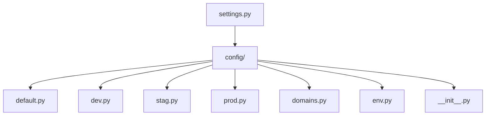
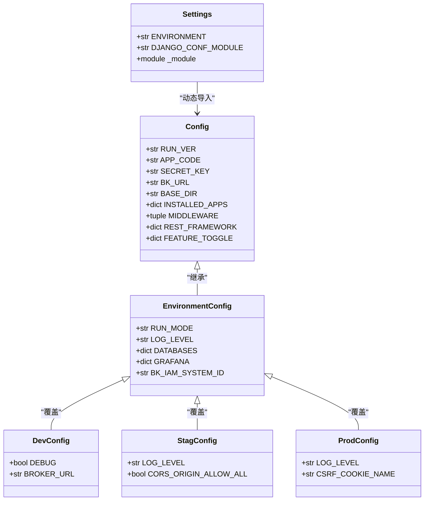
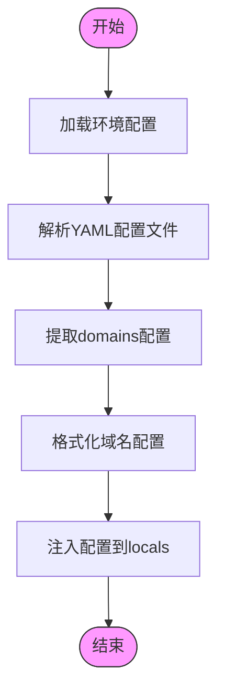
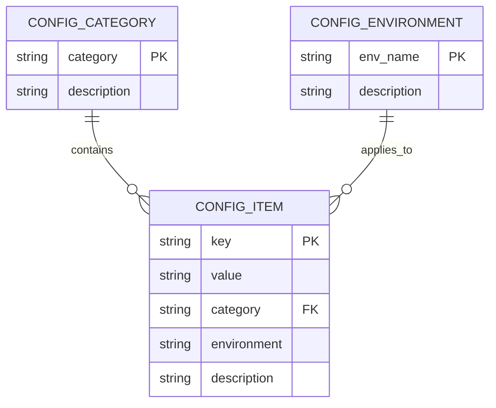

# 配置架构

<cite>
**本文档引用的文件**
- [settings.py](file://bklog/settings.py)
- [config/default.py](file://bklog/config/default.py)
- [config/dev.py](file://bklog/config/dev.py)
- [config/stag.py](file://bklog/config/stag.py)
- [config/prod.py](file://bklog/config/prod.py)
- [config/domains.py](file://bklog/config/domains.py)
- [config/env.py](file://bklog/config/env.py)
- [config/__init__.py](file://bklog/config/__init__.py)
</cite>

## 目录
1. [项目结构](#项目结构)
2. [核心配置文件分析](#核心配置文件分析)
3. [Django配置继承与覆盖机制](#django配置继承与覆盖机制)
4. [多租户环境下的域名路由配置](#多租户环境下的域名路由配置)
5. [配置项分类体系](#配置项分类体系)
6. [配置调试指南](#配置调试指南)

## 项目结构

BK-LOG系统的配置体系结构采用模块化设计，主要配置文件位于`bklog/config/`目录下。系统通过`settings.py`作为主配置入口，实现了基础配置与环境特定配置的分离。

**图示来源**
- [settings.py](file://bklog/settings.py#L1-L47)
- [config/](file://bklog/config/)

**本节来源**
- [settings.py](file://bklog/settings.py#L1-L47)
- [config/](file://bklog/config/)

## 核心配置文件分析

`settings.py`作为BK-LOG系统的核心配置文件，承担着配置加载的中枢作用。该文件不直接包含具体配置项，而是通过动态导入机制加载环境特定的配置模块。

系统首先通过环境变量`BKPAAS_ENVIRONMENT`或`BK_ENV`确定当前运行环境（dev、stag或prod），然后构造相应的配置模块路径`config.{env}`，通过Python的`__import__`函数动态导入该模块，并将模块中的大写变量作为配置项加载到全局命名空间中。

这种设计模式实现了配置的动态加载和环境隔离，确保了不同环境使用相应的配置，同时保持了配置接口的一致性。

**本节来源**
- [settings.py](file://bklog/settings.py#L1-L47)
- [config/__init__.py](file://bklog/config/__init__.py#L1-L79)

## Django配置继承与覆盖机制

BK-LOG系统通过`config/__init__.py`和环境特定配置文件（dev.py、stag.py、prod.py）实现了Django配置的继承与覆盖机制。`config/__init__.py`文件定义了所有环境共享的基础配置，包括应用列表、中间件、认证后端等核心设置。

环境特定配置文件通过导入蓝鲸平台的补丁配置，继承了基础配置并根据环境需求进行覆盖。例如，开发环境（dev.py）设置了`DEBUG=True`和本地数据库连接，而生产环境（prod.py）则将日志级别设置为`ERROR`以提高安全性。

这种分层配置机制通过Python的`locals()`函数和模块导入机制实现，确保了配置的可维护性和环境适应性。`env.py`文件进一步提供了通过YAML文件加载环境特定设置的能力，支持更复杂的配置场景。

**图示来源**
- [settings.py](file://bklog/settings.py#L1-L47)
- [config/default.py](file://bklog/config/default.py#L1-L800)
- [config/dev.py](file://bklog/config/dev.py#L1-L112)
- [config/stag.py](file://bklog/config/stag.py#L1-L106)
- [config/prod.py](file://bklog/config/prod.py#L1-L121)

**本节来源**
- [config/default.py](file://bklog/config/default.py#L1-L800)
- [config/dev.py](file://bklog/config/dev.py#L1-L112)
- [config/stag.py](file://bklog/config/stag.py#L1-L106)
- [config/prod.py](file://bklog/config/prod.py#L1-L121)
- [config/env.py](file://bklog/config/env.py#L1-L112)

## 多租户环境下的域名路由配置

`domains.py`文件负责处理BK-LOG系统在多租户环境下的域名路由配置。该文件定义了`API_ROOTS`列表，包含了系统依赖的各个蓝鲸组件的API网关根地址配置项。

通过`load_domains`函数从环境配置中加载域名设置，并使用`locals()`函数将这些配置项动态注入到模块命名空间中。这种设计支持了多租户场景下不同租户可能使用不同域名的需求，通过环境变量或YAML配置文件即可灵活调整各个组件的访问地址。

配置项的加载优先级遵循环境特定配置覆盖基础配置的原则，确保了在不同部署环境中能够正确解析各个微服务的访问地址，为系统的分布式架构提供了基础支持。

**图示来源**
- [config/domains.py](file://bklog/config/domains.py#L1-L83)
- [config/env.py](file://bklog/config/env.py#L1-L112)

**本节来源**
- [config/domains.py](file://bklog/config/domains.py#L1-L83)
- [config/env.py](file://bklog/config/env.py#L1-L112)

## 配置项分类体系

BK-LOG系统的配置项按照功能维度进行了系统化分类，形成了清晰的配置管理体系。

### 数据库配置
系统通过`DATABASES`配置项管理数据库连接，支持不同环境使用不同的数据库实例。开发环境使用本地MySQL，而生产环境则从环境变量中读取数据库连接参数，提高了安全性。

### 缓存配置
通过`REDIS_VERSION`和`BROKER_URL`等配置项管理Redis缓存和Celery消息队列，支持不同环境使用不同的缓存实例。

### 消息队列配置
Celery相关配置包括`IS_USE_CELERY`、`CELERYD_CONCURRENCY`等，控制任务队列的行为和性能。

### 外部API集成配置
系统通过`API_ROOTS`系列配置项管理与蓝鲸平台其他组件（如CC、GSE、MONITOR等）的集成，确保微服务架构下的组件间通信。

### 安全与认证配置
包括`SECRET_KEY`、`BK_IAM_SYSTEM_ID`等安全相关配置，以及`AUTHENTICATION_BACKENDS`定义的认证后端。

### 功能开关配置
`FEATURE_TOGGLE`字典集中管理系统的各项功能开关，支持动态启用或禁用特定功能模块。

### 日志与监控配置
`LOG_LEVEL`、`SENTRY_DSN`等配置项控制日志输出级别和监控集成。

**图示来源**
- [config/default.py](file://bklog/config/default.py#L1-L800)
- [config/dev.py](file://bklog/config/dev.py#L1-L112)
- [config/stag.py](file://bklog/config/stag.py#L1-L106)
- [config/prod.py](file://bklog/config/prod.py#L1-L121)

**本节来源**
- [config/default.py](file://bklog/config/default.py#L1-L800)
- [config/dev.py](file://bklog/config/dev.py#L1-L112)
- [config/stag.py](file://bklog/config/stag.py#L1-L106)
- [config/prod.py](file://bklog/config/prod.py#L1-L121)

## 配置调试指南

为确保配置加载的正确性并诊断配置相关问题，建议遵循以下调试步骤：

1. **验证环境变量**：检查`BKPAAS_ENVIRONMENT`或`BK_ENV`环境变量是否正确设置，这决定了系统加载哪个环境的配置文件。

2. **检查配置加载**：确认`settings.py`能够成功导入对应的环境配置模块（如`config.dev`），可通过查看应用启动日志中的导入错误来诊断。

3. **验证关键配置项**：检查数据库、缓存、API网关等关键配置项是否正确加载，可通过Django shell或管理命令查看配置值。

4. **检查YAML配置文件**：确保`.env.yml`文件存在且格式正确，特别是`settings`和`domains`部分的YAML结构。

5. **功能开关验证**：对于`FEATURE_TOGGLE`中的功能开关，确认环境变量是否正确覆盖了默认值。

6. **日志级别调试**：在调试配置问题时，可临时降低日志级别以获取更多诊断信息，但生产环境应保持较高的日志级别。

通过系统化的配置管理和调试流程，可以有效确保BK-LOG系统在不同环境下的稳定运行。

**本节来源**
- [config/env.py](file://bklog/config/env.py#L1-L112)
- [settings.py](file://bklog/settings.py#L1-L47)
- [config/default.py](file://bklog/config/default.py#L1-L800)