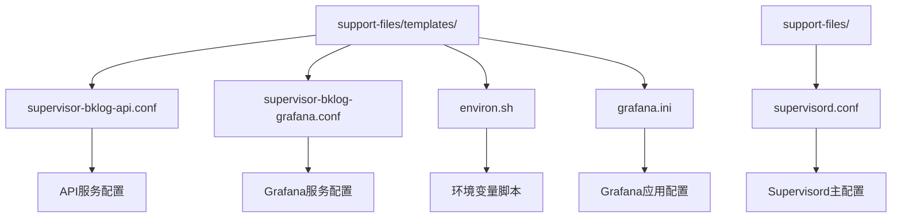
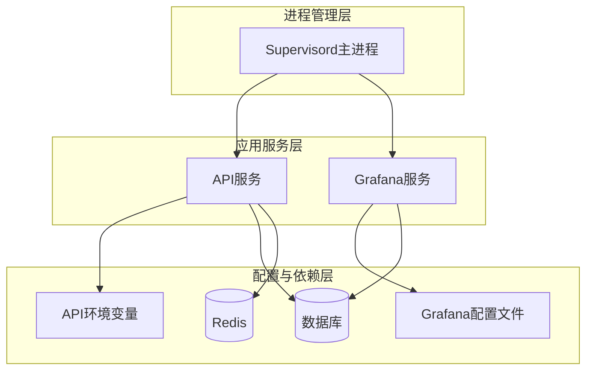
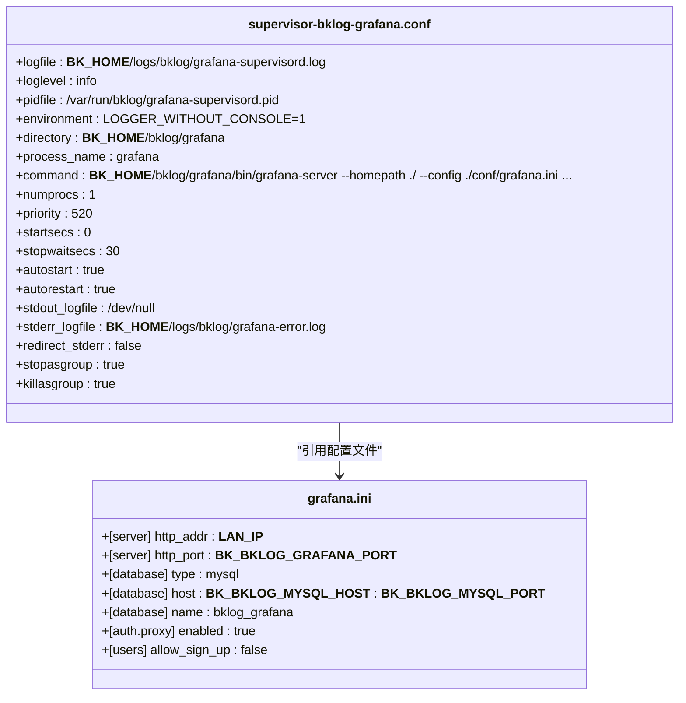
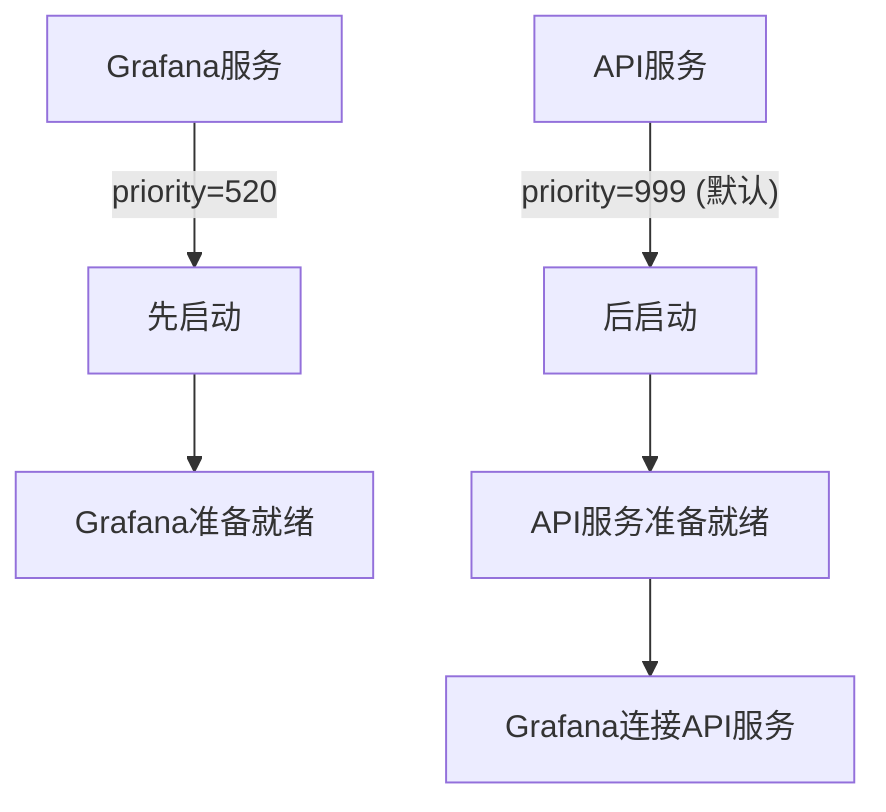

# 核心服务管理

<cite>
**本文档中引用的文件**  
- [supervisor-bklog-api.conf](file://support-files/templates/#etc#supervisor-bklog-api.conf)
- [supervisor-bklog-grafana.conf](file://support-files/templates/#etc#supervisor-bklog-grafana.conf)
- [environ.sh](file://support-files/templates/api#bin#environ.sh)
- [grafana.ini](file://support-files/templates/grafana#conf#grafana.ini)
- [gunicorn_config.py](file://gunicorn_config.py)
- [supervisord.conf](file://support-files/supervisord.conf)
</cite>

## 目录
1. [引言](#引言)
2. [项目结构](#项目结构)
3. [核心组件](#核心组件)
4. [架构概述](#架构概述)
5. [详细组件分析](#详细组件分析)
6. [依赖分析](#依赖分析)
7. [性能考虑](#性能考虑)
8. [故障排除指南](#故障排除指南)
9. [结论](#结论)

## 引言
本文档旨在深入解析BK-LOG系统中API服务和Grafana服务的Supervisor进程配置。重点阐述`supervisor-bklog-api.conf`和`supervisor-bklog-grafana.conf`两个核心配置文件，详细说明其关键参数设置、服务依赖关系、启动顺序控制机制以及资源配置策略。文档还提供配置最佳实践，并结合实际部署场景说明如何根据系统负载调整进程数量和资源分配。

## 项目结构
BK-LOG系统的Supervisor配置文件位于`support-files/templates/`目录下，采用模板化设计，便于在不同环境中进行变量替换和部署。主要配置文件包括API服务和Grafana服务的独立Supervisor配置，以及一个通用的Supervisord主配置文件。



**图示来源**
- [supervisor-bklog-api.conf](file://support-files/templates/#etc#supervisor-bklog-api.conf)
- [supervisor-bklog-grafana.conf](file://support-files/templates/#etc#supervisor-bklog-grafana.conf)
- [environ.sh](file://support-files/templates/api#bin#environ.sh)
- [grafana.ini](file://support-files/templates/grafana#conf#grafana.ini)
- [supervisord.conf](file://support-files/supervisord.conf)

**本节来源**
- [support-files/templates/](file://support-files/templates/)
- [support-files/supervisord.conf](file://support-files/supervisord.conf)

## 核心组件
本文档的核心组件是BK-LOG系统中的两个关键服务：API服务和Grafana服务。API服务基于Django框架，通过Gunicorn作为WSGI服务器运行，负责处理所有业务逻辑和数据交互。Grafana服务则是一个独立的数据可视化平台，用于展示日志分析结果。这两个服务均由Supervisor进行进程管理，确保其高可用性和稳定性。

**本节来源**
- [supervisor-bklog-api.conf](file://support-files/templates/#etc#supervisor-bklog-api.conf)
- [supervisor-bklog-grafana.conf](file://support-files/templates/#etc#supervisor-bklog-grafana.conf)

## 架构概述
BK-LOG系统的进程管理架构采用分层设计。最底层是Supervisord主进程，负责管理所有子进程。在其之上，API服务和Grafana服务作为独立的程序单元运行，每个服务都有自己的Supervisor配置文件。API服务依赖于一系列环境变量和数据库连接，而Grafana服务则有独立的配置文件和数据存储路径。这种设计实现了服务间的解耦，便于独立部署和维护。



**图示来源**
- [supervisor-bklog-api.conf](file://support-files/templates/#etc#supervisor-bklog-api.conf)
- [supervisor-bklog-grafana.conf](file://support-files/templates/#etc#supervisor-bklog-grafana.conf)
- [environ.sh](file://support-files/templates/api#bin#environ.sh)
- [grafana.ini](file://support-files/templates/grafana#conf#grafana.ini)

## 详细组件分析

### API服务分析
API服务的Supervisor配置文件`supervisor-bklog-api.conf`定义了服务的启动命令、工作目录、日志输出等关键参数。`command`指令通过`bash -c`执行一个复合命令，首先等待10秒，然后加载`environ.sh`环境变量脚本，最后启动Gunicorn服务器。`directory`参数设置为`__BK_HOME__/bklog/api`，指定了服务的工作目录。`stdout_logfile`和`redirect_stderr`参数共同作用，将标准输出和错误输出统一重定向到`__BK_HOME__/logs/bklog/api.log`文件中，便于日志集中管理。

#### API服务配置
```mermaid
classDiagram
class supervisor-bklog-api.conf {
+loglevel : info
+logfile : __BK_HOME__/logs/bklog/api-supervisord.log
+pidfile : /var/run/bklog/api-supervisord.pid
+command : bash -c "sleep 10 && source bin/environ.sh && exec gunicorn -c gunicorn_config.py wsgi : application"
+numprocs : 1
+autostart : true
+autorestart : true
+startsecs : 3
+stopwaitsecs : 10
+stopsignal : TERM
+stopasgroup : true
+stdout_logfile : __BK_HOME__/logs/bklog/api.log
+redirect_stderr : true
+directory : __BK_HOME__/bklog/api
}
class environ.sh {
+BK_ENV : production
+BK_LOG_DIR : __BK_HOME__/logs/bklog
+DJANGO_SETTINGS_MODULE : settings
+DB_NAME : bk_log_search
+BK_BKLOG_REDIS_HOST : __BK_BKLOG_REDIS_HOST__
+RABBITMQ_HOST : __BK_BKLOG_RABBITMQ_HOST__
}
class gunicorn_config.py {
+bind : f"{os.getenv('LAN_IP', '0.0.0.0')} : {os.getenv('BKLOG_API_PORT', '8000')}"
+workers : 8
+loglevel : info
+timeout : 65
+max_requests : 1000
}
supervisor-bklog-api.conf --> environ.sh : "加载环境变量"
supervisor-bklog-api.conf --> gunicorn_config.py : "引用Gunicorn配置"
environ.sh --> gunicorn_config.py : "提供环境变量"
```

**图示来源**
- [supervisor-bklog-api.conf](file://support-files/templates/#etc#supervisor-bklog-api.conf)
- [environ.sh](file://support-files/templates/api#bin#environ.sh)
- [gunicorn_config.py](file://gunicorn_config.py)

**本节来源**
- [supervisor-bklog-api.conf](file://support-files/templates/#etc#supervisor-bklog-api.conf)
- [environ.sh](file://support-files/templates/api#bin#environ.sh)
- [gunicorn_config.py](file://gunicorn_config.py)

### Grafana服务分析
Grafana服务的Supervisor配置文件`supervisor-bklog-grafana.conf`具有不同的配置特点。`command`指令直接调用Grafana服务器二进制文件，并通过命令行参数指定其配置文件路径和数据目录。`priority`参数设置为520，高于API服务的默认优先级999（数值越小优先级越高），这表明Grafana服务在启动时具有更高的优先级。`stderr_logfile`参数单独指定了错误日志的输出路径为`__BK_HOME__/logs/bklog/grafana-error.log`，而`stdout_logfile`被设置为`/dev/null`，表示标准输出被丢弃，这符合Grafana通常将日志写入文件而非标准输出的特性。

#### Grafana服务配置


**图示来源**
- [supervisor-bklog-grafana.conf](file://support-files/templates/#etc#supervisor-bklog-grafana.conf)
- [grafana.ini](file://support-files/templates/grafana#conf#grafana.ini)

**本节来源**
- [supervisor-bklog-grafana.conf](file://support-files/templates/#etc#supervisor-bklog-grafana.conf)
- [grafana.ini](file://support-files/templates/grafana#conf#grafana.ini)

## 依赖分析
BK-LOG系统的两个核心服务之间存在明确的依赖关系。API服务是系统的核心业务逻辑处理单元，而Grafana服务是其数据展示的前端。从Supervisor的配置来看，虽然两个服务的配置文件是独立的，但通过`priority`参数的设置可以推断出服务的启动顺序。Grafana服务的`priority`值为520，而API服务的`priority`未显式设置，使用默认值999。由于Supervisor会优先启动`priority`值较小的服务，因此Grafana服务会先于API服务启动。

然而，这种启动顺序在实际应用中可能存在问题，因为Grafana可能需要从API服务获取数据或配置。更合理的依赖关系应该是API服务先启动并准备好，然后Grafana服务再启动。这表明当前的配置可能需要调整，或者系统设计上Grafana服务具有足够的容错能力，能够在API服务未完全就绪时启动并自动重试连接。



**图示来源**
- [supervisor-bklog-api.conf](file://support-files/templates/#etc#supervisor-bklog-api.conf)
- [supervisor-bklog-grafana.conf](file://support-files/templates/#etc#supervisor-bklog-grafana.conf)

**本节来源**
- [supervisor-bklog-api.conf](file://support-files/templates/#etc#supervisor-bklog-api.conf)
- [supervisor-bklog-grafana.conf](file://support-files/templates/#etc#supervisor-bklog-grafana.conf)

## 性能考虑
从配置文件中可以分析出两个服务的资源分配策略。API服务通过Gunicorn配置文件`gunicorn_config.py`中的`workers = 8`参数，明确设置了8个工作进程，这充分利用了多核CPU的优势，能够处理高并发的HTTP请求。`timeout = 65`和`max_requests = 1000`参数则有助于防止工作进程因长时间运行或内存泄漏而耗尽资源。

Grafana服务的资源配置则主要体现在其Supervisor配置中。`stopwaitsecs = 30`参数比API服务的`stopwaitsecs = 10`更长，这表明Grafana服务在关闭时需要更多时间来完成清理工作，可能与其数据持久化机制有关。此外，`killasgroup = true`参数确保在终止进程时，会同时杀死其所有子进程，防止僵尸进程的产生。

在实际部署中，可以根据系统负载动态调整这些参数。例如，在高负载场景下，可以增加API服务的`workers`数量以提升并发处理能力；在内存受限的环境中，可以适当减少`max_requests`值以更频繁地重启工作进程，防止内存持续增长。

**本节来源**
- [gunicorn_config.py](file://gunicorn_config.py)
- [supervisor-bklog-api.conf](file://support-files/templates/#etc#supervisor-bklog-api.conf)
- [supervisor-bklog-grafana.conf](file://support-files/templates/#etc#supervisor-bklog-grafana.conf)

## 故障排除指南
当API服务或Grafana服务出现故障时，应首先检查Supervisor的日志文件。API服务的Supervisor日志位于`__BK_HOME__/logs/bklog/api-supervisord.log`，而Grafana服务的日志位于`__BK_HOME__/logs/bklog/grafana-supervisord.log`。这些日志文件记录了Supervisor进程本身的运行状态，包括服务启动、停止和重启的详细信息。

对于API服务，还需检查其应用日志`__BK_HOME__/logs/bklog/api.log`，该文件包含了Gunicorn服务器和Django应用的输出。对于Grafana服务，应检查`__BK_HOME__/logs/bklog/grafana-error.log`，该文件专门记录了Grafana的错误信息。

常见的故障场景包括：
- **服务无法启动**：检查`command`指令中的路径是否正确，环境变量是否已正确加载。
- **服务频繁重启**：检查`startsecs`参数，如果服务在`startsecs`秒内退出，Supervisor会认为启动失败并尝试重启。
- **端口冲突**：确认`bind`地址和端口没有被其他进程占用。
- **数据库连接失败**：检查`environ.sh`或`grafana.ini`中的数据库连接参数是否正确。

**本节来源**
- [supervisor-bklog-api.conf](file://support-files/templates/#etc#supervisor-bklog-api.conf)
- [supervisor-bklog-grafana.conf](file://support-files/templates/#etc#supervisor-bklog-grafana.conf)
- [environ.sh](file://support-files/templates/api#bin#environ.sh)
- [grafana.ini](file://support-files/templates/grafana#conf#grafana.ini)

## 结论
本文档详细解析了BK-LOG系统中API服务和Grafana服务的Supervisor进程配置。通过分析`supervisor-bklog-api.conf`和`supervisor-bklog-grafana.conf`两个核心配置文件，阐明了关键参数的设置及其作用。文档揭示了服务间的依赖关系和启动顺序控制机制，并对服务的资源配置进行了深入探讨。最后，提供了配置最佳实践和故障排除指南，为系统的稳定运行和高效维护提供了有力支持。建议在实际部署中，根据具体环境和负载情况，对配置参数进行适当调整和优化。