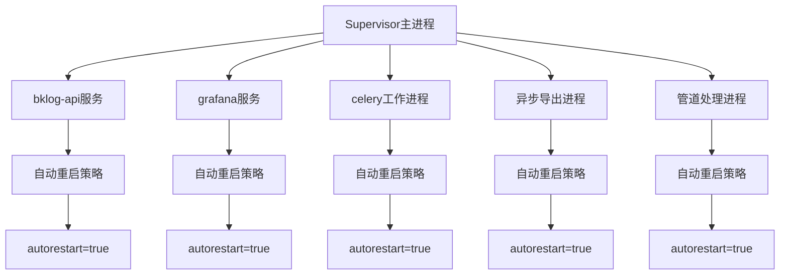
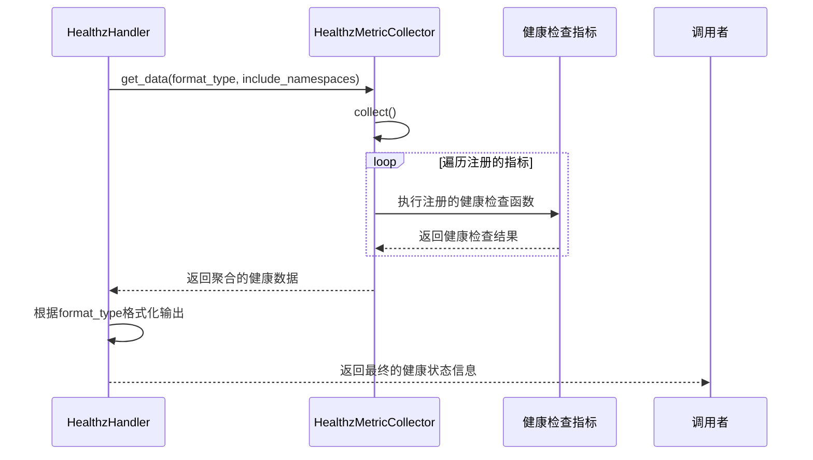
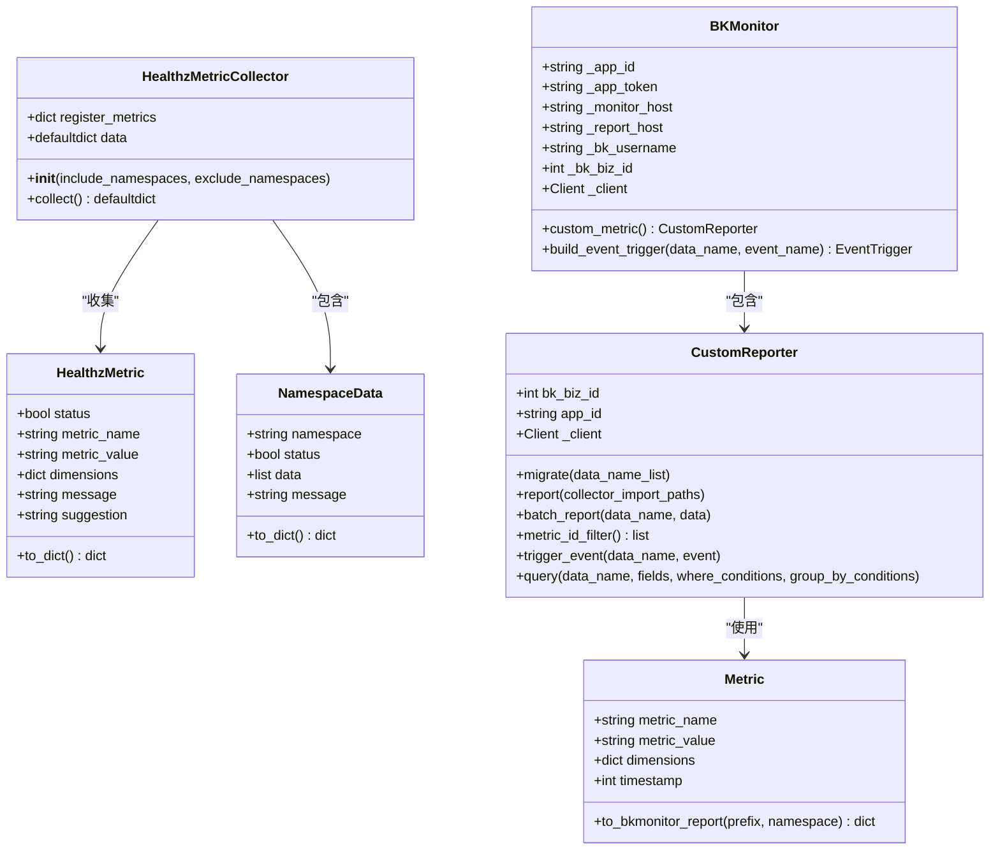
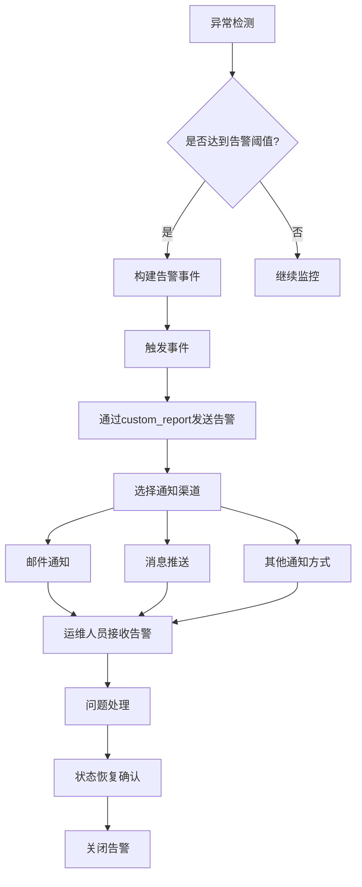
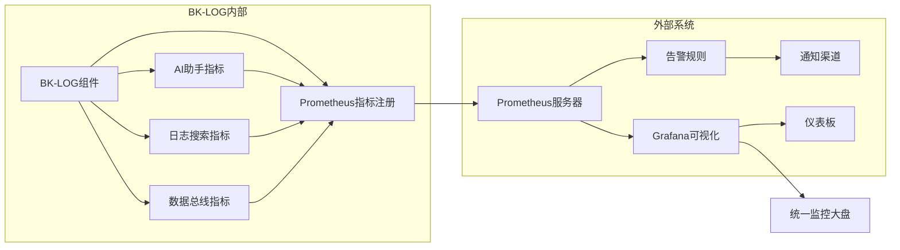
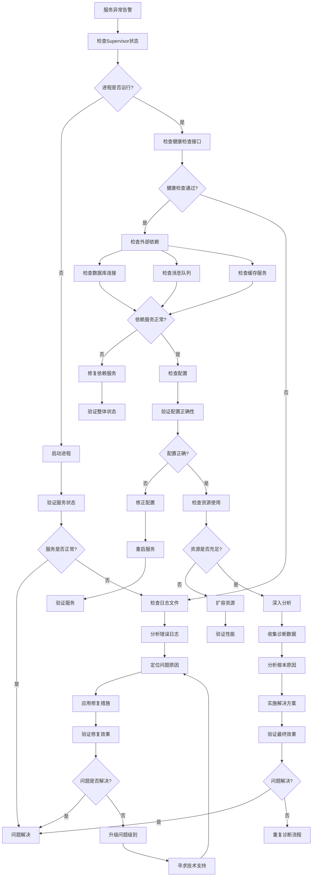

# 监控机制

<cite>
**本文档引用的文件**
- [supervisord.conf](file://support-files/supervisord.conf)
- [#etc#supervisor-bklog-api.conf](file://support-files/templates/#etc#supervisor-bklog-api.conf)
- [#etc#supervisor-bklog-grafana.conf](file://support-files/templates/#etc#supervisor-bklog-grafana.conf)
- [healthz.py](file://home_application/handlers/healthz.py)
- [metrics.py](file://home_application/handlers/metrics.py)
- [monitor.py](file://bk_monitor/handler/monitor.py)
- [metric.py](file://bk_monitor/utils/metric.py)
- [collector.py](file://bk_monitor/utils/collector.py)
- [ai_assistant/metrics.py](file://apps/ai_assistant/metrics.py)
- [log_search/metrics.py](file://apps/log_search/metrics.py)
</cite>

## 目录
1. [引言](#引言)
2. [Supervisor监控配置](#supervisor监控配置)
3. [健康状态检测机制](#健康状态检测机制)
4. [状态监控指标](#状态监控指标)
5. [告警通知配置](#告警通知配置)
6. [与外部监控系统集成](#与外部监控系统集成)
7. [故障诊断流程](#故障诊断流程)
8. [结论](#结论)

## 引言
BK-LOG平台通过多层次的监控机制确保各组件的稳定运行。本系统采用Supervisor作为进程管理工具，结合自定义健康检查和指标采集机制，实现了对API服务、Grafana等核心组件的全面监控。当组件出现异常时，系统能够自动重启服务，并通过多种渠道发送告警通知，确保问题能够被及时发现和处理。

**本节不分析具体源文件，因此不提供来源**

## Supervisor监控配置

BK-LOG平台使用Supervisor作为核心的进程监控和管理工具。Supervisor配置文件定义了对各个组件的监控策略，包括自动重启条件和重试间隔。

**Diagram sources**
- [supervisord.conf](file://support-files/supervisord.conf#L1-L75)
- [#etc#supervisor-bklog-api.conf](file://support-files/templates/#etc#supervisor-bklog-api.conf#L1-L31)
- [#etc#supervisor-bklog-grafana.conf](file://support-files/templates/#etc#supervisor-bklog-grafana.conf#L1-L36)

**Section sources**
- [supervisord.conf](file://support-files/supervisord.conf#L1-L75)
- [#etc#supervisor-bklog-api.conf](file://support-files/templates/#etc#supervisor-bklog-api.conf#L1-L31)
- [#etc#supervisor-bklog-grafana.conf](file://support-files/templates/#etc#supervisor-bklog-grafana.conf#L1-L36)

## 健康状态检测机制

BK-LOG平台实现了多层次的健康状态检测机制。系统通过HealthzHandler类收集和处理健康检查指标，确保能够准确判断各组件的运行状态。

**Diagram sources**
- [healthz.py](file://home_application/handlers/healthz.py#L29-L120)
- [metrics.py](file://home_application/handlers/metrics.py#L103-L158)

**Section sources**
- [healthz.py](file://home_application/handlers/healthz.py#L29-L120)
- [metrics.py](file://home_application/handlers/metrics.py#L36-L158)

## 状态监控指标

系统定义了丰富的状态监控指标，包括进程运行时间、重启次数和资源消耗等关键性能指标。这些指标通过Prometheus客户端库进行注册和采集。

**Diagram sources**
- [metrics.py](file://home_application/handlers/metrics.py#L56-L102)
- [metric.py](file://bk_monitor/utils/metric.py#L49-L86)
- [monitor.py](file://bk_monitor/handler/monitor.py#L39-L87)
- [collector.py](file://bk_monitor/utils/collector.py#L15-L96)

**Section sources**
- [metrics.py](file://home_application/handlers/metrics.py#L56-L158)
- [metric.py](file://bk_monitor/utils/metric.py#L8-L86)
- [collector.py](file://bk_monitor/utils/collector.py#L15-L96)

## 告警通知配置

系统通过BKMonitor组件实现告警通知功能。当检测到异常情况时，系统会触发事件并发送告警信息，支持邮件和消息推送等多种通知方式。

**Diagram sources**
- [monitor.py](file://bk_monitor/handler/monitor.py#L75-L265)
- [metric.py](file://bk_monitor/utils/metric.py#L49-L86)

**Section sources**
- [monitor.py](file://bk_monitor/handler/monitor.py#L75-L265)

## 与外部监控系统集成

BK-LOG平台与Prometheus等外部监控系统集成，实现统一监控大盘。系统通过注册Prometheus指标，将关键性能数据暴露给外部监控系统。

**Diagram sources**
- [ai_assistant/metrics.py](file://apps/ai_assistant/metrics.py#L1-L39)
- [log_search/metrics.py](file://apps/log_search/metrics.py#L1-L22)
- [metric.py](file://bk_monitor/utils/metric.py#L8-L86)

**Section sources**
- [ai_assistant/metrics.py](file://apps/ai_assistant/metrics.py#L1-L39)
- [log_search/metrics.py](file://apps/log_search/metrics.py#L1-L22)

## 故障诊断流程

当BK-LOG组件出现异常时，运维人员可以按照以下流程进行快速诊断和解决。

**Diagram sources**
- [healthz.py](file://home_application/handlers/healthz.py#L29-L120)
- [supervisord.conf](file://support-files/supervisord.conf#L1-L75)

**Section sources**
- [healthz.py](file://home_application/handlers/healthz.py#L29-L120)
- [supervisord.conf](file://support-files/supervisord.conf#L1-L75)

## 结论
BK-LOG平台通过Supervisor进程管理、自定义健康检查、多维度监控指标和外部系统集成，构建了完善的监控体系。该体系能够有效保障各组件的稳定运行，及时发现和处理异常情况，为系统的可靠性和可用性提供了有力保障。建议运维团队熟悉本监控机制，定期检查监控配置，确保监控系统的有效性。

**本节不分析具体源文件，因此不提供来源**