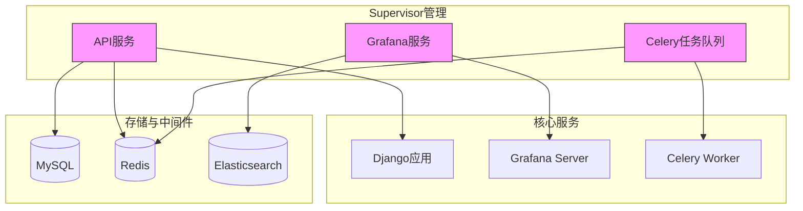
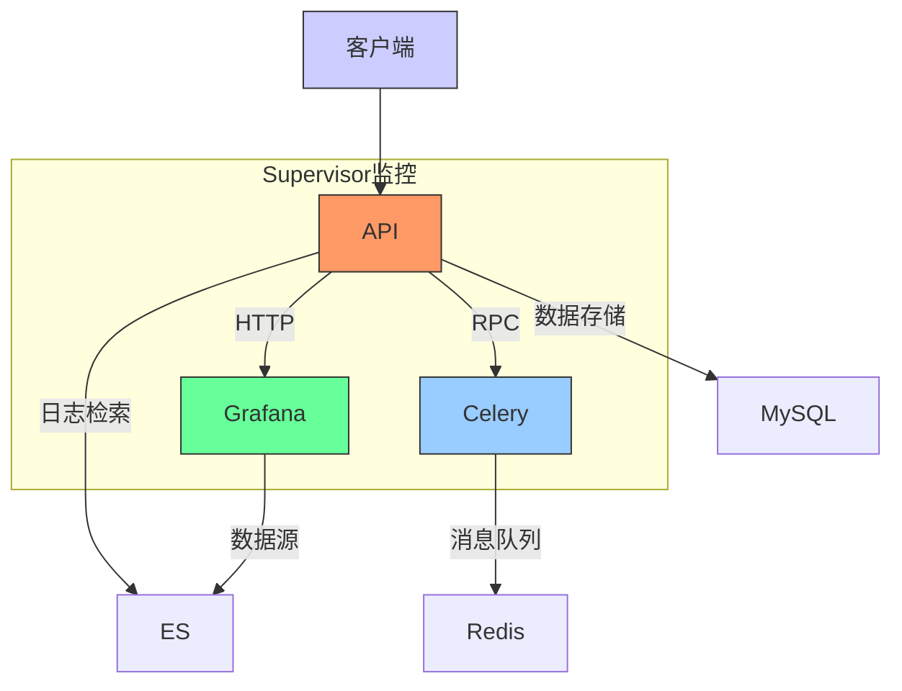
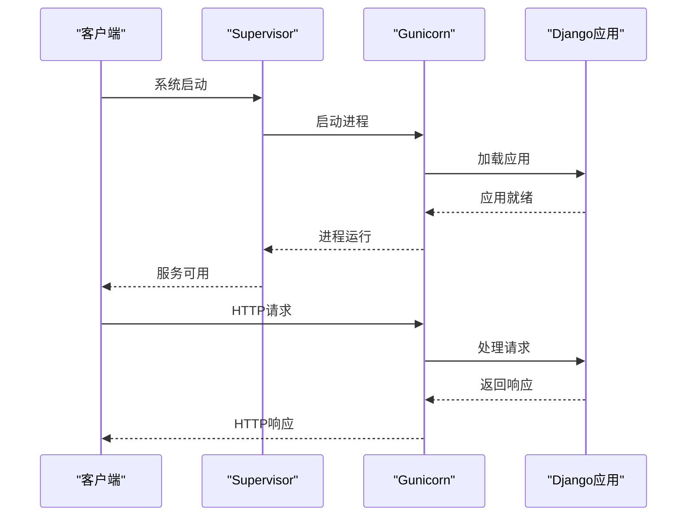
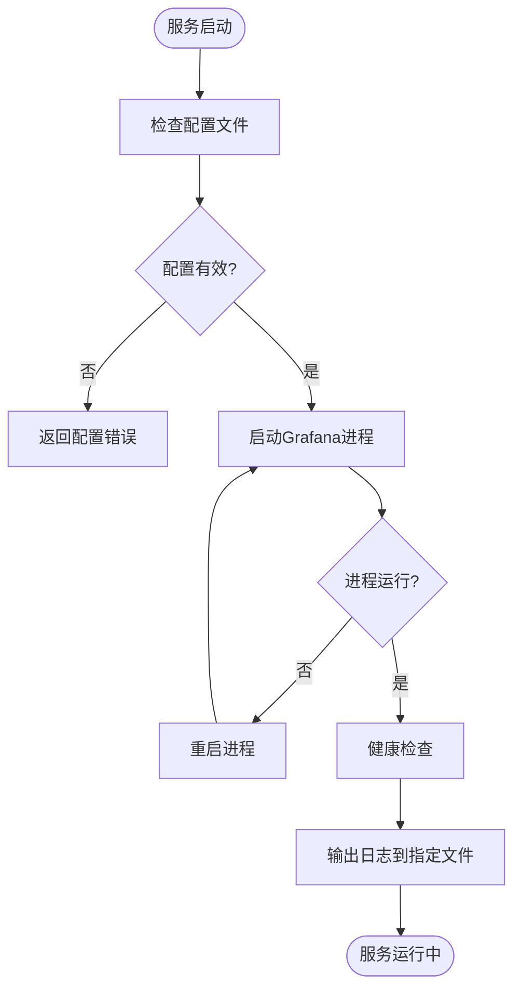
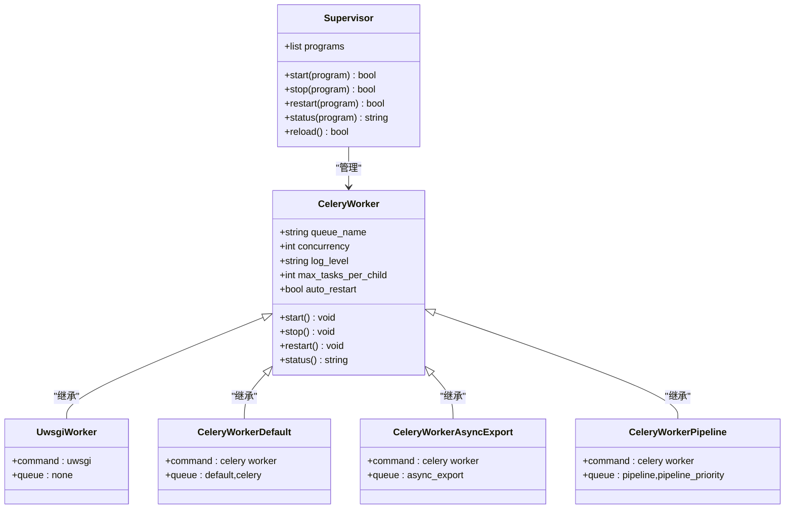
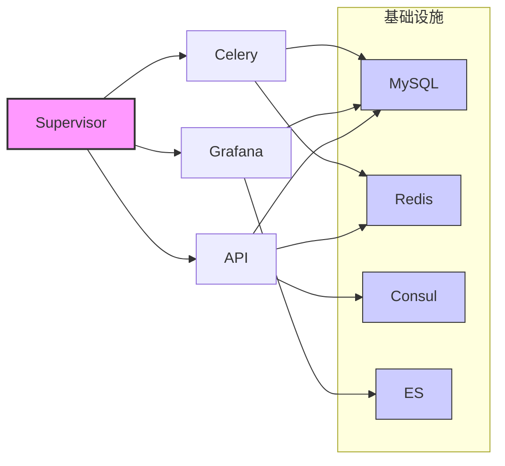

# 运维操作指南

<cite>
**本文档引用的文件**   
- [supervisord.conf](file://bklog/support-files/supervisord.conf)
- [supervisor-bklog-api.conf](file://bklog/support-files/templates/#etc#supervisor-bklog-api.conf)
- [supervisor-bklog-grafana.conf](file://bklog/support-files/templates/#etc#supervisor-bklog-grafana.conf)
- [environ.sh](file://bklog/support-files/templates/api#bin#environ.sh)
- [gunicorn_config.py](file://bklog/gunicorn_config.py)
</cite>

## 目录
1. [简介](#简介)
2. [项目结构](#项目结构)
3. [核心组件](#核心组件)
4. [架构概述](#架构概述)
5. [详细组件分析](#详细组件分析)
6. [依赖分析](#依赖分析)
7. [性能考虑](#性能考虑)
8. [故障排除指南](#故障排除指南)
9. [结论](#结论)

## 简介
本文档旨在提供基于Supervisor的蓝鲸日志平台（BK-LOG）的全面运维操作指南。文档详细介绍了服务启停、配置重载、状态查询等日常运维操作，提供了批量管理脚本示例，规范了配置变更流程，并涵盖了日志管理和故障应急处理的最佳实践。

## 项目结构
蓝鲸日志平台采用模块化设计，主要由接入层、场景层、服务层和存储层构成。Supervisor作为进程管理工具，负责管理平台核心服务的生命周期。平台通过Docker容器化部署，在Dockerfile中明确安装了Supervisor组件。

**图示来源**
- [supervisord.conf](file://bklog/support-files/supervisord.conf#L1-L75)
- [supervisor-bklog-api.conf](file://bklog/support-files/templates/#etc#supervisor-bklog-api.conf#L1-L31)
- [supervisor-bklog-grafana.conf](file://bklog/support-files/templates/#etc#supervisor-bklog-grafana.conf#L1-L36)

**本节来源**
- [supervisord.conf](file://bklog/support-files/supervisord.conf#L1-L75)
- [Dockerfile.monitor.dev](file://Dockerfile.monitor.dev#L14)

## 核心组件
系统核心由API服务、Grafana可视化服务和Celery异步任务队列组成，均由Supervisor统一管理。API服务基于Django框架，通过Gunicorn作为WSGI服务器运行；Grafana服务提供仪表盘和数据可视化功能；Celery处理后台异步任务。

**本节来源**
- [supervisor-bklog-api.conf](file://bklog/support-files/templates/#etc#supervisor-bklog-api.conf#L8-L21)
- [supervisor-bklog-grafana.conf](file://bklog/support-files/templates/#etc#supervisor-bklog-grafana.conf#L22-L35)
- [supervisord.conf](file://bklog/support-files/supervisord.conf#L16-L75)

## 架构概述
系统采用微服务架构，Supervisor作为进程守护程序，确保关键服务的高可用性。API服务处理所有HTTP请求，Grafana服务提供数据可视化，Celery处理耗时的异步任务。所有服务通过Redis进行通信，并将数据持久化到MySQL和Elasticsearch。

**图示来源**
- [supervisord.conf](file://bklog/support-files/supervisord.conf#L16-L75)
- [gunicorn_config.py](file://bklog/gunicorn_config.py#L71-L91)

## 详细组件分析

### API服务分析
API服务是系统的入口，负责处理所有业务逻辑和API请求。该服务由Supervisor管理，通过Gunicorn启动，配置了自动重启机制以确保服务的稳定性。

**图示来源**
- [supervisor-bklog-api.conf](file://bklog/support-files/templates/#etc#supervisor-bklog-api.conf#L8-L21)
- [environ.sh](file://bklog/support-files/templates/api#bin#environ.sh#L1-L67)

### Grafana服务分析
Grafana服务提供强大的数据可视化能力，通过Supervisor进行进程管理。服务配置了独立的socket文件和日志文件，便于监控和故障排查。

**图示来源**
- [supervisor-bklog-grafana.conf](file://bklog/support-files/templates/#etc#supervisor-bklog-grafana.conf#L22-L35)
- [supervisord.conf](file://bklog/support-files/supervisord.conf#L1-L15)

### Celery任务队列分析
Celery作为异步任务处理的核心，被配置为多个独立的worker进程，分别处理不同优先级的任务队列。Supervisor确保这些后台任务进程的持续运行。

**图示来源**
- [supervisord.conf](file://bklog/support-files/supervisord.conf#L16-L75)
- [gunicorn_config.py](file://bklog/gunicorn_config.py#L71-L91)

**本节来源**
- [supervisord.conf](file://bklog/support-files/supervisord.conf#L16-L75)
- [supervisor-bklog-api.conf](file://bklog/support-files/templates/#etc#supervisor-bklog-api.conf#L8-L21)
- [supervisor-bklog-grafana.conf](file://bklog/support-files/templates/#etc#supervisor-bklog-grafana.conf#L22-L35)

## 依赖分析
系统依赖于多个外部组件和服务，Supervisor配置中明确指定了这些依赖关系。通过分析配置文件，可以清晰地看到各组件之间的依赖关系和启动顺序。

**图示来源**
- [supervisord.conf](file://bklog/support-files/supervisord.conf#L1-L75)
- [environ.sh](file://bklog/support-files/templates/api#bin#environ.sh#L1-L67)

**本节来源**
- [supervisord.conf](file://bklog/support-files/supervisord.conf#L1-L75)
- [environ.sh](file://bklog/support-files/templates/api#bin#environ.sh#L1-L67)

## 性能考虑
Supervisor配置中包含了多项性能优化设置，如进程重启策略、日志轮转和资源限制。这些配置确保了系统在高负载下的稳定运行。

**本节来源**
- [supervisor-bklog-grafana.conf](file://bklog/support-files/templates/#etc#supervisor-bklog-grafana.conf#L5-L7)
- [supervisord.conf](file://bklog/support-files/supervisord.conf#L10-L11)

## 故障排除指南
当服务出现故障时，应首先检查Supervisor管理的状态，然后查看相应的日志文件。常见问题包括配置错误、依赖服务不可用和资源不足等。

**本节来源**
- [supervisor-bklog-api.conf](file://bklog/support-files/templates/#etc#supervisor-bklog-api.conf#L18-L19)
- [supervisor-bklog-grafana.conf](file://bklog/support-files/templates/#etc#supervisor-bklog-grafana.conf#L31-L32)

## 结论
本文档系统地介绍了基于Supervisor的运维操作，涵盖了服务管理、配置变更、日志监控和故障排除等关键方面。通过遵循这些最佳实践，可以确保蓝鲸日志平台的稳定运行和高效维护。