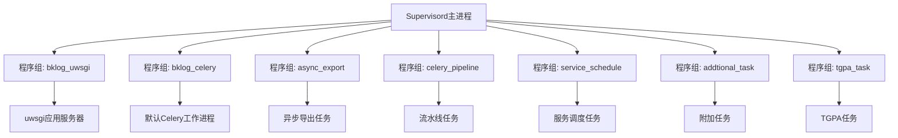
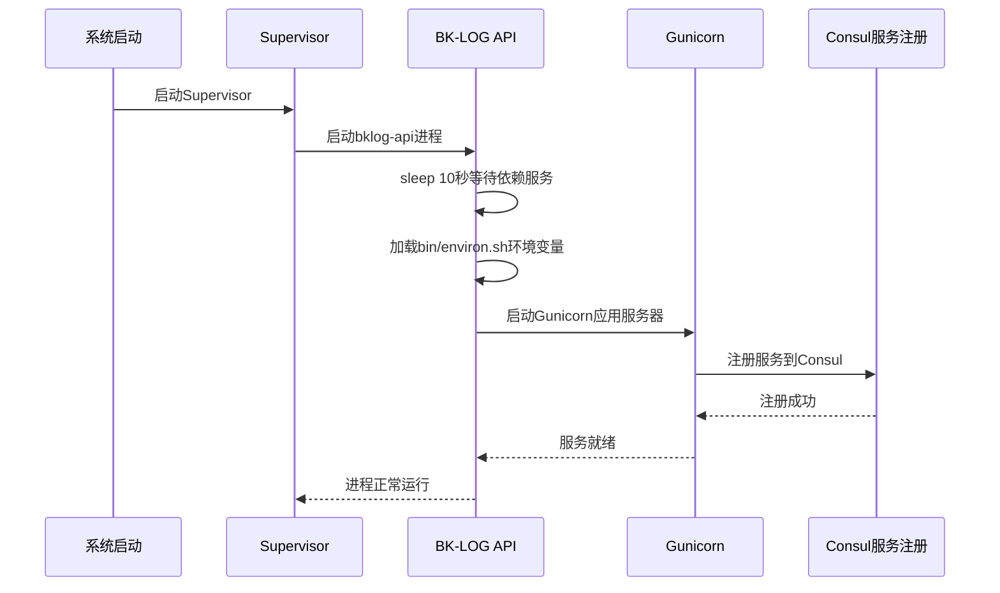
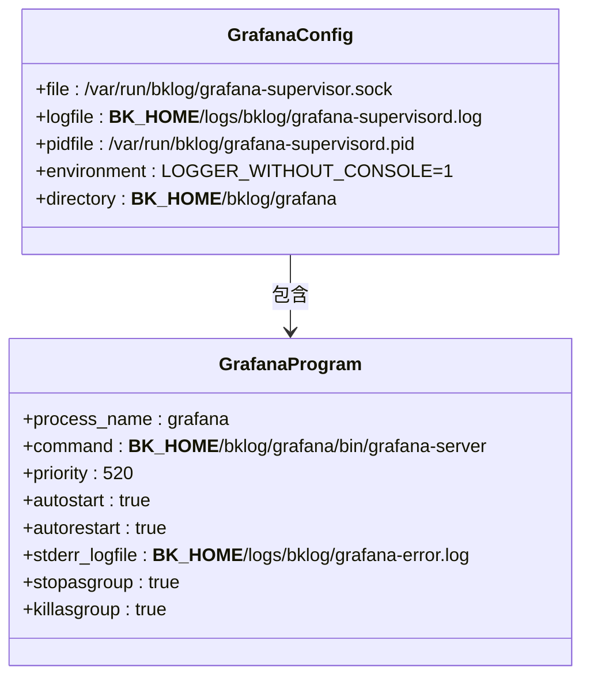
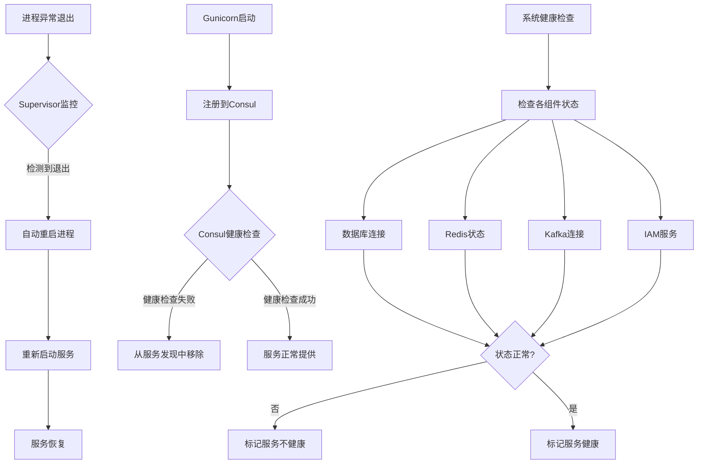

# 进程管理

<cite>
**本文档引用的文件**  
- [supervisord.conf](file://support-files/supervisord.conf)
- [templates/#etc#supervisor-bklog-api.conf](file://support-files/templates/#etc#supervisor-bklog-api.conf)
- [templates/#etc#supervisor-bklog-grafana.conf](file://support-files/templates/#etc#supervisor-bklog-grafana.conf)
- [templates/api#bin#environ.sh](file://support-files/templates/api#bin#environ.sh)
- [gunicorn_config.py](file://gunicorn_config.py)
- [home_application/handlers/healthz.py](file://home_application/handlers/healthz.py)
</cite>

## 目录
1. [引言](#引言)
2. [Supervisor主配置文件解析](#supervisor主配置文件解析)
3. [API服务进程配置](#api服务进程配置)
4. [Grafana服务进程配置](#grafana服务进程配置)
5. [故障恢复机制](#故障恢复机制)
6. [性能监控指标](#性能监控指标)
7. [运维操作指南](#运维操作指南)
8. [结论](#结论)

## 引言
BK-LOG系统采用Supervisor作为核心进程管理工具，用于统一管理API服务、Grafana可视化服务及其他后台任务进程。本文档详细阐述了基于Supervisor的进程管理实施方案，涵盖主配置文件结构、服务专用配置、自动重启策略、日志轮转机制及实际运维操作。通过本方案，系统实现了高可用性、自动故障恢复和集中化监控，确保日志平台的稳定运行。

## Supervisor主配置文件解析

BK-LOG系统的Supervisor主配置文件`supervisord.conf`定义了全局运行参数和多个程序组的管理策略。该配置采用模板化设计，支持动态变量注入，适用于不同部署环境。



**图示来源**  
- [supervisord.conf](file://support-files/supervisord.conf#L16-L75)

### 程序组与启动优先级
主配置文件中定义了多个程序组，每个组对应不同的任务队列和业务功能：
- `bklog_uwsgi`: Web应用服务器，处理HTTP请求
- `bklog_celery`: 默认任务队列，处理常规异步任务
- `async_export`: 专用队列处理异步导出任务
- `celery_pipeline`: 流水线相关任务
- `service_schedule`: 服务调度任务
- `addtional_task`: 附加任务处理
- `tgpa_task`: TGPA专项任务

所有程序组均配置`autorestart=true`，确保进程异常退出后自动重启。通过Celery的多队列机制，实现了任务的优先级划分和资源隔离。

### 自动重启策略
所有程序组均启用自动重启机制：
- `autorestart=true`: 进程异常退出后自动重启
- `stopwaitsecs=10`: 停止进程时等待10秒超时
- `redirect_stderr=true`: 标准错误重定向到日志文件

这种配置确保了服务的高可用性，即使在进程崩溃的情况下也能快速恢复服务。

### 日志轮转配置
主配置文件通过以下方式管理日志：
- 所有日志输出到`{{.app_container_path}}logs/{{.app_code}}/`目录
- 使用`redirect_stderr=true`统一管理标准输出和错误输出
- 日志文件按服务类型分类存储，便于排查问题

**本节来源**  
- [supervisord.conf](file://support-files/supervisord.conf#L1-L75)

## API服务进程配置

API服务通过独立的Supervisor配置文件`#etc#supervisor-bklog-api.conf`进行管理，该配置针对Web服务的特点进行了专门优化。



**图示来源**  
- [supervisor-bklog-api.conf](file://support-files/templates/#etc#supervisor-bklog-api.conf#L8-L21)
- [gunicorn_config.py](file://gunicorn_config.py#L67-L85)

### 执行命令与启动流程
API服务的执行命令设计了完整的启动流程：
```bash
bash -c "sleep 10 && source bin/environ.sh && exec gunicorn -c gunicorn_config.py wsgi:application"
```
该命令包含三个关键阶段：
1. `sleep 10`: 启动延迟，确保依赖服务（如数据库、Redis）已准备就绪
2. `source bin/environ.sh`: 加载环境变量配置
3. `exec gunicorn`: 启动Gunicorn应用服务器

### 工作目录与用户权限
- `directory=__BK_HOME__/bklog/api`: 设置工作目录为API服务根目录
- 配置中未显式指定用户，使用默认运行用户
- 通过环境变量文件控制敏感信息访问权限

### 环境变量设置
环境变量通过`bin/environ.sh`脚本集中管理，包含以下关键配置：
- **网络配置**: LAN_IP, BKLOG_API_PORT
- **虚拟环境**: PATH指向Python虚拟环境
- **PaaS平台**: BK_PAAS_HOST, BK_PAAS_INNER_HOST
- **应用凭证**: APP_ID, APP_TOKEN
- **数据库**: MySQL连接信息（DB_HOST, DB_PORT等）
- **Consul服务发现**: 客户端证书和服务器地址
- **IAM权限系统**: BK_IAM_V3_INNER_HOST
- **缓存系统**: Redis主机、端口、密码及哨兵配置
- **消息队列**: RabbitMQ连接参数

这种集中式环境变量管理提高了配置的安全性和可维护性。

### 进程管理参数
- `autostart=true`: 系统启动时自动启动
- `autorestart=true`: 进程异常退出后自动重启
- `startsecs=3`: 进程稳定运行3秒后认为启动成功
- `stopwaitsecs=10`: 停止进程时等待10秒
- `stopsignal=TERM`: 使用TERM信号优雅停止
- `stopasgroup=true`: 停止进程时同时停止其子进程组

**本节来源**  
- [supervisor-bklog-api.conf](file://support-files/templates/#etc#supervisor-bklog-api.conf#L8-L21)
- [environ.sh](file://support-files/templates/api#bin#environ.sh#L1-L67)
- [gunicorn_config.py](file://gunicorn_config.py#L41-L49)

## Grafana服务进程配置

Grafana服务通过专用配置文件`#etc#supervisor-bklog-grafana.conf`进行管理，针对可视化服务的特点进行了优化配置。



**图示来源**  
- [supervisor-bklog-grafana.conf](file://support-files/templates/#etc#supervisor-bklog-grafana.conf#L1-L36)

### 执行命令详解
Grafana服务的启动命令包含了多个配置参数：
```bash
__BK_HOME__/bklog/grafana/bin/grafana-server --homepath ./ --config ./conf/grafana.ini cfg:default.paths.logs=__BK_HOME__/logs/bklog/ cfg:default.paths.data=./data cfg:default.paths.plugins=./plugins
```
关键参数说明：
- `--homepath ./`: 指定Grafana主目录
- `--config ./conf/grafana.ini`: 指定配置文件路径
- `cfg:default.paths.logs`: 日志目录配置
- `cfg:default.paths.data`: 数据存储目录
- `cfg:default.paths.plugins`: 插件目录

### 启动优先级配置
- `priority=520`: 设置相对启动优先级
- 优先级数值越小，启动顺序越靠前
- 此配置确保Grafana在依赖服务启动后再启动

### 日志配置
- `stdout_logfile=/dev/null`: 屏蔽标准输出
- `stderr_logfile=__BK_HOME__/logs/bklog/grafana-error.log`: 错误日志单独记录
- `redirect_stderr=false`: 不重定向标准错误
- 主日志文件：`__BK_HOME__/logs/bklog/grafana-supervisord.log`

### 进程组管理
- `stopasgroup=true`: 停止进程时停止整个进程组
- `killasgroup=true`: 终止进程时终止整个进程组
- 这种配置确保了Grafana及其子进程能够被完整地管理

**本节来源**  
- [supervisor-bklog-grafana.conf](file://support-files/templates/#etc#supervisor-bklog-grafana.conf#L22-L36)

## 故障恢复机制

BK-LOG系统通过多层次的故障恢复机制确保服务的高可用性，包括Supervisor进程监控、Consul服务注册和健康检查体系。



**图示来源**  
- [supervisord.conf](file://support-files/supervisord.conf#L20-L21)
- [gunicorn_config.py](file://gunicorn_config.py#L67-L85)
- [healthz.py](file://home_application/handlers/healthz.py#L29-L120)

### Supervisor进程监控
Supervisor通过以下机制监控进程状态：
- **心跳检测**: 定期检查进程是否存在
- **退出码分析**: 根据进程退出码判断是否需要重启
- **自动重启**: 配置`autorestart=true`实现异常自动恢复
- **启动超时**: `startsecs`参数防止启动过程卡死

当API或Grafana进程异常退出时，Supervisor会在短时间内自动重启服务，最小化服务中断时间。

### Consul服务注册与健康检查
Gunicorn配置文件中实现了与Consul的集成：
- `when_ready`回调函数在服务启动后注册到Consul
- `on_exit`回调函数在服务停止时从Consul注销
- TCP健康检查每10秒执行一次
- 服务注册包含模块名、节点名、IP、端口和标签信息

这种机制确保了服务发现系统的准确性，避免将流量路由到不可用的实例。

### 健康检查体系
系统实现了多层次的健康检查：
- **进程级**: Supervisor监控进程生命周期
- **服务级**: Consul进行TCP健康检查
- **应用级**: 内置健康检查接口`/healthz`

`/healthz`接口返回详细的系统状态，包括：
- 数据库连接状态
- Redis缓存状态
- Kafka消息队列状态
- 第三方服务（IAM、ESB）可达性
- 版本信息

**本节来源**  
- [gunicorn_config.py](file://gunicorn_config.py#L67-L92)
- [healthz.py](file://home_application/handlers/healthz.py#L29-L120)

## 性能监控指标

BK-LOG系统提供了丰富的性能监控指标，支持通过Supervisor和自定义接口进行监控。

### Supervisor监控指标
通过Supervisor的Web界面或API可以监控以下指标：
- **进程状态**: 运行、停止、错误等状态
- **CPU使用率**: 各进程的CPU占用情况
- **内存使用**: 各进程的内存消耗
- **启动时间**: 进程已运行时间
- **重启次数**: 进程历史重启次数

### 自定义性能指标
系统通过`/healthz`接口提供详细的性能数据：
- **队列长度**: Redis队列中的待处理任务数量
- **Kafka偏移量**: 消费者组的消费进度
- **服务版本**: 当前部署的版本信息
- **第三方服务延迟**: IAM、ESB等外部服务的响应时间

### 监控接口使用
`/healthz`接口支持多种输出格式：
- `json`: JSON格式，便于程序解析
- `console`: 控制台格式，包含颜色编码
- `k8s`: Kubernetes就绪探针格式

接口返回结构化数据，包含命名空间、状态、指标值、消息和建议等信息，为故障排查提供全面支持。

**本节来源**  
- [healthz.py](file://home_application/handlers/healthz.py#L29-L120)
- [healthz_metrics/*.py](file://home_application/handlers/healthz_metrics/)

## 运维操作指南

### 服务启停命令
```bash
# 启动所有服务
supervisorctl -c /etc/supervisord.conf start all

# 停止所有服务
supervisorctl -c /etc/supervisord.conf stop all

# 重启所有服务
supervisorctl -c /etc/supervisord.conf restart all

# 启动API服务
supervisorctl -c /etc/supervisord.conf start bklog-api

# 停止Grafana服务
supervisorctl -c /etc/supervisord.conf stop grafana
```

### 配置重载
```bash
# 重新加载配置文件
supervisorctl -c /etc/supervisord.conf reread
supervisorctl -c /etc/supervisord.conf update

# 或使用简写
supervisorctl reread
supervisorctl update
```

### 状态查看
```bash
# 查看所有进程状态
supervisorctl status

# 查看特定进程状态
supervisorctl status bklog-api

# 查看进程详细信息
supervisorctl info
```

### 日志查看
```bash
# 查看Supervisor主进程日志
tail -f /var/log/bklog/supervisord.log

# 查看API服务日志
tail -f /var/log/bklog/api.log

# 查看Grafana错误日志
tail -f /var/log/bklog/grafana-error.log

# 使用supervisorctl查看日志
supervisorctl tail bklog-api
supervisorctl tail bklog-api stderr
```

### 常用快捷命令
```bash
# 进入supervisorctl交互模式
supervisorctl

# 在交互模式下执行命令
> status
> start bklog-api
> stop grafana
> quit
```

**本节来源**  
- [supervisord.conf](file://support-files/supervisord.conf)
- [supervisor-bklog-api.conf](file://support-files/templates/#etc#supervisor-bklog-api.conf)
- [supervisor-bklog-grafana.conf](file://support-files/templates/#etc#supervisor-bklog-grafana.conf)

## 结论
BK-LOG系统通过Supervisor实现了全面的进程管理，确保了服务的高可用性和稳定性。主配置文件通过程序组的方式管理多个Celery工作进程，实现了任务的优先级划分和资源隔离。API服务和Grafana服务分别通过专用配置文件进行管理，配置了合适的启动流程、环境变量和故障恢复策略。系统结合Supervisor进程监控、Consul服务注册和自定义健康检查，构建了多层次的故障恢复机制。通过丰富的性能监控指标和标准化的运维操作指南，为系统的稳定运行提供了有力保障。这种进程管理方案既保证了服务的可靠性，又提供了灵活的运维能力，是BK-LOG系统稳定运行的重要基础。