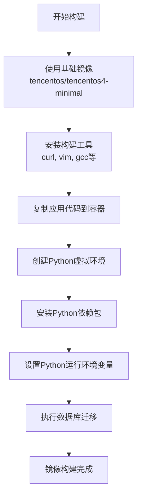
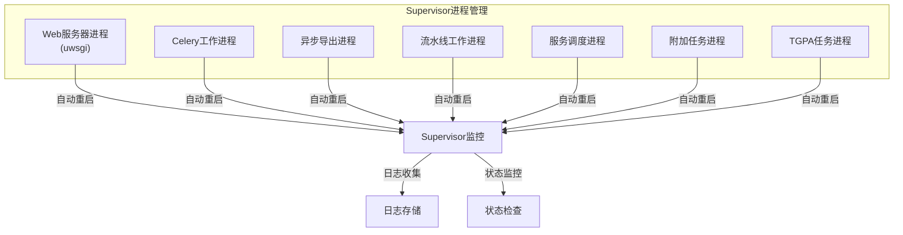
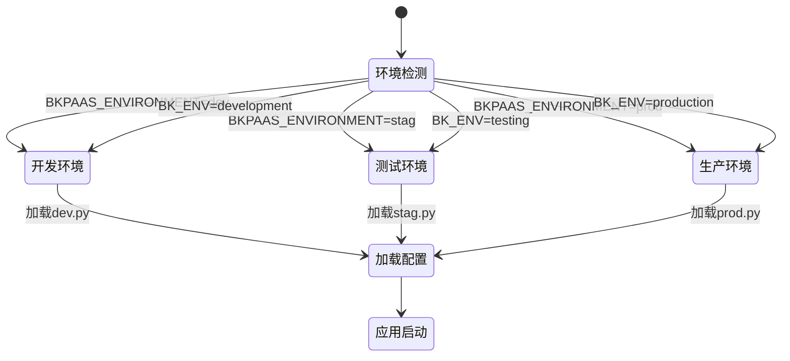

# 部署架构

<cite>
**本文档引用的文件**
- [Dockerfile](file://bklog/Dockerfile)
- [settings.py](file://bklog/settings.py)
- [supervisord.conf](file://bklog/support-files/supervisord.conf)
- [default.py](file://bklog/config/default.py)
- [dev.py](file://bklog/config/dev.py)
- [stag.py](file://bklog/config/stag.py)
- [prod.py](file://bklog/config/prod.py)
</cite>

## 目录
1. [简介](#简介)
2. [容器化部署方案](#容器化部署方案)
3. [应用镜像构建过程](#应用镜像构建过程)
4. [运行时环境配置](#运行时环境配置)
5. [进程管理策略](#进程管理策略)
6. [多环境部署差异](#多环境部署差异)
7. [服务发现与负载均衡](#服务发现与负载均衡)
8. [高可用性设计](#高可用性设计)
9. [实际部署示例](#实际部署示例)

## 简介
BK-LOG系统采用现代化的容器化部署架构，基于Docker和Supervisor实现应用的打包、部署和进程管理。系统支持开发、测试和生产等多种环境的差异化部署，通过灵活的配置机制适应不同场景的需求。本文档详细描述了BK-LOG系统的部署拓扑、容器化方案、进程管理策略以及高可用性设计。

## 容器化部署方案
BK-LOG系统采用Docker容器化技术进行部署，实现了应用与运行环境的解耦。系统使用多阶段构建策略优化镜像大小和构建效率。部署方案支持Kubernetes和传统部署模式，通过环境变量灵活切换。容器化部署确保了应用在不同环境中的一致性，简化了部署流程，提高了运维效率。

**文档来源**
- [Dockerfile](file://bklog/Dockerfile)
- [settings.py](file://bklog/settings.py)

## 应用镜像构建过程
BK-LOG系统的应用镜像构建过程基于Dockerfile定义，采用多阶段构建策略。构建过程首先使用基础Python镜像作为构建器，安装必要的构建工具和依赖，然后复制应用代码，创建虚拟环境并安装Python依赖包。构建完成后，应用代码和依赖被打包到最终的运行时镜像中。



**图示来源**
- [Dockerfile](file://bklog/Dockerfile#L1-L23)

**本节来源**
- [Dockerfile](file://bklog/Dockerfile#L1-L23)

## 运行时环境配置
BK-LOG系统的运行时环境通过环境变量和配置文件进行管理。系统在启动时根据环境变量确定运行模式，并加载相应的配置文件。运行时环境配置包括数据库连接、消息队列、日志级别等关键参数，确保应用能够适应不同部署环境的需求。

**本节来源**
- [settings.py](file://bklog/settings.py#L23-L47)
- [default.py](file://bklog/config/default.py)

## 进程管理策略
BK-LOG系统使用Supervisor进行进程管理，确保关键服务的稳定运行。Supervisor配置文件定义了多个服务进程，包括Web服务器、Celery工作进程和异步任务处理进程。每个进程都配置了自动重启策略和日志收集机制，确保服务的高可用性和故障可追溯性。



**图示来源**
- [supervisord.conf](file://bklog/support-files/supervisord.conf#L1-L75)

**本节来源**
- [supervisord.conf](file://bklog/support-files/supervisord.conf#L1-L75)

## 多环境部署差异
BK-LOG系统支持开发、测试和生产三种环境的差异化部署。环境的确定通过环境变量BKPAAS_ENVIRONMENT或BK_ENV实现，系统根据环境变量加载相应的配置文件。不同环境在数据库配置、日志级别、安全设置等方面存在差异，以满足各环境的特定需求。



**图示来源**
- [settings.py](file://bklog/settings.py#L27-L37)
- [dev.py](file://bklog/config/dev.py)
- [stag.py](file://bklog/config/stag.py)
- [prod.py](file://bklog/config/prod.py)

**本节来源**
- [settings.py](file://bklog/settings.py#L27-L37)
- [dev.py](file://bklog/config/dev.py)
- [stag.py](file://bklog/config/stag.py)
- [prod.py](file://bklog/config/prod.py)

## 服务发现与负载均衡
BK-LOG系统通过API网关实现服务发现和负载均衡。API网关作为系统的统一入口，负责将外部请求路由到相应的后端服务。系统使用蓝鲸平台的服务注册与发现机制，确保服务实例的动态管理和负载均衡。API网关还提供认证、限流、监控等增值服务，增强系统的安全性和可靠性。

**本节来源**
- [settings.py](file://bklog/settings.py)
- [default.py](file://bklog/config/default.py)

## 高可用性设计
BK-LOG系统通过多实例部署和故障转移机制确保高可用性。系统关键组件如Web服务器、Celery工作进程等均支持多实例部署，通过负载均衡器分发请求。数据库和消息队列等依赖服务也采用高可用架构，避免单点故障。Supervisor的自动重启策略确保服务进程在异常退出后能够快速恢复。

**本节来源**
- [supervisord.conf](file://bklog/support-files/supervisord.conf)
- [default.py](file://bklog/config/default.py)

## 实际部署示例
以下是一个典型的BK-LOG系统部署配置示例，展示了关键参数的设置和最佳实践：

```mermaid
erDiagram
ENVIRONMENT ||--o{ CONFIG : "加载"
CONFIG ||--o{ DATABASE : "配置"
CONFIG ||--o{ MESSAGE_QUEUE : "配置"
CONFIG ||--o{ LOGGING : "配置"
CONFIG ||--o{ SECURITY : "配置"
class ENVIRONMENT {
string 环境名称
string 配置文件
}
class CONFIG {
string 数据库主机
string 数据库端口
string 数据库名称
string 数据库用户
string 数据库密码
string 消息队列地址
string 日志级别
boolean 安全模式
}
class DATABASE {
string 主机
int 端口
string 名称
string 用户
string 密码
}
class MESSAGE_QUEUE {
string 地址
string 端口
}
class LOGGING {
string 级别
string 存储路径
}
class SECURITY {
boolean HTTPS
string 认证方式
}
```

**图示来源**
- [dev.py](file://bklog/config/dev.py#L53-L62)
- [prod.py](file://bklog/config/prod.py#L107-L116)
- [default.py](file://bklog/config/default.py)

**本节来源**
- [dev.py](file://bklog/config/dev.py#L53-L62)
- [prod.py](file://bklog/config/prod.py#L107-L116)
- [default.py](file://bklog/config/default.py)