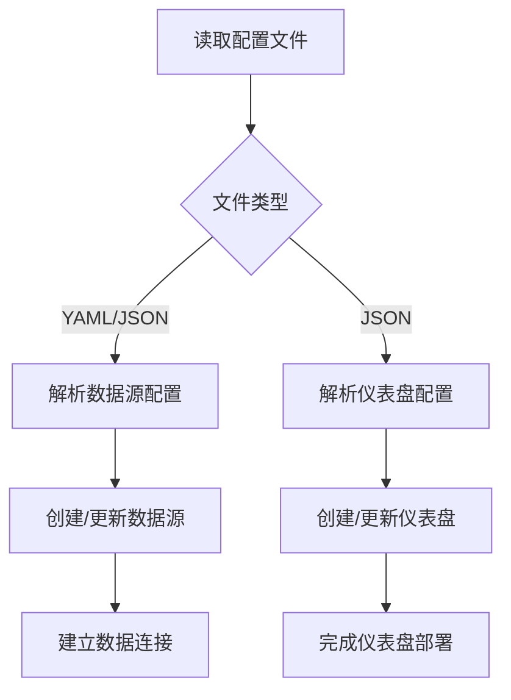
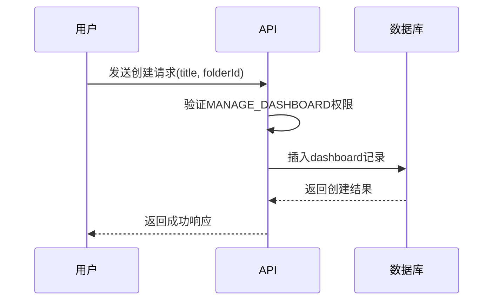
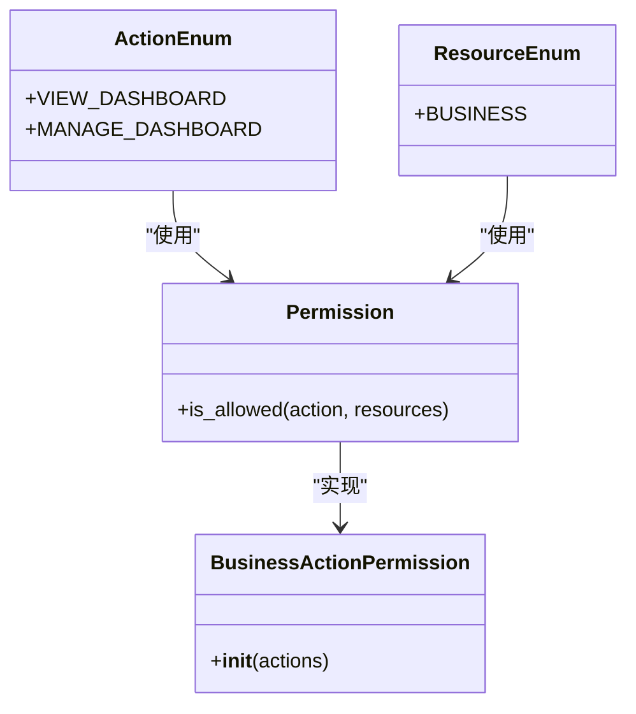
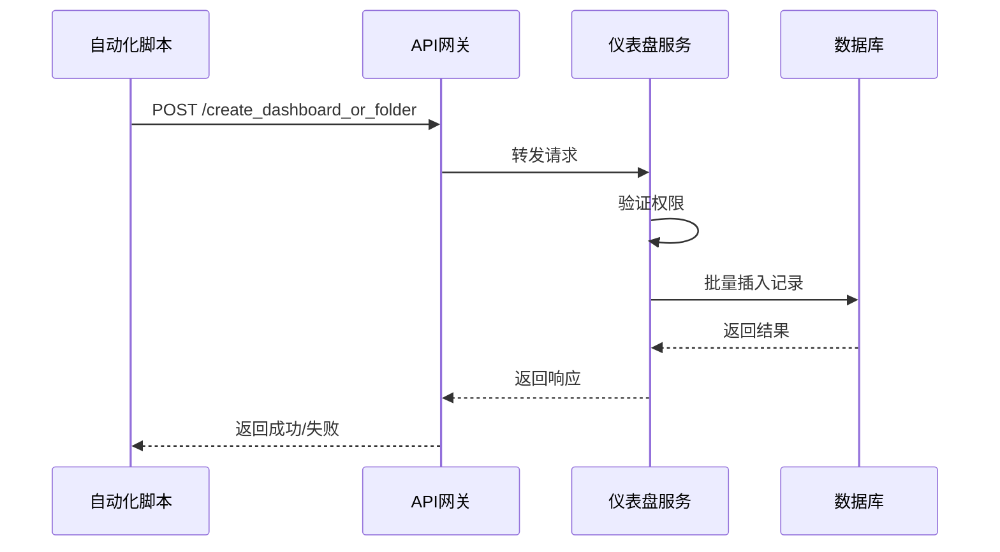
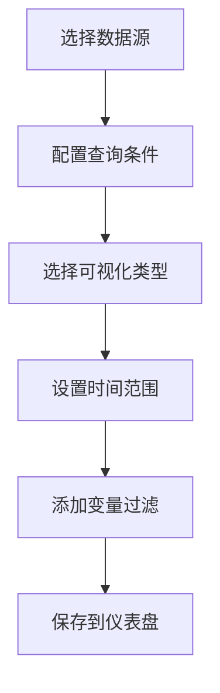
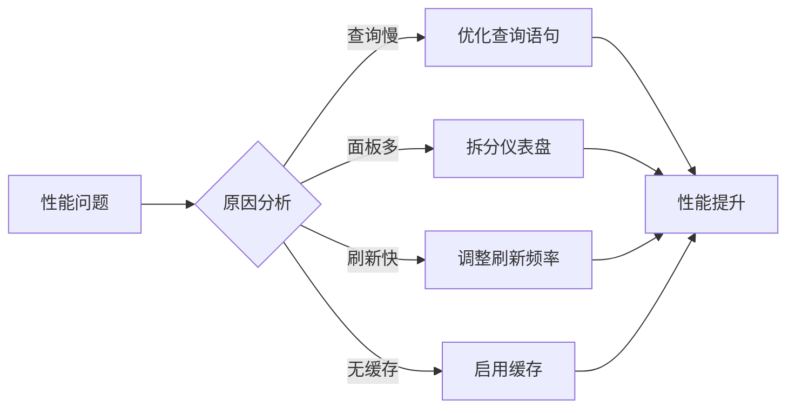

# 仪表盘管理

<cite>
**本文档引用的文件**
- [models.py](file://bklog/bk_dataview/grafana/models.py)
- [provisioning.py](file://bklog/bk_dataview/grafana/provisioning.py)
- [home_dashboard.py](file://bklog/apps/grafana/handlers/home_dashboard.py)
- [views.py](file://bklog/apps/grafana/views.py)
- [client.py](file://bklog/bk_dataview/grafana/client.py)
- [db.py](file://bklog/bk_dataview/grafana/backends/db.py)
- [api.py](file://bklog/bk_dataview/grafana/backends/api.py)
- [actions.py](file://bklog/apps/iam/handlers/actions.py)
</cite>

## 目录
1. [简介](#简介)
2. [预置仪表盘管理](#预置仪表盘管理)
3. [自定义仪表盘创建](#自定义仪表盘创建)
4. [仪表盘权限与共享](#仪表盘权限与共享)
5. [仪表盘版本控制与备份恢复](#仪表盘版本控制与备份恢复)
6. [API批量管理](#apibatch-management)
7. [业务监控仪表盘案例](#业务监控仪表盘案例)
8. [最佳实践与性能优化](#最佳实践与性能优化)

## 简介

仪表盘管理功能是蓝鲸日志平台的核心可视化组件，提供预置和自定义仪表盘的创建、导入、更新和管理能力。系统基于Grafana引擎构建，支持JSON模板配置、权限控制、共享设置和API批量操作。仪表盘与业务组织（org_id）关联，通过BKIAM进行细粒度权限管理，确保不同业务间的隔离和安全访问。

**Section sources**
- [models.py](file://bklog/bk_dataview/grafana/models.py#L119-L144)
- [actions.py](file://bklog/apps/iam/handlers/actions.py#L177-L195)

## 预置仪表盘管理

预置仪表盘通过配置文件自动注入和管理，实现标准化和自动化部署。系统使用`SimpleProvisioning`类从指定目录加载YAML/JSON配置文件，自动创建数据源和仪表盘。

### JSON模板使用方法

预置仪表盘的JSON模板遵循Grafana标准格式，包含面板、数据源、变量和布局配置。模板通过`provisioning.py`中的`Dashboard`数据类定义，关键字段包括：

- `title`: 仪表盘标题
- `dashboard`: 包含完整仪表盘配置的JSON对象
- `folder`: 所属文件夹
- `overwrite`: 是否允许覆盖现有仪表盘

配置文件通过`PROVISIONING_PATH`环境变量指定的路径加载，支持环境变量扩展。

### 配置规范

预置配置遵循YAML格式，定义数据源和仪表盘提供者。数据源配置包含类型、URL、认证信息等；仪表盘配置指定JSON文件路径和文件夹选项。系统自动处理数据源的创建、更新和删除，确保配置一致性。

**Diagram sources**
- [provisioning.py](file://bklog/bk_dataview/grafana/provisioning.py#L85-L124)
- [db.py](file://bklog/bk_dataview/grafana/backends/db.py#L35-L61)

**Section sources**
- [provisioning.py](file://bklog/bk_dataview/grafana/provisioning.py#L39-L124)
- [db.py](file://bklog/bk_dataview/grafana/backends/db.py#L35-L61)

## 自定义仪表盘创建

用户可以通过界面或API创建自定义仪表盘，系统提供完整的创建流程和管理功能。

### 创建流程

1. **命名**: 仪表盘必须有唯一名称，在同一文件夹内不能重复
2. **选择文件夹**: 可选择现有文件夹或创建新文件夹进行组织
3. **配置面板**: 添加图表、表格等可视化组件，配置数据查询
4. **设置变量**: 定义可交互的变量，实现动态过滤
5. **保存发布**: 保存仪表盘并设置访问权限

### 管理操作

通过`GrafanaViewSet`的`create_dashboard_or_folder`接口实现创建操作，需要`MANAGE_DASHBOARD`权限。系统在`dashboard`表中记录仪表盘元数据，包括标题、版本、创建/更新时间等。

**Diagram sources**
- [views.py](file://bklog/apps/grafana/views.py#L522-L543)
- [models.py](file://bklog/bk_dataview/grafana/models.py#L119-L144)

**Section sources**
- [views.py](file://bklog/apps/grafana/views.py#L522-L543)
- [client.py](file://bklog/bk_dataview/grafana/client.py#L179-L201)

## 仪表盘权限与共享

系统通过BKIAM实现细粒度的仪表盘权限控制，支持查看和管理两种权限级别。

### 权限设置

- `VIEW_DASHBOARD`: 仪表盘查看权限，允许用户访问和查看仪表盘内容
- `MANAGE_DASHBOARD`: 仪表盘管理权限，允许创建、编辑和删除仪表盘

权限与业务资源绑定，通过`BusinessActionPermission`进行验证。超级用户拥有所有权限。

### 共享配置

仪表盘共享通过文件夹和权限系统实现。用户可以将仪表盘放入共享文件夹，并为其他用户或用户组分配查看权限。系统支持收藏和最近查看功能，方便快速访问常用仪表盘。

**Diagram sources**
- [actions.py](file://bklog/apps/iam/handlers/actions.py#L177-L195)
- [views.py](file://bklog/apps/grafana/views.py#L149-L157)

**Section sources**
- [actions.py](file://bklog/apps/iam/handlers/actions.py#L177-L195)
- [views.py](file://bklog/apps/grafana/views.py#L149-L157)

## 仪表盘版本控制与备份恢复

系统内置版本控制和备份恢复机制，确保仪表盘配置的安全性和可追溯性。

### 版本控制

每个仪表盘都有版本号（version字段），每次更新时自动递增。`Dashboard`模型记录创建者、更新者、创建时间和更新时间，支持审计和回溯。系统通过`update_dashboard` API处理更新操作，保留历史版本信息。

### 备份恢复

仪表盘配置以JSON格式存储在`data`字段中，可通过导出功能备份。恢复时，系统验证JSON结构的完整性，然后创建新的仪表盘记录。支持批量导入和导出操作，便于跨环境迁移。

**Diagram sources**
- [models.py](file://bklog/bk_dataview/grafana/models.py#L121-L128)
- [client.py](file://bklog/bk_dataview/grafana/client.py#L204-L216)

**Section sources**
- [models.py](file://bklog/bk_dataview/grafana/models.py#L121-L128)
- [client.py](file://bklog/bk_dataview/grafana/client.py#L204-L216)

## API批量管理

系统提供RESTful API接口，支持批量创建、更新和管理仪表盘，便于自动化集成。

### 批量操作接口

- `create_dashboard_or_folder`: 批量创建仪表盘或文件夹
- `save_to_dashboard`: 批量保存面板到指定仪表盘
- `get_dashboard_directory_tree`: 获取仪表盘目录树，支持批量查询

### 使用示例

通过`MonitorApi`调用批量管理接口，传入业务ID、仪表盘UID列表和面板配置，实现一键部署多个监控视图。API支持JSON格式的请求体，返回操作结果和错误信息。

**Diagram sources**
- [views.py](file://bklog/apps/grafana/views.py#L522-L543)
- [monitor.py](file://bklog/apps/api/modules/monitor.py#L159-L175)

**Section sources**
- [views.py](file://bklog/apps/grafana/views.py#L522-L543)
- [monitor.py](file://bklog/apps/api/modules/monitor.py#L159-L175)

## 业务监控仪表盘案例

### 构建性能监控仪表盘

1. **添加性能指标面板**: 配置CPU使用率、内存占用、磁盘I/O等指标
2. **设置错误率图表**: 使用日志数据统计错误日志数量，计算错误率
3. **配置吞吐量监控**: 展示请求量、响应时间等性能数据
4. **添加告警状态**: 集成告警系统，显示当前告警状态

### 可视化配置

使用Grafana的查询编辑器，选择相应的数据源和指标，配置时间范围和聚合函数。通过变量实现多维度切换，如按业务、主机或时间段过滤数据。

**Diagram sources**
- [query.py](file://bklog/apps/grafana/handlers/query.py)
- [views.py](file://bklog/apps/grafana/views.py#L196-L233)

**Section sources**
- [query.py](file://bklog/apps/grafana/handlers/query.py)
- [views.py](file://bklog/apps/grafana/views.py#L196-L233)

## 最佳实践与性能优化

### 大规模管理最佳实践

1. **合理组织文件夹**: 按业务、团队或功能分类仪表盘
2. **标准化命名规范**: 使用统一的命名规则，便于搜索和管理
3. **定期清理废弃仪表盘**: 避免系统性能下降
4. **使用变量提高复用性**: 减少重复配置，提高维护效率

### 性能优化建议

1. **优化查询性能**: 避免全表扫描，使用合适的索引
2. **控制面板数量**: 单个仪表盘不宜包含过多面板
3. **合理设置刷新频率**: 根据实际需求调整数据刷新间隔
4. **使用缓存机制**: 对静态数据启用缓存，减少数据库压力

系统通过缓存机制（_ORG_DASHBOARDS_CACHE）优化仪表盘访问性能，减少数据库查询次数。建议定期监控仪表盘查询性能，及时优化慢查询。

**Diagram sources**
- [views.py](file://bklog/bk_dataview/grafana/views.py#L46-L49)
- [client.py](file://bklog/bk_dataview/grafana/client.py)

**Section sources**
- [views.py](file://bklog/bk_dataview/grafana/views.py#L46-L49)
- [client.py](file://bklog/bk_dataview/grafana/client.py)