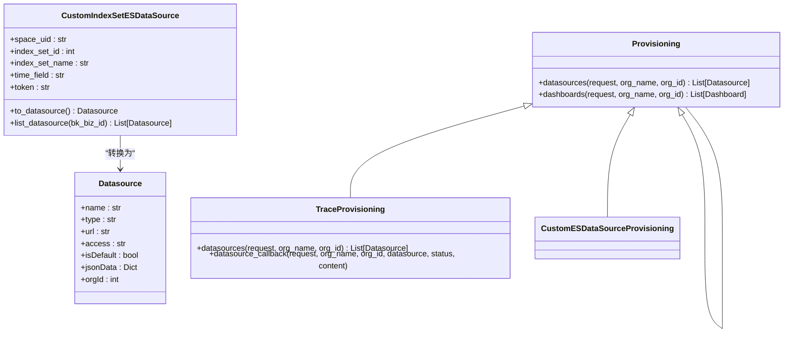

# 可视化

<cite>
**本文档引用的文件**
- [views.py](file://bklog/apps/grafana/views.py)
- [data_source.py](file://bklog/apps/grafana/data_source.py)
- [query.py](file://bklog/apps/grafana/handlers/query.py)
- [provisioning.py](file://bklog/apps/grafana/provisioning.py)
- [urls.py](file://bklog/apps/grafana/urls.py)
- [serializers.py](file://bklog/apps/grafana/serializers.py)
- [home_dashboard.py](file://bklog/apps/grafana/handlers/home_dashboard.py)
- [client.py](file://bklog/bk_dataview/grafana/client.py)
- [monitor.py](file://bklog/apps/api/modules/monitor.py)
- [chart_handlers.py](file://bklog/apps/log_search/handlers/search/chart_handlers.py)
- [model.py](file://bklog/apps/grafana/model.py)
</cite>

## 目录
1. [引言](#引言)
2. [Grafana集成机制](#grafana集成机制)
3. [数据源配置](#数据源配置)
4. [仪表盘管理](#仪表盘管理)
5. [查询接口](#查询接口)
6. [自定义仪表盘创建流程](#自定义仪表盘创建流程)
7. [预置仪表盘管理](#预置仪表盘管理)
8. [可视化查询处理流程](#可视化查询处理流程)
9. [业务监控仪表盘案例](#业务监控仪表盘案例)
10. [性能优化建议](#性能优化建议)

## 引言
本文档详细介绍了蓝鲸日志平台的可视化功能，重点阐述了Grafana集成机制、数据源配置、仪表盘管理、查询接口等核心组件。文档涵盖了自定义仪表盘的创建流程、预置仪表盘的管理和更新机制，以及可视化查询的完整处理链路。通过实际案例展示了如何构建业务监控仪表盘，并提供了性能优化建议和大规模仪表盘管理的最佳实践。

## Grafana集成机制
蓝鲸日志平台通过深度集成Grafana实现了强大的可视化能力。系统采用代理模式将Grafana嵌入到平台中，通过自定义视图和API接口实现功能扩展。

**图表来源**
- [views.py](file://bklog/apps/grafana/views.py#L67-L100)
- [home_dashboard.py](file://bklog/apps/grafana/handlers/home_dashboard.py#L27-L130)

**部分来源**
- [views.py](file://bklog/apps/grafana/views.py#L67-L100)
- [home_dashboard.py](file://bklog/apps/grafana/handlers/home_dashboard.py#L27-L130)

## 数据源配置
系统支持多种数据源配置方式，包括标准数据源、追踪数据源和自定义ES数据源。数据源的创建和管理通过Provisioning机制实现。

### 数据源类型
系统支持以下三种主要数据源类型：

**图表来源**
- [provisioning.py](file://bklog/apps/grafana/provisioning.py#L36-L126)
- [data_source.py](file://bklog/apps/grafana/data_source.py#L46-L152)
- [client.py](file://bklog/bk_dataview/grafana/client.py#L39-L128)

**部分来源**
- [provisioning.py](file://bklog/apps/grafana/provisioning.py#L36-L126)
- [data_source.py](file://bklog/apps/grafana/data_source.py#L46-L152)

### 数据源配置流程
数据源配置遵循以下流程：

**图表来源**
- [provisioning.py](file://bklog/apps/grafana/provisioning.py#L36-L126)
- [model.py](file://bklog/apps/grafana/model.py#L25-L29)

**部分来源**
- [provisioning.py](file://bklog/apps/grafana/provisioning.py#L36-L126)
- [model.py](file://bklog/apps/grafana/model.py#L25-L29)

## 仪表盘管理
系统提供了完整的仪表盘管理功能，包括创建、更新、删除和权限控制。

### 仪表盘操作API
主要的仪表盘操作通过以下API接口实现：

**图表来源**
- [views.py](file://bklog/apps/grafana/views.py#L522-L565)
- [monitor.py](file://bklog/apps/api/modules/monitor.py#L159-L175)
- [urls.py](file://bklog/apps/grafana/urls.py#L39-L58)

**部分来源**
- [views.py](file://bklog/apps/grafana/views.py#L522-L565)
- [monitor.py](file://bklog/apps/api/modules/monitor.py#L159-L175)

### 仪表盘权限控制
系统通过IAM权限系统对仪表盘操作进行细粒度控制：

**图表来源**
- [views.py](file://bklog/apps/grafana/views.py#L150-L157)
- [actions.py](file://bklog/apps/iam/handlers/actions.py#L177-L195)

**部分来源**
- [views.py](file://bklog/apps/grafana/views.py#L150-L157)

## 查询接口
系统提供了丰富的查询接口，支持指标查询、日志查询和变量查询等多种查询方式。

### 查询接口设计
查询接口采用统一的API设计模式：

**图表来源**
- [query.py](file://bklog/apps/grafana/handlers/query.py#L59-L800)
- [serializers.py](file://bklog/apps/grafana/serializers.py#L54-L86)
- [serializers.py](file://bklog/apps/grafana/serializers.py#L73-L85)

**部分来源**
- [query.py](file://bklog/apps/grafana/handlers/query.py#L59-L800)
- [serializers.py](file://bklog/apps/grafana/serializers.py#L54-L86)

### 查询处理流程
查询请求的处理流程如下：

**图表来源**
- [query.py](file://bklog/apps/grafana/handlers/query.py#L278-L405)
- [query.py](file://bklog/apps/grafana/handlers/query.py#L407-L463)

**部分来源**
- [query.py](file://bklog/apps/grafana/handlers/query.py#L278-L463)

## 自定义仪表盘创建流程
创建自定义仪表盘涉及多个步骤，包括图表类型选择、查询配置和布局设计。

### 创建流程
自定义仪表盘的创建流程如下：

**部分来源**
- [views.py](file://bklog/apps/grafana/views.py#L545-L565)
- [serializers.py](file://bklog/apps/grafana/serializers.py#L127-L137)

### 图表类型配置
系统支持多种图表类型，每种类型有不同的配置参数：

**图表来源**
- [log.py](file://bklog/apps/log_trace/handlers/proto/log.py#L93-L131)
- [trace_field_handlers.py](file://bklog/apps/log_trace/handlers/trace_field_handlers.py#L127-L151)

## 预置仪表盘管理
系统提供了预置仪表盘的管理和更新机制，确保用户能够快速使用标准化的监控视图。

### 预置仪表盘更新机制
预置仪表盘的更新流程如下：

**部分来源**
- [provisioning.py](file://bklog/apps/grafana/provisioning.py#L36-L126)

## 可视化查询处理流程
从Grafana请求到后端数据查询再到结果返回的完整链路如下：

**图表来源**
- [views.py](file://bklog/apps/grafana/views.py#L196-L233)
- [query.py](file://bklog/apps/grafana/handlers/query.py#L278-L405)
- [chart_handlers.py](file://bklog/apps/log_search/handlers/search/chart_handlers.py#L484-L502)

**部分来源**
- [views.py](file://bklog/apps/grafana/views.py#L196-L233)
- [query.py](file://bklog/apps/grafana/handlers/query.py#L278-L405)

## 业务监控仪表盘案例
以下是一个构建业务监控仪表盘的实际案例，展示如何可视化关键指标。

### 案例：性能监控仪表盘
构建一个性能监控仪表盘，包含以下关键指标：

**部分来源**
- [query.py](file://bklog/apps/grafana/handlers/query.py#L278-L405)
- [chart_handlers.py](file://bklog/apps/log_search/handlers/search/chart_handlers.py#L484-L502)

## 性能优化建议
为确保可视化系统的高性能运行，建议采取以下优化措施：

### 查询性能优化

**部分来源**
- [query.py](file://bklog/apps/grafana/handlers/query.py#L278-L405)
- [chart_handlers.py](file://bklog/apps/log_search/handlers/search/chart_handlers.py#L484-L502)

### 大规模仪表盘管理最佳实践

**部分来源**
- [views.py](file://bklog/apps/grafana/views.py#L522-L565)
- [provisioning.py](file://bklog/apps/grafana/provisioning.py#L36-L126)