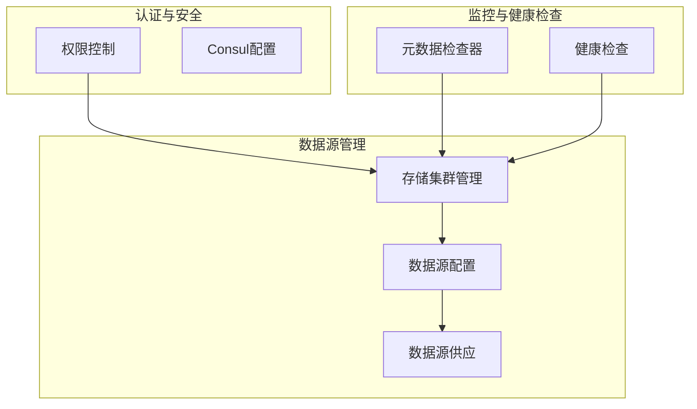
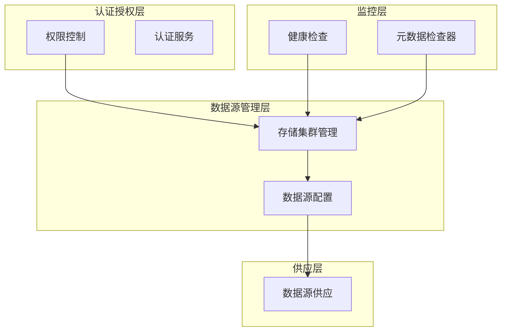
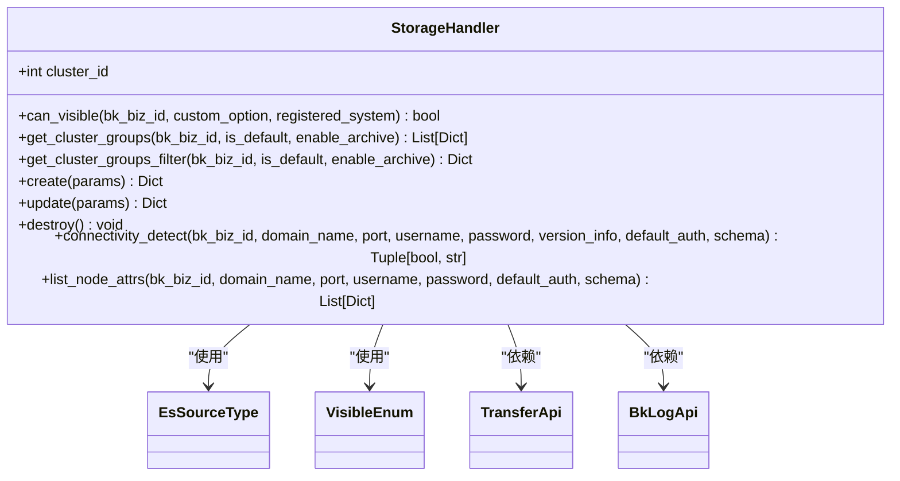
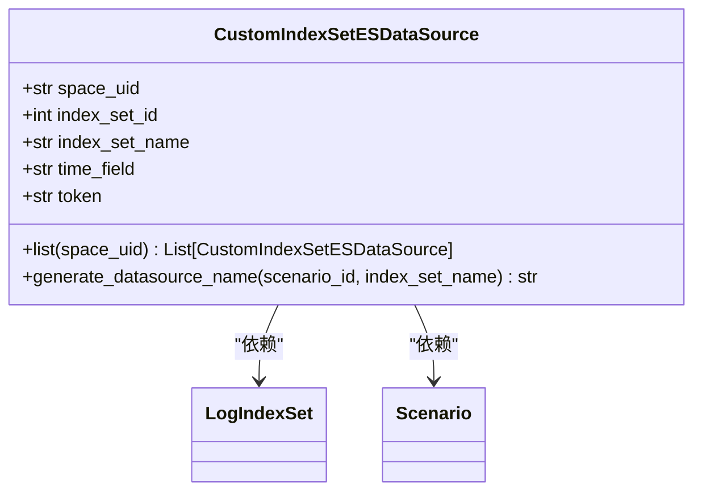
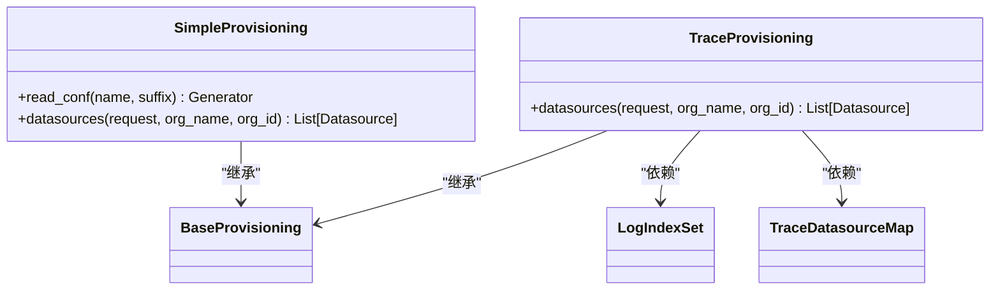
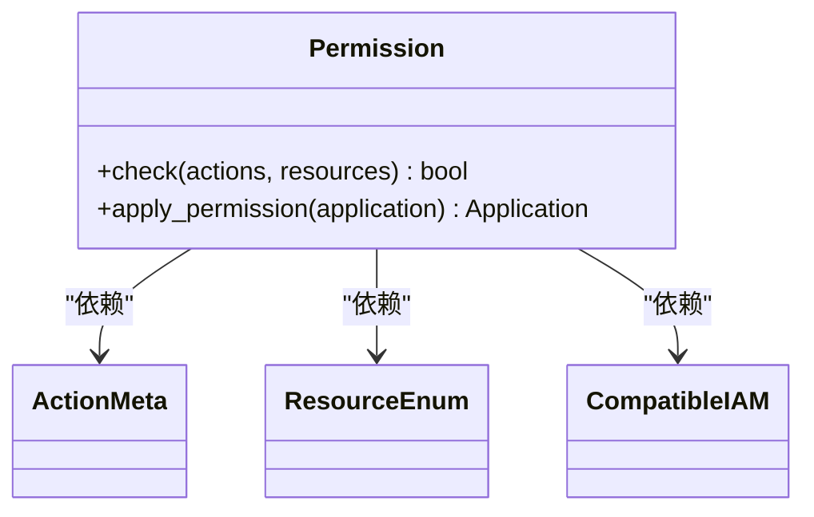
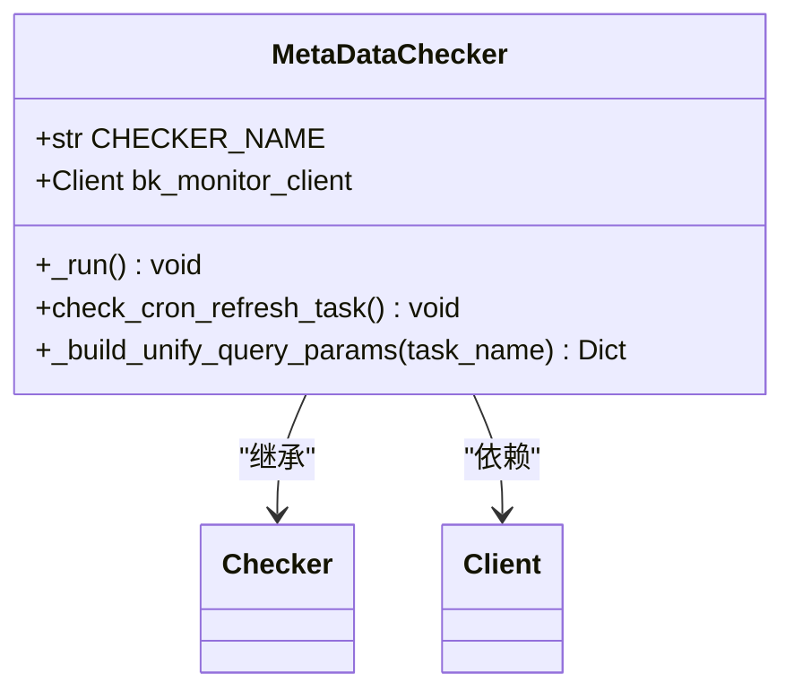
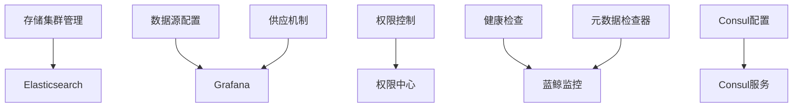

# 数据源配置

<cite>
**本文档引用的文件**
- [storage.py](file://bklog/apps/log_databus/handlers/storage.py)
- [data_source.py](file://bklog/apps/grafana/data_source.py)
- [provisioning.py](file://bklog/apps/grafana/provisioning.py)
- [type_constants.py](file://bklog/apps/log_esquery/type_constants.py)
- [constants.py](file://bklog/apps/log_esquery/constants.py)
- [consul.py](file://bklog/apps/utils/consul.py)
- [permission.py](file://bklog/apps/iam/handlers/permission.py)
- [metadata_checker.py](file://bklog/apps/log_databus/handlers/check_collector/checker/metadata_checker.py)
</cite>

## 目录
1. [引言](#引言)
2. [项目结构](#项目结构)
3. [核心组件](#核心组件)
4. [架构概述](#架构概述)
5. [详细组件分析](#详细组件分析)
6. [依赖分析](#依赖分析)
7. [性能考虑](#性能考虑)
8. [故障排除指南](#故障排除指南)
9. [结论](#结论)

## 引言
本文档详细介绍了蓝鲸日志平台的数据源配置功能，涵盖支持的数据源类型、认证机制、安全配置、健康检查、多租户隔离策略以及性能调优等方面。文档旨在为用户提供全面的配置指导和最佳实践。

## 项目结构
蓝鲸日志平台的数据源配置功能主要分布在`bklog`应用中，涉及多个子模块和组件。核心功能包括数据源管理、认证授权、健康检查和监控等。

**图示来源**
- [storage.py](file://bklog/apps/log_databus/handlers/storage.py#L83-L200)
- [data_source.py](file://bklog/apps/grafana/data_source.py#L62-L96)
- [provisioning.py](file://bklog/apps/grafana/provisioning.py#L55-L80)

**章节来源**
- [storage.py](file://bklog/apps/log_databus/handlers/storage.py#L1-L200)
- [data_source.py](file://bklog/apps/grafana/data_source.py#L1-L100)

## 核心组件
数据源配置的核心组件包括存储集群管理、数据源配置、供应机制、权限控制和健康检查等。这些组件协同工作，确保数据源的稳定性和安全性。

**章节来源**
- [storage.py](file://bklog/apps/log_databus/handlers/storage.py#L83-L200)
- [data_source.py](file://bklog/apps/grafana/data_source.py#L62-L96)

## 架构概述
蓝鲸日志平台的数据源配置架构采用分层设计，包括数据源管理层、认证授权层、监控层和供应层。各层之间通过API进行通信，确保系统的灵活性和可扩展性。

**图示来源**
- [storage.py](file://bklog/apps/log_databus/handlers/storage.py#L83-L200)
- [data_source.py](file://bklog/apps/grafana/data_source.py#L62-L96)
- [provisioning.py](file://bklog/apps/grafana/provisioning.py#L55-L80)

## 详细组件分析

### 存储集群管理分析
存储集群管理组件负责管理Elasticsearch等数据存储集群的配置和状态。它提供了创建、更新、删除和连通性检测等功能。

#### 存储集群管理类

**图示来源**
- [storage.py](file://bklog/apps/log_databus/handlers/storage.py#L83-L200)

**章节来源**
- [storage.py](file://bklog/apps/log_databus/handlers/storage.py#L83-L200)

### 数据源配置分析
数据源配置组件负责管理Grafana中的数据源配置，包括列表获取、数据源名称生成等。

#### 数据源配置类

**图示来源**
- [data_source.py](file://bklog/apps/grafana/data_source.py#L62-L96)

**章节来源**
- [data_source.py](file://bklog/apps/grafana/data_source.py#L62-L96)

### 供应机制分析
供应机制组件负责将数据源配置同步到Grafana中，确保数据源的自动创建和更新。

#### 供应机制类

**图示来源**
- [provisioning.py](file://bklog/apps/grafana/provisioning.py#L55-L80)
- [provisioning.py](file://bklog/bk_dataview/grafana/provisioning.py#L85-L108)

**章节来源**
- [provisioning.py](file://bklog/apps/grafana/provisioning.py#L55-L80)
- [provisioning.py](file://bklog/bk_dataview/grafana/provisioning.py#L85-L108)

### 认证与权限分析
认证与权限组件负责管理数据源的访问权限和认证信息，确保数据的安全性。

#### 权限控制类

**图示来源**
- [permission.py](file://bklog/apps/iam/handlers/permission.py#L57-L60)

**章节来源**
- [permission.py](file://bklog/apps/iam/handlers/permission.py#L57-L60)

### 健康检查分析
健康检查组件负责定期检查数据源的连通性和状态，确保数据源的可用性。

#### 元数据检查器类

**图示来源**
- [metadata_checker.py](file://bklog/apps/log_databus/handlers/check_collector/checker/metadata_checker.py#L35-L106)

**章节来源**
- [metadata_checker.py](file://bklog/apps/log_databus/handlers/check_collector/checker/metadata_checker.py#L35-L106)

## 依赖分析
数据源配置功能依赖于多个外部组件和服务，包括Elasticsearch、Grafana、Consul和蓝鲸监控API等。这些依赖关系确保了系统的完整性和功能性。

**图示来源**
- [storage.py](file://bklog/apps/log_databus/handlers/storage.py#L83-L200)
- [data_source.py](file://bklog/apps/grafana/data_source.py#L62-L96)
- [provisioning.py](file://bklog/apps/grafana/provisioning.py#L55-L80)
- [permission.py](file://bklog/apps/iam/handlers/permission.py#L57-L60)
- [metadata_checker.py](file://bklog/apps/log_databus/handlers/check_collector/checker/metadata_checker.py#L35-L106)
- [consul.py](file://bklog/apps/utils/consul.py#L84-L102)

**章节来源**
- [storage.py](file://bklog/apps/log_databus/handlers/storage.py#L83-L200)
- [data_source.py](file://bklog/apps/grafana/data_source.py#L62-L96)
- [provisioning.py](file://bklog/apps/grafana/provisioning.py#L55-L80)
- [permission.py](file://bklog/apps/iam/handlers/permission.py#L57-L60)
- [metadata_checker.py](file://bklog/apps/log_databus/handlers/check_collector/checker/metadata_checker.py#L35-L106)
- [consul.py](file://bklog/apps/utils/consul.py#L84-L102)

## 性能考虑
在配置数据源时，需要考虑性能因素，如连接池大小、查询超时时间、缓存策略等。合理配置这些参数可以提高系统的响应速度和稳定性。

## 故障排除指南
当数据源配置出现问题时，可以通过以下步骤进行排查：
1. 检查数据源的连通性。
2. 查看日志文件中的错误信息。
3. 验证认证信息是否正确。
4. 检查权限配置是否正确。
5. 确认依赖服务是否正常运行。

**章节来源**
- [storage.py](file://bklog/apps/log_databus/handlers/storage.py#L782-L830)
- [metadata_checker.py](file://bklog/apps/log_databus/handlers/check_collector/checker/metadata_checker.py#L51-L73)

## 结论
本文档详细介绍了蓝鲸日志平台的数据源配置功能，涵盖了从配置到监控的各个方面。通过遵循本文档中的指导，用户可以有效地管理和维护数据源，确保系统的稳定性和安全性。