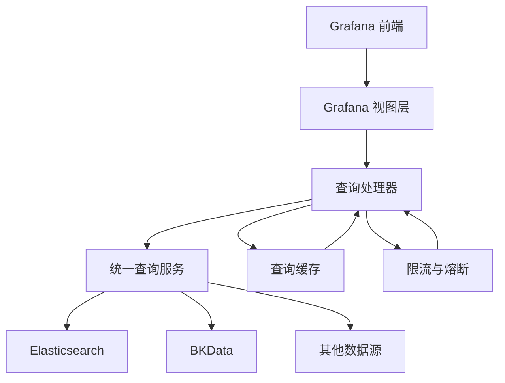
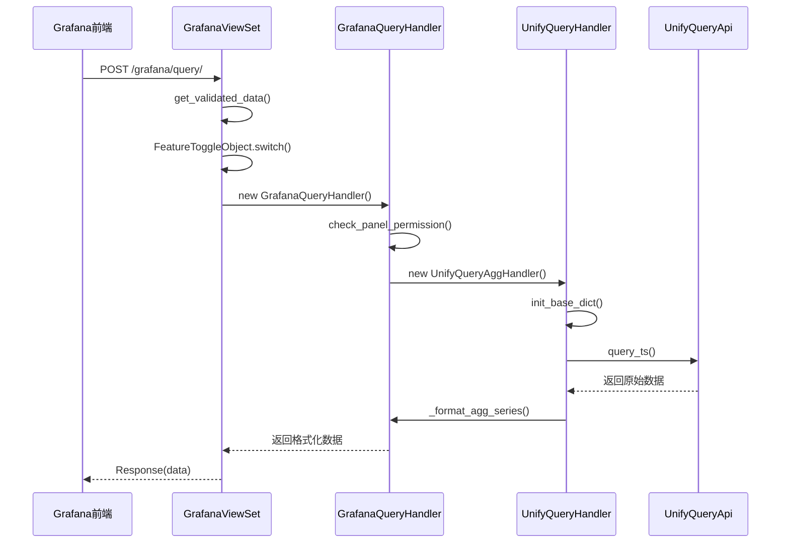
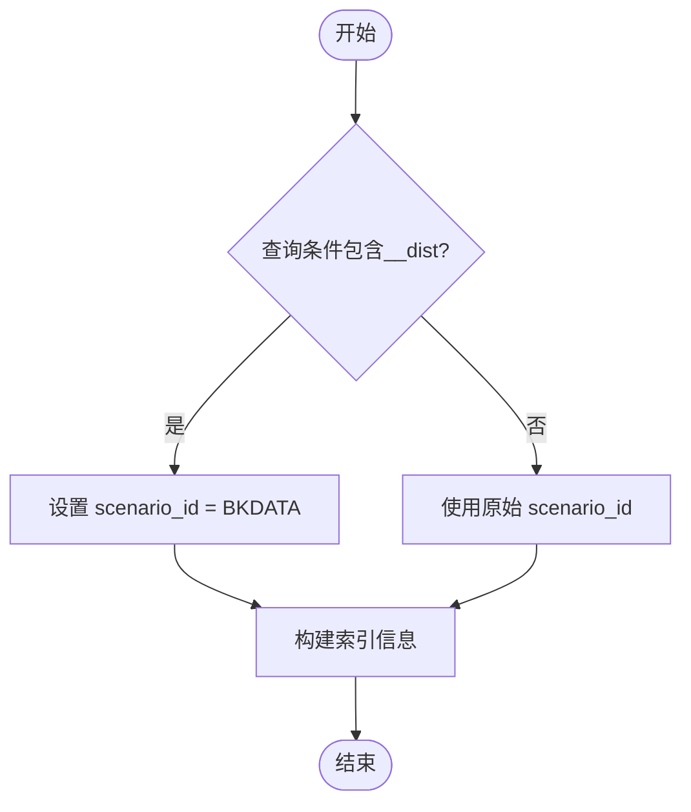
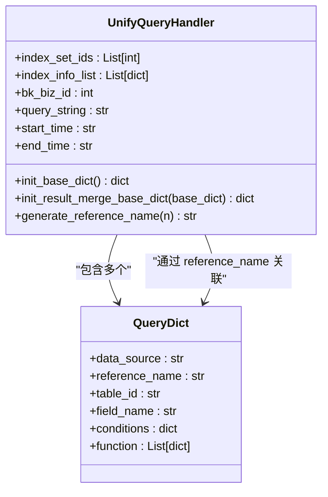
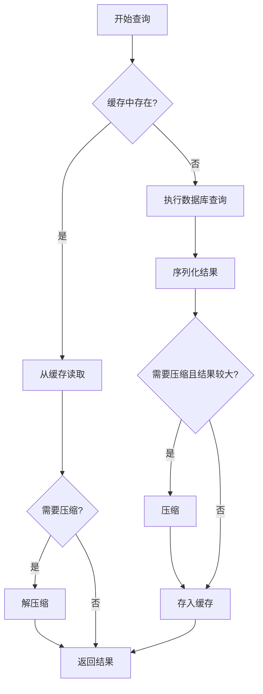
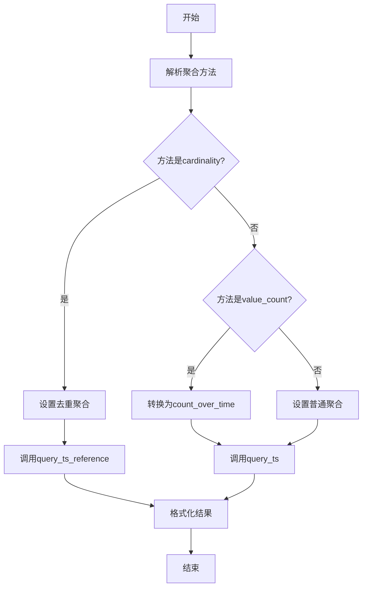
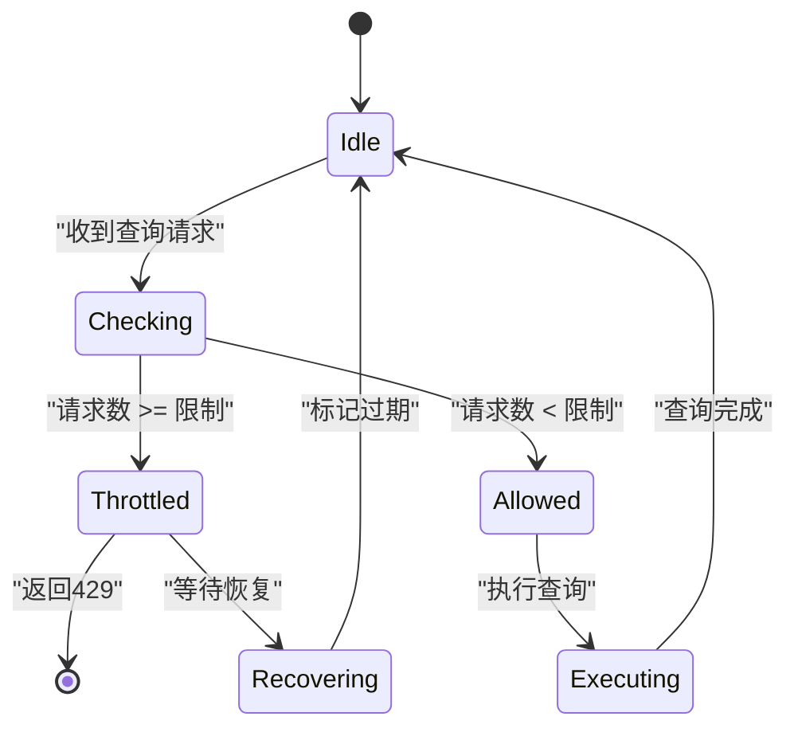

# 查询处理

<cite>
**本文档引用的文件**   
- [query.py](file://bklog/apps/grafana/handlers/query.py)
- [base.py](file://bklog/apps/log_unifyquery/handler/base.py)
- [agg.py](file://bklog/apps/log_unifyquery/handler/agg.py)
- [chart.py](file://bklog/apps/log_unifyquery/handler/chart.py)
- [terms_aggs.py](file://bklog/apps/log_unifyquery/handler/terms_aggs.py)
- [field.py](file://bklog/apps/log_unifyquery/handler/field.py)
- [qos.py](file://bklog/apps/log_esquery/qos.py)
- [cache.py](file://bklog/apps/utils/cache.py)
- [views.py](file://bklog/apps/grafana/views.py)
- [urls.py](file://bklog/apps/log_unifyquery/urls.py)
</cite>

## 目录
1. [引言](#引言)
2. [查询处理架构](#查询处理架构)
3. [Grafana查询请求处理流程](#grafana查询请求处理流程)
4. [多数据源查询路由与结果聚合](#多数据源查询路由与结果聚合)
5. [查询性能优化技术](#查询性能优化技术)
6. [复杂查询处理](#复杂查询处理)
7. [慢查询优化与大规模数据集处理](#慢查询优化与大规模数据集处理)
8. [查询稳定性保障机制](#查询稳定性保障机制)
9. [结论](#结论)

## 引言
本文档详细介绍了蓝鲸监控平台中查询处理功能的设计与实现。重点阐述了Grafana查询请求的完整处理链路，包括从HTTP请求接收、参数解析、查询构建到结果返回的全过程。文档深入分析了多数据源查询的路由机制、结果聚合策略以及查询性能优化技术，如查询缓存、并发控制和结果压缩。同时，文档还涵盖了复杂查询的处理方式，如时间序列聚合、指标计算和跨数据源查询，并提供了优化慢查询和处理大规模数据集的实际案例。最后，文档介绍了查询限流、熔断等稳定性保障机制的配置方法。

## 查询处理架构
蓝鲸监控平台的查询处理架构采用分层设计，主要包括以下几个核心组件：

- **Grafana视图层 (Grafana Views)**: 负责接收来自Grafana前端的HTTP请求，进行参数验证和权限校验，然后将请求分发到相应的处理器。
- **查询处理器 (Query Handlers)**: 核心业务逻辑层，负责解析查询参数、构建查询语句、调用底层API执行查询，并对结果进行格式化处理。
- **统一查询服务 (Unify Query Service)**: 提供统一的查询接口，支持对多种数据源（如Elasticsearch、BKData等）的查询，并负责查询的路由和结果聚合。
- **性能与稳定性保障层**: 包括查询缓存、限流、熔断等机制，确保系统在高并发场景下的稳定性和响应速度。

**图示来源**
- [views.py](file://bklog/apps/grafana/views.py#L196-L266)
- [query.py](file://bklog/apps/grafana/handlers/query.py#L59-L825)
- [base.py](file://bklog/apps/log_unifyquery/handler/base.py#L98-L1486)

## Grafana查询请求处理流程
Grafana查询请求的处理流程是一个典型的RESTful API处理链路，从HTTP请求接收到最终结果返回，主要经过以下几个步骤：

1.  **请求接收与路由**: 当Grafana发起查询请求时，Django的URL路由系统会根据请求路径（如`/grafana/query/`）将请求映射到`GrafanaViewSet`的`query`方法。
2.  **参数验证与反序列化**: `get_validated_data`方法会根据预定义的`QuerySerializer`对请求参数进行验证和反序列化，确保输入数据的合法性。
3.  **功能开关判断**: 系统会检查`UNIFY_QUERY_SEARCH`功能开关，决定是使用旧的查询逻辑还是新的统一查询逻辑。
4.  **查询处理器调用**: 根据功能开关的结果，创建`GrafanaQueryHandler`实例，并调用其`unify_query`或`query`方法来处理具体的查询逻辑。
5.  **权限校验**: 在查询执行前，会进行面板权限校验，确保用户有权访问所查询的索引集。
6.  **查询构建与执行**: 查询处理器会根据参数构建底层查询语句（如Elasticsearch的DSL），并调用相应的API（如`UnifyQueryApi`）执行查询。
7.  **结果格式化**: 将从底层API获取的原始数据转换为Grafana期望的`TimeSeries`或`Table`格式。
8.  **结果返回**: 将格式化后的结果通过`Response`对象返回给Grafana前端。

**图示来源**
- [views.py](file://bklog/apps/grafana/views.py#L196-L233)
- [query.py](file://bklog/apps/grafana/handlers/query.py#L407-L462)
- [base.py](file://bklog/apps/log_unifyquery/handler/base.py#L580-L625)
- [agg.py](file://bklog/apps/log_unifyquery/handler/agg.py#L19-L48)

## 多数据源查询路由与结果聚合
系统支持对多个数据源的联合查询，其核心在于`UnifyQueryHandler`的路由和聚合机制。

### 查询路由机制
查询路由主要通过`_init_index_info_list`方法实现。该方法会遍历所有`index_set_ids`，并为每个索引集初始化其信息，包括场景ID（`scenario_id`）、存储集群ID和索引列表。特别地，系统会根据查询条件中的特殊字段（如`__dist`）来判断是否需要走聚类路由，此时会将`scenario_id`切换为`BKDATA`，并使用聚类结果表。

**图示来源**
- [base.py](file://bklog/apps/log_unifyquery/handler/base.py#L295-L334)

### 结果聚合策略
对于多数据源查询，系统采用“引用名（reference_name）”和“度量合并（metric_merge）”的策略来聚合结果。

1.  **引用名生成**: 为每个查询生成一个唯一的引用名（如a, b, c...），这通过`generate_reference_name`方法实现。
2.  **查询列表构建**: 在`init_base_dict`方法中，为每个索引集创建一个查询字典，并将其添加到`query_list`中。
3.  **度量合并表达式**: 使用`metric_merge`字段定义如何合并多个查询的结果，例如`"a + b"`表示将两个查询的结果相加。

**图示来源**
- [base.py](file://bklog/apps/log_unifyquery/handler/base.py#L580-L625)
- [base.py](file://bklog/apps/log_unifyquery/handler/base.py#L550-L561)

## 查询性能优化技术
为了提升查询性能和用户体验，系统实现了多种优化技术。

### 查询缓存
系统广泛使用Redis缓存来避免重复查询。`using_cache`装饰器是核心实现，它支持：
- **键名格式化**: 支持通过`format`动态生成缓存键。
- **MD5哈希**: 对包含特殊字符的键名进行MD5哈希，确保Redis键的合法性。
- **结果压缩**: 对于大结果集，使用`zlib`进行压缩存储，节省内存空间。
- **多级缓存**: 提供了从30秒到24小时不等的多种缓存策略（如`cache_five_minute`, `cache_one_hour`）。

**图示来源**
- [cache.py](file://bklog/apps/utils/cache.py#L36-L136)

### 并发控制与结果压缩
- **并发控制**: 系统通过`UnifyQueryApi`的异步接口（如`query_ts_raw_with_scroll`）来处理大数据量的查询，避免单次请求超时。
- **结果压缩**: 如上所述，`using_cache`装饰器内置了对`zlib`压缩的支持，有效减少了网络传输和内存占用。

## 复杂查询处理
系统支持多种复杂查询场景，包括时间序列聚合、指标计算和跨数据源查询。

### 时间序列聚合
时间序列聚合由`UnifyQueryAggHandler`处理。它支持多种聚合方法（如COUNT, SUM, AVG, UNIQUE_COUNT），并能根据时间间隔（interval）对数据进行分组。

**图示来源**
- [agg.py](file://bklog/apps/log_unifyquery/handler/agg.py#L19-L48)

### 指标计算
`UnifyQueryFieldHandler`提供了丰富的指标计算功能，包括：
- `get_total_count`: 获取总条数
- `get_distinct_count`: 获取去重计数
- `get_topk_list`: 获取TopK聚合列表
- `get_bucket_data`: 计算分桶数据

### 跨数据源查询
通过`UnifyQueryChartHandler`，系统支持使用SQL语法进行跨数据源查询。`init_base_dict`方法会为每个索引集构建一个包含SQL语句的查询，并通过`is_merge_db=True`参数指示后端进行数据库合并。

## 慢查询优化与大规模数据集处理
针对慢查询和大规模数据集，系统提供了以下优化策略：

1.  **合理的聚合周期**: `_init_default_interval`方法会根据查询时间范围自动选择合适的聚合周期（如1m, 5m, 1h），避免在长时间范围内进行过细粒度的聚合。
2.  **分页与滚动查询**: 对于日志下载等大数据量场景，使用`query_ts_raw_with_scroll`接口进行分页查询，避免内存溢出。
3.  **预查询优化**: `query_ts_raw`方法支持预查询（pre_search），通过提前加载部分数据来优化首次查询的体验。
4.  **结果字段分析**: `_analyze_field_length`方法会动态分析返回结果中各字段的最大长度，为前端展示提供优化建议。

## 查询稳定性保障机制
为了保障系统在高负载下的稳定性，实现了查询限流和熔断机制。

### 查询限流 (QoS)
系统通过`QosThrottle`类实现基于Redis的查询限流。

- **令牌生成**: 每次查询请求时，`esquery_qos`函数会生成一个唯一令牌（token）并将其与过期时间戳一起存入Redis的有序集合（ZSET）。
- **窗口计数**: `get_window_count`函数会计算当前时间窗口内（如1分钟）的请求数量。
- **限流判断**: `allow_request`方法会检查当前窗口内的请求数是否超过阈值（`BKLOG_QOS_LIMIT`）。如果超过，则在缓存中设置一个“禁止标记”，后续请求在标记有效期内将被直接拒绝。

**图示来源**
- [qos.py](file://bklog/apps/log_esquery/qos.py#L118-L141)

### 熔断机制
虽然代码中未直接体现Hystrix式的熔断器，但限流机制本身起到了类似熔断的作用。当系统检测到某个应用或索引集的查询过于频繁时，会主动拒绝其后续请求，防止故障扩散，保护后端服务。

## 结论
本文档详细阐述了蓝鲸监控平台查询处理功能的完整实现。系统通过分层架构、统一查询服务、缓存、限流等多种技术手段，构建了一个高性能、高可用的查询引擎。它不仅支持Grafana等前端工具的实时数据展示，还能有效处理复杂的聚合分析和大规模数据集查询。未来可以进一步优化查询计划器，实现更智能的查询优化，并增强对流式数据的实时分析能力。