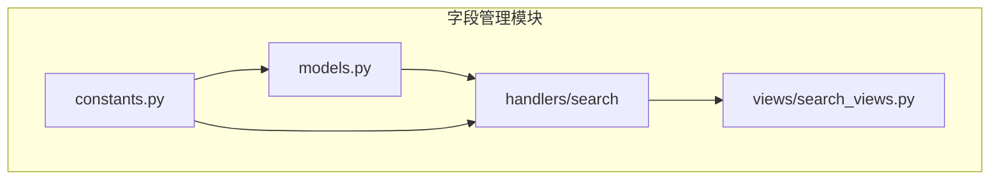
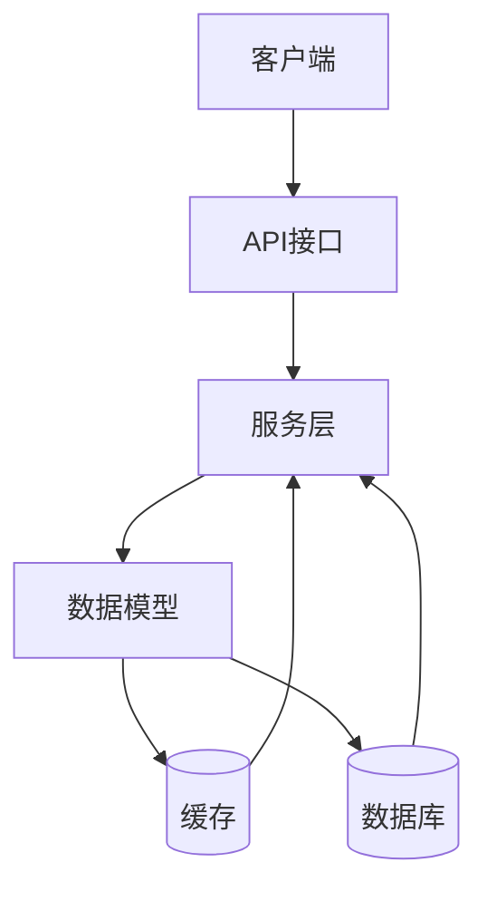
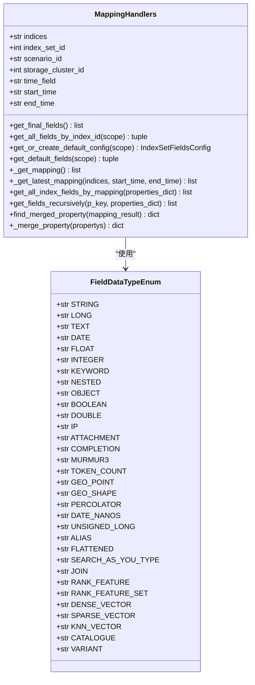
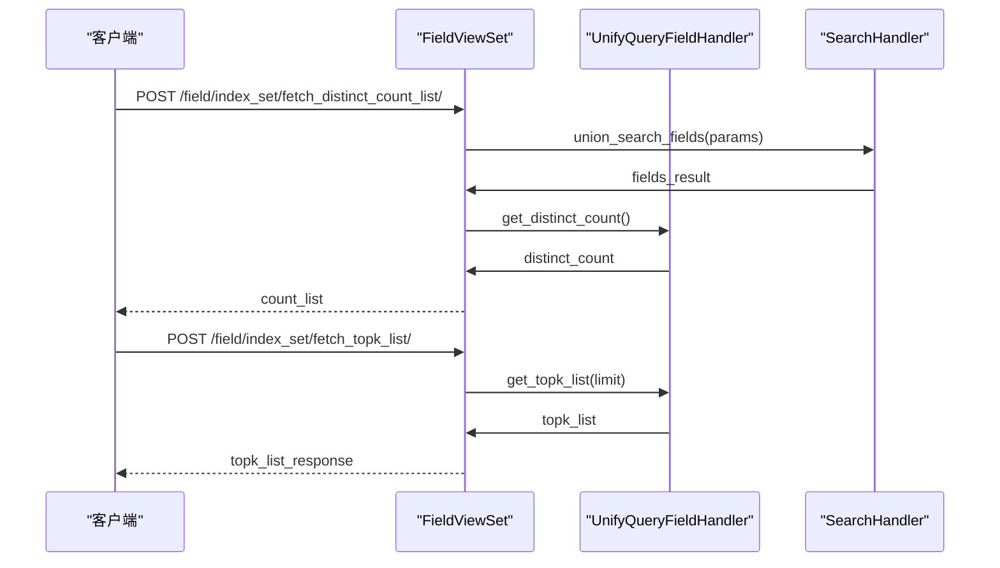
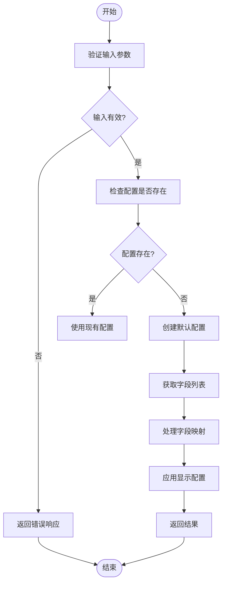
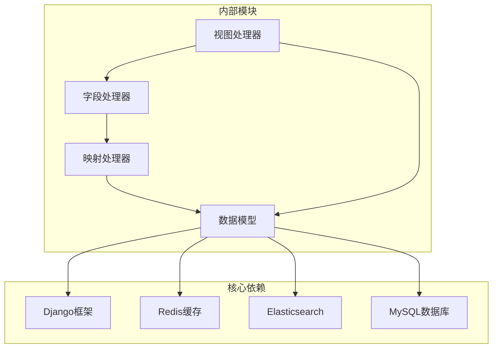

# 字段管理

<cite>
**本文档引用的文件**   
- [field_handlers.py](file://bklog/apps/log_search/handlers/search/field_handlers.py)
- [field_views.py](file://bklog/apps/log_search/views/field_views.py)
- [models.py](file://bklog/apps/log_search/models.py)
- [constants.py](file://bklog/apps/log_search/constants.py)
- [mapping_handlers.py](file://bklog/apps/log_search/handlers/search/mapping_handlers.py)
- [field.py](file://bklog/apps/log_unifyquery/handler/field.py)
- [search_views.py](file://bklog/apps/log_search/views/search_views.py)
</cite>

## 目录
1. [简介](#简介)
2. [项目结构](#项目结构)
3. [核心组件](#核心组件)
4. [架构概述](#架构概述)
5. [详细组件分析](#详细组件分析)
6. [依赖分析](#依赖分析)
7. [性能考虑](#性能考虑)
8. [故障排除指南](#故障排除指南)
9. [结论](#结论)
10. [附录](#附录)（如有必要）

## 简介
本文档详细介绍了日志搜索字段管理功能的实现机制。系统通过索引集（LogIndexSet）管理日志字段，支持字段提取、类型识别、索引映射等核心技术。字段配置功能涵盖字段别名设置、显示控制、排序配置等环节。系统实现了动态字段发现、字段类型转换、嵌套字段处理等高级功能。通过API可以管理字段配置，包括字段过滤、分组设置、自定义字段等操作。性能优化策略包括缓存机制、懒加载、批量处理等技术实现。文档还包含常见问题排查指南，如字段缺失、类型错误、映射异常等场景的解决方案。

## 项目结构
日志搜索字段管理功能主要分布在`bklog/apps/log_search`目录下，核心组件包括字段处理器、视图处理器、模型定义和常量定义。系统通过索引集模型管理字段配置，支持多种字段类型和显示控制。

**Diagram sources**
- [models.py](file://bklog/apps/log_search/models.py)
- [field_handlers.py](file://bklog/apps/log_search/handlers/search/field_handlers.py)
- [search_views.py](file://bklog/apps/log_search/views/search_views.py)
- [constants.py](file://bklog/apps/log_search/constants.py)

**Section sources**
- [models.py](file://bklog/apps/log_search/models.py#L1-L1557)
- [field_handlers.py](file://bklog/apps/log_search/handlers/search/field_handlers.py#L1-L11)
- [search_views.py](file://bklog/apps/log_search/views/search_views.py#L974-L1267)

## 核心组件
字段管理功能的核心组件包括字段处理器、字段视图处理器、索引集模型和字段常量定义。系统通过`MappingHandlers`类处理字段映射，`FieldViewSet`类提供字段统计和分析API，`LogIndexSet`模型管理索引集和字段配置。

**Section sources**
- [field_handlers.py](file://bklog/apps/log_search/handlers/search/field_handlers.py#L1-L11)
- [field_views.py](file://bklog/apps/log_search/views/field_views.py#L38-L197)
- [models.py](file://bklog/apps/log_search/models.py#L336-L409)

## 架构概述
字段管理系统的架构基于Django框架，采用MVC模式。系统通过API接口提供字段管理功能，后端处理字段提取、类型识别和索引映射。缓存机制用于提高字段查询性能，批量处理技术优化大规模字段操作。

**Diagram sources**
- [field_views.py](file://bklog/apps/log_search/views/field_views.py#L38-L197)
- [models.py](file://bklog/apps/log_search/models.py#L106-L183)

## 详细组件分析
### 字段处理器分析
字段处理器负责字段的提取、类型识别和映射处理。系统支持多种字段类型，包括文本、数字、日期等，并提供字段别名和显示控制功能。

#### 对象导向组件：

**Diagram sources**
- [mapping_handlers.py](file://bklog/apps/log_search/handlers/search/mapping_handlers.py#L96-L800)
- [constants.py](file://bklog/apps/log_search/constants.py#L191-L203)

#### API/服务组件：

**Diagram sources**
- [field_views.py](file://bklog/apps/log_search/views/field_views.py#L55-L87)
- [field.py](file://bklog/apps/log_unifyquery/handler/field.py#L19-L103)

### 字段配置分析
字段配置功能允许用户自定义字段显示、排序和过滤规则。系统支持多种配置类型，包括默认配置、用户自定义配置和联合检索配置。

#### 复杂逻辑组件：

**Diagram sources**
- [mapping_handlers.py](file://bklog/apps/log_search/handlers/search/mapping_handlers.py#L305-L355)
- [models.py](file://bklog/apps/log_search/models.py#L709-L718)

## 依赖分析
字段管理系统依赖多个核心组件和外部服务。系统通过Django ORM与数据库交互，使用Redis进行缓存，通过API与Elasticsearch集群通信。

**Diagram sources**
- [models.py](file://bklog/apps/log_search/models.py#L29-L35)
- [mapping_handlers.py](file://bklog/apps/log_search/handlers/search/mapping_handlers.py#L35-L38)

**Section sources**
- [models.py](file://bklog/apps/log_search/models.py#L29-L35)
- [mapping_handlers.py](file://bklog/apps/log_search/handlers/search/mapping_handlers.py#L35-L38)

## 性能考虑
字段管理系统采用多种性能优化策略，包括缓存机制、懒加载和批量处理。系统使用Redis缓存频繁访问的字段映射数据，减少数据库查询次数。批量处理技术用于优化大规模字段操作，提高系统响应速度。

## 故障排除指南
### 字段缺失问题
当字段缺失时，首先检查索引集配置是否正确，确认字段是否存在于Elasticsearch映射中。可以通过调用`fields` API接口验证字段是否存在。

### 类型错误问题
字段类型错误通常由于数据类型不匹配引起。检查字段定义中的`field_type`配置，确保与实际数据类型一致。对于数字类型，特别注意整数溢出问题。

### 映射异常问题
映射异常可能由于索引结构变化引起。检查`fields_snapshot`字段快照，确认字段映射是否与当前索引一致。必要时调用`sync_fields_snapshot`方法同步字段快照。

**Section sources**
- [models.py](file://bklog/apps/log_search/models.py#L594-L619)
- [mapping_handlers.py](file://bklog/apps/log_search/handlers/search/mapping_handlers.py#L263-L272)

## 结论
日志搜索字段管理功能提供了完整的字段处理机制，支持字段提取、类型识别、索引映射等核心技术。系统通过灵活的配置机制，允许用户自定义字段显示、排序和过滤规则。性能优化策略确保系统在大规模数据场景下的高效运行。完善的故障排除指南帮助用户快速解决常见问题。