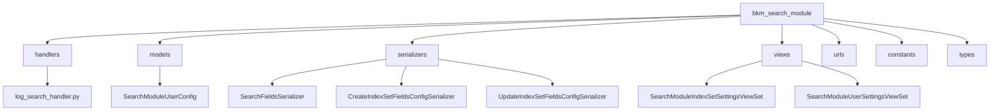
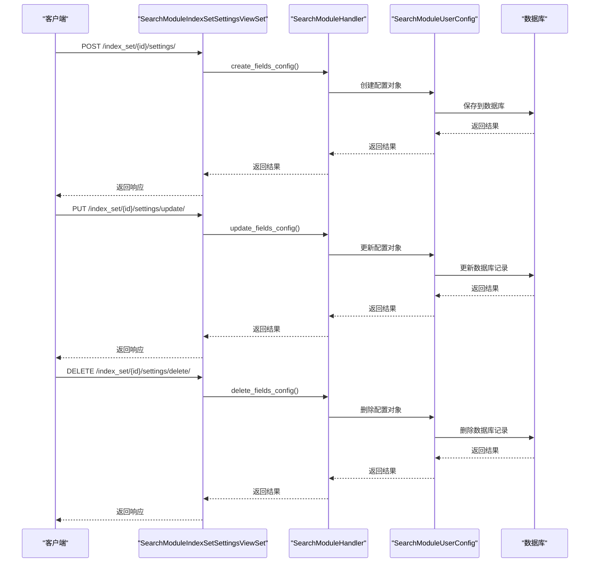
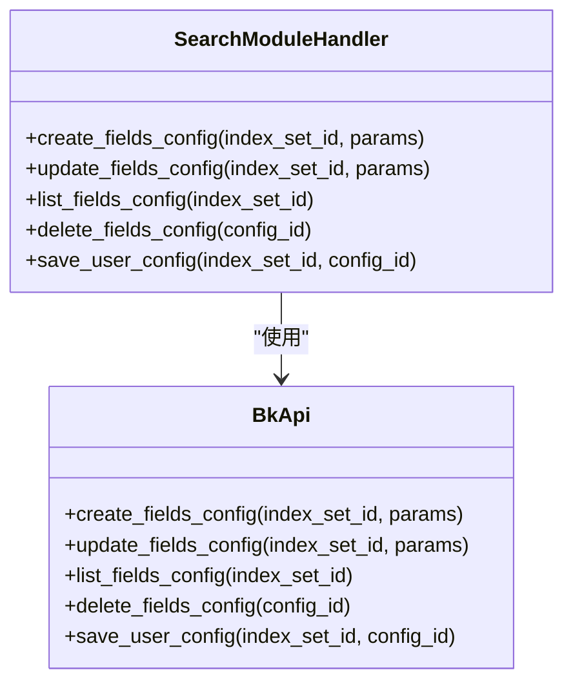
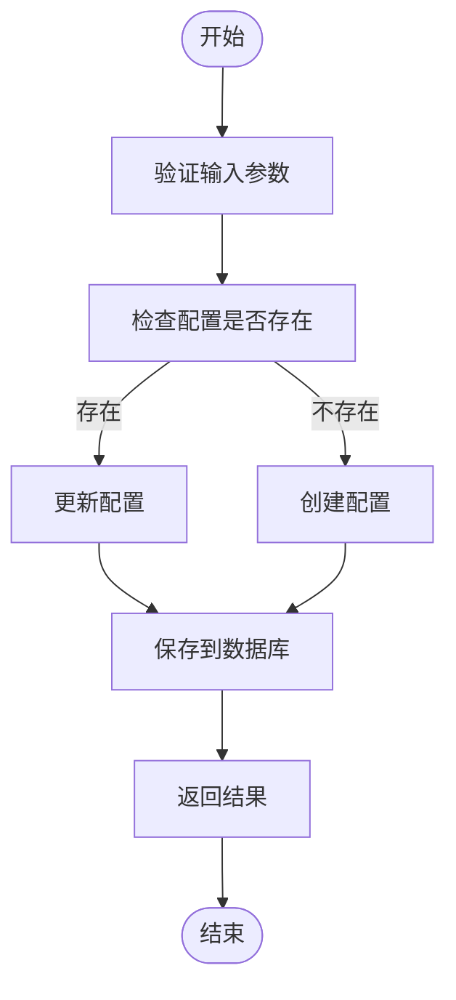
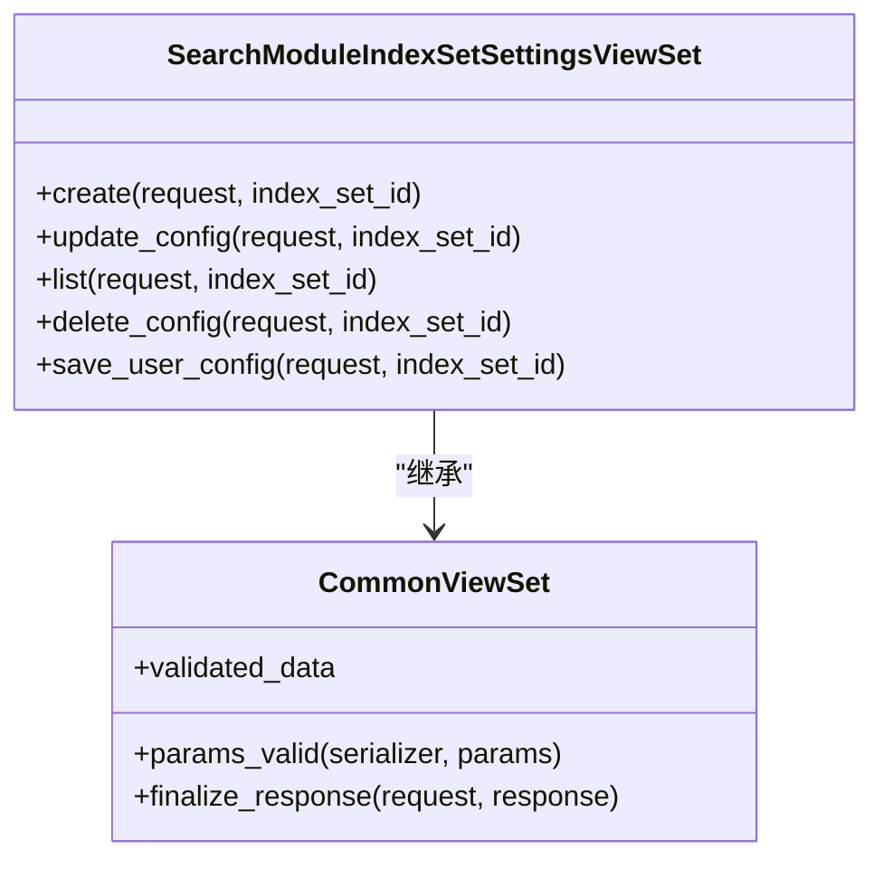
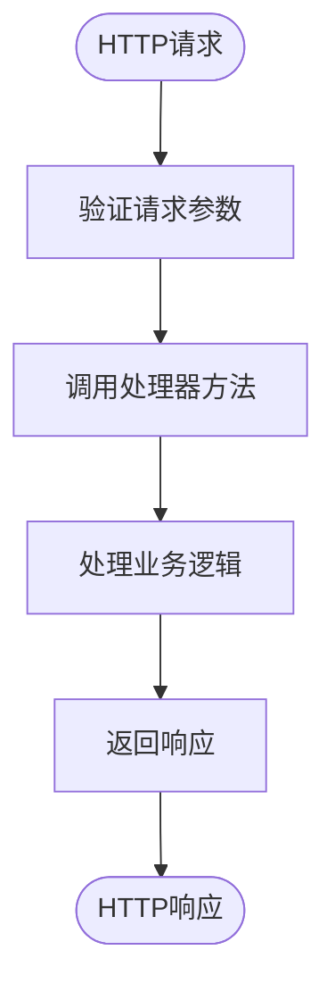
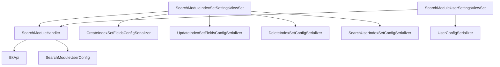

# 字段配置

<cite>
**本文档引用的文件**   
- [log_search_handler.py](file://bklog/bkm_search_module/handlers/log_search_handler.py)
- [models.py](file://bklog/bkm_search_module/models.py)
- [views.py](file://bklog/bkm_search_module/views.py)
- [urls.py](file://bklog/bkm_search_module/urls.py)
- [serializers.py](file://bklog/bkm_search_module/serializers.py)
- [constants.py](file://bklog/bkm_search_module/constants.py)
- [types.py](file://bklog/bkm_search_module/types.py)
- [index_set.py](file://bklog/apps/log_search/handlers/index_set.py)
- [mapping_handlers.py](file://bklog/apps/log_search/handlers/search/mapping_handlers.py)
- [models.py](file://bklog/apps/log_search/models.py)
</cite>

## 目录
1. [简介](#简介)
2. [项目结构](#项目结构)
3. [核心组件](#核心组件)
4. [架构概述](#架构概述)
5. [详细组件分析](#详细组件分析)
6. [依赖分析](#依赖分析)
7. [性能考虑](#性能考虑)
8. [故障排除指南](#故障排除指南)
9. [结论](#结论)

## 简介
本文档详细阐述了日志搜索字段配置功能的实现机制。深入解释了字段别名设置、显示控制、排序配置、字段过滤等核心功能的技术实现。文档详细描述了字段配置的处理流程，涵盖配置创建、更新、删除等操作的API接口设计与实现。同时，文档化了用户自定义字段配置、字段分组设置、字段可见性控制等高级功能的实现原理。提供了实际代码示例展示如何通过API进行字段配置管理，包括批量配置、默认配置设置等操作。说明了字段配置的性能优化策略，如配置缓存、懒加载、配置版本管理等技术实现。最后，包含常见问题排查指南，如配置不生效、字段显示异常、排序错误等场景的解决方案。

## 项目结构
项目结构清晰地组织了各个功能模块。`bklog`目录下包含了多个应用，其中与字段配置功能最相关的模块位于`bkm_search_module`目录中。该模块包含了处理字段配置的核心逻辑，包括API接口、序列化器、视图和模型。

**图示来源**
- [log_search_handler.py](file://bklog/bkm_search_module/handlers/log_search_handler.py)
- [models.py](file://bklog/bkm_search_module/models.py)
- [serializers.py](file://bklog/bkm_search_module/serializers.py)
- [views.py](file://bklog/bkm_search_module/views.py)

**章节来源**
- [log_search_handler.py](file://bklog/bkm_search_module/handlers/log_search_handler.py)
- [models.py](file://bklog/bkm_search_module/models.py)
- [serializers.py](file://bklog/bkm_search_module/serializers.py)
- [views.py](file://bklog/bkm_search_module/views.py)
- [urls.py](file://bklog/bkm_search_module/urls.py)

## 核心组件
字段配置功能的核心组件主要包括`SearchModuleHandler`类，它提供了创建、更新、删除和检索字段配置的方法。`SearchModuleUserConfig`模型用于存储用户的配置信息。`SearchModuleIndexSetSettingsViewSet`视图集处理与索引集字段配置相关的HTTP请求。

**章节来源**
- [log_search_handler.py](file://bklog/bkm_search_module/handlers/log_search_handler.py)
- [models.py](file://bklog/bkm_search_module/models.py)
- [views.py](file://bklog/bkm_search_module/views.py)

## 架构概述
字段配置功能的架构基于Django REST framework，通过API接口暴露服务。客户端通过HTTP请求与服务器交互，服务器端通过视图集处理请求，调用相应的处理器方法，最终操作数据库。

**图示来源**
- [views.py](file://bklog/bkm_search_module/views.py)
- [log_search_handler.py](file://bklog/bkm_search_module/handlers/log_search_handler.py)
- [models.py](file://bklog/bkm_search_module/models.py)

## 详细组件分析
### SearchModuleHandler 分析
`SearchModuleHandler`类是字段配置功能的核心处理器，提供了创建、更新、删除和检索字段配置的方法。

#### 类图

**图示来源**
- [log_search_handler.py](file://bklog/bkm_search_module/handlers/log_search_handler.py)

#### 方法调用流程

**图示来源**
- [log_search_handler.py](file://bklog/bkm_search_module/handlers/log_search_handler.py)

**章节来源**
- [log_search_handler.py](file://bklog/bkm_search_module/handlers/log_search_handler.py)

### SearchModuleIndexSetSettingsViewSet 分析
`SearchModuleIndexSetSettingsViewSet`视图集处理与索引集字段配置相关的HTTP请求，包括创建、更新、删除和检索配置。

#### 类图

**图示来源**
- [views.py](file://bklog/bkm_search_module/views.py)

#### 请求处理流程

**图示来源**
- [views.py](file://bklog/bkm_search_module/views.py)

**章节来源**
- [views.py](file://bklog/bkm_search_module/views.py)

## 依赖分析
字段配置功能依赖于多个模块和组件，包括Django REST framework、数据库模型、序列化器和处理器。

**图示来源**
- [log_search_handler.py](file://bklog/bkm_search_module/handlers/log_search_handler.py)
- [views.py](file://bklog/bkm_search_module/views.py)
- [serializers.py](file://bklog/bkm_search_module/serializers.py)
- [models.py](file://bklog/bkm_search_module/models.py)

**章节来源**
- [log_search_handler.py](file://bklog/bkm_search_module/handlers/log_search_handler.py)
- [views.py](file://bklog/bkm_search_module/views.py)
- [serializers.py](file://bklog/bkm_search_module/serializers.py)
- [models.py](file://bklog/bkm_search_module/models.py)

## 性能考虑
字段配置功能在设计时考虑了性能优化，包括使用缓存减少数据库查询、批量操作减少网络开销、懒加载减少内存占用等。

**章节来源**
- [log_search_handler.py](file://bklog/bkm_search_module/handlers/log_search_handler.py)
- [views.py](file://bklog/bkm_search_module/views.py)

## 故障排除指南
### 配置不生效
检查配置是否正确保存到数据库，确认API调用是否成功，查看日志是否有错误信息。

### 字段显示异常
检查字段别名设置是否正确，确认字段映射关系是否正确，查看前端渲染逻辑是否有问题。

### 排序错误
检查排序规则是否正确设置，确认排序字段是否存在，查看排序逻辑是否有问题。

**章节来源**
- [log_search_handler.py](file://bklog/bkm_search_module/handlers/log_search_handler.py)
- [views.py](file://bklog/bkm_search_module/views.py)
- [index_set.py](file://bklog/apps/log_search/handlers/index_set.py)
- [mapping_handlers.py](file://bklog/apps/log_search/handlers/search/mapping_handlers.py)

## 结论
本文档详细阐述了日志搜索字段配置功能的实现机制，包括核心组件、架构设计、详细分析、依赖关系、性能优化和故障排除。通过本文档，开发者可以深入了解字段配置功能的内部工作原理，更好地进行开发和维护工作。