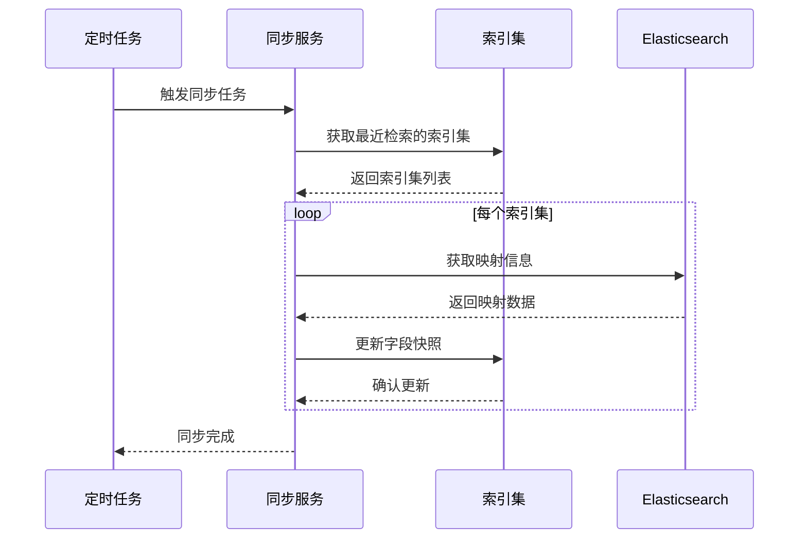
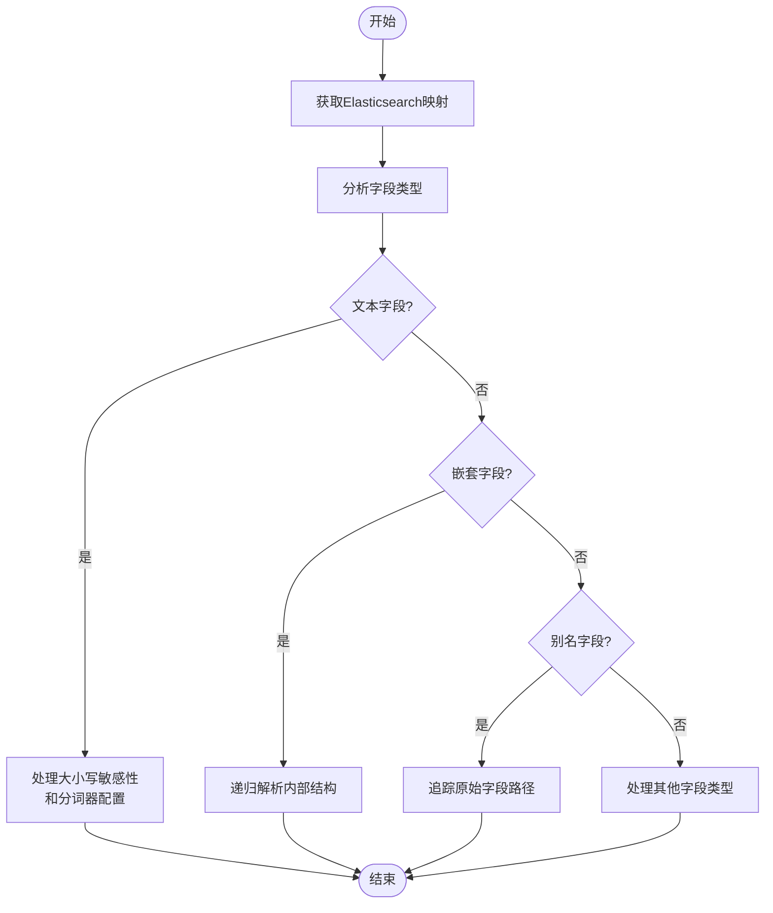
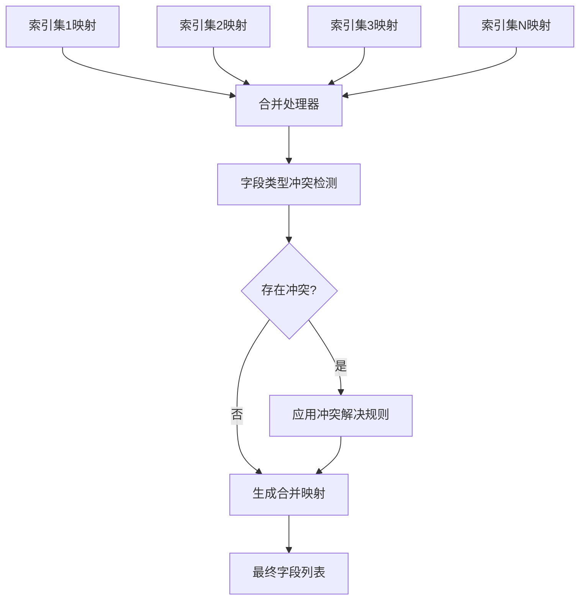
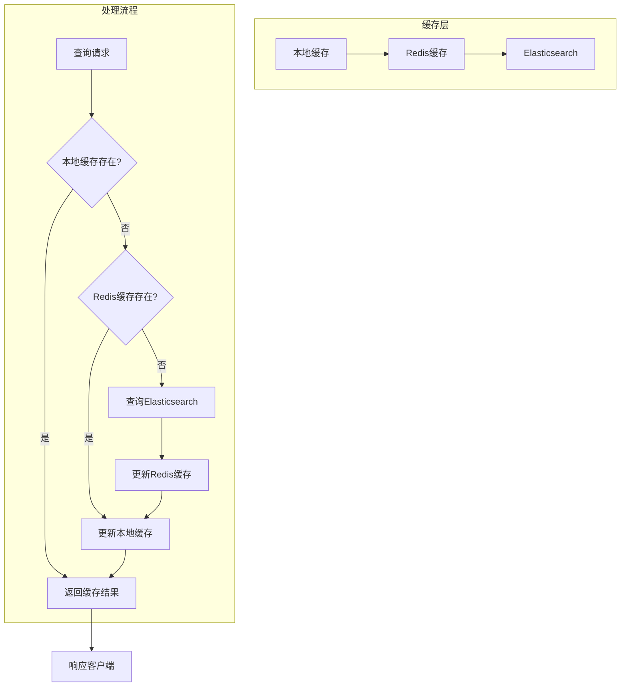
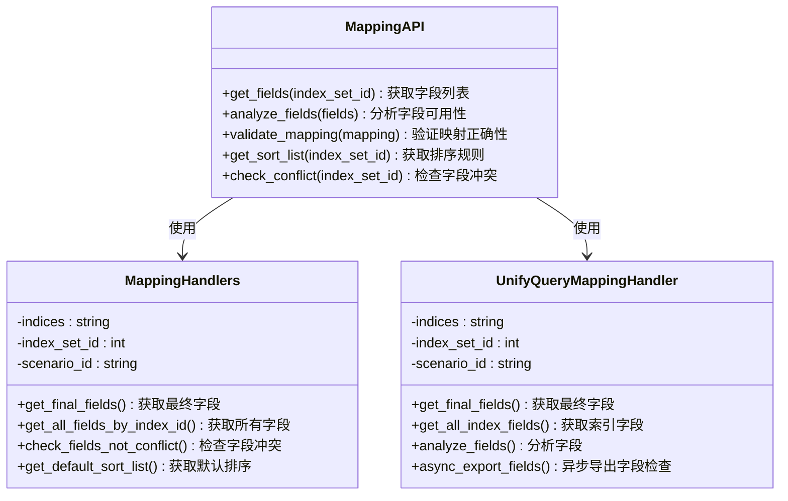

# 映射管理

<cite>
**本文档引用的文件**
- [mapping_handlers.py](file://bklog/apps/log_search/handlers/search/mapping_handlers.py)
- [mapping.py](file://bklog/apps/log_search/tasks/mapping.py)
- [mapping.py](file://bklog/apps/log_unifyquery/handler/mapping.py)
- [models.py](file://bklog/apps/log_search/models.py)
</cite>

## 目录
1. [简介](#简介)
2. [核心组件](#核心组件)
3. [映射同步机制](#映射同步机制)
4. [字段类型识别与处理](#字段类型识别与处理)
5. [多索引集映射合并](#多索引集映射合并)
6. [映射缓存与性能优化](#映射缓存与性能优化)
7. [API接口与操作](#api接口与操作)
8. [常见问题排查](#常见问题排查)

## 简介
映射管理功能是日志搜索系统的核心组件，负责管理Elasticsearch索引的字段映射。该功能实现了动态字段发现、字段类型识别、嵌套字段处理等核心技术，确保系统能够准确地解析和展示日志数据的各种字段。通过自动化的映射同步机制，系统能够及时获取最新的索引结构变化，并通过缓存机制优化性能。映射管理还支持多索引集的映射合并，解决映射冲突问题，并提供版本管理功能，确保数据的一致性和可靠性。

## 核心组件

映射管理功能主要由以下几个核心组件构成：`MappingHandlers`类负责处理单个索引集的映射获取和字段处理，`UnifyQueryMappingHandler`类提供统一查询接口的映射处理，`LogIndexSet`模型存储索引集的元数据和字段快照，以及相关的任务处理器负责定期同步映射信息。

**Section sources**
- [mapping_handlers.py](file://bklog/apps/log_search/handlers/search/mapping_handlers.py#L96-L110)
- [mapping.py](file://bklog/apps/log_unifyquery/handler/mapping.py#L78-L91)
- [models.py](file://bklog/apps/log_search/models.py#L335-L394)

## 映射同步机制

映射同步机制通过定时任务实现，确保索引集的字段信息保持最新。系统会定期检查用户最近检索过的索引集，并触发映射同步任务。同步过程首先获取索引的最新映射信息，然后分析字段结构，最后将结果存储为字段快照。

**Diagram sources**
- [mapping.py](file://bklog/apps/log_search/tasks/mapping.py#L35-L49)
- [models.py](file://bklog/apps/log_search/models.py#L593-L618)

## 字段类型识别与处理

字段类型识别与处理是映射管理的核心功能之一，系统能够自动识别各种字段类型并进行相应处理。对于文本字段，系统会分析其是否区分大小写和分词器配置；对于嵌套字段，系统会递归解析其内部结构；对于别名字段，系统会追踪其原始字段路径。

**Diagram sources**
- [mapping_handlers.py](file://bklog/apps/log_search/handlers/search/mapping_handlers.py#L608-L665)
- [mapping_handlers.py](file://bklog/apps/log_search/handlers/search/mapping_handlers.py#L668-L725)

## 多索引集映射合并

多索引集映射合并功能解决了跨多个索引集查询时的字段一致性问题。系统会收集所有相关索引集的映射信息，然后进行合并处理。在合并过程中，系统会检测字段类型冲突，并根据预定义的规则解决冲突，确保最终的字段列表具有一致的类型定义。

**Diagram sources**
- [mapping_handlers.py](file://bklog/apps/log_search/handlers/search/mapping_handlers.py#L752-L778)
- [mapping_handlers.py](file://bklog/apps/log_search/handlers/search/mapping_handlers.py#L779-L795)

## 映射缓存与性能优化

映射缓存与性能优化机制通过多级缓存策略显著提升了系统性能。系统实现了分钟级和十分钟级的缓存，避免频繁查询Elasticsearch。同时，系统采用增量更新策略，只同步发生变化的映射信息，减少了网络传输和处理开销。对于高频率的查询操作，系统还实现了字段列表的本地缓存。

**Diagram sources**
- [mapping_handlers.py](file://bklog/apps/log_search/handlers/search/mapping_handlers.py#L513-L514)
- [mapping.py](file://bklog/apps/log_unifyquery/handler/mapping.py#L521-L522)
- [mapping.py](file://bklog/apps/log_unifyquery/handler/mapping.py#L531-L532)

## API接口与操作

映射管理提供了丰富的API接口，支持各种映射操作。系统提供了映射查询接口获取字段列表，映射分析接口检查字段可用性，以及映射验证接口确保查询条件的正确性。这些API接口支持多种查询场景，包括普通检索、上下文检索和实时日志检索。

**Diagram sources**
- [mapping_handlers.py](file://bklog/apps/log_search/handlers/search/mapping_handlers.py#L261-L355)
- [mapping.py](file://bklog/apps/log_unifyquery/handler/mapping.py#L188-L293)

## 常见问题排查

### 映射缺失问题
当系统无法获取索引映射时，首先检查Elasticsearch连接是否正常，然后确认索引是否存在。如果索引存在但映射获取失败，可能是权限问题或网络问题。系统会自动使用字段快照作为后备方案。

### 类型错误问题
字段类型错误通常发生在多索引集合并时。系统会检测到同一字段在不同索引中具有不同类型，并记录冲突信息。解决方案包括统一索引的字段类型定义，或在查询时指定明确的类型转换规则。

### 嵌套字段解析异常
嵌套字段解析异常可能是由于字段结构过于复杂或Elasticsearch版本兼容性问题。建议简化嵌套层次，或将复杂对象展平为多个独立字段。系统提供了递归解析功能，但深度过大的嵌套结构会影响性能。

**Section sources**
- [mapping_handlers.py](file://bklog/apps/log_search/handlers/search/mapping_handlers.py#L128-L154)
- [mapping_handlers.py](file://bklog/apps/log_search/handlers/search/mapping_handlers.py#L1080-L1178)
- [mapping.py](file://bklog/apps/log_search/tasks/mapping.py#L59-L74)