# 异步导出

<cite>
**本文档引用文件**   
- [async_export.py](file://bklog/apps/log_search/tasks/async_export.py)
- [unify_query_async_export.py](file://bklog/apps/log_search/tasks/unify_query_async_export.py)
- [models.py](file://bklog/apps/log_search/models.py)
- [async_export_handlers.py](file://bklog/apps/log_search/handlers/search/async_export_handlers.py)
- [remote_storage.py](file://bklog/apps/utils/remote_storage.py)
- [email_template.html](file://bklog/templates/email_template/email_template.html)
- [email_template_err.html](file://bklog/templates/email_template/email_template_err.html)
</cite>

## 目录
1. [简介](#简介)
2. [核心组件](#核心组件)
3. [架构概览](#架构概览)
4. [详细组件分析](#详细组件分析)
5. [依赖分析](#依赖分析)
6. [性能考虑](#性能考虑)
7. [故障排除指南](#故障排除指南)
8. [结论](#结论)

## 简介
异步导出功能是日志搜索系统中的关键特性，旨在解决大规模日志数据导出时的性能瓶颈和用户体验问题。该功能通过异步任务处理机制，将耗时的导出操作从主请求流程中分离，确保用户界面的响应性。系统支持多种导出模式，包括普通异步导出和快速导出，并提供灵活的存储和通知配置。导出任务的状态管理、进度监控和失败重试机制确保了高可靠性。此外，系统还实现了文件过期清理和状态自动更新等维护功能，保障了系统的长期稳定运行。

## 核心组件

异步导出功能的核心组件包括任务处理器、状态管理器、文件打包工具和通知服务。任务处理器负责执行具体的导出逻辑，包括数据查询、格式转换和文件生成。状态管理器跟踪任务的整个生命周期，从创建到完成或失败。文件打包工具负责将查询结果组织成压缩文件，支持多种存储后端。通知服务在任务完成或失败时向用户发送邮件通知。这些组件协同工作，构成了一个完整的异步导出解决方案。

**Section sources**
- [async_export.py](file://bklog/apps/log_search/tasks/async_export.py#L70-L901)
- [unify_query_async_export.py](file://bklog/apps/log_search/tasks/unify_query_async_export.py#L63-L651)
- [models.py](file://bklog/apps/log_search/models.py#L1109-L1150)

## 架构概览

**Diagram sources**
- [async_export.py](file://bklog/apps/log_search/tasks/async_export.py#L70-L901)
- [unify_query_async_export.py](file://bklog/apps/log_search/tasks/unify_query_async_export.py#L63-L651)

## 详细组件分析

### 任务处理分析

异步导出任务处理是整个功能的核心，负责执行从数据查询到文件生成的完整流程。任务处理采用Celery作为任务队列系统，确保任务的可靠执行和调度。

#### 任务处理类图

**Diagram sources**
- [async_export.py](file://bklog/apps/log_search/tasks/async_export.py#L322-L901)
- [unify_query_async_export.py](file://bklog/apps/log_search/tasks/unify_query_async_export.py#L293-L651)

#### 任务处理流程图

```mermaid
flowchart TD
Start([开始]) --> CheckTask["检查任务是否存在"]
CheckTask --> |不存在| Error["记录错误并退出"]
CheckTask --> |存在| SetStatus1["设置状态: DOWNLOAD_LOG"]
SetStatus1 --> ExportPackage["执行导出打包"]
ExportPackage --> |成功| SetStatus2["设置状态: EXPORT_PACKAGE"]
ExportPackage --> |失败| SetFailed1["设置失败状态"]
SetStatus2 --> GetFileSize["获取文件大小"]
GetFileSize --> ExportUpload["执行文件上传"]
ExportUpload --> |成功| SetStatus3["设置状态: EXPORT_UPLOAD"]
ExportUpload --> |失败| SetFailed2["设置失败状态"]
SetStatus3 --> GenerateURL["生成下载链接"]
GenerateURL --> |成功| SetDownloadURL["设置下载URL"]
GenerateURL --> |失败| SetFailed3["设置失败状态"]
SetDownloadURL --> SendMsg["发送通知消息"]
SendMsg --> |成功| SetStatus4["设置状态: SUCCESS"]
SendMsg --> |失败| LogError["记录错误"]
SetStatus4 --> SetExpired["设置过期状态"]
SetExpired --> CleanPackage["清理临时文件"]
SetFailed1 --> SendErrorMsg["发送错误通知"]
SetFailed2 --> SendErrorMsg
SetFailed3 --> SendErrorMsg
SendErrorMsg --> End([结束])
CleanPackage --> End
LogError --> End
```

**Diagram sources**
- [async_export.py](file://bklog/apps/log_search/tasks/async_export.py#L70-L901)
- [unify_query_async_export.py](file://bklog/apps/log_search/tasks/unify_query_async_export.py#L63-L651)

### 状态管理分析

异步导出任务的状态管理是确保任务可靠执行的关键机制。系统定义了多种状态，包括下载日志、导出打包、导出上传、成功、失败和下载过期等。

#### 状态管理类图

**Diagram sources**
- [models.py](file://bklog/apps/log_search/models.py#L1109-L1150)
- [async_export.py](file://bklog/apps/log_search/tasks/async_export.py#L40-L53)

### 存储管理分析

异步导出功能支持多种存储后端，包括NFS、COS和BKREPO，通过策略模式实现存储的灵活配置和切换。

#### 存储管理类图

**Diagram sources**
- [remote_storage.py](file://bklog/apps/utils/remote_storage.py#L34-L103)
- [async_export.py](file://bklog/apps/log_search/tasks/async_export.py#L355-L367)

## 依赖分析

**Diagram sources**
- [async_export.py](file://bklog/apps/log_search/tasks/async_export.py)
- [unify_query_async_export.py](file://bklog/apps/log_search/tasks/unify_query_async_export.py)
- [models.py](file://bklog/apps/log_search/models.py)
- [remote_storage.py](file://bklog/apps/utils/remote_storage.py)

## 性能考虑

异步导出功能在设计时充分考虑了性能优化，主要体现在以下几个方面：首先，通过异步任务处理机制，将耗时的导出操作从主请求流程中分离，确保了用户界面的响应性。其次，系统支持并行处理，对于跨多个存储集群的查询，可以并行执行数据导出，显著提高了处理效率。再者，内存控制方面，系统采用流式处理方式，避免将大量数据加载到内存中，有效控制了内存使用。此外，文件压缩和分片处理技术的应用，不仅减少了存储空间占用，也提高了文件传输效率。最后，系统实现了断点续传机制，对于大型文件导出，即使中途失败也可以从断点继续，避免了重复工作。

## 故障排除指南

### 任务卡住
当导出任务长时间处于"下载日志"或"导出打包"状态时，可能是由于数据量过大或查询超时导致。建议检查查询时间范围是否过长，适当缩小时间范围。同时，可以查看Celery任务队列的长度，确认是否有任务积压。

### 文件损坏
如果下载的文件无法正常解压，可能是文件上传过程中出现问题。检查存储后端的可用性和网络连接。对于NFS存储，确认NFS服务正常运行；对于COS存储，检查密钥和权限配置是否正确。

### 超时失败
导出任务超时失败通常与数据量过大有关。建议启用快速导出模式，该模式通过分片处理大文件，避免单次操作超时。同时，可以调整Celery任务的超时设置，给予更长的执行时间。

### 通知未收到
如果任务完成后未收到通知邮件，首先检查任务的创建者邮箱是否正确。其次，确认通知服务的配置是否正确，包括邮件服务器设置和模板路径。最后，查看系统日志，确认是否有发送邮件的错误记录。

**Section sources**
- [async_export.py](file://bklog/apps/log_search/tasks/async_export.py#L151-L161)
- [unify_query_async_export.py](file://bklog/apps/log_search/tasks/unify_query_async_export.py#L149-L159)
- [email_template.html](file://bklog/templates/email_template/email_template.html)
- [email_template_err.html](file://bklog/templates/email_template/email_template_err.html)

## 结论

异步导出功能通过精心设计的架构和可靠的实现，为大规模日志数据导出提供了高效、稳定的解决方案。系统采用异步任务处理机制，确保了用户界面的响应性；通过灵活的存储后端支持，满足了不同环境的部署需求；完善的状态管理和通知机制，保障了任务的可靠执行和用户及时获知结果。性能优化方面，系统通过并行处理、内存控制和断点续传等技术，有效应对了大数据量导出的挑战。未来可以考虑增加更多导出格式支持，如CSV、JSON等，并进一步优化大文件处理性能。