# 收藏管理

<cite>
**本文档引用的文件**   
- [favorite_search_views.py](file://bklog/apps/log_search/views/favorite_search_views.py)
- [models.py](file://bklog/apps/log_search/models.py)
- [serializers.py](file://bklog/apps/log_search/serializers.py)
- [urls.py](file://bklog/apps/log_search/urls.py)
- [favorite_handlers.py](file://bklog/apps/log_search/handlers/search/favorite_handlers.py)
- [constants.py](file://bklog/apps/log_search/constants.py)
</cite>

## 目录
1. [收藏功能概述](#收藏功能概述)
2. [核心数据模型](#核心数据模型)
3. [收藏操作实现机制](#收藏操作实现机制)
4. [收藏分组管理](#收藏分组管理)
5. [用户配置集成](#用户配置集成)
6. [用户体验功能](#用户体验功能)
7. [API管理接口](#api管理接口)
8. [性能优化策略](#性能优化策略)
9. [常见问题排查](#常见问题排查)

## 收藏功能概述

收藏管理功能为用户提供了一种高效保存和管理日志检索条件的机制。用户可以将常用的检索条件、搜索模式、显示字段等配置保存为收藏项，以便快速访问和重复使用。该功能支持个人收藏和公开收藏，通过分组管理提高收藏项的组织性。收藏功能与用户配置深度集成，支持权限控制、共享设置和个性化显示配置。

**Section sources**
- [favorite_search_views.py](file://bklog/apps/log_search/views/favorite_search_views.py#L57-L890)
- [models.py](file://bklog/apps/log_search/models.py#L829-L1018)

## 核心数据模型

收藏功能的核心数据模型包括收藏项（Favorite）和收藏组（FavoriteGroup）两个主要实体。

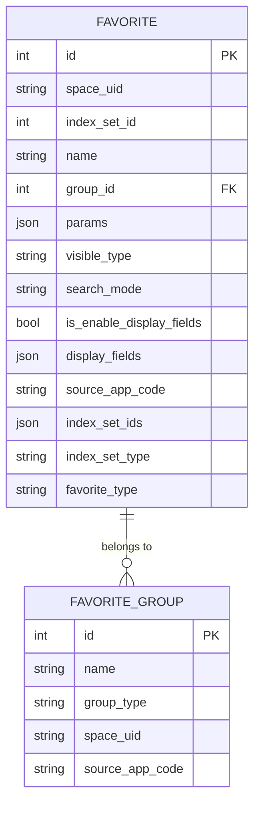

**Diagram sources**
- [models.py](file://bklog/apps/log_search/models.py#L829-L958)

### 收藏项模型

收藏项模型（Favorite）存储用户的检索收藏记录，包含以下关键字段：

| 字段 | 类型 | 描述 |
| --- | --- | --- |
| space_uid | 字符串 | 空间唯一标识 |
| index_set_id | 整数 | 索引集ID |
| name | 字符串 | 收藏名称 |
| group_id | 整数 | 收藏组ID |
| params | JSON | 检索条件 |
| visible_type | 字符串 | 可见类型（个人/公开） |
| search_mode | 字符串 | 检索模式 |
| is_enable_display_fields | 布尔值 | 是否启用显示字段 |
| display_fields | JSON | 显示字段列表 |
| index_set_type | 字符串 | 索引集类型（单个/联合） |

**Section sources**
- [models.py](file://bklog/apps/log_search/models.py#L829-L858)

### 收藏组模型

收藏组模型（FavoriteGroup）用于组织和管理收藏项的分组，包含以下关键字段：

| 字段 | 类型 | 描述 |
| --- | --- | --- |
| name | 字符串 | 收藏组名称 |
| group_type | 字符串 | 收藏组类型（个人/公共/未分组） |
| space_uid | 字符串 | 空间唯一标识 |

**Section sources**
- [models.py](file://bklog/apps/log_search/models.py#L943-L958)

## 收藏操作实现机制

收藏功能提供了完整的CRUD（创建、读取、更新、删除）操作接口，通过RESTful API实现。

### 收藏创建

收藏创建操作通过`CreateFavoriteSerializer`验证输入参数，并调用`FavoriteHandler`的`create_or_update`方法实现。

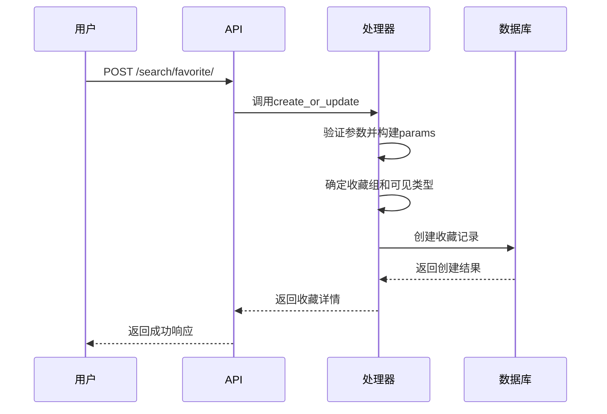

**Diagram sources**
- [favorite_search_views.py](file://bklog/apps/log_search/views/favorite_search_views.py#L206-L293)
- [favorite_handlers.py](file://bklog/apps/log_search/handlers/search/favorite_handlers.py#L196-L300)

### 收藏编辑

收藏编辑操作通过`UpdateFavoriteSerializer`验证更新参数，并调用`FavoriteHandler`的`create_or_update`方法实现更新。

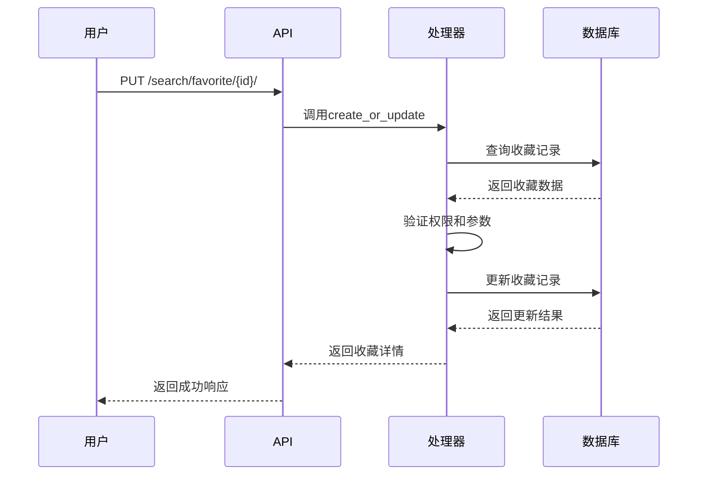

**Diagram sources**
- [favorite_search_views.py](file://bklog/apps/log_search/views/favorite_search_views.py#L294-L377)
- [favorite_handlers.py](file://bklog/apps/log_search/handlers/search/favorite_handlers.py#L196-L300)

### 收藏删除

收藏删除操作通过`FavoriteHandler`的`delete`方法实现软删除。

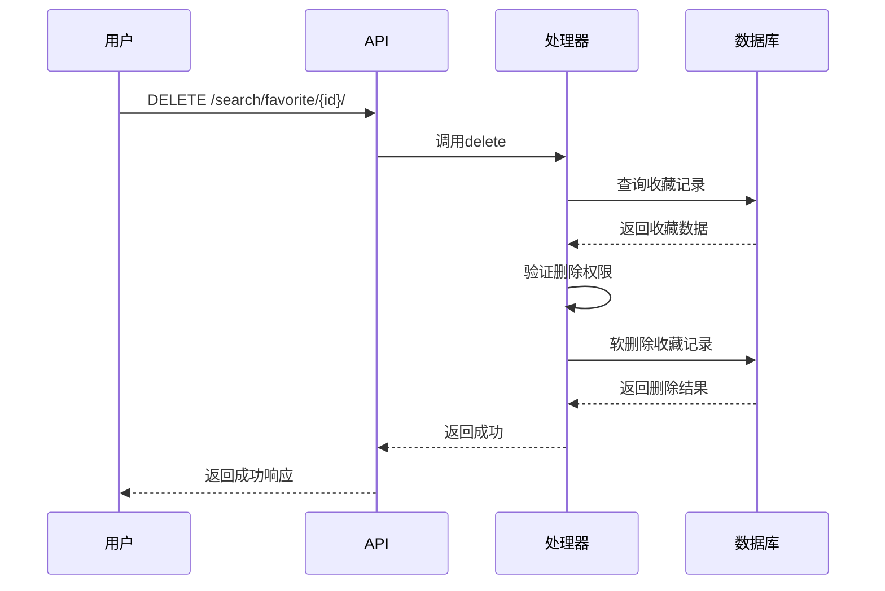

**Diagram sources**
- [favorite_search_views.py](file://bklog/apps/log_search/views/favorite_search_views.py#L442-L462)
- [favorite_handlers.py](file://bklog/apps/log_search/handlers/search/favorite_handlers.py#L318-L319)

## 收藏分组管理

收藏分组管理功能允许用户将收藏项组织到不同的组中，提高收藏项的可管理性。

### 分组创建

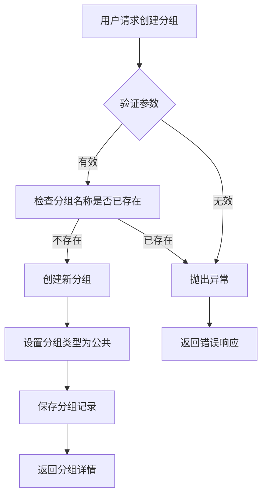

**Diagram sources**
- [favorite_search_views.py](file://bklog/apps/log_search/views/favorite_search_views.py#L629-L665)
- [favorite_handlers.py](file://bklog/apps/log_search/handlers/search/favorite_handlers.py#L363-L383)

### 分组删除

分组删除操作会将该组内的所有收藏项移动到"未分组"组，然后删除原分组。

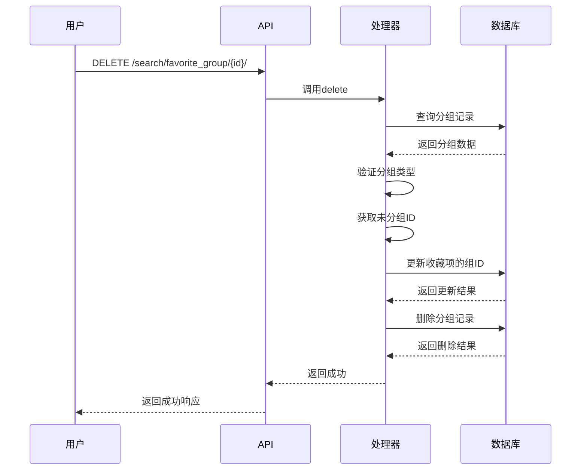

**Diagram sources**
- [favorite_search_views.py](file://bklog/apps/log_search/views/favorite_search_views.py#L701-L720)
- [favorite_handlers.py](file://bklog/apps/log_search/handlers/search/favorite_handlers.py#L385-L395)

## 用户配置集成

收藏功能与用户配置深度集成，支持权限控制、共享设置和个性化配置。

### 权限控制

收藏功能实现了细粒度的权限控制机制：

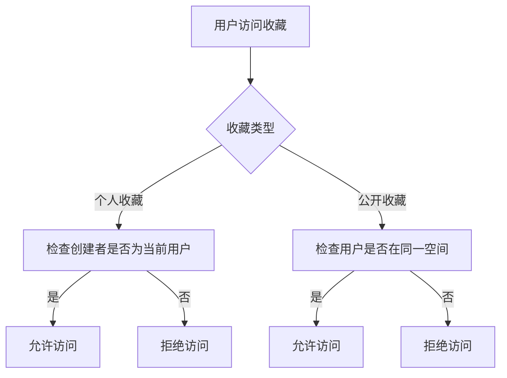

**Section sources**
- [favorite_handlers.py](file://bklog/apps/log_search/handlers/search/favorite_handlers.py#L70-L83)
- [models.py](file://bklog/apps/log_search/models.py#L861-L931)

### 显示字段配置

用户可以为收藏项配置显示字段，系统通过`UserIndexSetConfig`模型存储这些配置。

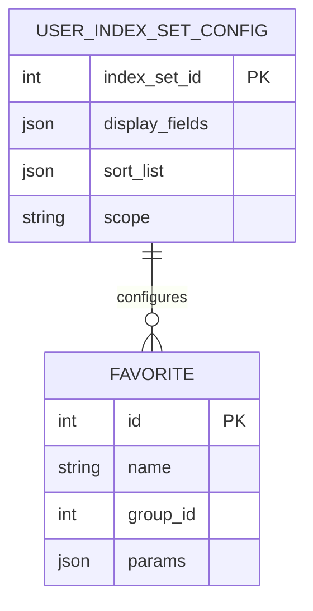

**Diagram sources**
- [models.py](file://bklog/apps/log_search/models.py#L709-L718)

## 用户体验功能

收藏功能提供了丰富的用户体验功能，包括历史记录、快速访问和个性化配置。

### 历史记录管理

系统自动保存用户的检索历史，支持按时间范围查询。

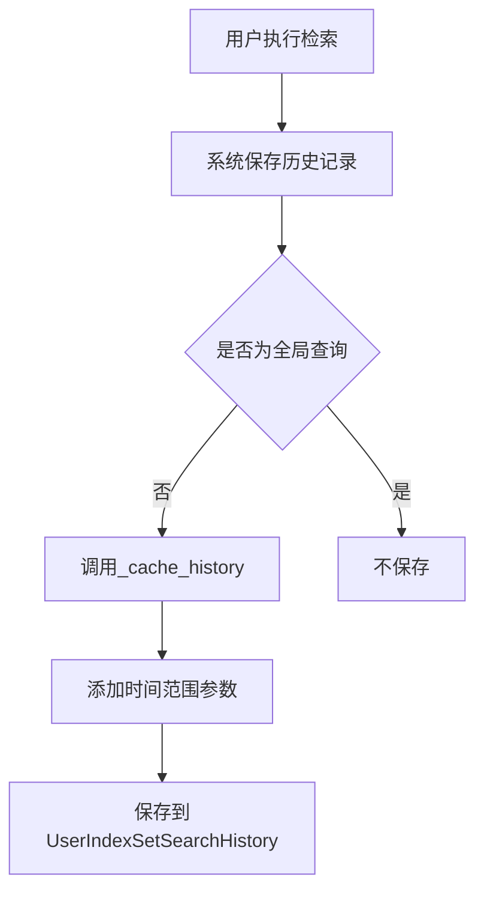

**Section sources**
- [favorite_handlers.py](file://bklog/apps/log_search/handlers/search/favorite_handlers.py#L325-L331)
- [models.py](file://bklog/apps/log_search/models.py#L720-L739)

### 快速访问

用户可以通过分组视图快速访问收藏项，系统提供按更新时间、名称等排序选项。

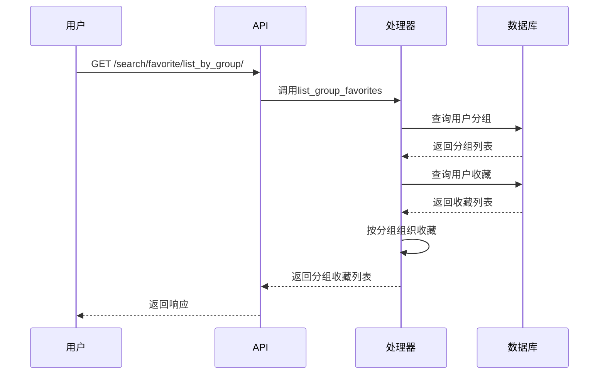

**Diagram sources**
- [favorite_search_views.py](file://bklog/apps/log_search/views/favorite_search_views.py#L150-L205)
- [favorite_handlers.py](file://bklog/apps/log_search/handlers/search/favorite_handlers.py#L118-L145)

## API管理接口

收藏功能提供了丰富的API接口，支持通过编程方式管理收藏项。

### 批量操作API

系统支持收藏项的批量创建、更新和删除操作。

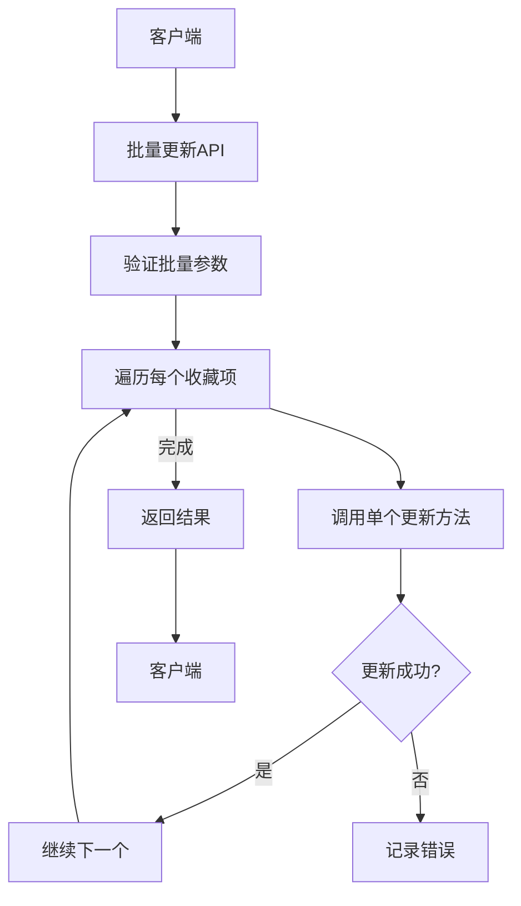

**Section sources**
- [favorite_search_views.py](file://bklog/apps/log_search/views/favorite_search_views.py#L378-L441)
- [favorite_handlers.py](file://bklog/apps/log_search/handlers/search/favorite_handlers.py#L301-L317)

### 排序设置API

用户可以通过API设置收藏项的排序规则。

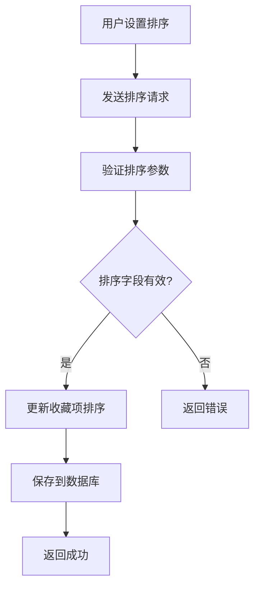

**Section sources**
- [serializers.py](file://bklog/apps/log_search/serializers.py#L775-L791)

## 性能优化策略

收藏功能采用了多种性能优化策略，确保系统在高并发场景下的稳定性和响应速度。

### 缓存策略

系统使用Redis缓存频繁访问的数据，减少数据库查询压力。

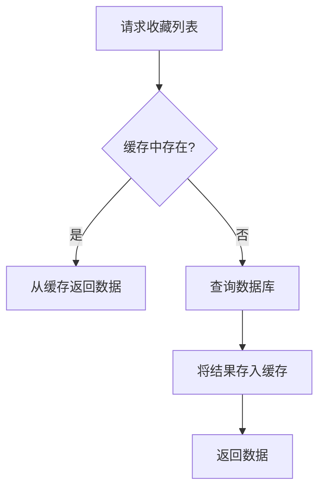

**Section sources**
- [favorite_handlers.py](file://bklog/apps/log_search/handlers/search/favorite_handlers.py#L118-L145)

### 索引优化

数据库表建立了适当的索引，提高查询效率。

```sql
-- 收藏表索引
CREATE INDEX idx_favorite_space_uid ON favorite (space_uid);
CREATE INDEX idx_favorite_group_id ON favorite (group_id);
CREATE INDEX idx_favorite_updated_at ON favorite (updated_at);

-- 收藏组表索引
CREATE INDEX idx_favorite_group_space_uid ON favorite_group (space_uid);
CREATE INDEX idx_favorite_group_updated_at ON favorite_group (updated_at);
```

**Section sources**
- [models.py](file://bklog/apps/log_search/models.py#L857-L858)
- [models.py](file://bklog/apps/log_search/models.py#L956-L957)

### 并发控制

系统通过数据库事务和锁机制确保并发操作的数据一致性。

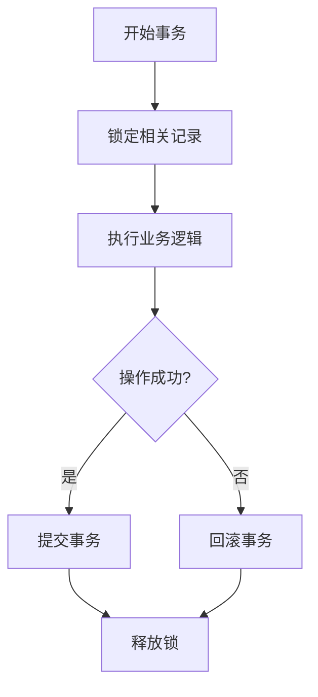

**Section sources**
- [favorite_handlers.py](file://bklog/apps/log_search/handlers/search/favorite_handlers.py#L196-L300)

## 常见问题排查

### 收藏丢失

当用户发现收藏项丢失时，可能的原因和解决方案包括：

1. **检查空间标识**：确认当前操作的空间是否正确
2. **检查权限**：确认用户是否有访问该收藏的权限
3. **检查分组**：确认收藏项是否被移动到其他分组
4. **检查软删除**：确认收藏项是否被软删除

**解决方案**：
- 使用管理员权限查询数据库确认收藏项状态
- 检查`is_deleted`字段是否为True
- 如果是软删除，可以通过数据库恢复

### 权限异常

当用户遇到权限异常时，可能的原因和解决方案包括：

1. **检查收藏类型**：个人收藏只能由创建者访问
2. **检查空间范围**：确认用户和收藏项在同一空间
3. **检查应用代码**：确认来源系统代码匹配

**解决方案**：
- 检查`Favorite`表的`visible_type`和`source_app_code`字段
- 确认用户身份和权限配置

### 同步延迟

当收藏项更新后界面未及时刷新时，可能的原因和解决方案包括：

1. **检查缓存**：确认缓存是否及时更新
2. **检查异步任务**：确认相关异步任务是否正常执行
3. **检查网络延迟**：确认网络连接是否稳定

**解决方案**：
- 清除相关缓存
- 检查Redis连接状态
- 重启相关服务

**Section sources**
- [favorite_handlers.py](file://bklog/apps/log_search/handlers/search/favorite_handlers.py#L70-L83)
- [models.py](file://bklog/apps/log_search/models.py#L835-L837)