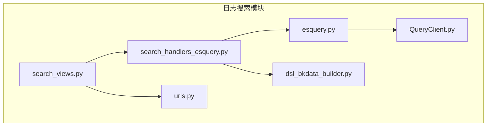
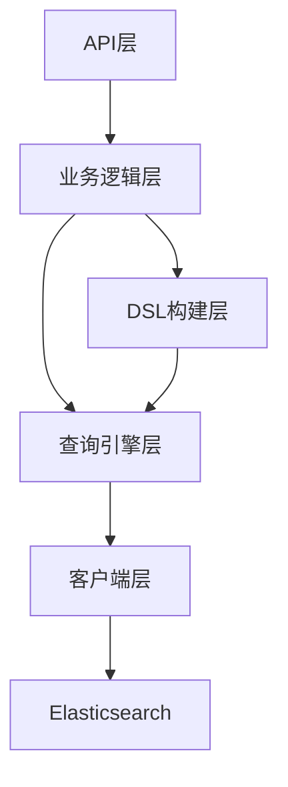
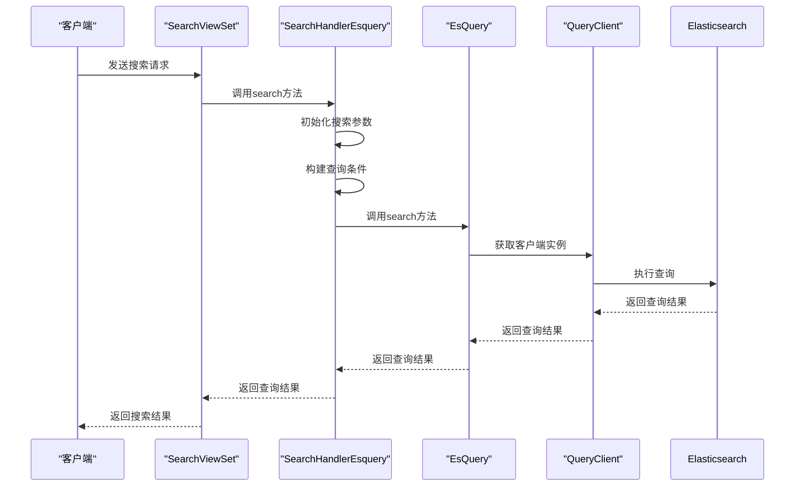
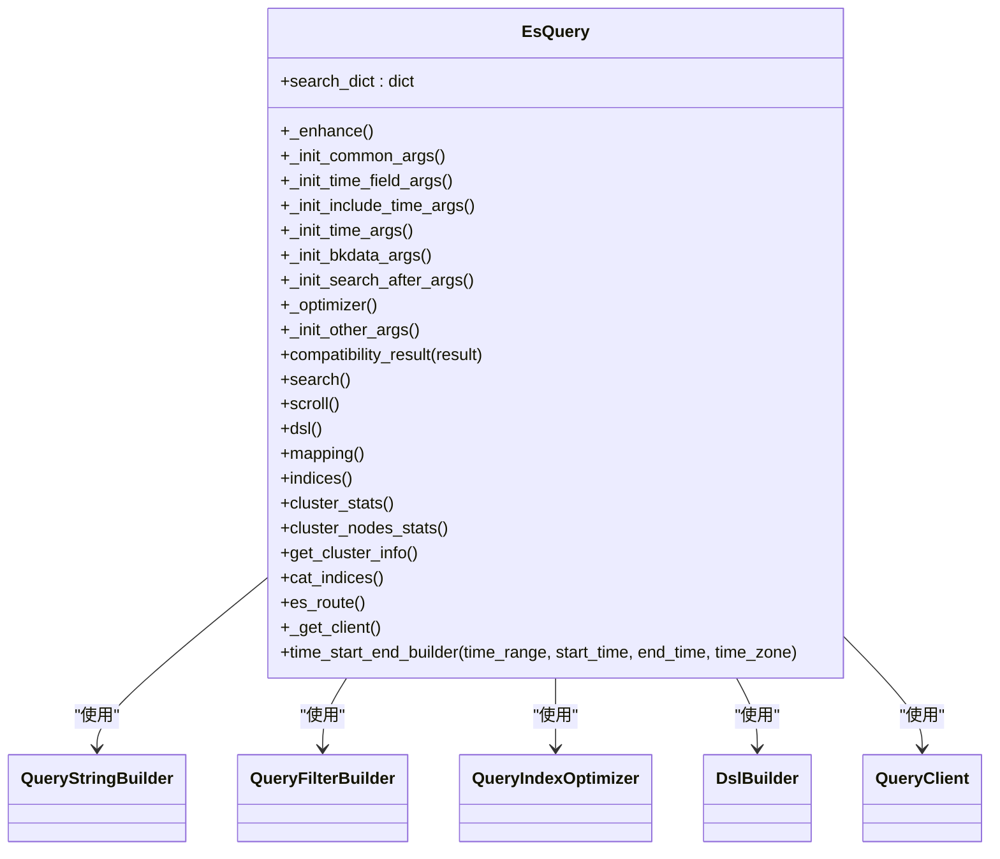
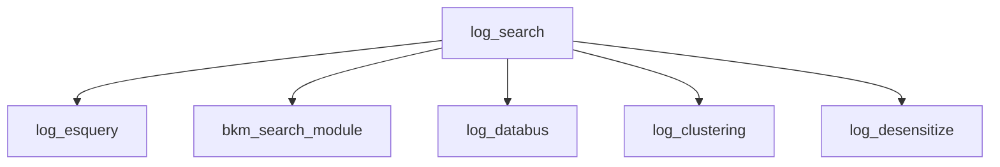

# 日志搜索

<cite>
**本文档引用文件**   
- [log_search_handler.py](file://bklog/bkm_search_module/handlers/log_search_handler.py)
- [esquery.py](file://bklog/apps/log_esquery/esquery/esquery.py)
- [search_handlers_esquery.py](file://bklog/apps/log_search/handlers/search/search_handlers_esquery.py)
- [search_views.py](file://bklog/apps/log_search/views/search_views.py)
- [urls.py](file://bklog/apps/log_search/urls.py)
- [query_string_builder.py](file://bklog/apps/log_esquery/esquery/builder/query_string_builder.py)
- [query_filter_builder.py](file://bklog/apps/log_esquery/esquery/builder/query_filter_builder.py)
- [QueryClient.py](file://bklog/apps/log_esquery/esquery/client/QueryClient.py)
- [dsl_bkdata_builder.py](file://bklog/apps/log_search/handlers/es/dsl_bkdata_builder.py)
</cite>

## 目录
1. [简介](#简介)
2. [项目结构](#项目结构)
3. [核心组件](#核心组件)
4. [架构概述](#架构概述)
5. [详细组件分析](#详细组件分析)
6. [依赖分析](#依赖分析)
7. [性能考虑](#性能考虑)
8. [故障排除指南](#故障排除指南)
9. [结论](#结论)

## 简介
本文档详细描述了基于Elasticsearch的查询引擎实现，包括查询语法解析、过滤条件构建、聚合分析处理等核心机制。文档深入解释了搜索请求的处理流程，从API入口到ES查询构建再到结果返回的完整链路。同时，文档化了高级搜索功能如上下文查询、实时日志查看、趋势分析等，并提供了实际代码示例展示如何构建复杂查询条件，包括布尔查询、范围查询、通配符查询等。此外，文档还解释了搜索性能优化策略，如索引优化、查询缓存、分页处理等，并说明了与用户配置的集成，如收藏搜索、字段配置等个性化功能。最后，文档包含了常见问题排查指南，如查询超时、结果不准确等场景的解决方案。

## 项目结构
日志搜索功能主要位于`bklog/apps/log_search`目录下，其核心功能模块包括：
- `handlers/search/`：包含搜索处理的核心逻辑，特别是`search_handlers_esquery.py`文件实现了基于Elasticsearch的查询处理。
- `views/search_views.py`：定义了搜索相关的API视图，处理来自前端的搜索请求。
- `urls.py`：配置了搜索功能的URL路由。
- `models.py`：定义了与搜索相关的数据模型，如索引集、搜索历史等。
- `serializers.py`：定义了搜索请求和响应的数据序列化器。

此外，`bklog/apps/log_esquery`模块提供了与Elasticsearch交互的底层查询接口，而`bklog/bkm_search_module/handlers/`则包含了更高层次的搜索功能处理逻辑。

**图源**
- [search_views.py](file://bklog/apps/log_search/views/search_views.py#L1-L2153)
- [search_handlers_esquery.py](file://bklog/apps/log_search/handlers/search/search_handlers_esquery.py#L1-L3490)
- [esquery.py](file://bklog/apps/log_esquery/esquery/esquery.py#L1-L405)
- [QueryClient.py](file://bklog/apps/log_esquery/esquery/client/QueryClient.py#L1-L53)
- [dsl_bkdata_builder.py](file://bklog/apps/log_search/handlers/es/dsl_bkdata_builder.py#L1-L598)
- [urls.py](file://bklog/apps/log_search/urls.py#L1-L65)

**章节源**
- [search_views.py](file://bklog/apps/log_search/views/search_views.py#L1-L2153)
- [search_handlers_esquery.py](file://bklog/apps/log_search/handlers/search/search_handlers_esquery.py#L1-L3490)

## 核心组件

日志搜索功能的核心组件主要包括：
- `SearchHandlerEsquery`：负责处理搜索请求，构建Elasticsearch查询参数，并调用底层查询接口。
- `EsQuery`：封装了与Elasticsearch交互的逻辑，负责构建和执行查询。
- `QueryClient`：根据不同的场景（如BKDATA、LOG、ES）选择合适的Elasticsearch客户端。
- `DslCreateSearchContextBodyScenarioBkData` 和 `DslCreateSearchTailBodyScenarioBkData`：用于构建上下文查询和实时日志查询的DSL。

这些组件协同工作，实现了从接收搜索请求到返回搜索结果的完整流程。

**章节源**
- [search_handlers_esquery.py](file://bklog/apps/log_search/handlers/search/search_handlers_esquery.py#L166-L3490)
- [esquery.py](file://bklog/apps/log_esquery/esquery/esquery.py#L51-L405)
- [QueryClient.py](file://bklog/apps/log_esquery/esquery/client/QueryClient.py#L28-L53)
- [dsl_bkdata_builder.py](file://bklog/apps/log_search/handlers/es/dsl_bkdata_builder.py#L35-L598)

## 架构概述

日志搜索功能的架构可以分为以下几个层次：
1. **API层**：由`search_views.py`中的`SearchViewSet`类提供RESTful API接口，接收前端的搜索请求。
2. **业务逻辑层**：由`search_handlers_esquery.py`中的`SearchHandlerEsquery`类处理搜索请求，构建查询参数，并调用底层查询接口。
3. **查询引擎层**：由`esquery.py`中的`EsQuery`类封装Elasticsearch查询逻辑，负责构建和执行查询。
4. **客户端层**：由`QueryClient.py`中的`QueryClient`类根据不同的场景选择合适的Elasticsearch客户端。
5. **DSL构建层**：由`dsl_bkdata_builder.py`中的多个类负责构建特定场景下的Elasticsearch DSL查询语句。

**图源**
- [search_views.py](file://bklog/apps/log_search/views/search_views.py#L124-L2153)
- [search_handlers_esquery.py](file://bklog/apps/log_search/handlers/search/search_handlers_esquery.py#L166-L3490)
- [esquery.py](file://bklog/apps/log_esquery/esquery/esquery.py#L51-L405)
- [QueryClient.py](file://bklog/apps/log_esquery/esquery/client/QueryClient.py#L28-L53)
- [dsl_bkdata_builder.py](file://bklog/apps/log_search/handlers/es/dsl_bkdata_builder.py#L35-L598)

## 详细组件分析

### SearchHandlerEsquery 分析
`SearchHandlerEsquery`是处理搜索请求的核心类，它负责初始化搜索参数、构建查询条件、调用底层查询接口，并处理查询结果。

#### 初始化
在初始化过程中，`SearchHandlerEsquery`会从请求参数中提取必要的信息，如索引集ID、搜索关键字、时间范围等，并根据这些信息构建Elasticsearch查询参数。

#### 查询构建
`SearchHandlerEsquery`通过调用`_init_indices_str`方法构建索引字符串，并通过`_init_time_field`方法确定时间字段。然后，它会调用`_init_sort`方法构建排序列表，并通过`_init_aggs`方法构建聚合查询。

#### 查询执行
`SearchHandlerEsquery`通过调用`_multi_search`方法执行查询。该方法会根据存储集群切换记录多线程请求`BkLogApi.search`，并合并多个集群的检索结果。

**图源**
- [search_handlers_esquery.py](file://bklog/apps/log_search/handlers/search/search_handlers_esquery.py#L166-L3490)
- [esquery.py](file://bklog/apps/log_esquery/esquery/esquery.py#L51-L405)
- [QueryClient.py](file://bklog/apps/log_esquery/esquery/client/QueryClient.py#L28-L53)

**章节源**
- [search_handlers_esquery.py](file://bklog/apps/log_search/handlers/search/search_handlers_esquery.py#L166-L3490)

### EsQuery 分析
`EsQuery`类封装了与Elasticsearch交互的逻辑，负责构建和执行查询。

#### 查询优化
`EsQuery`通过`_optimizer`方法对查询字符串、过滤条件和索引进行优化。例如，它会调用`QueryStringBuilder`对查询字符串进行增强，调用`QueryFilterBuilder`对过滤条件进行优化，调用`QueryIndexOptimizer`对查询索引进行优化。

#### 查询执行
`EsQuery`通过`search`方法执行查询。该方法会调用`DslBuilder`构建Elasticsearch DSL查询语句，并通过`QueryClient`执行查询。

**图源**
- [esquery.py](file://bklog/apps/log_esquery/esquery/esquery.py#L51-L405)
- [query_string_builder.py](file://bklog/apps/log_esquery/esquery/builder/query_string_builder.py#L31-L54)
- [query_filter_builder.py](file://bklog/apps/log_esquery/esquery/builder/query_filter_builder.py#L26-L48)
- [QueryClient.py](file://bklog/apps/log_esquery/esquery/client/QueryClient.py#L28-L53)

**章节源**
- [esquery.py](file://bklog/apps/log_esquery/esquery/esquery.py#L51-L405)

## 依赖分析

日志搜索功能依赖于多个模块和组件，主要包括：
- `bklog/apps/log_esquery`：提供与Elasticsearch交互的底层查询接口。
- `bklog/bkm_search_module`：提供更高层次的搜索功能处理逻辑。
- `bklog/apps/log_databus`：提供数据总线相关的功能，如数据采集、传输等。
- `bklog/apps/log_clustering`：提供日志聚类相关的功能。
- `bklog/apps/log_desensitize`：提供日志脱敏相关的功能。

这些模块通过API调用和数据共享的方式相互协作，共同实现了日志搜索功能。

**图源**
- [search_handlers_esquery.py](file://bklog/apps/log_search/handlers/search/search_handlers_esquery.py#L37-L143)
- [log_search_handler.py](file://bklog/bkm_search_module/handlers/log_search_handler.py#L1-L109)

**章节源**
- [search_handlers_esquery.py](file://bklog/apps/log_search/handlers/search/search_handlers_esquery.py#L37-L143)
- [log_search_handler.py](file://bklog/bkm_search_module/handlers/log_search_handler.py#L1-L109)

## 性能考虑

日志搜索功能在设计时考虑了多种性能优化策略，主要包括：
- **预查询**：在执行全量查询之前，先执行一次预查询，以减少不必要的数据传输。
- **分页查询**：通过`scroll`和`search_after`机制实现分页查询，避免一次性返回大量数据。
- **缓存**：对频繁访问的数据进行缓存，减少数据库查询次数。
- **索引优化**：通过`QueryIndexOptimizer`对查询索引进行优化，提高查询效率。

这些策略共同作用，确保了日志搜索功能在高并发场景下的性能表现。

## 故障排除指南

### 查询超时
当查询超时发生时，可以尝试以下解决方案：
- 检查Elasticsearch集群的健康状态，确保集群正常运行。
- 优化查询条件，减少查询范围。
- 增加Elasticsearch集群的资源，如CPU、内存等。
- 调整查询超时时间，适当延长超时时间。

### 结果不准确
当查询结果不准确时，可以尝试以下解决方案：
- 检查查询条件是否正确，特别是时间范围和过滤条件。
- 检查Elasticsearch索引的数据是否完整，确保数据已正确索引。
- 检查Elasticsearch集群的配置，确保配置正确无误。
- 重新索引数据，确保数据一致性。

**章节源**
- [search_handlers_esquery.py](file://bklog/apps/log_search/handlers/search/search_handlers_esquery.py#L681-L685)
- [esquery.py](file://bklog/apps/log_esquery/esquery/esquery.py#L210-L214)

## 结论
本文档详细描述了基于Elasticsearch的查询引擎实现，包括查询语法解析、过滤条件构建、聚合分析处理等核心机制。通过分析代码结构和实现细节，我们了解了搜索请求的处理流程，从API入口到ES查询构建再到结果返回的完整链路。同时，文档化了高级搜索功能如上下文查询、实时日志查看、趋势分析等，并提供了实际代码示例展示如何构建复杂查询条件。此外，文档还解释了搜索性能优化策略，并说明了与用户配置的集成。最后，文档包含了常见问题排查指南，为开发者提供了有力的支持。