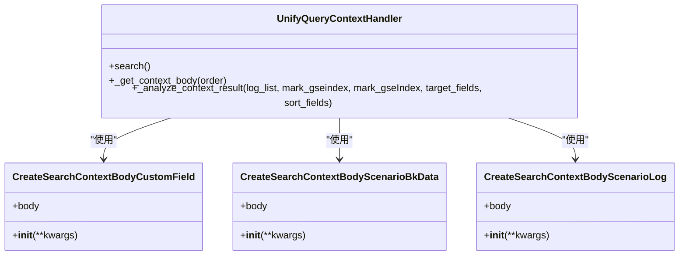
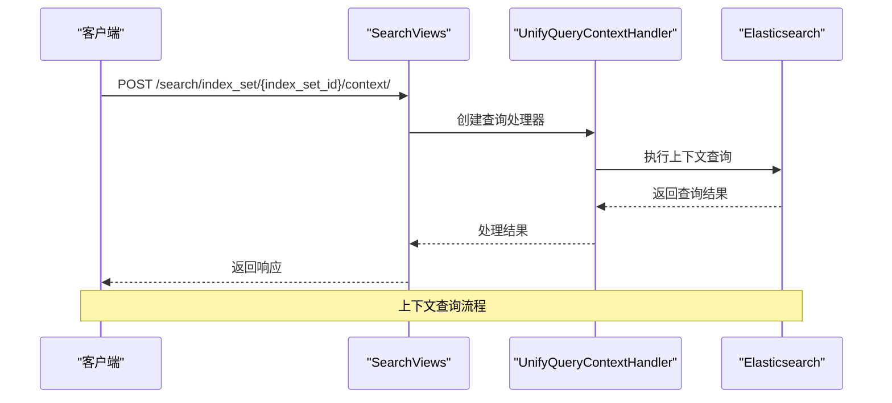
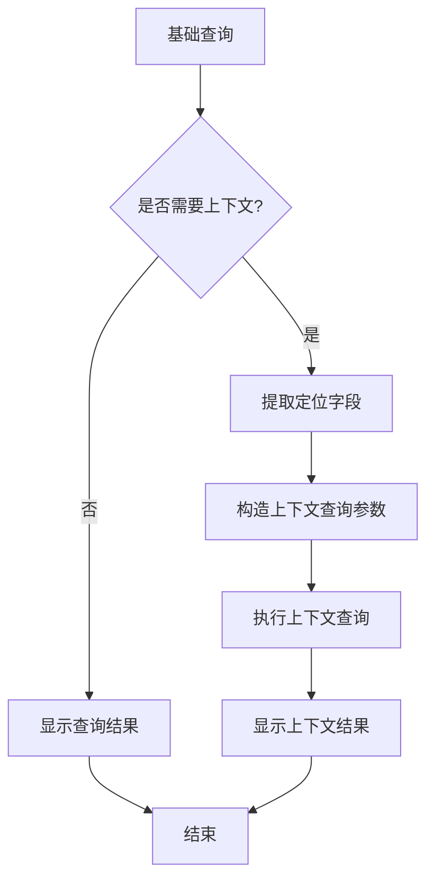
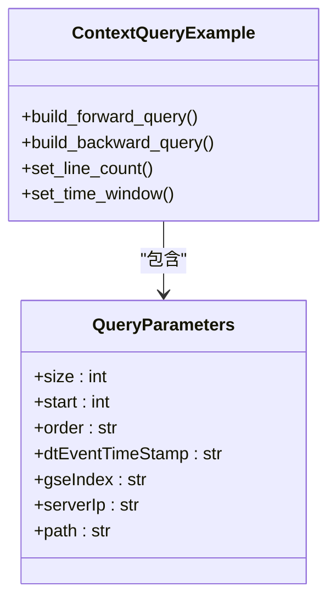
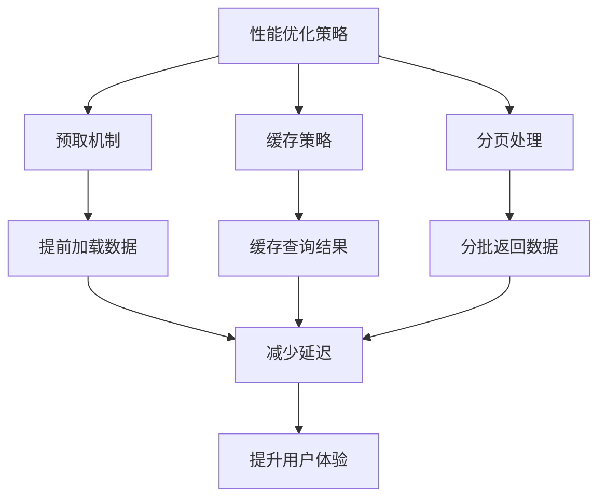
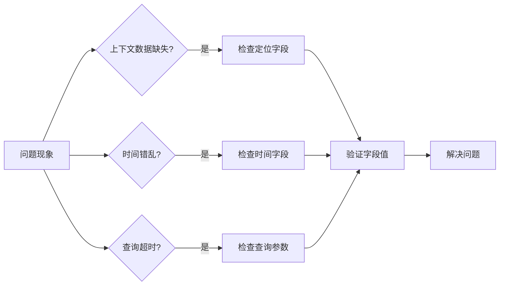

# 上下文查询

<cite>
**本文档引用的文件**   
- [context.py](file://bklog/apps/log_unifyquery/handler/context.py)
- [context.py](file://bklog/apps/log_unifyquery/builder/context.py)
- [search_views.py](file://bklog/apps/log_search/views/search_views.py)
- [search_handlers_esquery.py](file://bklog/apps/log_search/handlers/search/search_handlers_esquery.py)
- [indices_optimizer_context_tail.py](file://bklog/apps/log_search/handlers/es/indices_optimizer_context_tail.py)
- [views.py](file://bklog/apps/log_unifyquery/views.py)
- [index_set_views.py](file://bklog/apps/log_search/views/index_set_views.py)
</cite>

## 目录
1. [引言](#引言)
2. [上下文查询实现机制](#上下文查询实现机制)
3. [API接口设计](#api接口设计)
4. [基础查询集成方式](#基础查询集成方式)
5. [代码示例](#代码示例)
6. [性能优化策略](#性能优化策略)
7. [常见问题排查指南](#常见问题排查指南)
8. [结论](#结论)

## 引言
上下文查询功能是日志分析系统中的核心特性，它允许用户查看特定日志记录的前后关联日志，从而更好地理解事件发生的完整上下文。本文档详细阐述了上下文查询的实现机制、API设计、集成方式、性能优化策略以及常见问题的解决方案，为开发者和运维人员提供全面的技术参考。

## 上下文查询实现机制

上下文查询的实现机制主要包括前后日志行的检索逻辑、时间序列对齐和日志排序等关键技术。系统通过精确的定位字段和排序字段来确保查询结果的准确性和一致性。

**图来源**
- [context.py](file://bklog/apps/log_unifyquery/handler/context.py#L24-L262)
- [context.py](file://bklog/apps/log_unifyquery/builder/context.py#L1-L285)

**上下文查询实现机制来源**
- [context.py](file://bklog/apps/log_unifyquery/handler/context.py#L24-L262)
- [context.py](file://bklog/apps/log_unifyquery/builder/context.py#L1-L285)

## API接口设计

上下文查询的API接口设计涵盖了请求参数、响应格式和错误处理等规范。API通过统一的查询接口提供上下文检索功能，支持灵活的参数配置。

**图来源**
- [search_views.py](file://bklog/apps/log_search/views/search_views.py#L474-L507)
- [context.py](file://bklog/apps/log_unifyquery/handler/context.py#L24-L262)

**API接口设计来源**
- [search_views.py](file://bklog/apps/log_search/views/search_views.py#L474-L507)
- [views.py](file://bklog/apps/log_unifyquery/views.py#L1-L184)

## 基础查询集成方式

上下文查询与基础查询的集成方式包括如何从单条日志记录快速跳转到上下文视图。系统通过索引集和查询参数的无缝衔接，实现了基础查询与上下文查询的平滑过渡。

**图来源**
- [search_views.py](file://bklog/apps/log_search/views/search_views.py#L474-L507)
- [index_set_views.py](file://bklog/apps/log_search/views/index_set_views.py#L95-L120)

**基础查询集成方式来源**
- [search_views.py](file://bklog/apps/log_search/views/search_views.py#L474-L507)
- [index_set_views.py](file://bklog/apps/log_search/views/index_set_views.py#L95-L120)

## 代码示例

以下代码示例展示了上下文查询的构建方法，包括正向/反向查询、行数控制、时间窗口设置等参数的使用。

**图来源**
- [context.py](file://bklog/apps/log_unifyquery/builder/context.py#L1-L285)
- [context.py](file://bklog/apps/log_unifyquery/handler/context.py#L24-L262)

**代码示例来源**
- [context.py](file://bklog/apps/log_unifyquery/builder/context.py#L1-L285)
- [context.py](file://bklog/apps/log_unifyquery/handler/context.py#L24-L262)

## 性能优化策略

性能优化策略包括预取机制、缓存策略和大数据量下的分页处理。系统通过索引优化和查询预处理来提升上下文查询的性能。

**图来源**
- [indices_optimizer_context_tail.py](file://bklog/apps/log_search/handlers/es/indices_optimizer_context_tail.py#L1-L121)
- [search_handlers_esquery.py](file://bklog/apps/log_search/handlers/search/search_handlers_esquery.py#L653-L1788)

**性能优化策略来源**
- [indices_optimizer_context_tail.py](file://bklog/apps/log_search/handlers/es/indices_optimizer_context_tail.py#L1-L121)
- [search_handlers_esquery.py](file://bklog/apps/log_search/handlers/search/search_handlers_esquery.py#L653-L1788)

## 常见问题排查指南

常见问题排查指南包括上下文数据缺失、时间错乱、查询超时等场景的解决方案。通过系统化的排查步骤，可以快速定位和解决上下文查询中的问题。

**图来源**
- [context.py](file://bklog/apps/log_unifyquery/handler/context.py#L171-L262)
- [search_handlers_esquery.py](file://bklog/apps/log_search/handlers/search/search_handlers_esquery.py#L1700-L1899)

**常见问题排查指南来源**
- [context.py](file://bklog/apps/log_unifyquery/handler/context.py#L171-L262)
- [search_handlers_esquery.py](file://bklog/apps/log_search/handlers/search/search_handlers_esquery.py#L1700-L1899)

## 结论
上下文查询功能通过精确的实现机制、规范的API设计、无缝的集成方式、高效的性能优化策略和完善的排查指南，为用户提供了一个强大而可靠的日志分析工具。通过本文档的指导，开发者和运维人员可以更好地理解和使用上下文查询功能，提升日志分析的效率和准确性。