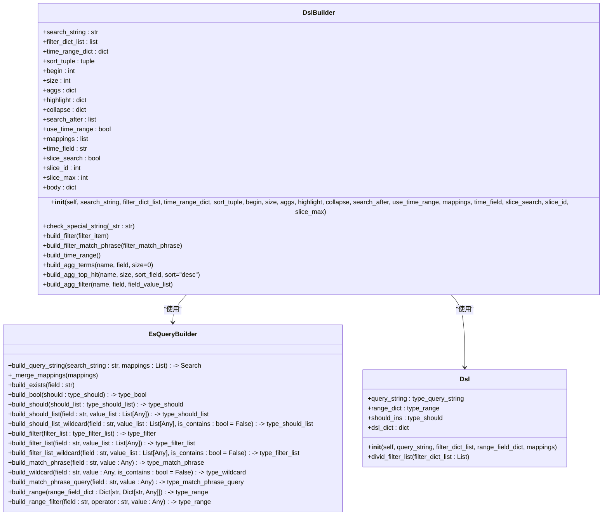
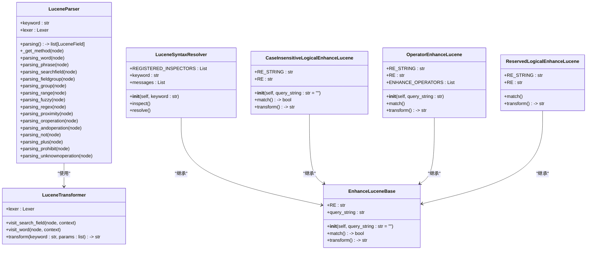
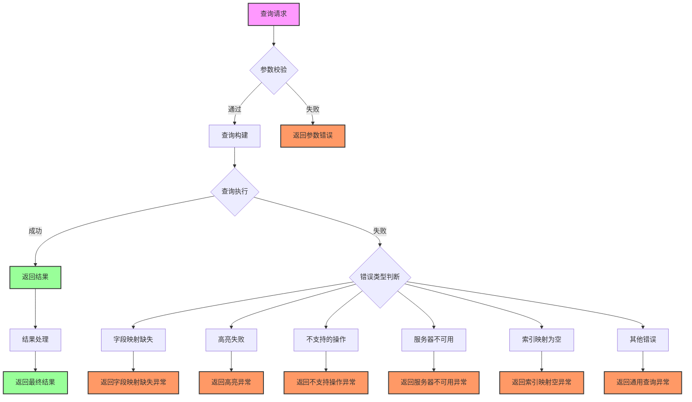

# 基础查询

<cite>
**本文档引用的文件**   
- [dsl_builder.py](file://bklog/apps/log_esquery/esquery/dsl_builder/dsl_builder.py)
- [query_builder_logic.py](file://bklog/apps/log_esquery/esquery/dsl_builder/query_builder/query_builder_logic.py)
- [esquery.py](file://bklog/apps/log_esquery/esquery/esquery.py)
- [esquery_views.py](file://bklog/apps/log_esquery/views/esquery_views.py)
- [lucene.py](file://bklog/apps/utils/lucene.py)
- [constants.py](file://bklog/apps/constants.py)
- [serializers.py](file://bklog/apps/log_esquery/serializers.py)
- [query_time_builder.py](file://bklog/apps/log_esquery/esquery/builder/query_time_builder.py)
- [query_filter_builder.py](file://bklog/apps/log_esquery/esquery/builder/query_filter_builder.py)
- [query_sort_builder.py](file://bklog/apps/log_esquery/esquery/builder/query_sort_builder.py)
- [query_string_builder.py](file://bklog/apps/log_esquery/esquery/builder/query_string_builder.py)
- [query_index_optimizer.py](file://bklog/apps/log_esquery/esquery/builder/query_index_optimizer.py)
</cite>

## 目录
1. [简介](#简介)
2. [查询构建机制](#查询构建机制)
3. [Lucene语法解析器](#lucene语法解析器)
4. [查询参数校验与转换](#查询参数校验与转换)
5. [查询性能优化](#查询性能优化)
6. [常见问题排查](#常见问题排查)

## 简介
本系统提供基于Elasticsearch的高级查询功能，支持复杂的DSL查询构建、时间范围处理、过滤器组装等核心功能。系统通过Lucene语法解析器实现字段查询、布尔操作、通配符、正则表达式等语法支持，并提供查询参数的校验与转换逻辑，包括分页控制、排序规则、高亮显示等特性。系统还实现了查询性能优化策略，如缓存机制、查询超时设置、结果截断等。

## 查询构建机制

系统通过DSL构建器实现Elasticsearch查询的构建。核心组件包括查询字符串、过滤条件、时间范围、排序规则等。



**图源**
- [dsl_builder.py](file://bklog/apps/log_esquery/esquery/dsl_builder/dsl_builder.py#L34-L195)
- [query_builder_logic.py](file://bklog/apps/log_esquery/esquery/dsl_builder/query_builder/query_builder_logic.py#L691-L739)

**节源**
- [dsl_builder.py](file://bklog/apps/log_esquery/esquery/dsl_builder/dsl_builder.py#L34-L195)
- [query_builder_logic.py](file://bklog/apps/log_esquery/esquery/dsl_builder/query_builder/query_builder_logic.py#L691-L739)

## Lucene语法解析器

系统实现了完整的Lucene语法解析器，支持字段查询、布尔操作、通配符、正则表达式等语法。



**图源**
- [lucene.py](file://bklog/apps/utils/lucene.py#L66-L800)
- [constants.py](file://bklog/apps/constants.py#L116-L169)

**节源**
- [lucene.py](file://bklog/apps/utils/lucene.py#L66-L800)
- [constants.py](file://bklog/apps/constants.py#L116-L169)

## 查询参数校验与转换

系统通过序列化器实现查询参数的校验与转换，包括分页控制、排序规则、高亮显示等特性。

```mermaid
classDiagram
class EsQuerySearchAttrSerializer {
+index_set_id : int
+indices : str
+scenario_id : str
+storage_cluster_id : int
+time_field : str
+time_field_type : str
+time_field_unit : str
+use_time_range : bool
+include_start_time : bool
+include_end_time : bool
+start_time : str
+end_time : str
+time_range : str
+time_zone : str
+query_string : str
+filter : list
+sort_list : list
+start : int
+size : int
+dtEventTimeStamp : str
+search_type_tag : str
+aggs : dict
+highlight : dict
+collapse : dict
+bkdata_authentication_method : str
+bkdata_data_token : str
+search_after : list
+track_total_hits : bool
+scroll : str
+include_nested_fields : bool
+slice_search : bool
+slice_id : int
+slice_max : int
+validate(attrs)
+deal_filter(attrs)
}
class EsQuery {
+search_dict : Dict[str, Any]
+include_nested_fields : bool
+__init__(self, search_dict : type_search_dict)
+_enhance()
+_init_common_args()
+_init_time_field_args()
+_init_include_time_args()
+_init_time_args()
+_init_bkdata_args()
+_init_search_after_args()
+_optimizer(indices, scenario_id, start_time, end_time, time_zone, use_time_range)
+_init_other_args()
+compatibility_result(result)
+search()
+scroll()
+dsl()
+mapping()
+indices()
+cluster_stats()
+cluster_nodes_stats()
+get_cluster_info()
+cat_indices()
+es_route()
+_get_client()
+time_start_end_builder(time_range : str, start_time : str, end_time : str, time_zone=None) -> Tuple
}
class QueryTimeBuilder {
+TIME_FIELD_UNIT_RATE_MAP : dict
+GT : str
+GTE : str
+LT : str
+LTE : str
+time_field : str
+start_time : int | datetime
+end_time : int | datetime
+time_field_type : str
+time_field_unit : str
+indices : str
+scenario_id : str
+_time_range_dict : dict
+start_time_filter : str
+end_time_filter : str
+__init__(self, time_field : str = "", start_time : datetime = "", end_time : datetime = "", time_field_type : str = TimeFieldTypeEnum.DATE.value, time_field_unit : str = TimeFieldUnitEnum.SECOND.value, include_start_time : bool = True, include_end_time : bool = True, indices : str = "", scenario_id : str = "")
+time_range_dict : dict
+time_serilizer(start_time : Any, end_time : Any) -> tuple[Any | int, Any | int]
+_start_time_filter(include_start_time)
+_end_time_filter(include_end_time)
+get_storage_retention_time(indices, scenario_id)
+_deal_time(start_time, end_time)
}
class QueryFilterBuilder {
+_filter_dict_list : type_addition
+__init__(self, addition : type_addition)
+filter_dict_list : type_addition
+set_filter_dict_list(addition : type_addition)
}
class QuerySortBuilder {
+DESC : str
+ASC : str
+_sort_final_list : type_sort_multi_dict_list
+__init__(self, sort_list : type_sort_multi_list)
+sort_list : type_sort_multi_dict_list
+build_sort_list(sort_list : type_sort_multi_list) -> type_sort_multi_dict_list
}
class QueryIndexOptimizer {
+_index : str
+__init__(self, indices : type_index_set_string, scenario_id : str, start_time : arrow.Arrow = None, end_time : arrow.Arrow = None, time_zone : str = None, use_time_range : bool = True)
+index : str
+index_filter(result_table_id_list : type_index_set_list, start_time : arrow.Arrow, end_time : arrow.Arrow, time_zone : str) -> list[str]
+index_time_filter(x : str, start_time : arrow.Arrow, end_time : arrow.Arrow, time_zone : str, date_format : str) -> tuple[list[str], str]
+_generate_start_end(now : arrow.Arrow) -> tuple[arrow.Arrow, arrow.Arrow]
}
EsQuery --> EsQuerySearchAttrSerializer : "使用"
EsQuery --> QueryTimeBuilder : "使用"
EsQuery --> QueryFilterBuilder : "使用"
EsQuery --> QuerySortBuilder : "使用"
EsQuery --> QueryIndexOptimizer : "使用"
```



**图源**
- [serializers.py](file://bklog/apps/log_esquery/serializers.py#L39-L459)
- [esquery.py](file://bklog/apps/log_esquery/esquery/esquery.py#L51-L405)
- [query_time_builder.py](file://bklog/apps/log_esquery/esquery/builder/query_time_builder.py#L36-L152)
- [query_filter_builder.py](file://bklog/apps/log_esquery/esquery/builder/query_filter_builder.py#L26-L48)
- [query_sort_builder.py](file://bklog/apps/log_esquery/esquery/builder/query_sort_builder.py#L26-L45)
- [query_index_optimizer.py](file://bklog/apps/log_esquery/esquery/builder/query_index_optimizer.py#L33-L89)

**节源**
- [serializers.py](file://bklog/apps/log_esquery/serializers.py#L39-L459)
- [esquery.py](file://bklog/apps/log_esquery/esquery/esquery.py#L51-L405)
- [query_time_builder.py](file://bklog/apps/log_esquery/esquery/builder/query_time_builder.py#L36-L152)
- [query_filter_builder.py](file://bklog/apps/log_esquery/esquery/builder/query_filter_builder.py#L26-L48)
- [query_sort_builder.py](file://bklog/apps/log_esquery/esquery/builder/query_sort_builder.py#L26-L45)
- [query_index_optimizer.py](file://bklog/apps/log_esquery/esquery/builder/query_index_optimizer.py#L33-L89)

## 查询性能优化

系统实现了多种查询性能优化策略，包括缓存机制、查询超时设置、结果截断等。

```mermaid
classDiagram
class EsQuery {
+search_dict : Dict[str, Any]
+include_nested_fields : bool
+__init__(self, search_dict : type_search_dict)
+_enhance()
+_init_common_args()
+_init_time_field_args()
+_init_include_time_args()
+_init_time_args()
+_init_bkdata_args()
+_init_search_after_args()
+_optimizer(indices, scenario_id, start_time, end_time, time_zone, use_time_range)
+_init_other_args()
+compatibility_result(result)
+search()
+scroll()
+dsl()
+mapping()
+indices()
+cluster_stats()
+cluster_nodes_stats()
+get_cluster_info()
+cat_indices()
+es_route()
+_get_client()
+time_start_end_builder(time_range : str, start_time : str, end_time : str, time_zone=None) -> Tuple
}
class QueryTimeBuilder {
+TIME_FIELD_UNIT_RATE_MAP : dict
+GT : str
+GTE : str
+LT : str
+LTE : str
+time_field : str
+start_time : int | datetime
+end_time : int | datetime
+time_field_type : str
+time_field_unit : str
+indices : str
+scenario_id : str
+_time_range_dict : dict
+start_time_filter : str
+end_time_filter : str
+__init__(self, time_field : str = "", start_time : datetime = "", end_time : datetime = "", time_field_type : str = TimeFieldTypeEnum.DATE.value, time_field_unit : str = TimeFieldUnitEnum.SECOND.value, include_start_time : bool = True, include_end_time : bool = True, indices : str = "", scenario_id : str = "")
+time_range_dict : dict
+time_serilizer(start_time : Any, end_time : Any) -> tuple[Any | int, Any | int]
+_start_time_filter(include_start_time)
+_end_time_filter(include_end_time)
+get_storage_retention_time(indices, scenario_id)
+_deal_time(start_time, end_time)
}
class QueryIndexOptimizer {
+_index : str
+__init__(self, indices : type_index_set_string, scenario_id : str, start_time : arrow.Arrow = None, end_time : arrow.Arrow = None, time_zone : str = None, use_time_range : bool = True)
+index : str
+index_filter(result_table_id_list : type_index_set_list, start_time : arrow.Arrow, end_time : arrow.Arrow, time_zone : str) -> list[str]
+index_time_filter(x : str, start_time : arrow.Arrow, end_time : arrow.Arrow, time_zone : str, date_format : str) -> tuple[list[str], str]
+_generate_start_end(now : arrow.Arrow) -> tuple[arrow.Arrow, arrow.Arrow]
}
class QueryFilterBuilder {
+_filter_dict_list : type_addition
+__init__(self, addition : type_addition)
+filter_dict_list : type_addition
+set_filter_dict_list(addition : type_addition)
}
class QuerySortBuilder {
+DESC : str
+ASC : str
+_sort_final_list : type_sort_multi_dict_list
+__init__(self, sort_list : type_sort_multi_list)
+sort_list : type_sort_multi_dict_list
+build_sort_list(sort_list : type_sort_multi_list) -> type_sort_multi_dict_list
}
EsQuery --> QueryTimeBuilder : "使用"
EsQuery --> QueryIndexOptimizer : "使用"
EsQuery --> QueryFilterBuilder : "使用"
EsQuery --> QuerySortBuilder : "使用"
note right of QueryTimeBuilder
实现时间范围优化和过期数据处理
end note
note right of QueryIndexOptimizer
实现索引优化和查询范围缩小
end note
note right of QueryFilterBuilder
实现过滤条件优化
end note
note right of QuerySortBuilder
实现排序规则优化
end note
```

**图源**
- [esquery.py](file://bklog/apps/log_esquery/esquery/esquery.py#L51-L405)
- [query_time_builder.py](file://bklog/apps/log_esquery/esquery/builder/query_time_builder.py#L36-L152)
- [query_index_optimizer.py](file://bklog/apps/log_esquery/esquery/builder/query_index_optimizer.py#L33-L89)
- [query_filter_builder.py](file://bklog/apps/log_esquery/esquery/builder/query_filter_builder.py#L26-L48)
- [query_sort_builder.py](file://bklog/apps/log_esquery/esquery/builder/query_sort_builder.py#L26-L45)

**节源**
- [esquery.py](file://bklog/apps/log_esquery/esquery/esquery.py#L51-L405)
- [query_time_builder.py](file://bklog/apps/log_esquery/esquery/builder/query_time_builder.py#L36-L152)
- [query_index_optimizer.py](file://bklog/apps/log_esquery/esquery/builder/query_index_optimizer.py#L33-L89)
- [query_filter_builder.py](file://bklog/apps/log_esquery/esquery/builder/query_filter_builder.py#L26-L48)
- [query_sort_builder.py](file://bklog/apps/log_esquery/esquery/builder/query_sort_builder.py#L26-L45)

## 常见问题排查

系统提供了完善的错误处理机制，能够识别和处理各种查询异常情况。



**图源**
- [esquery_views.py](file://bklog/apps/log_esquery/views/esquery_views.py#L86-L254)
- [serializers.py](file://bklog/apps/log_esquery/serializers.py#L108-L157)
- [test_error_message.py](file://bklog/apps/tests/log_search/test_error_message.py#L30-L82)

**节源**
- [esquery_views.py](file://bklog/apps/log_esquery/views/esquery_views.py#L86-L254)
- [serializers.py](file://bklog/apps/log_esquery/serializers.py#L108-L157)
- [test_error_message.py](file://bklog/apps/tests/log_search/test_error_message.py#L30-L82)