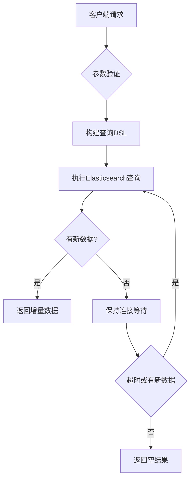
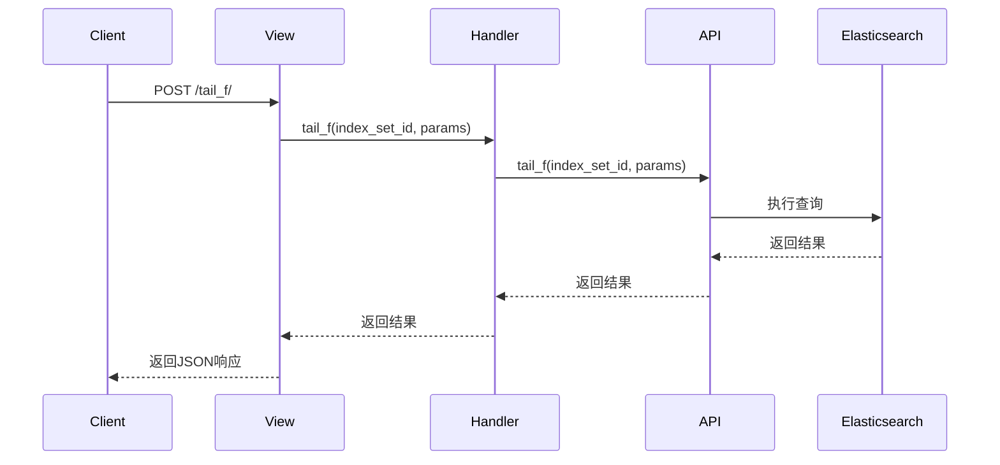

# 实时日志

<cite>
**本文档引用的文件**
- [tail_f.md](file://bkm_search_module/docs/apidocs/16_查看实时日志.md)
- [search_views.py](file://apps/log_search/views/search_views.py)
- [views.py](file://bkm_search_module/views.py)
- [log_search_handler.py](file://bkm_search_module/handlers/log_search_handler.py)
- [api.py](file://bkm_search_module/api.py)
- [serializers.py](file://bkm_search_module/serializers.py)
</cite>

## 目录
1. [简介](#简介)
2. [实时日志实现机制](#实时日志实现机制)
3. [实时查询建立过程](#实时查询建立过程)
4. [性能控制策略](#性能控制策略)
5. [API调用方式](#api调用方式)
6. [与ES集群交互模式](#与es集群交互模式)
7. [常见问题排查指南](#常见问题排查指南)

## 简介
实时日志功能允许用户实时查看系统中最新写入的日志数据。该功能通过HTTP长轮询技术实现，基于Elasticsearch存储的日志数据，提供高效的实时日志流服务。系统通过索引集（index_set）组织日志数据，支持按时间戳、服务器IP、日志路径等条件进行定位查询。

**Section sources**
- [tail_f.md](file://bkm_search_module/docs/apidocs/16_查看实时日志.md)

## 实时日志实现机制
实时日志功能采用HTTP长轮询（Long Polling）技术实现，而非WebSocket。客户端通过POST请求访问特定接口，服务端在接收到请求后会保持连接打开状态，直到有新的日志数据可用或达到超时时间。

核心实现基于Elasticsearch的搜索功能，通过时间戳（dtEventTimeStamp）、gseIndex、iterationIndex等字段进行排序和定位。服务端使用倒序排列（desc）的方式查询数据，确保最新的日志条目优先返回。

请求处理流程如下：
1. 客户端发送包含定位信息的POST请求
2. 服务端验证请求参数并构建Elasticsearch查询DSL
3. 执行查询并返回结果
4. 若无新数据，服务端保持连接直到有新数据或超时

**Section sources**
- [search_views.py](file://apps/log_search/views/search_views.py#L509-L542)
- [views.py](file://bkm_search_module/views.py#L240-L248)

## 实时查询建立过程
实时查询的建立过程涉及订阅管理、游标跟踪和增量数据获取三个核心流程。

### 订阅管理
系统通过索引集ID（index_set_id）管理日志订阅。每个订阅对应一个特定的日志数据源集合。客户端在请求时必须提供有效的索引集ID。

### 游标跟踪
游标通过location对象进行跟踪，包含以下关键字段：
- dtEventTimeStamp：时间戳，用于时间定位
- gseIndex：GSE索引，标识日志位置
- iterationIndex：迭代索引
- path：日志文件路径
- serverIp：服务器IP地址

### 增量数据获取
系统通过比较当前请求的游标位置与最新日志位置来获取增量数据。当zero参数为true时，表示从起始位置开始获取数据。



**Diagram sources**
- [log_search_handler.py](file://bkm_search_module/handlers/log_search_handler.py#L91-L93)
- [api.py](file://bkm_search_module/api.py#L76-L78)

**Section sources**
- [serializers.py](file://bkm_search_module/serializers.py#L91-L97)
- [tail_f.md](file://bkm_search_module/docs/apidocs/16_查看实时日志.md)

## 性能控制策略
系统实现了多项性能控制策略，确保实时日志功能的稳定性和效率。

### 配置项
| 配置项 | 描述 | 默认值 |
|-------|------|-------|
| size | 每页返回的日志数量 | 500 |
| zero | 是否从起始位置开始 | true |
| BKLOG_QOS_LIMIT_WINDOW | 限流窗口时间（分钟） | 由settings配置 |
| USE_REDIS | 是否使用Redis进行限流 | 由settings配置 |

### 采样率
系统未显式实现采样率控制，而是通过限制返回的日志数量（size参数）来控制数据传输量。

### 带宽限制
通过QoS（服务质量）机制实现带宽限制，使用Redis的zset数据结构跟踪请求频率，防止客户端过度请求。

### 连接超时
系统依赖HTTP协议的默认超时机制，未设置特殊的长轮询超时时间。连接保持时间取决于Elasticsearch查询的执行时间和网络状况。

**Section sources**
- [qos.py](file://apps/log_esquery/qos.py#L22-L63)
- [serializers.py](file://bkm_search_module/serializers.py#L106-L109)

## API调用方式
实时日志会话通过RESTful API进行管理，支持开始、暂停、恢复、停止等操作。

### 开始实时日志会话
```http
POST /search_module/index_set/{index_set_id}/tail_f/
```

请求体示例：
```json
{
    "size": 500,
    "zero": true,
    "location": {
        "serverIp": "",
        "gseIndex": 1,
        "iterationIndex": 2,
        "path": "/data/logs/gse/iteration2",
        "dtEventTimeStamp": "1698112284000"
    }
}
```

### API操作流程


**Diagram sources**
- [views.py](file://bkm_search_module/views.py#L240-L248)
- [log_search_handler.py](file://bkm_search_module/handlers/log_search_handler.py#L91-L93)

**Section sources**
- [tail_f.md](file://bkm_search_module/docs/apidocs/16_查看实时日志.md)
- [search_views.py](file://apps/log_search/views/search_views.py#L509-L542)

## 与ES集群交互模式
系统通过esquery模块与Elasticsearch集群进行交互，采用高效的查询策略获取最新写入的日志数据。

### 查询策略
1. 使用复合排序：按dtEventTimeStamp、gseIndex、iterationIndex降序排列
2. 基于时间戳和索引的精确定位
3. 支持滚动查询（scroll）处理大量数据

### 数据获取流程


系统通过QueryClientEs和QueryClientLog等客户端类封装Elasticsearch操作，提供统一的查询接口。查询过程中会自动处理连接、认证和错误重试。

**Diagram sources**
- [QueryClientEs.py](file://apps/log_esquery/esquery/client/QueryClientEs.py#L48-L60)
- [QueryClientTemplate.py](file://apps/log_esquery/esquery/client/QueryClientTemplate.py#L33-L61)

**Section sources**
- [esquery_views.py](file://apps/log_esquery/views/esquery_views.py#L795-L819)
- [dsl_builder.py](file://apps/log_esquery/esquery/dsl_builder/dsl_builder.py#L24-L76)

## 常见问题排查指南
### 连接中断
**现象**：客户端频繁收到空响应或连接被重置
**原因**：
- 网络不稳定
- 服务端超时设置过短
- 客户端请求过于频繁触发QoS限制

**解决方案**：
1. 检查网络连接稳定性
2. 调整客户端重试策略，增加重试间隔
3. 检查Redis限流配置，适当调整限流阈值

### 数据延迟
**现象**：新写入的日志不能及时在实时日志中看到
**原因**：
- Elasticsearch索引刷新间隔
- 数据采集链路延迟
- 查询条件定位不准确

**解决方案**：
1. 确认数据已成功写入Elasticsearch
2. 检查gseIndex和iterationIndex是否正确
3. 验证时间戳是否准确

### 内存溢出
**现象**：服务端出现OutOfMemoryError或响应缓慢
**原因**：
- 单次请求返回日志数量过多（size参数过大）
- 并发连接数过多
- Elasticsearch查询消耗过多内存

**解决方案**：
1. 限制单次请求的size参数，建议不超过1000
2. 优化Elasticsearch查询，避免全表扫描
3. 增加服务端内存配置
4. 实现更有效的连接池管理

**Section sources**
- [tail_f.md](file://bkm_search_module/docs/apidocs/16_查看实时日志.md)
- [qos.py](file://apps/log_esquery/qos.py#L22-L63)