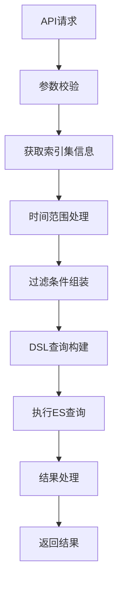
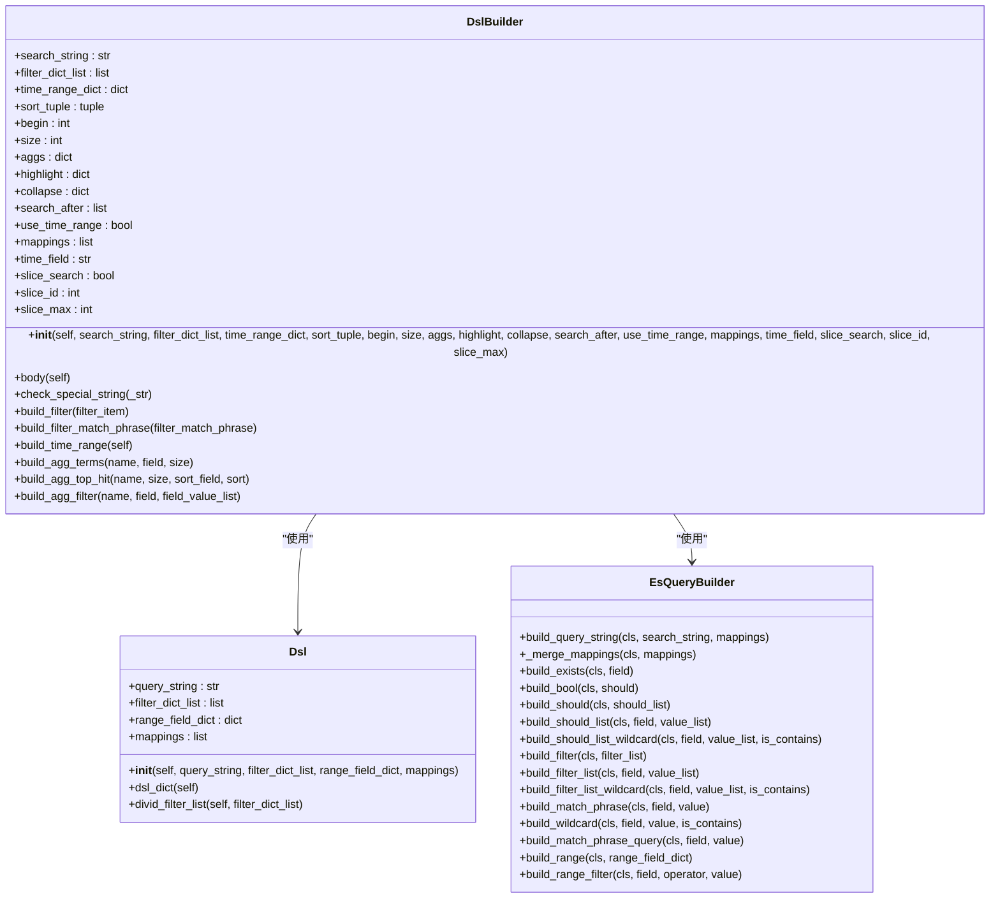
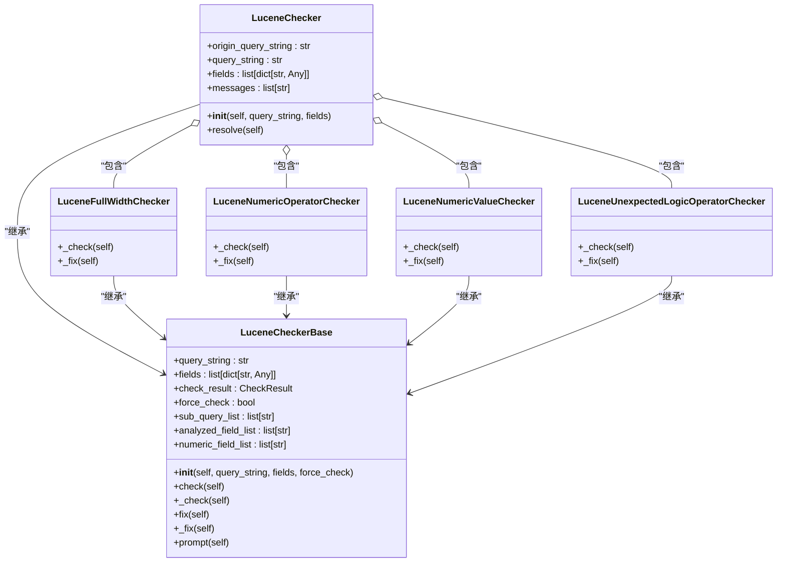
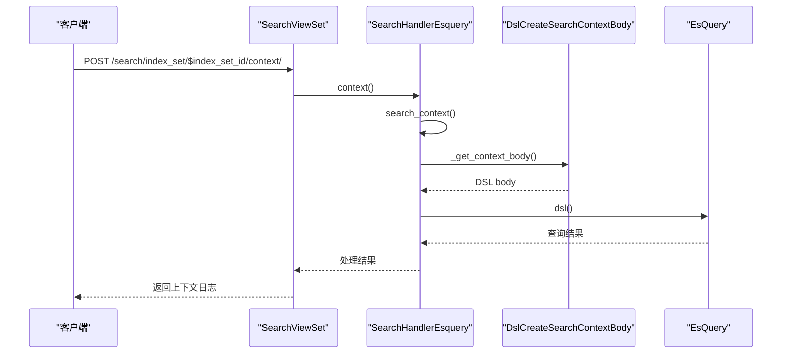
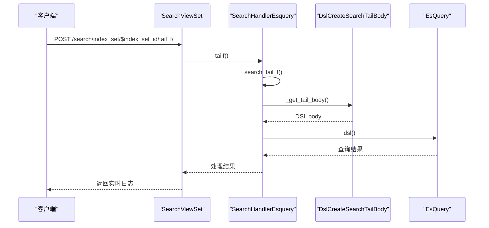
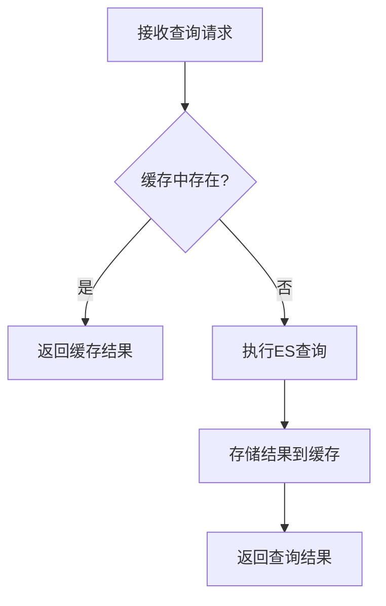
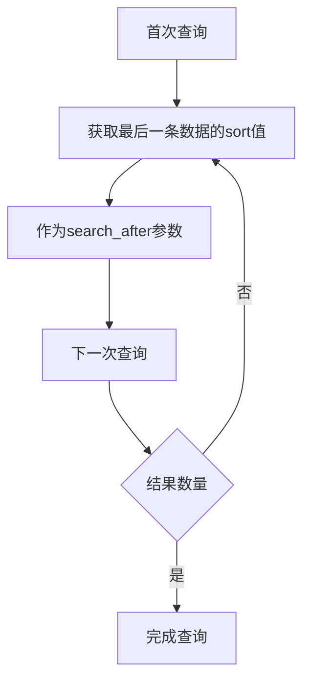

# 查询功能

<cite>
**本文档引用的文件**   
- [dsl_builder.py](file://bklog/apps/log_esquery/esquery/dsl_builder/dsl_builder.py)
- [query_builder_logic.py](file://bklog/apps/log_esquery/esquery/dsl_builder/query_builder/query_builder_logic.py)
- [search_handlers_esquery.py](file://bklog/apps/log_search/handlers/search/search_handlers_esquery.py)
- [search_views.py](file://bklog/apps/log_search/views/search_views.py)
- [serializers.py](file://bklog/apps/log_esquery/serializers.py)
- [exceptions.py](file://bklog/apps/log_search/exceptions.py)
- [lucene.py](file://bklog/apps/utils/lucene.py)
- [esquery_search.md](file://bklog/support-files/apigw/apidocs/zh/esquery_search.md)
</cite>

## 目录
1. [简介](#简介)
2. [查询处理流程](#查询处理流程)
3. [DSL查询构建机制](#dsl查询构建机制)
4. [Lucene语法解析与校验](#lucene语法解析与校验)
5. [高级查询功能实现](#高级查询功能实现)
6. [查询性能优化策略](#查询性能优化策略)
7. [常见问题排查指南](#常见问题排查指南)
8. [附录](#附录)

## 简介
本系统基于Elasticsearch构建了强大的日志搜索查询功能，提供从API请求到ES查询执行的完整处理流程。系统支持复杂的查询条件构建、时间范围处理、过滤条件组装等核心功能，并实现了上下文查询、实时日志查看、跨索引集查询等高级功能。查询引擎通过DSL查询构建、Lucene语法解析和查询条件优化等技术，确保查询的准确性和高效性。系统还提供了查询缓存、索引预热、分页优化等性能优化策略，以应对大规模日志数据的查询需求。

## 查询处理流程
日志搜索查询功能的处理流程从API请求开始，经过查询参数校验、索引集信息获取、查询条件组装，最终生成Elasticsearch DSL查询并执行。整个流程确保了查询的准确性和高效性。

**Diagram sources**
- [search_views.py](file://bklog/apps/log_search/views/search_views.py#L440-L507)
- [search_handlers_esquery.py](file://bklog/apps/log_search/handlers/search/search_handlers_esquery.py#L1650-L1774)

## DSL查询构建机制
DSL查询构建是查询引擎的核心，通过`DslBuilder`类实现。该类负责将用户输入的查询参数转换为Elasticsearch DSL查询语句，支持复杂的布尔查询、正则表达式查询和嵌套查询。

**Diagram sources**
- [dsl_builder.py](file://bklog/apps/log_esquery/esquery/dsl_builder/dsl_builder.py#L34-L195)
- [query_builder_logic.py](file://bklog/apps/log_esquery/esquery/dsl_builder/query_builder/query_builder_logic.py#L691-L739)

## Lucene语法解析与校验
系统通过`lucene.py`文件中的`LuceneChecker`类实现Lucene语法的解析与校验。该类支持多种语法检查器，能够检测和修复常见的语法错误，确保查询语句的正确性。

**Diagram sources**
- [lucene.py](file://bklog/apps/utils/lucene.py#L1653-L1667)
- [lucene.py](file://bklog/apps/utils/lucene.py#L989-L1651)

## 高级查询功能实现
系统实现了上下文查询、实时日志查看和跨索引集查询等高级功能。这些功能通过特定的查询处理器和优化策略实现，提供了更丰富的日志分析能力。

### 上下文查询
上下文查询功能允许用户查看指定日志条目周围的上下文信息，帮助理解日志的完整上下文。

**Diagram sources**
- [search_views.py](file://bklog/apps/log_search/views/search_views.py#L440-L507)
- [search_handlers_esquery.py](file://bklog/apps/log_search/handlers/search/search_handlers_esquery.py#L1650-L1774)

### 实时日志查看
实时日志查看功能允许用户实时监控日志流，及时发现和响应系统问题。

**Diagram sources**
- [search_views.py](file://bklog/apps/log_search/views/search_views.py#L509-L572)
- [search_handlers_esquery.py](file://bklog/apps/log_search/handlers/search/search_handlers_esquery.py#L1776-L1899)

## 查询性能优化策略
系统通过查询缓存、索引预热和分页优化等策略提升查询性能，确保在大规模数据场景下的查询效率。

### 查询缓存
系统使用Redis缓存查询结果，减少重复查询对ES集群的压力。

**Diagram sources**
- [cache.py](file://bklog/apps/utils/cache.py#L139-L147)
- [search_handlers_esquery.py](file://bklog/apps/log_search/handlers/search/search_handlers_esquery.py#L1880-L1899)

### 分页优化
系统支持`search_after`分页模式，避免深度分页带来的性能问题。

**Diagram sources**
- [esquery_search.md](file://bklog/support-files/apigw/apidocs/zh/esquery_search.md#L180-L216)
- [search_handlers_esquery.py](file://bklog/apps/log_search/handlers/search/search_handlers_esquery.py#L1165-L1195)

## 常见问题排查指南
本节提供常见查询问题的排查方法和解决方案，帮助用户快速定位和解决问题。

### 查询超时
当查询超时发生时，可能的原因包括查询条件过于复杂、数据量过大或ES集群负载过高。

**解决方案：**
1. 简化查询条件，减少不必要的过滤条件
2. 缩小时间范围，减少查询的数据量
3. 检查ES集群状态，确保集群正常运行
4. 使用异步查询模式处理大规模数据查询

**Section sources**
- [exceptions.py](file://bklog/apps/log_search/exceptions.py#L526-L528)
- [search_handlers_esquery.py](file://bklog/apps/log_search/handlers/search/search_handlers_esquery.py#L1880-L1899)

### 结果不完整
查询结果不完整可能是由于分页设置不当或查询条件限制过严导致。

**解决方案：**
1. 检查`size`参数设置，确保其值在合理范围内
2. 使用`search_after`模式进行深度分页
3. 检查过滤条件，确保没有过度限制查询结果
4. 验证时间范围设置，确保覆盖所需数据

**Section sources**
- [search_handlers_esquery.py](file://bklog/apps/log_search/handlers/search/search_handlers_esquery.py#L1165-L1195)
- [serializers.py](file://bklog/apps/log_esquery/serializers.py#L90-L93)

### 语法错误
Lucene语法错误会导致查询失败，系统提供了语法校验和自动修复功能。

**解决方案：**
1. 使用系统提供的语法校验功能检查查询语句
2. 避免使用ES保留字符，必要时进行转义
3. 检查字段名和操作符的正确性
4. 参考系统提供的查询示例构建查询语句

**Section sources**
- [lucene.py](file://bklog/apps/utils/lucene.py#L989-L1667)
- [exceptions.py](file://bklog/apps/log_search/exceptions.py#L506-L508)

## 附录
### 查询参数说明
| 参数 | 类型 | 说明 |
|------|------|------|
| index_set_id | int | 索引集ID |
| start_time | string | 查询开始时间 |
| end_time | string | 查询结束时间 |
| query_string | string | 查询语句 |
| filter | list | 过滤条件列表 |
| sort_list | list | 排序字段列表 |
| start | int | 分页起始位置 |
| size | int | 每页大小 |
| search_after | list | search_after分页参数 |
| track_total_hits | bool | 是否返回准确的总命中数 |

**Section sources**
- [serializers.py](file://bklog/apps/log_esquery/serializers.py#L39-L200)
- [esquery_search.md](file://bklog/support-files/apigw/apidocs/zh/esquery_search.md#L166-L216)

### 错误码说明
| 错误码 | 说明 |
|------|------|
| 411 | 索引集没有已审批通过的索引信息 |
| 418 | 超出最大查询数量 |
| 449 | 日志检索失败，请检查检索语句是否正确 |
| 453 | 存储集群请求超时，请稍后重试 |

**Section sources**
- [exceptions.py](file://bklog/apps/log_search/exceptions.py#L321-L538)