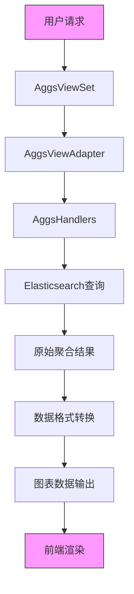
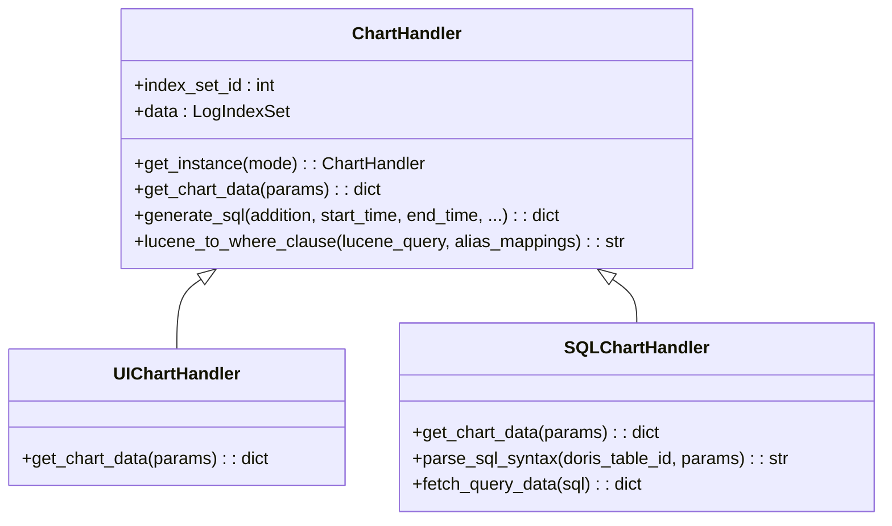
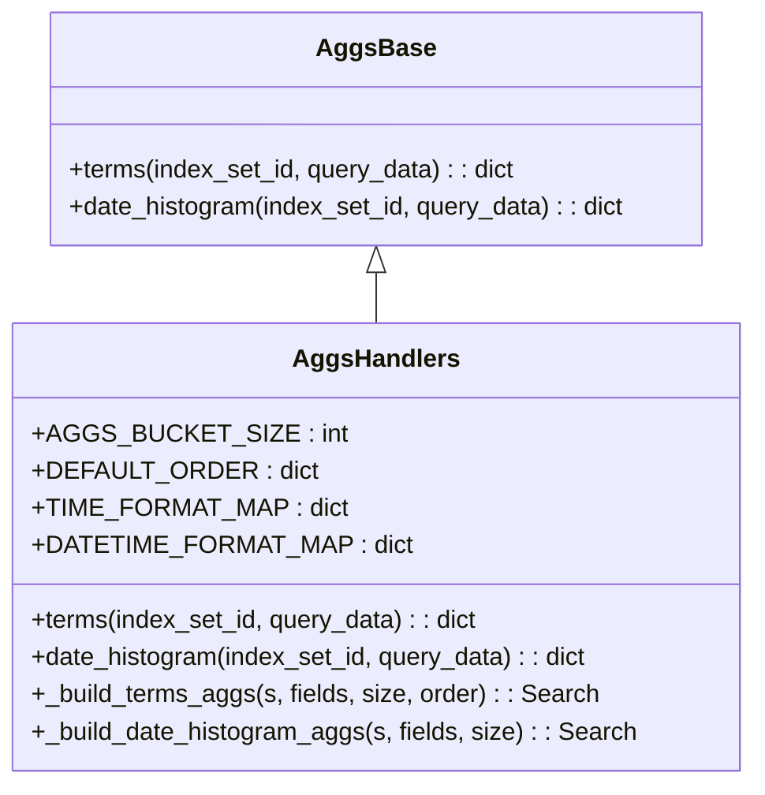
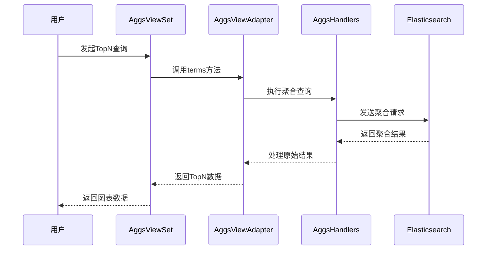
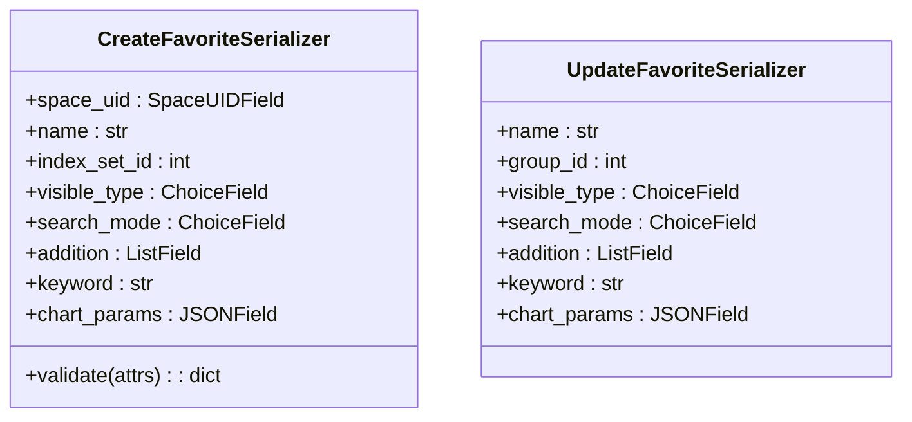
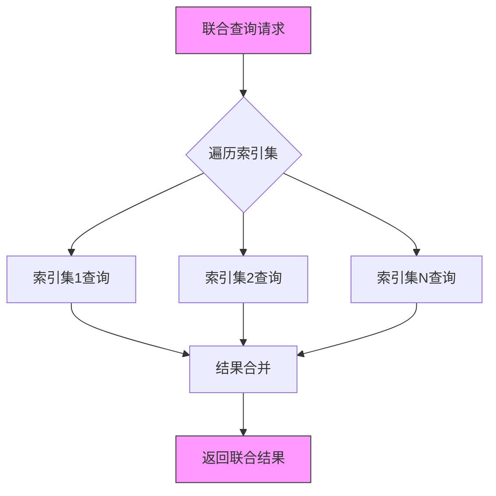
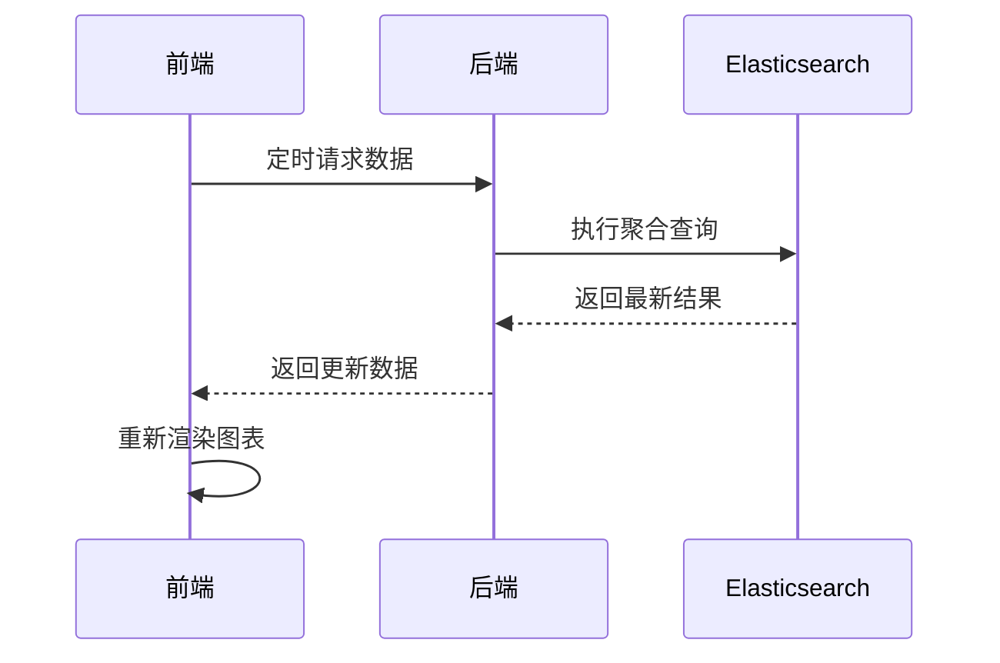
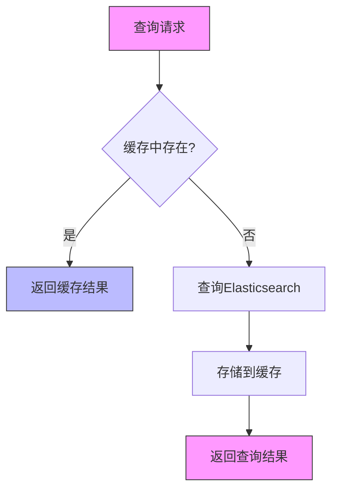

# 图表分析

<cite>
**本文档引用的文件**   
- [chart_handlers.py](file://bklog/apps/log_search/handlers/search/chart_handlers.py)
- [aggs_handlers.py](file://bklog/apps/log_search/handlers/search/aggs_handlers.py)
- [aggs_views.py](file://bklog/apps/log_search/views/aggs_views.py)
- [chart.py](file://bklog/apps/log_unifyquery/handler/chart.py)
- [terms_aggs.py](file://bklog/apps/log_unifyquery/handler/terms_aggs.py)
- [serializers.py](file://bklog/apps/log_search/serializers.py)
</cite>

## 目录
1. [引言](#引言)
2. [图表数据生成流程](#图表数据生成流程)
3. [核心组件分析](#核心组件分析)
4. [高级分析功能实现](#高级分析功能实现)
5. [图表配置管理](#图表配置管理)
6. [多维度数据关联](#多维度数据关联)
7. [动态刷新机制](#动态刷新机制)
8. [性能优化策略](#性能优化策略)
9. [常见问题排查](#常见问题排查)
10. [总结](#总结)

## 引言
本文档详细阐述了日志搜索系统中图表分析功能的实现机制。系统通过将Elasticsearch聚合结果转换为可视化图表数据，支持柱状图、折线图、饼图、热力图等多种图表类型。文档深入解析了从原始聚合结果到前端可用图表数据的转换流程，涵盖趋势分析、分布统计、TopN分析等高级功能的技术实现。同时，文档还介绍了图表配置管理、多维度数据关联、动态刷新等核心功能，以及数据采样、增量更新、缓存机制等性能优化策略。

## 图表数据生成流程
图表数据生成流程始于用户发起的聚合查询请求，经过多个处理阶段最终生成前端可用的图表数据格式。整个流程涉及多个核心组件的协同工作，确保数据的准确性和高效性。

**图表来源**  
- [aggs_views.py](file://bklog/apps/log_search/views/aggs_views.py#L42-L321)
- [aggs_handlers.py](file://bklog/apps/log_search/handlers/search/aggs_handlers.py#L295-L592)

## 核心组件分析
图表分析功能的核心由多个关键组件构成，这些组件各司其职，共同完成从数据查询到图表生成的全过程。

### ChartHandler组件
ChartHandler是图表处理的核心基类，负责根据不同的模式（UI模式或SQL模式）生成相应的图表数据。该组件通过工厂模式动态创建具体的处理器实例，实现了灵活的扩展性。

**图表来源**  
- [chart_handlers.py](file://bklog/apps/log_search/handlers/search/chart_handlers.py#L72-L676)

### AggsHandlers组件
AggsHandlers组件负责处理Elasticsearch的聚合查询，包括terms聚合和date_histogram聚合。该组件构建了复杂的聚合查询DSL，并处理返回的原始聚合结果。

**图表来源**  
- [aggs_handlers.py](file://bklog/apps/log_search/handlers/search/aggs_handlers.py#L46-L293)

## 高级分析功能实现
系统实现了多种高级分析功能，包括趋势分析、分布统计和TopN分析，满足不同场景下的数据分析需求。

### 趋势分析
趋势分析通过date_histogram聚合实现，将日志数据按时间维度进行分组统计，生成时间序列数据用于折线图或柱状图展示。

**Section sources**
- [aggs_handlers.py](file://bklog/apps/log_search/handlers/search/aggs_handlers.py#L168-L244)
- [aggs_views.py](file://bklog/apps/log_search/views/aggs_views.py#L105-L189)

### 分布统计
分布统计通过terms聚合实现，对指定字段的不同值进行频次统计，生成分类数据用于饼图或条形图展示。

**Section sources**
- [aggs_handlers.py](file://bklog/apps/log_search/handlers/search/aggs_handlers.py#L74-L93)
- [aggs_views.py](file://bklog/apps/log_search/views/aggs_views.py#L51-L98)

### TopN分析
TopN分析在分布统计的基础上，通过排序和限制返回数量，获取出现频次最高的N个值，用于突出显示关键数据。

**图表来源**  
- [aggs_handlers.py](file://bklog/apps/log_search/handlers/search/aggs_handlers.py#L320-L335)
- [aggs_views.py](file://bklog/apps/log_search/views/aggs_views.py#L51-L98)

## 图表配置管理
系统提供了完善的图表配置管理功能，允许用户自定义图表的显示属性和查询条件。

### 配置序列化
通过序列化器对图表配置进行验证和处理，确保配置数据的合法性和一致性。

**图表来源**  
- [serializers.py](file://bklog/apps/log_search/serializers.py#L661-L732)

## 多维度数据关联
系统支持多维度数据的联合查询和关联分析，能够整合来自不同索引集的数据进行综合展示。

### 联合查询实现
通过AggsViewAdapter的union_search方法，实现对多个索引集的并行查询和结果合并。

**图表来源**  
- [aggs_handlers.py](file://bklog/apps/log_search/handlers/search/aggs_handlers.py#L431-L473)
- [aggs_views.py](file://bklog/apps/log_search/views/aggs_views.py#L191-L269)

## 动态刷新机制
系统实现了图表数据的动态刷新功能，支持实时监控和定时更新。

### 刷新流程
动态刷新通过定时请求后端API获取最新数据，保持图表的实时性。

**图表来源**  
- [aggs_views.py](file://bklog/apps/log_search/views/aggs_views.py#L105-L189)
- [chart_handlers.py](file://bklog/apps/log_search/handlers/search/chart_handlers.py#L484-L676)

## 性能优化策略
为提升图表分析功能的性能，系统采用了多种优化策略，确保在大数据量下的响应速度。

### 数据采样
对大规模数据集进行采样处理，减少查询的数据量，提高响应速度。

### 增量更新
仅获取和传输发生变化的数据，减少网络传输和前端渲染的开销。

### 缓存机制
利用Redis缓存频繁访问的查询结果，避免重复查询Elasticsearch。

**图表来源**  
- [utils/cache.py](file://bklog/apps/utils/cache.py#L138-L147)
- [config/default.py](file://bklog/config/default.py#L1178-L1202)

## 常见问题排查
本节提供图表分析功能中常见问题的排查指南和解决方案。

### 图表数据异常
当图表数据显示异常时，可能的原因包括：
- 查询时间范围设置不当
- 聚合字段选择错误
- 数据源配置问题

**解决方案**：检查查询参数的正确性，验证数据源的可用性。

### 渲染性能低下
图表渲染性能低下的可能原因：
- 数据量过大
- 查询复杂度高
- 网络延迟

**解决方案**：优化查询条件，使用数据采样，检查网络状况。

### 数据不一致
数据不一致问题可能源于：
- 缓存未及时更新
- 数据同步延迟
- 查询条件不一致

**解决方案**：清除相关缓存，检查数据同步状态，确保查询条件一致。

## 总结
本文档全面介绍了日志搜索系统中图表分析功能的实现机制。通过深入分析核心组件、数据流程和性能优化策略，展示了系统如何将Elasticsearch聚合结果高效转换为多种可视化图表。系统不仅支持基本的图表展示，还提供了高级分析功能和灵活的配置管理，满足多样化的数据分析需求。未来可进一步优化查询性能，增强图表交互功能，提升用户体验。