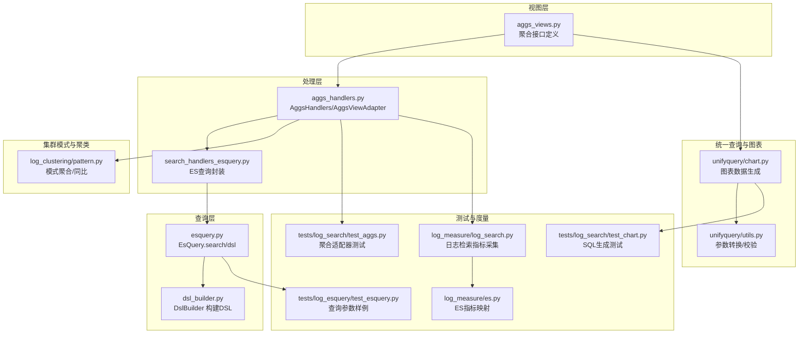
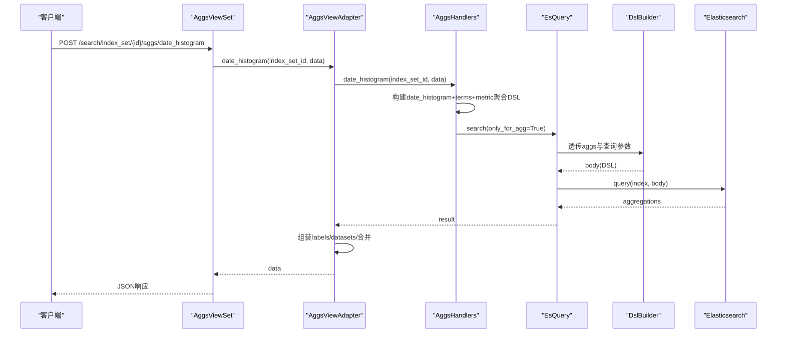
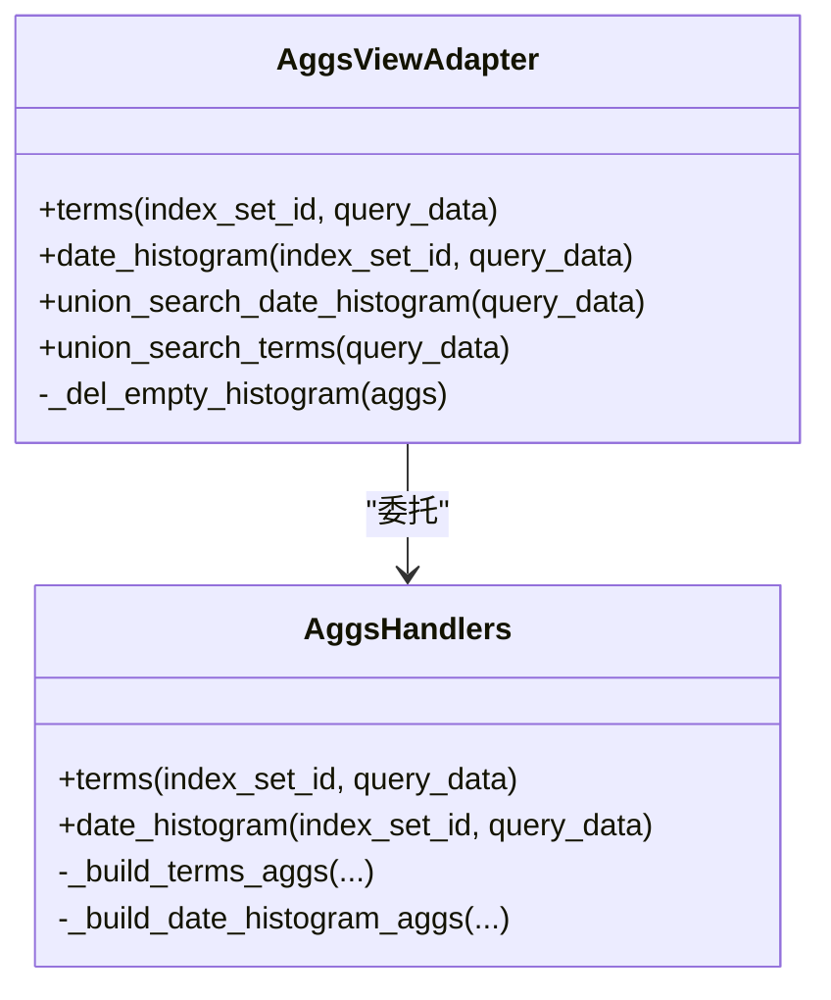
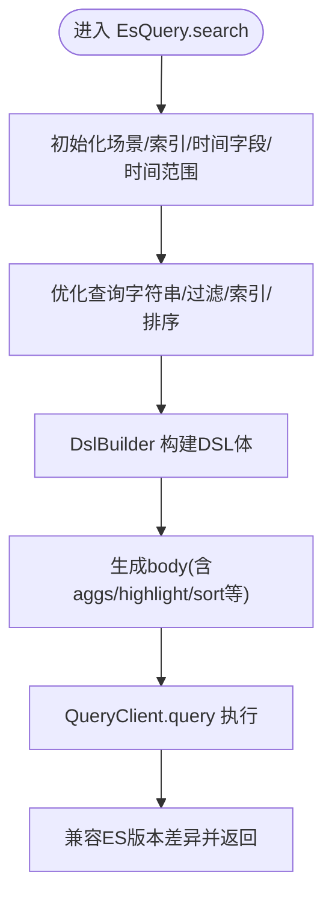
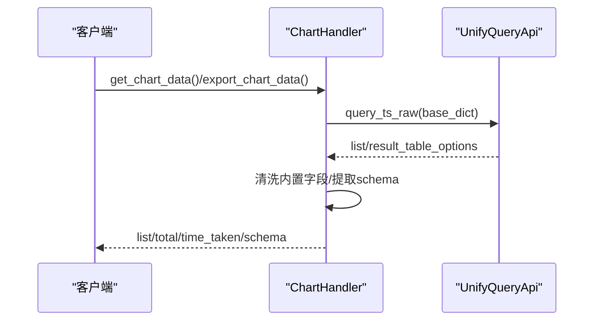
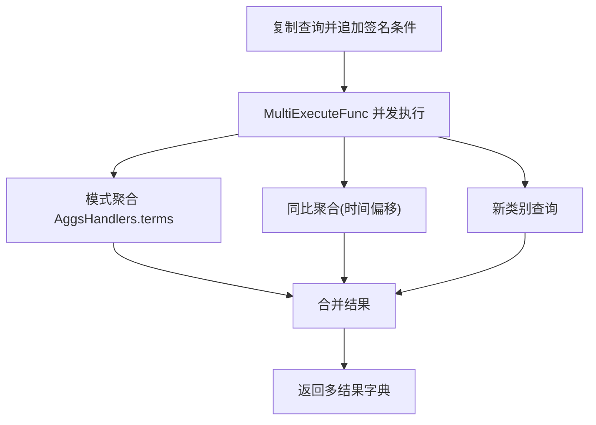
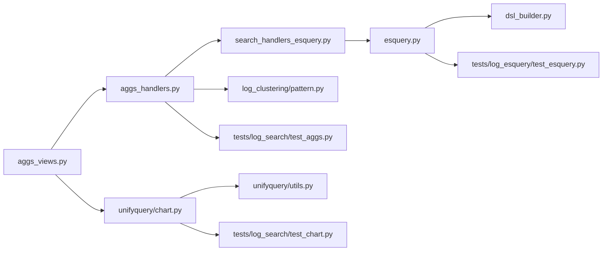
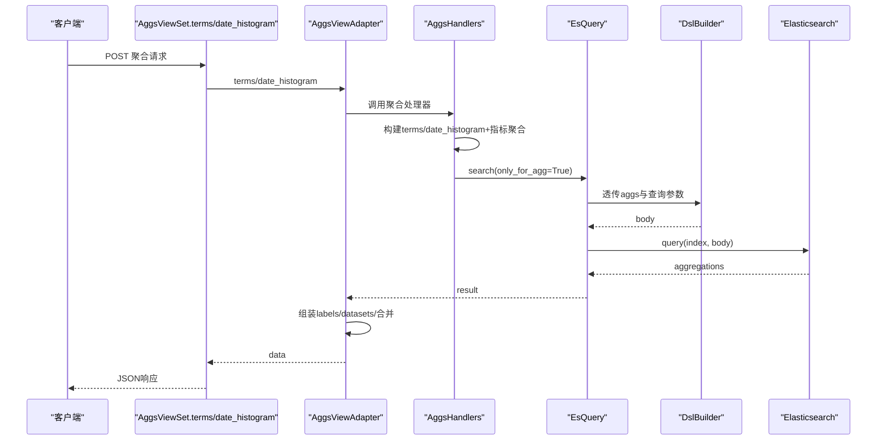

# 聚合分析

<cite>
**本文引用的文件**
- [apps/log_search/handlers/search/aggs_handlers.py](file://apps/log_search/handlers/search/aggs_handlers.py)
- [apps/log_search/views/aggs_views.py](file://apps/log_search/views/aggs_views.py)
- [apps/log_esquery/esquery/esquery.py](file://apps/log_esquery/esquery/esquery.py)
- [apps/log_esquery/esquery/dsl_builder/dsl_builder.py](file://apps/log_esquery/esquery/dsl_builder/dsl_builder.py)
- [apps/log_unifyquery/handler/chart.py](file://apps/log_unifyquery/handler/chart.py)
- [apps/log_unifyquery/utils.py](file://apps/log_unifyquery/utils.py)
- [apps/log_clustering/handlers/pattern.py](file://apps/log_clustering/handlers/pattern.py)
- [apps/log_search/handlers/search/search_handlers_esquery.py](file://apps/log_search/handlers/search/search_handlers_esquery.py)
- [apps/tests/log_search/test_aggs.py](file://apps/tests/log_search/test_aggs.py)
- [apps/tests/log_search/test_chart.py](file://apps/tests/log_search/test_chart.py)
- [apps/tests/log_esquery/test_esquery.py](file://apps/tests/log_esquery/test_esquery.py)
- [apps/grafana/handlers/query.py](file://apps/grafana/handlers/query.py)
- [apps/log_measure/handlers/metric_collectors/log_search.py](file://apps/log_measure/handlers/metric_collectors/log_search.py)
- [apps/log_measure/utils/es.py](file://apps/log_measure/utils/es.py)
</cite>

## 目录
1. [简介](#简介)
2. [项目结构](#项目结构)
3. [核心组件](#核心组件)
4. [架构总览](#架构总览)
5. [详细组件分析](#详细组件分析)
6. [依赖关系分析](#依赖关系分析)
7. [性能考量](#性能考量)
8. [故障排查指南](#故障排查指南)
9. [结论](#结论)
10. [附录](#附录)

## 简介
本文件系统性梳理蓝鲸日志平台中“开发日志搜索聚合分析”能力，围绕基于 Elasticsearch 的聚合查询实现机制展开，覆盖指标聚合、桶聚合、时间序列聚合、多维统计、图表数据生成、趋势分析、分布统计、TopN 分析等。文档从 API 请求到聚合结果生成的完整链路入手，逐步拆解聚合条件解析、嵌套聚合、条件聚合、时间序列聚合、联合检索聚合、结果适配与可视化等关键环节，并给出性能优化策略与常见问题排查建议。

## 项目结构
围绕聚合分析的关键模块主要分布在以下路径：
- 视图层：聚合接口定义与权限控制
- 处理层：聚合处理器与视图适配器
- 查询层：DSL 构建与 ES 客户端调用
- 统一查询与图表：跨索引集聚合与图表数据生成
- 集群模式下的模式聚合：用于日志聚类场景的时间序列对比
- 测试与度量：测试用例与 ES 指标采集

图表来源
- [apps/log_search/views/aggs_views.py](file://apps/log_search/views/aggs_views.py#L1-L321)
- [apps/log_search/handlers/search/aggs_handlers.py](file://apps/log_search/handlers/search/aggs_handlers.py#L1-L592)
- [apps/log_search/handlers/search/search_handlers_esquery.py](file://apps/log_search/handlers/search/search_handlers_esquery.py#L935-L962)
- [apps/log_esquery/esquery/esquery.py](file://apps/log_esquery/esquery/esquery.py#L1-L405)
- [apps/log_esquery/esquery/dsl_builder/dsl_builder.py](file://apps/log_esquery/esquery/dsl_builder/dsl_builder.py#L1-L195)
- [apps/log_unifyquery/handler/chart.py](file://apps/log_unifyquery/handler/chart.py#L54-L89)
- [apps/log_unifyquery/utils.py](file://apps/log_unifyquery/utils.py#L1-L83)
- [apps/log_clustering/handlers/pattern.py](file://apps/log_clustering/handlers/pattern.py#L273-L354)
- [apps/tests/log_search/test_aggs.py](file://apps/tests/log_search/test_aggs.py#L24-L74)
- [apps/tests/log_search/test_chart.py](file://apps/tests/log_search/test_chart.py#L227-L249)
- [apps/tests/log_esquery/test_esquery.py](file://apps/tests/log_esquery/test_esquery.py#L317-L354)
- [apps/log_measure/handlers/metric_collectors/log_search.py](file://apps/log_measure/handlers/metric_collectors/log_search.py#L26-L66)
- [apps/log_measure/utils/es.py](file://apps/log_measure/utils/es.py#L438-L756)

章节来源
- [apps/log_search/views/aggs_views.py](file://apps/log_search/views/aggs_views.py#L1-L321)
- [apps/log_search/handlers/search/aggs_handlers.py](file://apps/log_search/handlers/search/aggs_handlers.py#L1-L592)
- [apps/log_esquery/esquery/esquery.py](file://apps/log_esquery/esquery/esquery.py#L1-L405)
- [apps/log_esquery/esquery/dsl_builder/dsl_builder.py](file://apps/log_esquery/esquery/dsl_builder/dsl_builder.py#L1-L195)

## 核心组件
- 聚合视图适配器：负责 terms/date_histogram 的聚合结果组装与多索引集聚合合并
- 聚合处理器：构建 ES DSL 的 terms/date_histogram 聚合，支持嵌套、指标、时间序列
- ES 查询封装：统一初始化时间字段、时间范围、索引优化、DSL 透传与客户端调用
- DSL 构建器：将查询字符串、过滤条件、时间范围、排序、聚合、高亮、分片等整合为最终 DSL
- 统一查询与图表：跨索引集聚合与图表数据生成
- 集群模式下的模式聚合：用于聚类场景的同比分析与多任务并发
- 测试与度量：验证聚合适配器行为、SQL 生成、查询参数样例、ES 指标采集

章节来源
- [apps/log_search/handlers/search/aggs_handlers.py](file://apps/log_search/handlers/search/aggs_handlers.py#L1-L592)
- [apps/log_esquery/esquery/esquery.py](file://apps/log_esquery/esquery/esquery.py#L1-L405)
- [apps/log_esquery/esquery/dsl_builder/dsl_builder.py](file://apps/log_esquery/esquery/dsl_builder/dsl_builder.py#L1-L195)
- [apps/log_unifyquery/handler/chart.py](file://apps/log_unifyquery/handler/chart.py#L54-L89)
- [apps/log_clustering/handlers/pattern.py](file://apps/log_clustering/handlers/pattern.py#L273-L354)

## 架构总览
聚合分析从 API 层进入，经由视图适配器选择聚合处理器或统一查询处理器，构建 ES DSL 并调用 ES 客户端，最终在视图适配器中完成结果格式化与多索引集合并。

图表来源
- [apps/log_search/views/aggs_views.py](file://apps/log_search/views/aggs_views.py#L105-L189)
- [apps/log_search/handlers/search/aggs_handlers.py](file://apps/log_search/handlers/search/aggs_handlers.py#L168-L243)
- [apps/log_esquery/esquery/esquery.py](file://apps/log_esquery/esquery/esquery.py#L149-L224)
- [apps/log_esquery/esquery/dsl_builder/dsl_builder.py](file://apps/log_esquery/esquery/dsl_builder/dsl_builder.py#L90-L148)

## 详细组件分析

### 聚合视图适配器与处理器
- terms 聚合：支持单字段或多字段聚合，支持嵌套子聚合；返回 buckets 与 keys 列表
- date_histogram 聚合：按时间间隔聚合，支持 group_field 分组与指标聚合；自动推断时间间隔；对非 date 类型时间字段做单位换算
- 视图适配器：将 ES 返回的 aggregations 转换为前端友好的 labels/datasets 结构；处理失败 shards 抛错；提供空桶清理
- 联合检索聚合：多索引集并行查询，按时间键合并桶，按 doc_count 合并；terms 聚合按 doc_count 排序合并

图表来源
- [apps/log_search/handlers/search/aggs_handlers.py](file://apps/log_search/handlers/search/aggs_handlers.py#L46-L592)

章节来源
- [apps/log_search/handlers/search/aggs_handlers.py](file://apps/log_search/handlers/search/aggs_handlers.py#L73-L167)
- [apps/log_search/handlers/search/aggs_handlers.py](file://apps/log_search/handlers/search/aggs_handlers.py#L168-L243)
- [apps/log_search/handlers/search/aggs_handlers.py](file://apps/log_search/handlers/search/aggs_handlers.py#L295-L592)

### ES 查询封装与 DSL 构建
- EsQuery：统一初始化场景、索引、时间字段、时间范围、过滤、排序、高亮、聚合、分片等；调用 DSL 构建器生成 body；通过客户端执行查询
- DslBuilder：将查询字符串、过滤条件、时间范围、排序、聚合、高亮、search_after、slice_search 等拼装为最终 DSL；支持透传 aggs 与 highlight

图表来源
- [apps/log_esquery/esquery/esquery.py](file://apps/log_esquery/esquery/esquery.py#L149-L224)
- [apps/log_esquery/esquery/dsl_builder/dsl_builder.py](file://apps/log_esquery/esquery/dsl_builder/dsl_builder.py#L90-L148)

章节来源
- [apps/log_esquery/esquery/esquery.py](file://apps/log_esquery/esquery/esquery.py#L1-L405)
- [apps/log_esquery/esquery/dsl_builder/dsl_builder.py](file://apps/log_esquery/esquery/dsl_builder/dsl_builder.py#L1-L195)

### 统一查询与图表数据生成
- 统一查询图表处理器：生成图表数据、导出数据、SQL 生成；支持去内置字段、返回 schema 顺序
- 统一查询工具：参数转换、时间戳处理、令牌校验

图表来源
- [apps/log_unifyquery/handler/chart.py](file://apps/log_unifyquery/handler/chart.py#L54-L89)
- [apps/log_unifyquery/utils.py](file://apps/log_unifyquery/utils.py#L1-L83)

章节来源
- [apps/log_unifyquery/handler/chart.py](file://apps/log_unifyquery/handler/chart.py#L54-L89)
- [apps/log_unifyquery/utils.py](file://apps/log_unifyquery/utils.py#L1-L83)

### 集群模式下的模式聚合与同比分析
- 模式聚合：按层级字段构建 terms 嵌套聚合，支持签名字段或模式字段；支持同比时间偏移与百分比计算
- 多任务并发：使用 MultiExecuteFunc 并发执行模式聚合、同比、新类别查询

图表来源
- [apps/log_clustering/handlers/pattern.py](file://apps/log_clustering/handlers/pattern.py#L273-L354)

章节来源
- [apps/log_clustering/handlers/pattern.py](file://apps/log_clustering/handlers/pattern.py#L273-L354)

### 视图层接口与权限控制
- terms/date_histogram 接口：支持单索引集与联合检索；支持统一查询开关
- 权限：按索引集批量鉴权

章节来源
- [apps/log_search/views/aggs_views.py](file://apps/log_search/views/aggs_views.py#L42-L321)

## 依赖关系分析
- 视图层依赖处理层；处理层依赖 ES 查询封装；ES 查询封装依赖 DSL 构建器
- 统一查询图表处理器独立于聚合处理器，但可与之并行使用
- 集群模式下的模式聚合与聚合处理器并行存在，服务于聚类场景
- 测试用例覆盖聚合适配器、SQL 生成、查询参数样例

图表来源
- [apps/log_search/views/aggs_views.py](file://apps/log_search/views/aggs_views.py#L1-L321)
- [apps/log_search/handlers/search/aggs_handlers.py](file://apps/log_search/handlers/search/aggs_handlers.py#L1-L592)
- [apps/log_search/handlers/search/search_handlers_esquery.py](file://apps/log_search/handlers/search/search_handlers_esquery.py#L935-L962)
- [apps/log_esquery/esquery/esquery.py](file://apps/log_esquery/esquery/esquery.py#L1-L405)
- [apps/log_esquery/esquery/dsl_builder/dsl_builder.py](file://apps/log_esquery/esquery/dsl_builder/dsl_builder.py#L1-L195)
- [apps/log_unifyquery/handler/chart.py](file://apps/log_unifyquery/handler/chart.py#L54-L89)
- [apps/log_unifyquery/utils.py](file://apps/log_unifyquery/utils.py#L1-L83)
- [apps/log_clustering/handlers/pattern.py](file://apps/log_clustering/handlers/pattern.py#L273-L354)
- [apps/tests/log_search/test_aggs.py](file://apps/tests/log_search/test_aggs.py#L24-L74)
- [apps/tests/log_search/test_chart.py](file://apps/tests/log_search/test_chart.py#L227-L249)
- [apps/tests/log_esquery/test_esquery.py](file://apps/tests/log_esquery/test_esquery.py#L317-L354)

## 性能考量
- 采样查询与分片搜索
  - 支持 slice_search 参数，按时间字段切片并行查询，降低单节点压力
  - 适用于大规模数据集的时间序列聚合
- 自适应时间间隔
  - date_histogram 根据时长区间自动选择聚合间隔，避免过细粒度过大导致桶过多
- 嵌套聚合与指标聚合
  - terms 嵌套聚合与指标聚合组合，减少多次查询；注意控制子聚合层级与 size
- 多索引集并行
  - 联合检索采用并发执行，缩短总耗时；合并阶段需注意排序与去重成本
- 结果缓存与预聚合
  - 可结合外部缓存或预聚合方案（如流式预聚合节点）降低重复计算
- 高亮与排序
  - 高亮仅在存在查询条件时启用，避免不必要的开销；排序字段应合理选择以减少排序成本

章节来源
- [apps/log_esquery/esquery/dsl_builder/dsl_builder.py](file://apps/log_esquery/esquery/dsl_builder/dsl_builder.py#L135-L148)
- [apps/log_search/handlers/search/aggs_handlers.py](file://apps/log_search/handlers/search/aggs_handlers.py#L245-L256)
- [apps/log_search/handlers/search/aggs_handlers.py](file://apps/log_search/handlers/search/aggs_handlers.py#L431-L473)
- [apps/log_search/handlers/search/aggs_handlers.py](file://apps/log_search/handlers/search/aggs_handlers.py#L475-L551)

## 故障排查指南
- 聚合结果不准确
  - 检查时间字段类型与单位：date_histogram 对非 date 类型时间字段做单位换算，确保 key_as_string 正确
  - 检查聚合 size 与 missing 填充值：terms 聚合 missing 参数影响缺失值桶
  - 检查嵌套聚合层级：确保子聚合字段存在且可聚合
- 性能低下
  - 减小聚合 size 或限制时间范围；启用 slice_search 并行
  - 优先使用 doc_count 聚合，避免昂贵的 top_hits 等指标
  - 使用联合检索时，控制索引集数量与字段数量
- 内存溢出
  - 降低 terms 聚合的 size；对高基数字段使用采样或降维
  - 优化查询条件，减少匹配文档数
- shards 失败
  - date_histogram 适配器对 failures 字段抛错，检查索引状态与权限
- 图表数据异常
  - 检查视图适配器的空桶清理逻辑；确认 labels/datasets 组装正确

章节来源
- [apps/log_search/handlers/search/aggs_handlers.py](file://apps/log_search/handlers/search/aggs_handlers.py#L186-L243)
- [apps/log_search/handlers/search/aggs_handlers.py](file://apps/log_search/handlers/search/aggs_handlers.py#L337-L357)
- [apps/tests/log_search/test_aggs.py](file://apps/tests/log_search/test_aggs.py#L24-L74)

## 结论
该聚合分析体系以视图适配器为核心，串联聚合处理器、DSL 构建与 ES 客户端调用，形成从 API 到结果的完整链路。通过嵌套聚合、指标聚合、时间序列聚合与联合检索，满足趋势分析、分布统计、TopN 等高级分析需求。配合采样查询、分片搜索、自适应间隔与多索引集并行，可在保证准确性的同时提升性能。建议在生产环境中结合缓存与预聚合策略进一步优化。

## 附录

### API 请求到聚合结果生成流程（代码级）

图表来源
- [apps/log_search/views/aggs_views.py](file://apps/log_search/views/aggs_views.py#L52-L189)
- [apps/log_search/handlers/search/aggs_handlers.py](file://apps/log_search/handlers/search/aggs_handlers.py#L73-L167)
- [apps/log_esquery/esquery/esquery.py](file://apps/log_esquery/esquery/esquery.py#L149-L224)
- [apps/log_esquery/esquery/dsl_builder/dsl_builder.py](file://apps/log_esquery/esquery/dsl_builder/dsl_builder.py#L90-L148)

### 实际代码示例（路径指引）
- 构建嵌套 terms 聚合
  - 示例路径：[apps/log_search/handlers/search/aggs_handlers.py](file://apps/log_search/handlers/search/aggs_handlers.py#L95-L165)
- 构建时间序列聚合（含指标）
  - 示例路径：[apps/log_search/handlers/search/aggs_handlers.py](file://apps/log_search/handlers/search/aggs_handlers.py#L258-L292)
- 透传聚合与高亮
  - 示例路径：[apps/log_esquery/esquery/dsl_builder/dsl_builder.py](file://apps/log_esquery/esquery/dsl_builder/dsl_builder.py#L113-L127)
- 联合检索聚合（多索引集）
  - 示例路径：[apps/log_search/handlers/search/aggs_handlers.py](file://apps/log_search/handlers/search/aggs_handlers.py#L431-L551)
- 模式聚合与同比
  - 示例路径：[apps/log_clustering/handlers/pattern.py](file://apps/log_clustering/handlers/pattern.py#L273-L354)
- 图表数据生成与 SQL 生成
  - 示例路径：[apps/log_unifyquery/handler/chart.py](file://apps/log_unifyquery/handler/chart.py#L54-L89)
- 查询参数样例（测试）
  - 示例路径：[apps/tests/log_esquery/test_esquery.py](file://apps/tests/log_esquery/test_esquery.py#L317-L354)

### 高级分析功能实现要点
- 趋势分析：date_histogram 聚合 + 指标聚合，按时间序列输出 labels/datasets
- 分布统计：terms 聚合按字段分布计数，支持嵌套子聚合
- TopN 分析：terms 聚合按 doc_count 排序，限制 size 输出前 N
- 联合检索：多索引集并行聚合，按时间键合并桶，按 doc_count 合并
- 同比分析：模式聚合按时间偏移生成同比桶，计算百分比变化

章节来源
- [apps/log_search/handlers/search/aggs_handlers.py](file://apps/log_search/handlers/search/aggs_handlers.py#L168-L243)
- [apps/log_search/handlers/search/aggs_handlers.py](file://apps/log_search/handlers/search/aggs_handlers.py#L295-L551)
- [apps/log_clustering/handlers/pattern.py](file://apps/log_clustering/handlers/pattern.py#L319-L354)