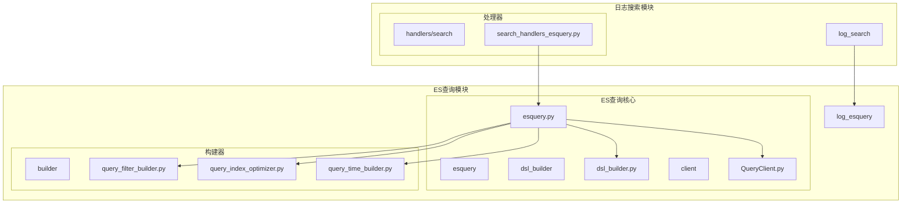
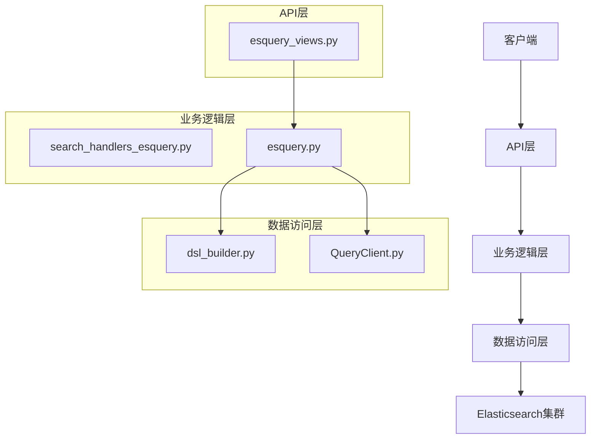
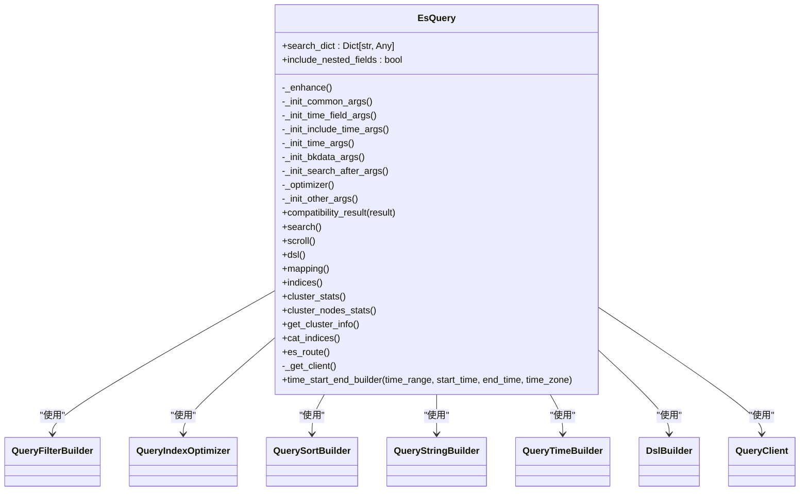
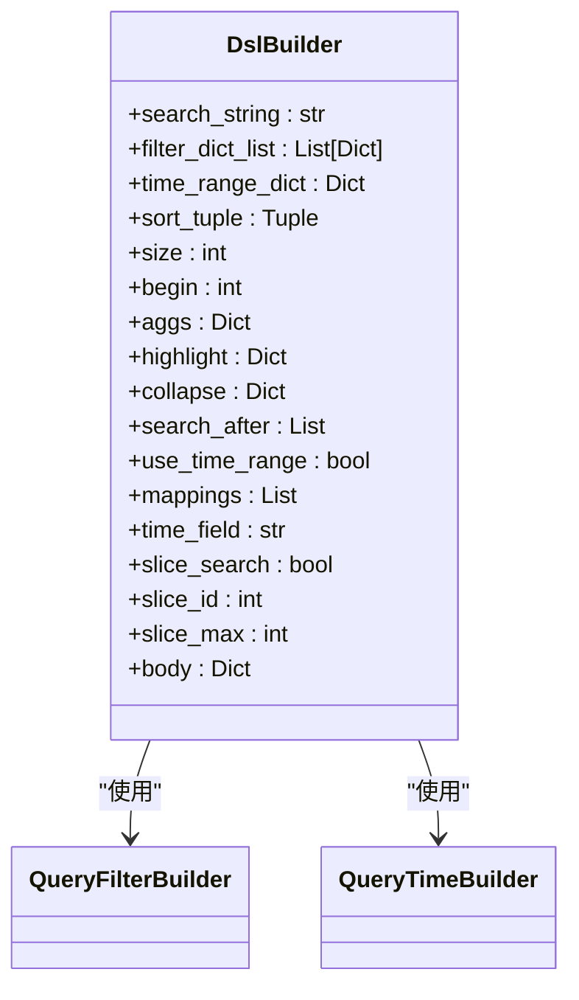
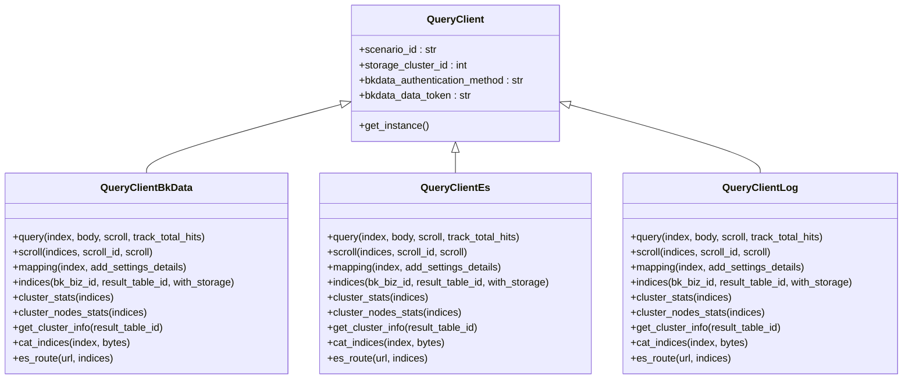
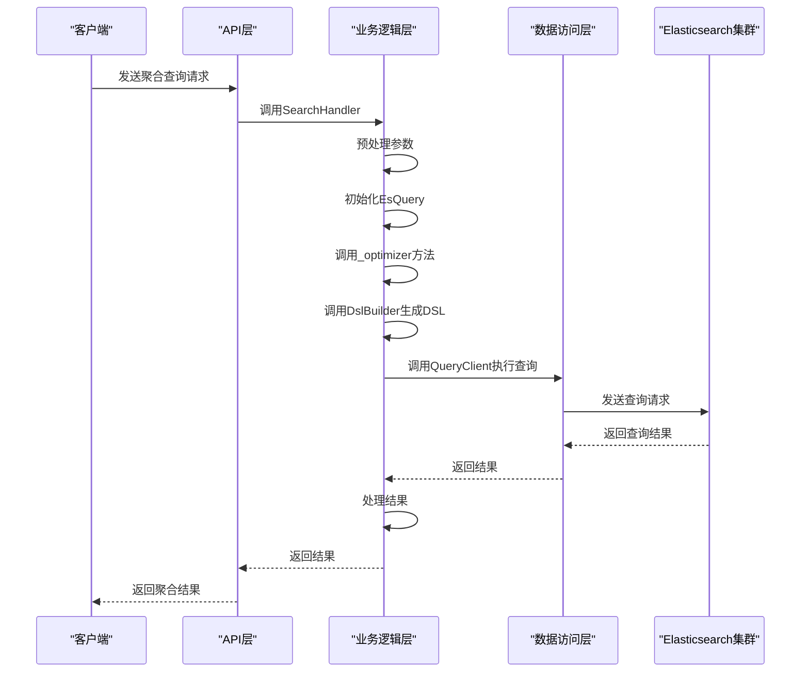
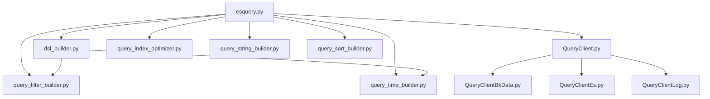

# 聚合查询

<cite>
**本文档引用的文件**
- [esquery.py](file://bklog/apps/log_esquery/esquery/esquery.py)
- [esquery_views.py](file://bklog/apps/log_esquery/views/esquery_views.py)
- [search_handlers_esquery.py](file://bklog/apps/log_search/handlers/search/search_handlers_esquery.py)
- [dsl_builder.py](file://bklog/apps/log_esquery/esquery/dsl_builder/dsl_builder.py)
- [QueryClient.py](file://bklog/apps/log_esquery/esquery/client/QueryClient.py)
- [query_filter_builder.py](file://bklog/apps/log_esquery/esquery/builder/query_filter_builder.py)
- [query_index_optimizer.py](file://bklog/apps/log_esquery/esquery/builder/query_index_optimizer.py)
- [query_time_builder.py](file://bklog/apps/log_esquery/esquery/builder/query_time_builder.py)
- [type_constants.py](file://bklog/apps/log_esquery/type_constants.py)
- [constants.py](file://bklog/apps/log_esquery/constants.py)
</cite>

## 目录
1. [引言](#引言)
2. [项目结构](#项目结构)
3. [核心组件](#核心组件)
4. [架构概述](#架构概述)
5. [详细组件分析](#详细组件分析)
6. [依赖分析](#依赖分析)
7. [性能考虑](#性能考虑)
8. [故障排除指南](#故障排除指南)
9. [结论](#结论)

## 引言
本文档详细描述了基于Elasticsearch的聚合查询功能的实现机制。该功能支持指标聚合（如count、sum、avg、min、max）、桶聚合（如terms、date_histogram、range）和管道聚合（如derivative、cumulative_sum）等多种聚合类型。文档深入分析了从API请求到聚合结果生成的完整处理流程，包括聚合DSL构建、多级嵌套聚合、条件过滤聚合等核心环节。同时，文档还涵盖了聚合查询的性能优化策略、错误处理机制和限流策略。

## 项目结构
日志搜索聚合查询功能主要分布在`bklog/apps/log_esquery`和`bklog/apps/log_search`两个目录下。`log_esquery`模块负责Elasticsearch查询的核心实现，包括DSL构建、客户端调用等；`log_search`模块则提供了更高层次的搜索处理逻辑，包括预处理、结果处理等。

**图源**
- [esquery.py](file://bklog/apps/log_esquery/esquery/esquery.py)
- [search_handlers_esquery.py](file://bklog/apps/log_search/handlers/search/search_handlers_esquery.py)
- [dsl_builder.py](file://bklog/apps/log_esquery/esquery/dsl_builder/dsl_builder.py)
- [QueryClient.py](file://bklog/apps/log_esquery/esquery/client/QueryClient.py)
- [query_filter_builder.py](file://bklog/apps/log_esquery/esquery/builder/query_filter_builder.py)
- [query_index_optimizer.py](file://bklog/apps/log_esquery/esquery/builder/query_index_optimizer.py)
- [query_time_builder.py](file://bklog/apps/log_esquery/esquery/builder/query_time_builder.py)

**节源**
- [esquery.py](file://bklog/apps/log_esquery/esquery/esquery.py)
- [search_handlers_esquery.py](file://bklog/apps/log_search/handlers/search/search_handlers_esquery.py)

## 核心组件
聚合查询功能的核心组件包括`EsQuery`类、DSL构建器、查询客户端和各种构建器。`EsQuery`类是聚合查询的入口点，负责协调各个组件完成查询任务。DSL构建器负责生成Elasticsearch查询DSL，查询客户端负责与Elasticsearch集群通信，各种构建器则负责优化查询条件、时间范围等。

**节源**
- [esquery.py](file://bklog/apps/log_esquery/esquery/esquery.py)
- [dsl_builder.py](file://bklog/apps/log_esquery/esquery/dsl_builder/dsl_builder.py)
- [QueryClient.py](file://bklog/apps/log_esquery/esquery/client/QueryClient.py)

## 架构概述
聚合查询功能的架构分为三层：API层、业务逻辑层和数据访问层。API层提供RESTful接口，接收客户端请求；业务逻辑层处理请求参数，进行预处理和后处理；数据访问层负责与Elasticsearch集群通信，执行查询并返回结果。

**图源**
- [esquery_views.py](file://bklog/apps/log_esquery/views/esquery_views.py)
- [search_handlers_esquery.py](file://bklog/apps/log_search/handlers/search/search_handlers_esquery.py)
- [esquery.py](file://bklog/apps/log_esquery/esquery/esquery.py)
- [dsl_builder.py](file://bklog/apps/log_esquery/esquery/dsl_builder/dsl_builder.py)
- [QueryClient.py](file://bklog/apps/log_esquery/esquery/client/QueryClient.py)

## 详细组件分析

### EsQuery类分析
`EsQuery`类是聚合查询的核心，负责协调各个组件完成查询任务。它接收搜索参数，初始化各种构建器，生成查询DSL，并调用查询客户端执行查询。

**图源**
- [esquery.py](file://bklog/apps/log_esquery/esquery/esquery.py)
- [query_filter_builder.py](file://bklog/apps/log_esquery/esquery/builder/query_filter_builder.py)
- [query_index_optimizer.py](file://bklog/apps/log_esquery/esquery/builder/query_index_optimizer.py)
- [query_time_builder.py](file://bklog/apps/log_esquery/esquery/builder/query_time_builder.py)
- [dsl_builder.py](file://bklog/apps/log_esquery/esquery/dsl_builder/dsl_builder.py)
- [QueryClient.py](file://bklog/apps/log_esquery/esquery/client/QueryClient.py)

**节源**
- [esquery.py](file://bklog/apps/log_esquery/esquery/esquery.py)

### DSL构建器分析
DSL构建器负责生成Elasticsearch查询DSL。它接收查询字符串、过滤条件、时间范围、排序条件等参数，生成符合Elasticsearch规范的查询DSL。

**图源**
- [dsl_builder.py](file://bklog/apps/log_esquery/esquery/dsl_builder/dsl_builder.py)
- [query_filter_builder.py](file://bklog/apps/log_esquery/esquery/builder/query_filter_builder.py)
- [query_time_builder.py](file://bklog/apps/log_esquery/esquery/builder/query_time_builder.py)

**节源**
- [dsl_builder.py](file://bklog/apps/log_esquery/esquery/dsl_builder/dsl_builder.py)

### 查询客户端分析
查询客户端负责与Elasticsearch集群通信，执行查询并返回结果。它根据查询场景（如bkdata、log、es）选择不同的客户端实现。

**图源**
- [QueryClient.py](file://bklog/apps/log_esquery/esquery/client/QueryClient.py)
- [QueryClientBkData.py](file://bklog/apps/log_esquery/esquery/client/QueryClientBkData.py)
- [QueryClientEs.py](file://bklog/apps/log_esquery/esquery/client/QueryClientEs.py)
- [QueryClientLog.py](file://bklog/apps/log_esquery/esquery/client/QueryClientLog.py)

**节源**
- [QueryClient.py](file://bklog/apps/log_esquery/esquery/client/QueryClient.py)

### 聚合查询处理流程
聚合查询的处理流程从API请求开始，经过参数验证、预处理、DSL生成、查询执行、结果处理等环节，最终返回聚合结果。

**图源**
- [esquery_views.py](file://bklog/apps/log_esquery/views/esquery_views.py)
- [search_handlers_esquery.py](file://bklog/apps/log_search/handlers/search/search_handlers_esquery.py)
- [esquery.py](file://bklog/apps/log_esquery/esquery/esquery.py)
- [dsl_builder.py](file://bklog/apps/log_esquery/esquery/dsl_builder/dsl_builder.py)
- [QueryClient.py](file://bklog/apps/log_esquery/esquery/client/QueryClient.py)

**节源**
- [esquery_views.py](file://bklog/apps/log_esquery/views/esquery_views.py)
- [search_handlers_esquery.py](file://bklog/apps/log_search/handlers/search/search_handlers_esquery.py)

## 依赖分析
聚合查询功能依赖于多个组件和模块，包括Elasticsearch集群、查询构建器、查询客户端等。这些组件之间存在明确的依赖关系，确保了查询功能的正确执行。

**图源**
- [esquery.py](file://bklog/apps/log_esquery/esquery/esquery.py)
- [dsl_builder.py](file://bklog/apps/log_esquery/esquery/dsl_builder/dsl_builder.py)
- [QueryClient.py](file://bklog/apps/log_esquery/esquery/client/QueryClient.py)
- [query_filter_builder.py](file://bklog/apps/log_esquery/esquery/builder/query_filter_builder.py)
- [query_index_optimizer.py](file://bklog/apps/log_esquery/esquery/builder/query_index_optimizer.py)
- [query_time_builder.py](file://bklog/apps/log_esquery/esquery/builder/query_time_builder.py)

**节源**
- [esquery.py](file://bklog/apps/log_esquery/esquery/esquery.py)

## 性能考虑
聚合查询功能在设计时考虑了多种性能优化策略，包括索引优化、查询缓存、结果缓存等。通过优化查询DSL和减少不必要的数据传输，提高了查询性能。

**节源**
- [query_index_optimizer.py](file://bklog/apps/log_esquery/esquery/builder/query_index_optimizer.py)
- [esquery.py](file://bklog/apps/log_esquery/esquery/esquery.py)

## 故障排除指南
聚合查询功能提供了详细的错误处理机制，包括参数验证、异常捕获、日志记录等。当查询失败时，系统会返回详细的错误信息，帮助用户快速定位问题。

**节源**
- [esquery.py](file://bklog/apps/log_esquery/esquery/esquery.py)
- [esquery_views.py](file://bklog/apps/log_esquery/views/esquery_views.py)

## 结论
本文档详细描述了基于Elasticsearch的聚合查询功能的实现机制。该功能通过分层架构和模块化设计，实现了高效、可靠的聚合查询。通过优化查询DSL和减少不必要的数据传输，提高了查询性能。同时，系统提供了详细的错误处理机制，帮助用户快速定位和解决问题。